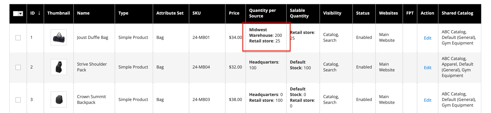

# Inventaire : attribuez des sources et des quantités.

Pour les marchands multisource utilisant [[!DNL Inventory Management]](../inventory-management/introduction.md), faites défiler l’écran vers le bas jusqu’à l’objet **Sources** et affecter les sources et les quantités :

1. Pour ajouter une source, cliquez sur **[!UICONTROL Assign Sources]**.

1. Parcourez ou recherchez des sources et cochez la case en regard des sources que vous souhaitez ajouter au produit.

   {width="600" zoomable="yes"}

1. Cliquez sur **[!UICONTROL Done]** pour ajouter les sources.

1. Pour gérer la quantité et l’état de la source, cliquez sur **[!UICONTROL Advanced Inventory]** et défini **[!UICONTROL Manage Stock]** to `Yes`.

1. Définir **[!UICONTROL Source Item Status]** to `In Stock`.

1. Saisissez un montant à mettre à jour. **[!UICONTROL Qty]** pour le stock disponible.

1. Pour définir une notification pour les quantités d&#39;inventaire, effectuez l&#39;une des opérations suivantes :

   - _Quantité de notification personnalisée_ - Effacez la variable **[!UICONTROL Notify Quantity Use Default]** et saisissez un montant dans **[!UICONTROL Notify Quantity]**.

   - _Quantité de notification par défaut_ - Sélectionnez la variable **[!UICONTROL Notify Quantity Use Default]** . Commerce vérifie et utilise le paramètre dans [!UICONTROL Advanced Inventory] ou configuration de magasin globale.

   {width="600" zoomable="yes"}
