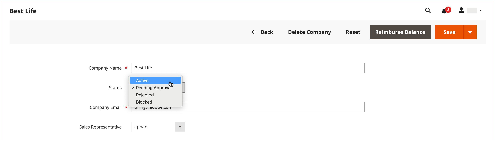

# Valider un compte d’entreprise

Le statut des demandes reçues du storefront pour créer une entreprise est `Pending Approval` jusqu’à ce que la demande soit examinée par l’administrateur du magasin, et approuvée ou rejetée. Le statut d’un compte d’entreprise peut être défini sur l’une des options suivantes :

- [!UICONTROL Active]
- [!UICONTROL Pending Approval]
- [!UICONTROL Rejected]
- [!UICONTROL Blocked]

Vous pouvez également utiliser le contrôle [Actions](account-company-manage.md) pour approuver plusieurs demandes d’entreprise.

{width="700" zoomable="yes"}

## Valider un compte d’entreprise en attente

1. Dans la barre latérale _Admin_, accédez à **[!UICONTROL Customers]** > **[!UICONTROL Companies]**.

   Vous pouvez utiliser le sélecteur de _[!UICONTROL Columns]_au-dessus de la grille pour afficher la colonne **[!UICONTROL Status]**.

1. Dans la colonne _[!UICONTROL Action]_, cliquez sur **[!UICONTROL Edit]**.

1. Définissez **[!UICONTROL Company Status]** sur `Active`.

   {width="700" zoomable="yes"}

1. Lorsque vous êtes invité à confirmer, cliquez sur **[!UICONTROL Change status]**.

   L’administrateur ou l’administratrice de la société reçoit une notification par e-mail indiquant que la société est désormais active.

1. Le cas échéant, définissez **[!UICONTROL Sales Representative]** sur un compte utilisateur d’administration spécifique.

1. Développez  la section **[!UICONTROL Account Information]** et utilisez le champ **[!UICONTROL Comment]** pour saisir des notes sur le compte.

   Les commentaires ne sont pas visibles depuis le storefront.

1. Cliquez ensuite sur **[!UICONTROL Save]**.

   Un e-mail de confirmation est envoyé à la société et à l’administrateur de la société pour confirmer que le compte de la société est approuvé.

## Statut de la société

| Statut | Description |
|------------------|--------------------------------------------------------------------------------------------------------------------------------------------|
| [!UICONTROL Active] | L’entreprise est approuvée et peut être gérée à partir du storefront par l’administrateur de l’entreprise. |
| [!UICONTROL Pending Approval] | Une demande de création de compte d’entreprise a été soumise depuis le storefront, mais n’a pas encore été examinée. |
| [!UICONTROL Rejected] | La demande de création d’un compte d’entreprise a été rejetée par l’administrateur du magasin. |
| [!UICONTROL Blocked] | Le compte de la société n&#39;est plus en règle. Le client peut accéder au compte à partir du storefront, mais ne peut pas effectuer d’achats. |

{style="table-layout:auto"}
