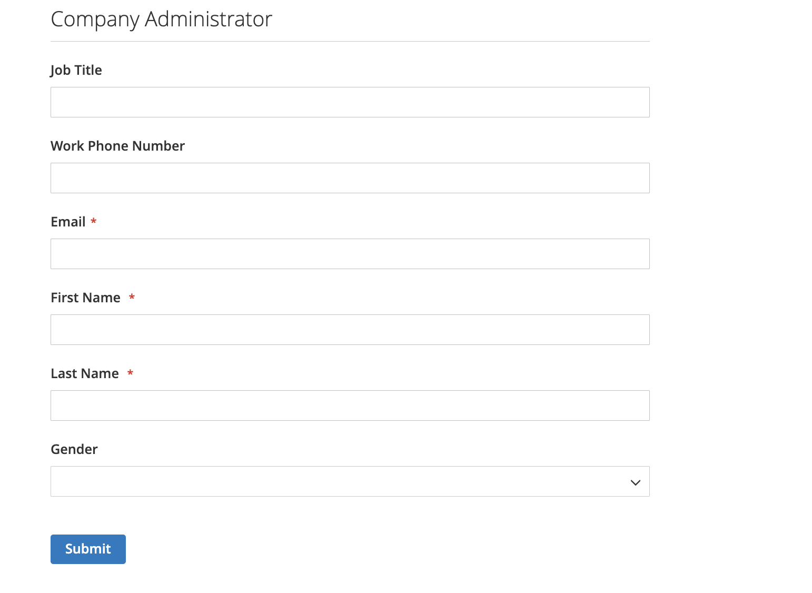

# Création d’un compte d’entreprise

Les comptes d’entreprise peuvent être configurés à partir du storefront par le client ou à partir de l’administrateur. Toutes les demandes de création de compte d’entreprise doivent être approuvées par l’administrateur du magasin avant que le compte ne devienne actif.

La personne qui configure un compte de société à partir du storefront se voit attribuer un rôle d’ [administrateur de société](account-company-admin.md). Une fois la demande de création de compte d’entreprise approuvée, l’administrateur de l’entreprise peut définir un mot de passe de compte et se connecter au compte.

## Méthode 1 : le client crée le compte à partir du storefront

>[!IMPORTANT]
>
>Pour prendre en charge cette méthode (qui permet aux clients d’enregistrer leur société à partir du storefront), assurez-vous que les [fonctionnalités B2B](enable-basic-features.md) sont activées.

1. Dans le coin supérieur droit de l’en-tête du storefront, le client clique sur **[!UICONTROL Create an Account]** et choisit **[!UICONTROL Create New Company Account]**.

   {width="700" zoomable="yes"}

   >[!NOTE]
   >
   >Si un visiteur est connecté à un compte utilisateur enregistré, il peut créer un compte de société en accédant à _[!UICONTROL Customer Profile]_>**[!UICONTROL Company Structure]**>**[!UICONTROL Create a Company Account]**.

1. Dans la section _[!UICONTROL Company Information]_, le client effectue les opérations suivantes :

   - Renseigne les champs requis :

      - **[!UICONTROL Company Name]**
      - **[!UICONTROL Company Email]**

   - Remplit les champs restants, selon le cas :

      - **[!UICONTROL Company Legal Name]**
      - **[!UICONTROL VAT/TAX ID]**
      - **[!UICONTROL Reseller ID]**

   {width="700" zoomable="yes"}

1. Renseigne les champs requis de la section _[!UICONTROL Legal Address]_.

   - **[!UICONTROL Street Address]**
   - **[!UICONTROL City]**
   - **[!UICONTROL Country]**
   - **[!UICONTROL State/Province]**
   - **[!UICONTROL ZIP/Postal Code]**
   - **[!UICONTROL Phone Number]**

   {width="700" zoomable="yes"}

1. Dans la section _[!UICONTROL Company Administrator]_, effectue les opérations suivantes :

   - Saisissez le **[!UICONTROL Email address]** pour l’administrateur de la société.

     L’adresse électronique de l’administrateur de la société peut être identique à celle de la société ou à une autre adresse électronique. Si une autre adresse électronique est saisie, un compte utilisateur de l’entreprise est créé, en plus du compte administrateur de l’entreprise.

   - Entrez les **[!UICONTROL First Name]** et **[!UICONTROL Last Name]** de l’administrateur de la société.

   - Renseigne éventuellement les champs suivants :

      - **[!UICONTROL Job Title]**
      - **[!UICONTROL Work Phone Number]**
      - **[!UICONTROL Gender]**

   

1. Effectue la validation si reCAPTCHA est activé pour cette fonction de vitrine.

1. Une fois les informations terminées, sélectionnez **[!UICONTROL Submit]**.

   Lorsque la demande de création d’un compte de société est approuvée par le commerçant, une notification électronique est envoyée à l’administrateur de la société.

   {width="500"}

   Lorsque le mot de passe est défini, l’administrateur de l’entreprise peut [ se connecter ](../customers/customer-sign-in.md) au compte.

## Méthode 2 : le commerçant crée le compte à partir de l’administrateur.

Le processus de création d’une entreprise à partir de l’administrateur est essentiellement le même que depuis le storefront, mais avec des champs supplémentaires.

{width="700" zoomable="yes"}

1. Sur la barre latérale _Admin_, accédez à **[!UICONTROL Customers]** > **[!UICONTROL Companies]**.

1. Cliquez sur **[!UICONTROL Add New Company]** et procédez comme suit :

   - Renseignez les champs requis suivants :

      - **[!UICONTROL Company Name]**
      - **[!UICONTROL Company Email]**

   - Si vous n’êtes pas prêt pour que le compte soit actif, définissez **[!UICONTROL Status]** sur `Pending Approval`. (Défini sur `Active` par défaut.)

   - Le cas échéant, sélectionnez le compte administrateur de l’ **[!UICONTROL Sales Representative]** qui doit gérer le compte.

1. Dans la section _[!UICONTROL Account Information]_, procédez comme suit :

   - Renseignez les champs suivants, le cas échéant :

      - **[!UICONTROL Company Legal Name]**
      - **[!UICONTROL VAT/TAX ID]**
      - **[!UICONTROL Reseller ID]**

   - Pour **[!UICONTROL Comment]**, saisissez toute information supplémentaire sur le client qui peut être nécessaire.

     Les commentaires ne sont visibles que par l’administrateur.

   {width="700" zoomable="yes"}

1. Lors de la création initiale de l’entreprise, la grille _[!UICONTROL Company Hierarchy]_est vide lorsque vous la développez. Après avoir enregistré la société, vous pouvez l’inclure dans une hiérarchie de société. Voir [Gestion des entreprises](manage-companies.md).

1. Dans la section _[!UICONTROL Legal Address]_, renseignez les champs requis suivants :

   - **[!UICONTROL Street Address]**
   - **[!UICONTROL City Country]**
   - **[!UICONTROL ZIP/Postal Code]**
   - **[!UICONTROL Phone Number]**

1. Dans la section _[!UICONTROL Company Admin]_, procédez comme suit :

   - Renseignez les champs requis suivants :

      - **[!UICONTROL Email]**
      - **[!UICONTROL First Name]**
      - **[!UICONTROL Last Name]**

   - Remplissez les parties facultatives suivantes du nom, qui peuvent s’appliquer à certains noms de client plus que d’autres et peuvent être utilisées à votre guise :

      - **[!UICONTROL Prefix]**
      - **[!UICONTROL Middle Name/Initial]**
      - **[!UICONTROL Suffix]**

   - Si les informations sont disponibles, renseignez les champs restants pour décrire l&#39;administrateur de la société :

      - **[!UICONTROL Website]**
      - **[!UICONTROL Job Title]**
      - **[!UICONTROL Work Phone Number]**
      - **[!UICONTROL Gender]**
      - **[!UICONTROL Send Welcome Email From]**

   {width="700" zoomable="yes"}

1. Dans la section _[!UICONTROL Company Credit]_, qui affiche un résumé de l’activité de crédit du client, renseignez autant de champs que nécessaire dans la partie inférieure de la section :

   - **[!UICONTROL Credit Currency]**
   - **[!UICONTROL Credit Limit]**
   - **[!UICONTROL Allow to Exceed Credit Limit]**
   - **[!UICONTROL Reason for Change]**

   {width="700" zoomable="yes"}

1. Dans la section _[!UICONTROL Advanced Settings]_, procédez comme suit :

   >[!NOTE]
   >
   >L’affectation de groupe de clients détermine le catalogue partagé disponible pour l’entreprise et ses employés. Par défaut, la société est affectée au groupe de clients défini comme valeur par défaut dans la configuration.

   - Vous pouvez modifier l’affectation **[!UICONTROL Customer Group]** de l’entreprise et de ses employés en un groupe ayant accès à un catalogue partagé différent ou en un groupe de clients standard. Vous êtes invité à confirmer la modification du groupe.

     {width="600"}

   - Si vous souhaitez autoriser les employés de l’entreprise à générer des guillemets à partir de leur compte, définissez **[!UICONTROL Allow Quotes]** sur `Yes`.

   - Si vous souhaitez permettre aux employés de l’entreprise de créer et d’utiliser des commandes d’achat à partir de leur compte, définissez **[!UICONTROL Enable Purchase Orders]** sur `Yes`.

   - Pour modifier les **[!UICONTROL Applicable Payment Methods]** disponibles pour l’entreprise, décochez la case **[!UICONTROL Use config settings]** et sélectionnez l’une des options suivantes :

     | Option | Description |
     |-------------------------------|-----------------------------------------------------------------------------------------------------------------------------------------------------------------------------------------------------------------------------------------|
     | `B2B Payment Methods` | (Par défaut) Active tous les [méthodes de paiement définies par défaut](../configuration-reference/general/b2b-features.md#default-b2b-payment-methods) pour les commandes B2B. |
     | `All Enabled Payment Methods` | Rend tous les [modes de paiement activés](../configuration-reference/sales/payment-methods.md) disponibles pour les comptes clients associés au compte de l’entreprise. |
     | `Selected Payment Methods` | Permet de sélectionner les modes de paiement disponibles pour les comptes clients associés au compte de la société. Pour sélectionner plusieurs modes de paiement, maintenez la touche Ctrl (PC) ou la touche Commande (Mac) enfoncée et sélectionnez chaque option. |

     {style="table-layout:auto"}

   - Pour modifier les **[!UICONTROL Applicable Shipping Methods]** disponibles pour l’entreprise, décochez la case **[!UICONTROL Use config settings]** et sélectionnez l’une des options suivantes :

     | Option | Description |
     |--------------------------------|----------------------------------------------------------------------------------------------------------------------------------------------------------------------------------------------------------------------------------------------------|
     | `B2B Shipping Methods` | (Par défaut) Active toutes les [méthodes de livraison définies par défaut](../configuration-reference/general/b2b-features.md#default-b2b-shipping-methods) pour les commandes B2B. |
     | `All Enabled Shipping Methods` | Rend toutes les [méthodes d’expédition activées](../configuration-reference/sales/delivery-methods.md) disponibles pour les comptes clients associés au compte de la société. |
     | `Selected Shipping Methods` | Permet de sélectionner les méthodes de livraison disponibles pour les comptes clients associés au compte de la société. Pour sélectionner plusieurs méthodes de livraison, maintenez la touche Ctrl (PC) ou la touche Commande (Mac) enfoncée et sélectionnez chaque option. |

     {style="table-layout:auto"}

1. Une fois l’opération terminée, sélectionnez **[!UICONTROL Save]**.

   Lorsque la demande de création d’un compte de société est approuvée par le commerçant, une notification électronique est envoyée à l’adresse électronique de l’administrateur de la société.

   Lorsque le mot de passe est défini, l’administrateur de l’entreprise peut [ se connecter ](../customers/customer-sign-in.md) au compte.

## Barre de boutons

| Bouton | Description |
|---------------------------|------------------------------------------------------------------|
| [!UICONTROL Back] | Renvoie à la page Entreprises sans enregistrer les modifications. |
| [!UICONTROL Reset] | Restaure les valeurs d’origine dans tous les champs avec des modifications non enregistrées. |
| [!UICONTROL Save] | Enregistre les modifications apportées à l’entreprise et conserve le profil ouvert. |
| [!UICONTROL Save & Close] | Enregistre les modifications apportées à l’entreprise et ferme le profil. |

{style="table-layout:auto"}

## Descriptions des champs

| Champ | Description |
|-----------------------------------|---------------------------------------------------------------------------------------------------------------------------------------------------------------------------------------------------------------------------------------------------------------------------------------------------------------------------------------------------------------------------------------------------------------------------------------------------------------------------------------------------------------------------------------------------------------------------------------------------------------------------------------------------------------------------------------------------------------------------------------------------------------------------------------------------------------------------------------------------------------------------------------------------------------------------------|
| [!UICONTROL Company Name] | Le nom de la société est saisi lors de la création du compte de la société et peut être une version abrégée du nom légal complet. |
| [!UICONTROL Status] | (Administrateur uniquement) Indique l’état actuel du compte de la société. Options :  **[!UICONTROL Active]**- Le compte de la société est approuvé par l’administrateur du magasin. L’administrateur de la société et les membres associés peuvent se connecter au compte à partir du storefront et effectuer des achats. **[!UICONTROL Pending Approval]** - Une demande d’ouverture d’un compte de société a été envoyée, mais n’est pas encore approuvée par l’administrateur du magasin.  **[!UICONTROL Rejected]**- Une demande d’ouverture d’un compte de société a été envoyée, mais n’a pas été approuvée par l’administrateur du magasin. Les informations de connexion initiales utilisées pour envoyer la demande sont bloquées. ** Blocked **- Les membres de la société peuvent se connecter et accéder au catalogue, mais ne peuvent pas effectuer d’achats. L’administrateur du magasin peut bloquer un compte d’entreprise qui n’est pas en règle. Le bloc du compte peut être supprimé à tout moment par l’administrateur du magasin. |
| [!UICONTROL Company Email] | Adresse électronique associée au compte de la société. |
| [!UICONTROL Sales Representative] | (Administrateur uniquement) Utilisateur administrateur qui est le contact principal pour le compte de la société. |

{style="table-layout:auto"}

### [!UICONTROL Account Information]

| Champ | Description |
|---------------------------------|-----------------------------------------------------------------------------------------------------------------------------------------------------------------------------------------------------------------------------------------------------------------------------------------------------------------------------------------------------------------------------------------------------------------------------------------------------------------|
| [!UICONTROL Company Legal Name] | Nom légal complet de la société. |
| [!UICONTROL VAT / TAX ID] | Numéro de la [taxe sur la valeur ajoutée](../stores-purchase/vat.md) qui est attribué à la société par certaines juridictions à des fins de déclaration fiscale. Pour configurer l’ID de TVA/TAX du client pour qu’il apparaisse sur le storefront, voir [Créer des options de compte](../configuration-reference/customers/customer-configuration.md).   **_Remarque :_** L’administrateur de la société et les autres utilisateurs de la société n’ont pas leurs propres numéros d’ID TVA/TAX dans leurs comptes clients. |
| [!UICONTROL Reseller ID] | Numéro de revente attribué à la société à des fins de déclaration fiscale. |
| [!UICONTROL Comment] | (Admin uniquement) Ces notes sur le compte de la société sont à titre de référence et ne sont visibles que par l’administrateur. |

{style="table-layout:auto"}

### [!UICONTROL Company Hierarchy]

| Champ | Description |
|-----------------------------------|------------------------------------------------------------------------------------------------------------------------------------------------------|
| [!UICONTROL Company ID] | Numéro d’ID de la société. |
| [!UICONTROL Company Name] | Nom complet de la société.  Un `current company indicator` apparaît dans la ligne de l’entreprise en cours de modification. |
| [!UICONTROL Company Email] | Adresse électronique associée au compte de la société. |
| [!UICONTROL Phone Number] | Numéro de téléphone principal de la société. |
| [!UICONTROL Country] | Le pays dans lequel la société est enregistrée pour mener une activité commerciale. |
| [!UICONTROL State/Province] | État ou province dans lequel l’entreprise est enregistrée pour exercer une activité commerciale. |
| [!UICONTROL City] | Ville dans laquelle l’entreprise est enregistrée pour faire des affaires. |
| [!UICONTROL Group/Shared Catalog] | (Admin uniquement) Indique le [groupe de clients](../customers/customer-groups.md) ou le [catalogue partagé](catalog-shared.md) affecté à la société. |
| [!UICONTROL Company Admin] | Nom complet de l’administrateur de la société. |
| [!UICONTROL Action] | Liste des actions possibles pour cette ligne d’entreprise. |

{style="table-layout:auto"}

### [!UICONTROL Legal Address]

| Champ | Description |
|------------------------------|-----------------------------------------------------------------------------|
| [!UICONTROL Street Address] | Adresse de la rue où l’entreprise est enregistrée pour faire des affaires. |
| [!UICONTROL City] | Ville dans laquelle l’entreprise est enregistrée pour faire des affaires. |
| [!UICONTROL Country] | Le pays dans lequel la société est enregistrée pour mener une activité commerciale. |
| [!UICONTROL State/Province] | État ou province dans lequel l’entreprise est enregistrée pour exercer une activité commerciale. |
| [!UICONTROL ZIP/Postal Code] | Code postal où l’entreprise est enregistrée pour exercer ses activités. |
| [!UICONTROL Phone Number] | Numéro de téléphone principal de la société. |

{style="table-layout:auto"}

### [!UICONTROL Company Admin]

| Champ | Description |
|--------------------------------------|---------------------------------------------------------------------------------------------------------------------------------------------------------------------------------------------------------------------------------------------------|
| [!UICONTROL Website] | Détermine le site web auquel appartient l’administrateur de l’entreprise. |
| [!UICONTROL Job Title] | Titre de l’administrateur de la société qui gère le compte de la société. |
| [!UICONTROL Work Phone Number] | Numéro de téléphone de l’administrateur de l’entreprise qui gère le compte de l’entreprise. |
| [!UICONTROL Email] | L’adresse électronique de l’administrateur de l’entreprise peut être identique à celle de l’entreprise. Si une autre adresse électronique est saisie, un compte individuel distinct est créé pour l’administrateur de la société, en plus du compte de la société. |
| [!UICONTROL Prefix] | Le cas échéant, le préfixe associé au nom de l’administrateur de l’entreprise (par exemple `Mr.`, `Ms.`, `Mrs.` ou `Dr.`). Selon le paramétrage, le champ de saisie peut être un champ de texte ou une liste. |
| [!UICONTROL First Name] | Prénom de l’administrateur de la société. |
| [!UICONTROL Middle Name/Initial] | Nom intermédiaire ou initial de l’administrateur de la société. |
| [!UICONTROL Last Name] | Nom de l’administrateur de la société. |
| [!UICONTROL Suffix] | Le cas échéant, le suffixe associé au nom de l’administrateur de l’entreprise (par exemple `Jr.`, `Sr.` ou `III.`). Selon le paramétrage, le champ de saisie peut être un champ de texte ou une liste. |
| [!UICONTROL Gender] | Genre de l’administrateur de l’entreprise. Options : `Male` / `Female` / `Not Specified` |
| [!UICONTROL Send Welcome Email From] | Vue de magasin à partir de laquelle le courriel de bienvenue doit être envoyé. |

{style="table-layout:auto"}

### [!UICONTROL Company Credit]

| Champ | Description |
|-------------------------------------------|-----------------------------------------------------------------------------------------------------------------------------------------------------------------------------------------|
| [!UICONTROL Credit Currency] | (Administrateur uniquement) Devise acceptée par le magasin pour les achats sur le crédit de la société. |
| [!UICONTROL Credit Limit] | (Admin uniquement) Limite de crédit étendue au compte de la société. |
| [!UICONTROL Allow to Exceed Credit Limit] | (Administrateur uniquement) Indique si l’entreprise est autorisée à dépasser la limite de crédit. Options : `Yes` / `No` |
| [!UICONTROL Reason for Change] | (Admin uniquement) Remarque expliquant pourquoi la société est autorisée ou non à dépasser la limite de crédit. Ce champ est actif uniquement si l’autorisation de dépasser la limite de crédit change. |

{style="table-layout:auto"}

### [!UICONTROL Advanced Settings]

| Champ | Description |
|------------------------------------------|--------------------------------------------------------------------------------------------------------------------------------------------------------------------------------------------------------------------------|
| [!UICONTROL Customer Group] | (Admin uniquement) Indique le [groupe de clients](../customers/customer-groups.md) ou le [catalogue partagé](catalog-shared.md) affecté à la société. |
| [!UICONTROL Allow Quotes] | (Administrateur uniquement) Détermine si les membres de la société peuvent préparer et envoyer des citations négociables pour le compte de la société. |
| [!UICONTROL Enable Purchase Orders] | (Administrateur uniquement) Détermine si les membres de la société peuvent envoyer des commandes en tant que [commandes d’achat](account-dashboard-my-purchase-orders.md) pour le compte de la société. |
| Méthodes de paiement applicables | (Admin uniquement) Indique les modes de paiement disponibles pour les achats de l’entreprise. Options : `B2B Payment Methods` / `All Enabled Payment Methods` / `Selected Payment Methods` |
| [!UICONTROL Payment Methods] | (Administrateur uniquement) Devient actif si des méthodes de paiement spécifiques sont activées. Pour mettre à disposition plusieurs modes de paiement pour le compte de l’entreprise, maintenez la touche Ctrl (PC) ou la touche Commande (Mac) enfoncée et sélectionnez chaque option. |
| [!UICONTROL Applicable Shipping Methods] | (Admin uniquement) Indique les méthodes de livraison disponibles pour les achats de l’entreprise. Options : `B2B Shipping Methods` / `All Enabled Shipping Methods` / `Selected Shipping Methods` |
| [!UICONTROL Shipping Methods] | (Administrateur uniquement) Devient actif si des méthodes de livraison spécifiques sont activées. Pour mettre à disposition plusieurs modes de paiement pour le compte de l’entreprise, maintenez la touche Ctrl (PC) ou la touche Commande (Mac) enfoncée et sélectionnez chaque option. |

{style="table-layout:auto"}
