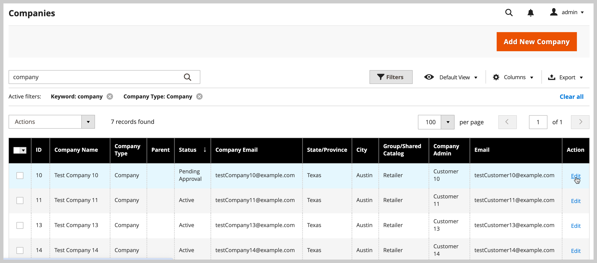
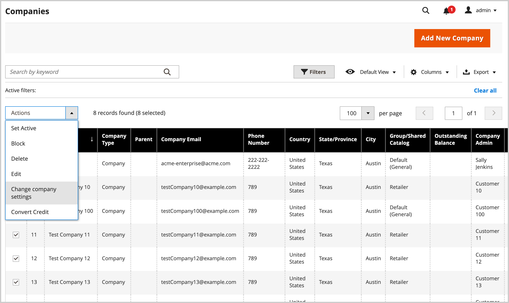
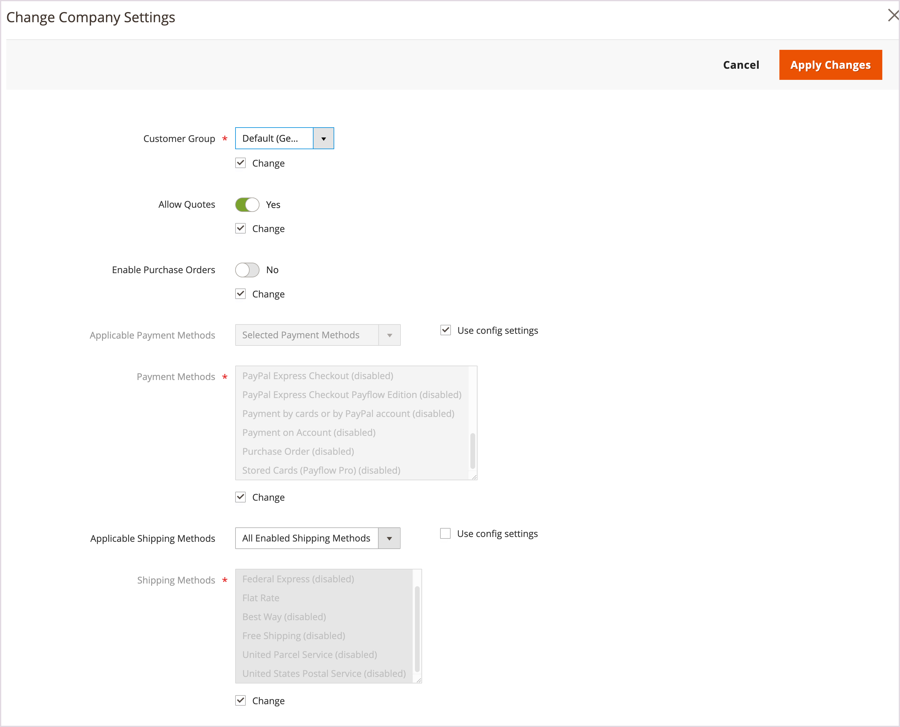
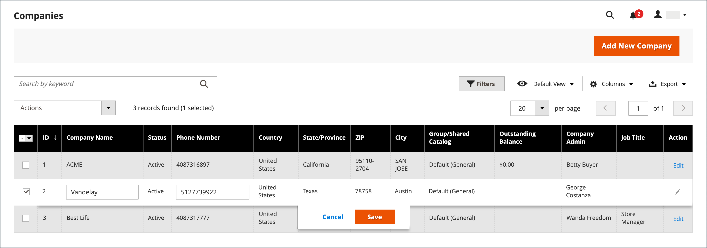

# Gestion des comptes d’entreprise

La page _[!UICONTROL Companies]_&#x200B;répertorie tous les comptes de société actuels, quel que soit leur statut. Toutes les demandes d’approbation en attente apparaissent en haut de la liste.

{width="700" zoomable="yes"}

Utilisez le contrôle *[!UICONTROL Columns]* pour personnaliser les colonnes affichées dans la grille. Personnalisez les sociétés affichées dans la vue à l’aide des fonctionnalités de recherche et de filtrage.

- Recherchez des sociétés dans la grille **Sociétés** à l’aide de l’_[!UICONTROL Search]_. La recherche indexe les colonnes **Nom de la société**&#x200B;et **Parent**.

- Personnalisez la vue pour inclure des enregistrements qui répondent à des critères spécifiques à l’aide de l’[!UICONTROL Filter] . Par exemple, si le site B2B est configuré pour gérer à la fois les comptes de société uniques et les [hiérarchies de société](manage-companies.md), vous pouvez filtrer par `[!UICONTROL Company Type - Company]` pour n’afficher que les sociétés uniques ou par `[!UICONTROL Company Type - Parent]` pour n’afficher que la société parent pour chaque hiérarchie.

Appliquez une action à plusieurs enregistrements d&#39;entreprise à l&#39;aide du contrôle _[!UICONTROL Actions]_&#x200B;au-dessus de la grille. Par exemple, plutôt que d’approuver chaque demande individuelle d’entreprise, vous pouvez sélectionner plusieurs demandes pour activer les comptes en une seule action. Les actions disponibles dépendent des [autorisations](../systems/permissions.md) pour le rôle affecté à votre compte utilisateur d’administrateur.

## Ressources de rôle d’entreprise

Les paramètres [Ressources du rôle](../systems/permissions-user-roles.md#role-resources) déterminent les possibilités suivantes :

- Ajouter une entreprise
- Supprimer une entreprise
- Appliquer un remboursement de solde
- Afficher les entreprises

Ces ressources de rôle doivent être définies pour le [rôle utilisateur](../systems/permissions-user-roles.md) attribué au compte utilisateur Admin.

## Gérer les comptes d’entreprise à partir de la grille Entreprises

Affichez et gérez les comptes utilisateur des sociétés à partir du menu Admin en sélectionnant **[!UICONTROL Customers]** > **[!UICONTROL Companies]** pour ouvrir la page de *[!UICONTROL Companies]*.

Vous pouvez gérer les comptes individuellement ou en groupes.

- Affichez ou modifiez les paramètres de configuration d&#39;un compte de société individuel en sélectionnant **[!UICONTROL Edit]** dans la colonne **[!UICONTROL Action]** de l&#39;enregistrement de compte de société.

  {width="675" zoomable="yes"}

- Affichez ou modifiez un groupe de comptes société sélectionnés à l&#39;aide des options disponibles dans le contrôle ** au-dessus de la grille.[!UICONTROL Actions]

  {width="675" zoomable="yes"}

Consultez les sections suivantes pour obtenir des instructions sur l’application de chaque action.

### Activer les comptes d’entreprise

1. Dans la commande **[!UICONTROL Actions]**, sélectionnez **[!UICONTROL Set Active]**.

1. Lorsque vous êtes invité à confirmer, cliquez sur **[!UICONTROL OK]**.

### Définir comme actif/inactif

Les clients disposant de comptes inactifs ne peuvent pas se connecter ni effectuer d’achats à partir de leurs comptes. Deux méthodes permettent de définir un compte client comme actif ou inactif :

Méthode 1 : **à partir de la grille Clients**

1. Dans la barre latérale _Admin_, accédez à [!UICONTROL **Clients**] > [!UICONTROL **Tous les clients**].

1. Dans le menu **[!UICONTROL Actions]**, sélectionnez l’une des options suivantes :

   - **[!UICONTROL Active]**
   - **[!UICONTROL Inactive]**

1. Lorsque vous y êtes invité, sélectionnez **[!UICONTROL OK]** pour appliquer la modification.

Méthode 2 : **à partir de la page de modification du compte**

1. Dans la barre latérale _Admin_, accédez à [!UICONTROL **Clients**] > [!UICONTROL **Tous les clients**].

1. Dans la grille, recherchez l’enregistrement du client à modifier.

1. Dans la colonne _Actions_ tout à droite, sélectionnez [!UICONTROL **Modifier**].

1. Sélectionnez l’onglet [!UICONTROL **Informations du compte**].

1. Définissez [!UICONTROL **Client actif**] sur `Yes` ou `No`.

1. Cliquez sur [!UICONTROL **Enregistrer le client**].

### Bloquer les comptes d’entreprise

Les utilisateurs associés à un compte d’entreprise bloqué peuvent se connecter et accéder au catalogue, mais ne peuvent pas effectuer d’achats. Une entreprise dont le compte n’est pas en règle peut être bloquée temporairement jusqu’à ce que le problème soit résolu.

1. Dans la commande **[!UICONTROL Actions]**, sélectionnez **[!UICONTROL Block]**.

1. Lorsque vous êtes invité à confirmer, cliquez sur **[!UICONTROL OK]**.

### Supprimer des comptes société

Les comptes société supprimés ne peuvent pas être restaurés. Le statut des comptes d’utilisateurs associés à la société est défini sur `Inactive` et l’ID de société est supprimé des profils des comptes d’utilisateurs. Les informations sur les activités et les transactions de la société sont conservées dans le système.

1. Dans la commande **[!UICONTROL Actions]**, sélectionnez **[!UICONTROL Delete]**.

1. Lorsque vous êtes invité à confirmer, cliquez sur **[!UICONTROL OK]**.

### Modifier les paramètres de l’entreprise

Mettez à jour la configuration [Paramètres avancés](account-company-create.md#advanced-settings) pour appliquer les mêmes paramètres à plusieurs sociétés sélectionnées dans la grille *Sociétés*.

>[!NOTE]
>
>Gérez la configuration des paramètres avancés d&#39;une organisation d&#39;entreprise avec une société parent et des sociétés enfants associées à partir de la [vue Hiérarchie de l&#39;entreprise](manage-company-hierarchy.md#change-company-settings).

1. Dans la commande **[!UICONTROL Actions]**, sélectionnez **[!UICONTROL Change company settings]**.

   Sur le formulaire *[!UICONTROL Change company settings]*, les paramètres de configuration initiaux sont définis sur les valeurs par défaut.

1. Pour chaque paramètre de configuration à modifier, cochez la case **[!UICONTROL Change]** pour activer le paramètre. Mettez ensuite à jour le paramètre selon vos besoins.

   {width="675" zoomable="yes"}

1. Après avoir mis à jour les paramètres de configuration, sélectionnez **[!UICONTROL Apply Changes]**.

1. Lorsque vous y êtes invité, sélectionnez **[!UICONTROL Change settings]** pour mettre à jour la configuration pour les sociétés sélectionnées.

>[!TIP]
>
>Vous pouvez modifier la configuration des paramètres avancés pour une seule société en sélectionnant **[!UICONTROL Edit]** dans la colonne **[!UICONTROL Action]** de l&#39;enregistrement de compte de société.

### Convertir la devise de crédit

Le crédit dans les comptes des sociétés sélectionnées est converti au taux actuel de la devise sélectionnée.

1. Dans la commande **[!UICONTROL Actions]**, sélectionnez **[!UICONTROL Convert Currency]**.

1. Lorsque vous êtes invité à confirmer, cliquez sur **[!UICONTROL OK]**.

1. Choisissez les **[!UICONTROL Credit Currency]** à utiliser pour les comptes de société sélectionnés.

   Les montants sont recalculés en fonction des taux de conversion actuels, le cas échéant. Si elle n’est pas disponible, vous pouvez saisir manuellement des taux de conversion personnalisés. Le système affiche autant de calculs de conversion que nécessaire pour la devise de crédit utilisée par les sociétés sélectionnées.

1. Cliquez sur **[!UICONTROL Proceed]** pour terminer la conversion.

## Modifier un compte d’entreprise

Méthode 1 : **Modification rapide**

1. Dans la première colonne, cochez la case du compte d&#39;entreprise à éditer.

1. Dans la commande **[!UICONTROL Actions]**, sélectionnez **[!UICONTROL Edit]**.

   Chaque valeur pouvant être mise à jour apparaît dans une zone de texte.

   {width="675" zoomable="yes"}

1. Mettez à jour l’une des valeurs suivantes si nécessaire :

   - **[!UICONTROL Company Name]**

   - **[!UICONTROL Company Email]**

   - **[!UICONTROL Phone Number]**

1. Cliquez sur **[!UICONTROL Save]**.

Méthode 2 : **Modification complète**

1. Dans la grille, recherchez l&#39;enregistrement d&#39;entreprise à modifier.

1. Sélectionnez **[!UICONTROL Edit]** dans la colonne _[!UICONTROL Action]_.

1. Apportez les modifications nécessaires aux informations de la société.

   Pour la description des champs, voir [Créer un compte d’entreprise](account-company-create.md).

1. Cliquez ensuite sur **[!UICONTROL Save]**.

## Affecter un représentant commercial

Le représentant commercial est un [utilisateur administrateur](../systems/permissions.md) qui est désigné comme point de contact pour un compte d’entreprise et qui reçoit tous les [e-mails](../b2b/enable-basic-features.md#configure-company-email-options) automatisés liés à l’entreprise. Un seul vendeur peut être affecté par compte de société, mais un seul vendeur peut gérer plusieurs comptes de société. Le compte utilisateur administrateur par défaut est affecté en tant que représentant commercial, sauf si un autre utilisateur administrateur est affecté.

Le nom et l&#39;adresse e-mail du représentant commercial assigné sont visibles pour les membres de la société à partir de la page du compte de la société et des devis.

1. Dans la barre latérale _Admin_, accédez à **[!UICONTROL Customers]** > **[!UICONTROL Companies]**.

1. Recherchez l’entreprise dans la grille et ouvrez-la en mode d’édition.

1. Définissez **[!UICONTROL Sales Representative]** sur l’utilisateur administrateur que vous souhaitez affecter comme point de contact pour la société.

1. Cliquez ensuite sur **[!UICONTROL Save]**.

   Le commercial assigné reçoit une notification par e-mail de l&#39;affectation.

## Mettre à jour un profil d’entreprise

Le profil d’entreprise peut être conservé à partir du storefront par l’administrateur de l’entreprise, mais également à partir de l’administrateur par un administrateur de magasin.

{width="700" zoomable="yes"}

1. Dans la barre latérale _Admin_, accédez à **[!UICONTROL Customers]** > **[!UICONTROL Companies]**.

1. Recherchez la société dans la grille et cliquez sur **[!UICONTROL Edit]** dans la colonne _[!UICONTROL Action]_.

1. Mettez à jour les valeurs de champ dans chaque section selon vos besoins à l’aide des descriptions des champs à titre de référence.

1. Cliquez ensuite sur **[!UICONTROL Save]**.

## Démonstration du compte d’entreprise

Pour en savoir plus sur la gestion des comptes d’entreprise, regardez cette vidéo :

>[!VIDEO](https://video.tv.adobe.com/v/3410771?captions=fre_fr&quality=12&learn=on)

## Gestion d&#39;entreprise

Une fois une société créée, les utilisateurs administrateurs disposant des autorisations appropriées peuvent utiliser la section [!UICONTROL Company Hierarchy] pour créer une organisation de société parent en modifiant la société parent désignée et en affectant des sociétés associées.

Si une société a été ajoutée à une hiérarchie, la grille [!UICONTROL Company Hierarchy] affiche la société parent et toutes les sociétés affectées dans la grille.

Voir [Gérer la hiérarchie de l’entreprise](manage-company-hierarchy.md) pour plus d’informations.

## Options et colonnes de la société

Les sections suivantes fournissent des informations sur les actions et options disponibles ainsi que sur les informations affichées disponibles pour la gestion des comptes société.

### Options de contrôle des actions

| Option | Description |
|--------------------------------------|---------------------------------------------------------------------------------------------------------------------------------------------------------------------------------------------------------------------------------------------------------------------------------|
| [!UICONTROL Set Active] | Définit le statut de tous les enregistrements d&#39;entreprise sélectionnés sur `Active`. Les administrateurs de l’entreprise reçoivent des instructions pour définir leurs mots de passe afin de pouvoir accéder à leurs comptes et gérer leurs entreprises à partir du storefront. |
| [!UICONTROL Block] | Limite les comptes d’entreprise qui ne sont pas en règle, tout en préservant le compte. Les membres de la société peuvent se connecter et accéder au catalogue, mais ils ne peuvent pas passer de commandes au nom de la société. |
| [!UICONTROL Delete] | Supprime les comptes société sélectionnés. Le statut des comptes d’utilisateurs associés à une entreprise supprimée est défini sur `Inactive` et l’ID d’entreprise est supprimé des profils des comptes d’utilisateurs. Les informations sur les activités et les transactions de la société sont conservées dans le système. |
| [!UICONTROL Edit] | Permet de modifier certaines valeurs de l&#39;enregistrement d&#39;entreprise sélectionné à partir de la grille. Par défaut, les valeurs Nom de la société, Adresse électronique de la société et Numéro de téléphone sont disponibles pour une modification rapide. |
| [!UICONTROL Change company settings] | Ouvre le formulaire *Modifier les paramètres de l’entreprise* pour mettre à jour la configuration [Paramètres avancés](account-company-create.md#advanced-settings) et appliquer les modifications aux entreprises sélectionnées. |
| [!UICONTROL Convert Credit] | Convertit le crédit en compte pour les sociétés sélectionnées en fonction des taux de la devise spécifiée. |

{style="table-layout:auto"}

### Descriptions des colonnes

#### Mise en page des colonnes par défaut

| Colonne | Description |
|-----------------------------------|--------------------------------------------------------------------------------------------------------------------------------------------------------------------------------------------------------------------------------------------------------------------------------------------------------------------------------------------------------------------------------------------------------------------------------------------------------------------------|
| [!UICONTROL Select] | Cases à cocher utilisées pour sélectionner les enregistrements d&#39;entreprise qui doivent faire l&#39;objet d&#39;une action ou utiliser la commande de sélection dans l&#39;en-tête de colonne pour tout sélectionner/désélectionner. |
| [!UICONTROL ID] | Identifiant numérique unique attribué lors de l’envoi de la demande de création d’une entreprise. |
| [!UICONTROL Company Name] | Le nom de la société est saisi lors de la première création du compte de société et peut être une version abrégée de la dénomination sociale complète. |
| [!UICONTROL Company Type] | Type de [société](manage-companies.md). Options :  **[!UICONTROL Company]**- Par défaut, les nouvelles sociétés sont créées en tant que sociétés uniques. **[!UICONTROL Parent]** - La société est une société mère d’autres sociétés.  **[!UICONTROL Child]**- Cette société est liée à une société mère. |
| [!UICONTROL Parent] | Affiche la société parent pour cette ligne de société spécifique. |
| [!UICONTROL Company Email] | Adresse e-mail associée au compte d’entreprise. |
| [!UICONTROL Phone Number] | Numéro de téléphone principal de la société. |
| [!UICONTROL Country] | Pays dans lequel la société est enregistrée pour exercer son activité. |
| [!UICONTROL State Province] | État ou province dans lequel la société est enregistrée pour exercer ses activités. |
| [!UICONTROL City] | Ville dans laquelle la société est enregistrée pour exercer ses activités. |
| [!UICONTROL Group/Shared Catalog] | Le nom de la colonne dépend de l’activation ou non du catalogue partagé dans la configuration. Options :  **[!UICONTROL Customer Group]**- Si le catalogue partagé n’est pas activé dans la configuration, indique le nom du [groupe de clients](../customers/customer-groups.md) auquel la société appartient. **[!UICONTROL Shared Catalog]** - Si le catalogue partagé est activé dans la configuration, indique le nom du catalogue partagé affecté au client. |
| [!UICONTROL Outstanding Balance] | Solde restant sur le compte de la société. la colonne est vide si l&#39;entreprise n&#39;a pas d&#39;historique de crédit et que sa limite de crédit est nulle. |
| [!UICONTROL Company Admin] | Prénom et nom de l’administrateur ou de l’administratrice de la société. |
| [!UICONTROL Job Title] | Fonction de l&#39;administrateur de la société. |
| [!UICONTROL Work Phone Number] | Numéro de téléphone professionnel de l’administrateur de la société. |
| [!UICONTROL Email] | Adresse e-mail de l’administrateur de la société. |
| [!UICONTROL Action] | **[!UICONTROL Edit]** - Ouvre le compte d’entreprise en mode d’édition. |

{style="table-layout:auto"}

#### Colonnes supplémentaires

Les colonnes suivantes sont disponibles en modifiant la [disposition des colonnes](../getting-started/admin-grid-controls.md) de la grille.

| Colonne | Description |
|---------------------------------|--------------------------------------------------------------------------------------------------------------------------------------------------------------------------------------------------------------------------------------------------------------------------------------------------------------------------------------------------------------------------------------------------------------------------------------------------------------------------------------------------------------------------------------------------------------------------------------------------------------------------------------------------------------------------------------------------------------------------------------------------------------------------------------------------------------------------------------------------------------------------------------------------------------------------------------------------------|
| [!UICONTROL Company Legal Name] | Nom légal complet de la société. |
| [!UICONTROL Street Address] | Adresse postale où la société est enregistrée pour exercer ses activités. |
| [!UICONTROL ZIP] | Code postal de l’enregistrement de la société pour l’exercice de ses activités. |
| [!UICONTROL Reseller ID] | Numéro de revente attribué à la société à des fins de déclaration fiscale. |
| [!UICONTROL VAT/TAX ID] | Numéro [taxe sur la valeur ajoutée](../stores-purchase/vat.md) attribué à la société par certaines juridictions à des fins de déclaration fiscale. Pour configurer l’ID TVA/TAXE du client à afficher dans le storefront, voir [Options de création de compte](../configuration-reference/customers/customer-configuration.md). |
| [!UICONTROL Credit Limit] | Limite de crédit étendue au compte de la société. |
| [!UICONTROL Credit Currency] | Devise acceptée par le magasin pour les achats à crédit de la société. |
| [!UICONTROL Status] | Indique le [statut](account-company-approve.md) du compte société. Options :  **[!UICONTROL Active]**- Le compte de la société est approuvé par l’administrateur du magasin. L’administrateur de l’entreprise et les membres associés peuvent se connecter au compte depuis le storefront et effectuer des achats. **[!UICONTROL Pending Approval]** - Une demande d’ouverture d’un compte d’entreprise a été soumise, mais n’a pas encore été approuvée par l’administrateur de la boutique.  **[!UICONTROL Rejected]**- Une demande d’ouverture d’un compte d’entreprise a été soumise, mais n’a pas été approuvée par l’administrateur du magasin. Les informations d’identification de connexion initiales utilisées pour envoyer la requête sont bloquées. **[!UICONTROL Blocked]** - Les membres de l’entreprise peuvent se connecter et accéder au catalogue, mais ne peuvent pas effectuer d’achats. L’administrateur du magasin peut bloquer un compte d’entreprise qui n’est pas en règle. Le blocage sur le compte peut être supprimé à tout moment par l’administrateur du magasin. |
| [!UICONTROL Gender] | Sexe de l’administrateur ou de l’administratrice de la société. Options : Homme / Femme / Non Spécifié |
| [!UICONTROL Comment] | Notes relatives au compte de société à titre de référence et visibles uniquement par l’administrateur. |

{style="table-layout:auto"}

### Barre de boutons

| Bouton | Description |
|--------------------------------|---------------------------------------------------------------------------------------------------------------------------------------------------------------------------------------------------------------------------------------------------------------------|
| [!UICONTROL Back] | Retourne à la page Entreprises sans enregistrer les modifications. |
| [!DNL Delete Company] | Supprime le compte société. Le statut des comptes d’utilisateurs associés à la société est défini sur `Inactive` et l’ID de société est supprimé des profils des comptes d’utilisateurs. Les informations sur les activités et les transactions de la société sont conservées dans le système. |
| [!DNL Reset] | Restaure les valeurs d’origine dans tous les champs avec des modifications non enregistrées. |
| [!DNL Reimburse Balance] | Permet à l&#39;administrateur de rembourser le solde à partir du crédit du magasin, référencé par le numéro de bon de commande. |
| [!DNL Save] | Enregistre les modifications dans l’entreprise et maintient le profil ouvert. |
| [!UICONTROL Save & Close] | Enregistre les modifications dans l&#39;entreprise et ferme le profil. |

{style="table-layout:auto"}

### Descriptions des champs

| Champ | Description |
|-----------------------------------|--------------------------------------------------------------------------------------------------------------------------------------------------------------------------------------------------------------------------------------------------------------------------------------------------------------------------------------------------------------------------------------------------------------------------------------------------------------------------------------------------------------------------------------------------------------------------------------------------------------------------------------------------------------------------------------------------------------------------------------------------------------------------------------------------------------------------------------------------------------------------------------------------------------------------------------------------------|
| [!UICONTROL Company Name] | Le nom de la société est saisi lors de la première création du compte de société et peut être une version abrégée de la dénomination sociale complète. |
| [!UICONTROL Status] | Indique le [statut](account-company-approve.md) du compte société. Options :  **[!UICONTROL Active]**- Le compte de la société est approuvé par l’administrateur du magasin. L’administrateur de l’entreprise et les membres associés peuvent se connecter au compte depuis le storefront et effectuer des achats. **[!UICONTROL Pending Approval]** - Une demande d’ouverture d’un compte d’entreprise a été soumise, mais n’a pas encore été approuvée par l’administrateur de la boutique.  **[!UICONTROL Rejected]**- Une demande d’ouverture d’un compte d’entreprise a été soumise, mais n’a pas été approuvée par l’administrateur du magasin. Les informations d’identification de connexion initiales utilisées pour envoyer la requête sont bloquées. **[!UICONTROL Blocked]** - Les membres de l’entreprise peuvent se connecter et accéder au catalogue, mais ne peuvent pas effectuer d’achats. L’administrateur du magasin peut bloquer un compte d’entreprise qui n’est pas en règle. Le blocage sur le compte peut être supprimé à tout moment par l’administrateur du magasin. |
| [!UICONTROL Company Email] | Adresse e-mail associée au compte d’entreprise. |
| [!UICONTROL Sales Representative] | Utilisateur administrateur qui est le contact principal pour le compte de société. |

{style="table-layout:auto"}

#### [!UICONTROL Account Information]

| Champ | Description |
|---------------------------------|----------------------------------------------------------------------------------------------------------------------------|
| [!UICONTROL Company Legal Name] | Nom légal complet de la société. |
| [!UICONTROL VAT / TAX ID] | Numéro de taxe ou [taxe sur la valeur ajoutée](../stores-purchase/vat.md) attribué à la société à des fins de déclaration fiscale. |
| [!UICONTROL Reseller ID] | Numéro de revente attribué à la société à des fins de déclaration fiscale. |
| [!UICONTROL Comment] | Ces notes sur le compte de la société sont fournies à titre de référence et ne sont visibles que par l’administrateur. |

{style="table-layout:auto"}

#### [!UICONTROL Company Hierarchy]

| Colonnes | Description |
|-----------------------------|------------------------------------------------------------------------------------------------------------------------------------------------------|
| [!UICONTROL Company ID] | Numéro d’identification de la société. |
| [!UICONTROL Company Name] | Nom complet de la société.  Un `current company indicator` apparaît dans la ligne de société en cours de modification. |
| [!UICONTROL Company Email] | Adresse e-mail associée au compte d’entreprise. |
| [!UICONTROL Phone Number] | Numéro de téléphone principal de la société. |
| [!UICONTROL State/Province] | État ou province dans lequel la société est enregistrée pour exercer ses activités. |
| [!UICONTROL City] | Ville dans laquelle la société est enregistrée pour exercer ses activités. |
| [!UICONTROL Customer Group] | (Administrateur uniquement) Indique le [groupe de clients](../customers/customer-groups.md) ou [catalogue partagé](catalog-shared.md) affecté à la société. |
| [!UICONTROL Company Admin] | Nom complet de l’administrateur de la société. |
| [!UICONTROL Action] | Liste des actions possibles pour cette ligne d’entreprise. |

{style="table-layout:auto"}

#### [!UICONTROL Legal Address]

| Colonnes | Description |
|-----------------------------|------------------------------------------------------------------------------------------------------------------------------------------------------|
| [!UICONTROL Street Address] | Adresse postale où la société est enregistrée pour exercer ses activités. |
| [!UICONTROL City] | Ville dans laquelle la société est enregistrée pour exercer ses activités. |
| [!UICONTROL Country] | Pays dans lequel la société est enregistrée pour exercer son activité. |
| [!UICONTROL State/Province] | État ou province dans lequel la société est enregistrée pour exercer ses activités. |
| [!UICONTROL ZIP/Postal Code] | Code postal de l’enregistrement de la société pour l’exercice de ses activités. |
| [!UICONTROL Phone Number] | Numéro de téléphone principal de la société. |

{style="table-layout:auto"}

#### [!UICONTROL Company Admin]

| Champ | Description |
|--------------------------------------|--------------------------------------------------------------------------------------------------------------------------------------------------------------------------------------------------------------------------------------------------|
| [!UICONTROL Website] | Définissez la [portée du site web](../getting-started/websites-stores-views.md) pour le compte d’entreprise. La valeur par défaut est la *[!UICONTROL Main Website]*. |
| [!UICONTROL Job Title] | Titre de l’administrateur de la société qui gère le compte de la société. |
| [!UICONTROL Work Phone Number] | Numéro de téléphone de l’administrateur de la société qui gère le compte de la société. |
| [!UICONTROL Email] | L’adresse e-mail de l’administrateur de la société peut être identique à celle de la société. Si une adresse e-mail différente est saisie, un compte individuel distinct est créé pour l’administrateur de la société en plus du compte de la société. |
| [!UICONTROL Prefix] | Le cas échéant, le préfixe associé au nom de l’administrateur de la société (tel que `Mr.`, `Ms.`, `Mrs.` ou `Dr.`). Selon la configuration, le champ de saisie peut être un champ de texte ou une liste. |
| [!UICONTROL First Name] | Prénom de l’administrateur ou de l’administratrice de la société. |
| [!UICONTROL Middle Name/Initial] | Deuxième prénom ou initiale de l’administrateur de la société. |
| [!UICONTROL Last Name] | Nom de l’administrateur de la société. |
| [!UICONTROL Suffix] | Le cas échéant, le suffixe associé au nom de l’administrateur de la société (`Jr.`, `Sr.` ou `III`, par exemple). Selon la configuration, le champ de saisie peut être un champ de texte ou une liste. |
| [!UICONTROL Gender] | Sexe de l’administrateur ou de l’administratrice de la société. Options : `Male` / `Female` / `Not Specified` |
| [!UICONTROL Send Welcome Email From] | Définissez le magasin à utiliser lors de l’envoi de l’e-mail de bienvenue au nouvel administrateur de l’entreprise si vous ne souhaitez pas utiliser le *[!UICONTROL Default Store View]*. |

{style="table-layout:auto"}

#### [!UICONTROL Company Credit]

| Champ | Description |
|-------------------------------------------|--------------------------------------------------------------------------------------------------------------------------------------------------------------------------------|
| [!UICONTROL Credit Currency] | Devise acceptée par le magasin pour les achats à crédit de la société. |
| [!UICONTROL Credit Limit] | Limite de crédit étendue au compte de la société. |
| [!UICONTROL Allow to Exceed Credit Limit] | Indique si la société est autorisée à dépasser la limite de crédit. Options : Oui / Non |
| [!UICONTROL Reason for Change] | Note expliquant les circonstances dans lesquelles la société peut ou ne peut pas dépasser la limite de crédit. Ce champ n’est actif que si l’autorisation de dépasser la limite de crédit est modifiée. |

{style="table-layout:auto"}

#### [!UICONTROL Advanced Settings]

| Champ | Description |
|-----------------------------------------|------------------------------------------------------------------------------------------------------------------------------------------------------------------------------------------------------|
| [!UICONTROL Customer Group] | Indique le [groupe de clients](../customers/customer-groups.md) ou [catalogue partagé](catalog-shared.md) affecté à la société. |
| [!UICONTROL Allow Quotes] | Détermine si les membres de la société peuvent préparer et soumettre des devis négociables pour le compte de la société. |
| [!UICONTROL Enable Purchase Orders] | Détermine si les commandes fournisseur sont autorisées pour la société. Pour que les commandes fournisseur fonctionnent pour les comptes des membres de la société, l&#39;administrateur de la société doit également activer cette fonctionnalité sur le storefront. |
| [!UICONTROL Applicable Payment Methods] | Indique les modes de paiement disponibles pour les achats de la société. Options : `B2B Payment Methods` / `All Enabled Payment Methods` / `Specific Payment Methods` |
| [!UICONTROL Payment Methods] | (Administrateur uniquement) Devient actif si des modes de paiement spécifiques sont indiqués. Pour sélectionner plusieurs modes de paiement, maintenez la touche Ctrl (PC) ou Commande (Mac) enfoncée et cliquez sur chaque option. |

{style="table-layout:auto"}
