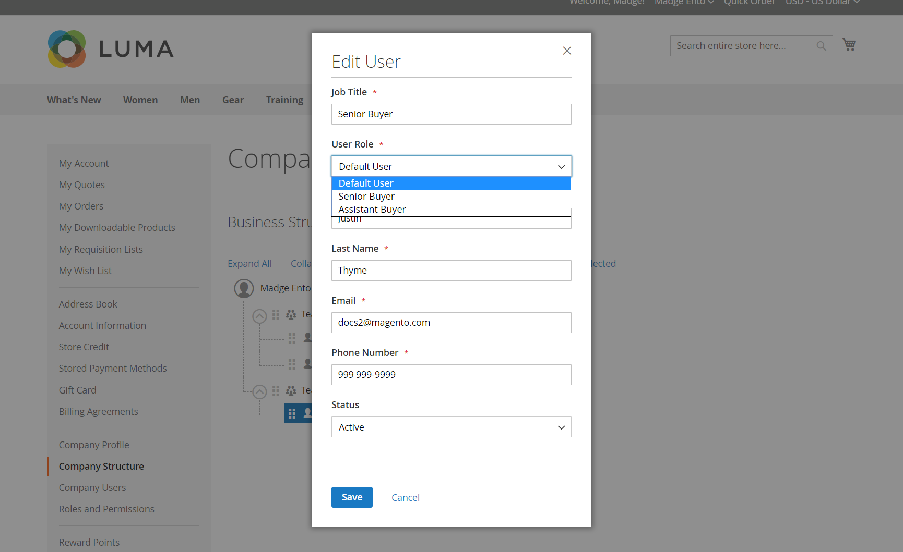

# Rôles et autorisations de l’entreprise

Les rôles des utilisateurs de l’entreprise sont configurés avec différents niveaux d’autorisation pour accéder aux informations et ressources commerciales. Par défaut, l’administrateur de l’entreprise est un _super-utilisateur_ avec des autorisations complètes. La variable [Accès refusé](../content-design/pages.md#access-denied) s’affiche si l’utilisateur n’est pas autorisé à accéder à la page.

{width="700" zoomable="yes"}

Le système dispose d’un rôle Utilisateur par défaut prédéfini que vous pouvez utiliser. _as is_ ou effectuez des modifications en fonction de vos besoins. Vous pouvez créer autant de rôles que nécessaire pour correspondre à la structure de votre entreprise et aux responsabilités organisationnelles, comme dans l’exemple suivant :

- **Utilisateur par défaut** — L’utilisateur par défaut dispose d’un accès complet aux activités liées aux ventes et aux devis, ainsi que d’un accès en lecture seule aux informations de profil et de crédit de la société.

- **Achat senior** — Un acheteur principal peut avoir accès à toutes les ressources de ventes et de devis, ainsi qu’à des autorisations d’affichage uniquement sur le profil de la société, les informations utilisateur et équipe, les informations de paiement et le crédit de la société.

- **Acheteur adjoint** — Un acheteur assistant peut avoir la permission de passer une commande en utilisant _Passage en caisse avec devis_ et pour afficher les commandes, les devis et les informations dans le profil de l’entreprise.

## Gestion des rôles et des autorisations

1. L’administrateur de la société se connecte à son compte de magasin.

1. Dans le panneau de gauche, sélectionnez **[!UICONTROL Roles and Permissions]**.

1. Effectue l’une des tâches suivantes.

### Création d’un rôle

1. Clics **[!UICONTROL Add New Role]**.

   {width="600" zoomable="yes"}

1. Saisissez une description **[!UICONTROL Role Name]**.

1. Sous _[!UICONTROL Role Permissions]_, effectue l’une des opérations suivantes :

   - Coche la case de chaque ressource ou activité à laquelle les utilisateurs auxquels le rôle a été attribué et à laquelle ils ont accès.

   - Sélectionne la variable **[!UICONTROL All]** et efface la case à cocher de chaque ressource ou activité à laquelle les utilisateurs affectés au rôle ne sont pas autorisés à accéder.

1. Clics **[!UICONTROL Save Role]**.

1. Crée autant de rôles que nécessaire en répétant ces étapes.

### Modification d’un rôle

1. Pour modifier le rôle, l’administrateur de l’entreprise clique sur **[!UICONTROL Edit]** dans le _[!UICONTROL Actions]_colonne .

1. Apporte les modifications nécessaires aux paramètres de nom et d’autorisation.

1. Une fois l’opération terminée, cliquez sur **[!UICONTROL Save Role]**.

### Dupliquer un rôle

1. Pour dupliquer le rôle, l’administrateur de l’entreprise clique sur **[!UICONTROL Duplicate]** dans le _[!UICONTROL Actions]_colonne .

1. Apporte les modifications nécessaires aux paramètres de nom et d’autorisation.

1. Une fois l’opération terminée, cliquez sur **[!UICONTROL Save Role]**.

### Suppression d’un rôle

1. L’administrateur de la société trouve le rôle à supprimer dans la liste des rôles.

   Seuls les rôles sans utilisateurs affectés peuvent être supprimés.

1. Clics **[!UICONTROL Delete]** dans le _[!UICONTROL Actions]_colonne .

1. Lorsque vous êtes invité à confirmer l’opération, cliquez sur **[!UICONTROL OK]**.

## Actions

| Action | Description |
|-----------| ----------- |
| [!UICONTROL Duplicate] | Crée une copie du rôle sélectionné. Le nom du rôle dupliqué contient `- Duplicated` ajouté à la fin. |
| [!UICONTROL Edit] | Modifiez le nom et/ou le jeu d’autorisations. |
| [!UICONTROL Delete] | Supprimez le rôle. Seuls les rôles sans utilisateurs affectés peuvent être supprimés. |

{style="table-layout:auto"}

## Autorisations de rôle

- Tous
   - Ventes
      - Autoriser l’extraction (ordre de tri)
         - Méthode Payer sur le compte
      - Afficher les commandes
         - Afficher les commandes des utilisateurs subordonnés
- Guillemets
   - Affichage
      - Demande, modification et suppression
      - Passage en caisse avec guillemet
      - Affichage des guillemets des utilisateurs subordonnés
- Approbations de commandes
   - Afficher mes commandes
      - Vue pour les subordonnés
      - Afficher pour toutes les entreprises
   - Validation automatique des PO créés dans ce rôle
   - Approuver les commandes d’achat sans autres approbations
   - Affichage des règles d’approbation
      - Création, modification et suppression
- Profil d’entreprise
   - Informations du compte (affichage)
      - Modifier
   - Adresse légale
      - Modifier
   - Contacts (vue)
   - Informations de paiement (affichage)
   - Informations d’expédition (affichage)
- Gestion des utilisateurs de l’entreprise
   - Affichage des rôles et des autorisations
      - Gestion des rôles et des autorisations
   - Affichage des utilisateurs et des équipes
      - Gestion des utilisateurs et des équipes
- Crédit de la société
   - Affichage

## Attribution d’un rôle à un utilisateur de société

Après avoir défini les rôles nécessaires, l’administrateur de l’entreprise attribue un rôle à chaque utilisateur de l’entreprise.

1. Se connecte à son compte d’entreprise en tant qu’administrateur de l’entreprise.

1. Dans le panneau de gauche, sélectionnez **[!UICONTROL Company Users]**.

   {width="700" zoomable="yes"}

1. Recherche l’utilisateur dans la liste et clique sur **[!UICONTROL Edit]**.

1. Choisissez la méthode appropriée. **[!UICONTROL User Role]** pour l’utilisateur.

   {width="700" zoomable="yes"}

1. Clics **[!UICONTROL Save]**.
