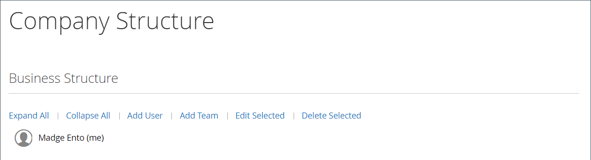

# Structure des comptes d&#39;entreprise

Un compte d’entreprise peut être configuré pour refléter la structure de l’entreprise. Au départ, la structure de l’entreprise comprend uniquement l’administrateur ou l’administratrice de l’entreprise, mais peut être étendue pour inclure des équipes d’utilisateurs et utilisatrices. Les utilisateurs peuvent être associés à des équipes ou organisés dans une hiérarchie de divisions et de subdivisions au sein de la société.

{width="500"}

Dans le tableau de bord du compte de l’administrateur de l’entreprise sur le storefront, la structure de l’entreprise est représentée sous la forme d’une arborescence et se compose initialement uniquement de l’administrateur de l’entreprise.

{width="700" zoomable="yes"}

Pour les commerçants, la structure complète de l’entreprise est reflétée dans les grilles _Entreprises_ et _Clients_ au sein de l’administration. La grille Sociétés répertorie toutes les sociétés, quel que soit leur statut.

{width="700" zoomable="yes"}

L&#39;exemple suivant illustre la grille [!UICONTROL Customers] avec les comptes d&#39;administration initiaux de chaque société.

{width="700" zoomable="yes"}

Après avoir créé le compte, l’administrateur ou l’administratrice d’entreprise peut définir une structure d’entreprise avec des [équipes](account-company-structure.md), configurer les [utilisateurs de l’entreprise](account-company-users.md) et établir des [rôles et autorisations](account-company-roles-permissions.md) pour chacun.

>[!NOTE]
>
>Lorsqu’un utilisateur d’entreprise est ajouté, il est d’abord ajouté à la structure racine de l’entreprise, puis subordonné à l’administrateur de l’entreprise. Si l’administrateur ou l’administratrice de l’entreprise exerce plusieurs rôles au sein de l’entreprise, créez des comptes utilisateur d’entreprise distincts avec une adresse électronique différente pour chaque rôle.

## Icônes de structure de l’entreprise

| Icon | Description |
| ---- | ----------------- |
|  | Représente l&#39;administrateur de la société dans la structure de la société. |
|  | Représente une équipe dans la structure de l&#39;entreprise. |
|  | Représente un utilisateur dans la structure de l’entreprise. |
|  | Déplace une équipe vers un autre poste de la structure de l&#39;entreprise. |
|  | Développe une équipe dans la structure de l&#39;entreprise. |
|  | Réduit une équipe dans la structure de l&#39;entreprise. |

{style="table-layout:auto"}

## Créer des équipes d’entreprise

La structure d&#39;un compte d&#39;entreprise doit refléter l&#39;organisation d&#39;achat, qu&#39;il s&#39;agisse d&#39;une organisation simple et plate ou d&#39;une organisation complexe avec différentes équipes pour chaque subdivision et division de l&#39;entreprise.

Si le magasin est [configuré](enable-basic-features.md) pour permettre aux sociétés de gérer leurs propres comptes, la configuration de la structure de la société est l’une des premières tâches qu’un administrateur de la société doit effectuer après la validation du compte. Dans le compte d’entreprise, la structure de l’entreprise est représentée sous la forme d’une arborescence, l’administrateur de l’entreprise étant en haut.

{width="450"}

1. L’administrateur de l’entreprise se connecte à son compte.

1. Dans le panneau de gauche, sélectionne **[!UICONTROL Company Structure]**.

1. Sous **[!UICONTROL Business Structure]**, clique sur **[!UICONTROL Add Team]** et effectue les opérations suivantes :

   - Entre les **[!UICONTROL Team Title]** et les **[!UICONTROL Description]**.

     Le titre d’équipe peut être tout élément représentant la structure de la société, telle qu’une équipe, un bureau ou une division au sein de la société

     {width="700" zoomable="yes"}

   - Une fois l’opération terminée, cliquez sur **[!UICONTROL Save]**.

   - Crée autant d’équipes que nécessaire.

1. Pour créer une hiérarchie d’équipes, l’administrateur effectue les opérations suivantes :

   - Sélectionne l&#39;équipe parente, puis cliquez sur **[!UICONTROL Add Team]**.

     {width="600" zoomable="yes"}

   - Entre les **[!UICONTROL Team Title]** et les **[!UICONTROL Description]**.

   - Effectue un clic sur **[!UICONTROL Save]**.

1. Répète ces étapes pour créer autant d’équipes, ou de divisions et de subdivisions que nécessaire.

   {width="600" zoomable="yes"}

## Déplacer une équipe

Lorsque l&#39;administrateur de la société travaille avec la structure de la société, il peut faire glisser des équipes ou des divisions vers d&#39;autres emplacements de la structure.

1. L’administrateur d’entreprise localise l’équipe à déplacer.

1. Clique et fait glisser l’équipe vers un nouveau poste dans la structure de l’entreprise.

## Supprimer une équipe

>[!NOTE]
>
>Avant de supprimer une équipe, il est recommandé de s’assurer que la bonne équipe est sélectionnée (les équipes supprimées ne peuvent pas être restaurées).

1. L&#39;administrateur de l&#39;entreprise sélectionne l&#39;équipe à supprimer.

1. Effectue un clic sur **[!UICONTROL Delete Selected]**.

1. Lorsque vous êtes invité à confirmer, cliquez sur **[!UICONTROL Delete]**.

## Développer ou réduire la structure de l’équipe

Lorsque l’administrateur de l’entreprise travaille avec la structure de l’entreprise, il peut réduire ou développer l’arborescence :

- Clics **[!UICONTROL Collapse All]** ou **[!UICONTROL Expand All]**.

- Clique sur  pour réduire une équipe ou  pour développer une équipe.

## Affectation d’utilisateurs à des équipes

Lorsque des équipes et des utilisateurs sont ajoutés pour la première fois à la [structure de l’entreprise](account-company-structure.md), ils sont placés au même niveau sous l’administration de l’entreprise.

{width="700" zoomable="yes"}

| Contrôle | Description |
|--- |--- |
| [!UICONTROL Collapse All / Expand All] | Réduit ou développe l’arborescence de la structure d’entreprise |
| [!UICONTROL Add User] | Crée un utilisateur sous l&#39;équipe actuelle |
| [!UICONTROL Add Team] | Crée une équipe |
| [!UICONTROL Edit Selected / Remove from Structure] | Modifie les informations utilisateur ou supprime des utilisateurs de l’arborescence métier. Pour plus d’informations, voir [Gestion des comptes utilisateur d’entreprise](account-company-users.md). |

{style="table-layout:auto"}

1. Dans le panneau de gauche, l’administrateur de l’entreprise choisit **[!UICONTROL Company Structure]**.

1. Pour affecter un utilisateur à une équipe existante, il ou elle fait glisser () l’utilisateur ou l’utilisatrice sous l’équipe appropriée.

   {width="700" zoomable="yes"}
