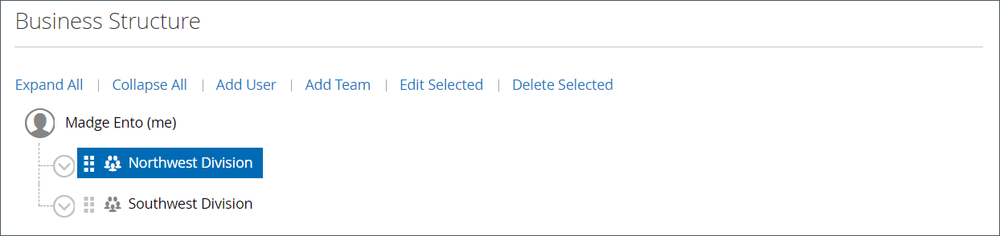

# Structure du compte d’entreprise

Un compte d’entreprise peut être configuré pour refléter la structure de l’entreprise. Au départ, la structure de l’entreprise inclut uniquement l’administrateur de l’entreprise, mais peut être développée pour inclure des équipes d’utilisateurs. Les utilisateurs peuvent être associés à des équipes ou organisés au sein d’une hiérarchie de divisions et de subdivisions au sein de l’entreprise.

{width="500"}

Dans le tableau de bord du compte de l’administrateur de l’entreprise, la structure de l’entreprise est représentée sous la forme d’une arborescence et se compose initialement uniquement de l’administrateur de l’entreprise.

{width="600" zoomable="yes"}

Lorsque le compte est créé et approuvé, l’administrateur de l’entreprise peut utiliser l’adresse électronique de l’entreprise ou se voir attribuer une autre adresse électronique.

Il est possible que la personne qui est administrateur de la société ait plusieurs rôles au sein de la société. Si une adresse électronique distincte est saisie pour l’administrateur de l’entreprise, la structure initiale de l’entreprise inclut l’administrateur de l’entreprise ainsi qu’un compte utilisateur individuel au nom de l’administrateur de l’entreprise. Dans ce cas, l’administrateur de l’entreprise peut se connecter au compte en tant qu’entreprise ou utilisateur individuel.

{width="600" zoomable="yes"}

Pour les commerçants, la structure complète de l’entreprise est reflétée dans la variable _Entreprises_ et _Clients_ grilles dans l’administrateur. La grille Entreprises répertorie toutes les entreprises, quel que soit leur statut. L’exemple suivant montre les comptes de deux sociétés : la variable _ACME_ et la variable _Vendelay_ société.

{width="700" zoomable="yes"}

L’exemple suivant illustre la variable [!UICONTROL Customers] grille avec le compte administrateur initial de l’entreprise pour ces entreprises.

{width="700" zoomable="yes"}

Après la création du compte, l’administrateur de l’entreprise doit définir la structure de l’entreprise de [équipes](account-company-structure.md), configurez la variable [utilisateurs de l’entreprise](account-company-users.md), et [rôles et autorisations](account-company-roles-permissions.md) pour chacun d’eux.

## Icônes de structure de l’entreprise

| Icône | Description |
| ---- | ----------------- |
|  | Représente l’administrateur de l’entreprise dans la structure de l’entreprise. |
|  | Représente une équipe dans la structure de l’entreprise. |
|  | Représente un utilisateur dans la structure de l’entreprise. |
|  | Déplace une équipe vers un autre poste de la structure de l’entreprise. |
|  | Développe une équipe dans la structure de l’entreprise. |
|  | Réduit une équipe dans la structure de l’entreprise. |

{style="table-layout:auto"}

## Création d’équipes d’entreprise

La structure d’un compte de société doit refléter l’organisation d’achat, qu’il s’agisse d’une organisation simple et plate ou d’une organisation complexe avec des équipes différentes pour chaque division et division de la société.

Si le magasin est [configuré](enable-basic-features.md) pour permettre aux entreprises de gérer leurs propres comptes, la configuration de la structure de l’entreprise est l’une des premières tâches à accomplir par un administrateur de l’entreprise une fois le compte approuvé. Dans le compte de l’entreprise, la structure de l’entreprise est représentée sous la forme d’une arborescence dont l’administrateur est situé en haut.

{width="450"}

1. L’administrateur de la société se connecte à son compte.

1. Dans le panneau de gauche, sélectionnez **[!UICONTROL Company Structure]**.

1. Sous **[!UICONTROL Business Structure]**, clics **[!UICONTROL Add Team]** et effectue les opérations suivantes :

   - entre dans la variable **[!UICONTROL Team Title]** et **[!UICONTROL Description]**.

     Le Titre de l’équipe peut être tout ce qui représente la structure de l’entreprise, telle qu’une équipe, un bureau ou une division au sein de l’entreprise.

     {width="700" zoomable="yes"}

   - Une fois l’opération terminée, cliquez sur **[!UICONTROL Save]**.

   - Crée autant d’équipes que nécessaire.

     {width="600" zoomable="yes"}

1. Pour créer une hiérarchie d’équipes, procédez comme suit :

   - Sélectionnez l’équipe parente, puis cliquez sur **[!UICONTROL Add Team]**.

     {width="600" zoomable="yes"}

   - entre dans la variable **[!UICONTROL Team Title]** et **[!UICONTROL Description]**.

   - Clics **[!UICONTROL Save]**.

1. Répète ces étapes pour créer autant d’équipes, de divisions et de subdivisions que nécessaire.

   {width="600" zoomable="yes"}

## Déplacer une équipe

Comme l’administrateur de l’entreprise travaille avec la structure de l’entreprise, il peut faire glisser des équipes ou des divisions vers d’autres emplacements de la structure.

1. L’administrateur de l’entreprise localise l’équipe à déplacer.

1. Clique et fait glisser l’équipe vers un nouveau poste dans la structure de l’entreprise.

## Suppression d’une équipe

>[!NOTE]
>
>Avant de supprimer une équipe, il est recommandé de s’assurer que la bonne équipe est sélectionnée ; les équipes supprimées ne peuvent pas être restaurées.

1. L&#39;administrateur de l&#39;entreprise sélectionne l&#39;équipe à supprimer.

1. Clics **[!UICONTROL Delete Selected]**.

1. Lorsque vous êtes invité à confirmer l’opération, cliquez sur **[!UICONTROL Delete]**.

## Développer ou réduire la structure de l’équipe

Lorsque l’administrateur de l’entreprise travaille avec la structure de l’entreprise, il peut réduire ou développer l’arborescence :

- Clics **[!UICONTROL Collapse All]** ou **[!UICONTROL Expand All]**.

- Clics  pour réduire une équipe ou  pour développer une équipe.

## Affecter des utilisateurs à des équipes

Lors de l’ajout initial d’équipes et d’utilisateurs à la variable [structure de l&#39;entreprise](account-company-structure.md), ils sont placés au même niveau sous l’administrateur de la société.

{width="700" zoomable="yes"}

| Contrôle | Description |
|--- |--- |
| [!UICONTROL Collapse All / Expand All] | Réduit ou développe l’arborescence de la structure d’entreprise |
| [!UICONTROL Add User] | Crée un utilisateur sous l’équipe actuelle |
| [!UICONTROL Add Team] | Crée une équipe |
| [!UICONTROL Edit Selected / Delete Selected] | Modifie ou supprime des utilisateurs de l’arborescence de l’entreprise |

{style="table-layout:auto"}

1. Dans le panneau de gauche, l’administrateur de l’entreprise choisit **[!UICONTROL Company Structure]**.

1. Pour affecter un utilisateur à une équipe existante, ils font glisser () l’utilisateur sous l’équipe appropriée.

   {width="700" zoomable="yes"}
