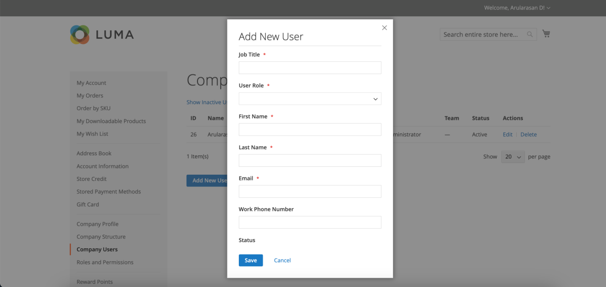

# Gestion des comptes d’utilisateurs de l’entreprise

Sur le storefront, les utilisateurs de l’entreprise sont affectés par l’administrateur de l’entreprise et sont visibles à partir de la page _[!UICONTROL Company Users]_. Ces personnes sont généralement des acheteurs disposant de différents niveaux de permission d’accéder aux services et aux ressources des magasins.

L’administrateur de l’entreprise commence par configurer la [structure de l’entreprise](account-company-structure.md), puis effectue les tâches suivantes, si nécessaire :

- Créer des utilisateurs d’entreprise et affecter des utilisateurs à des équipes

- Définition des rôles et des autorisations et affectation d’utilisateurs à des rôles

Seuls les administrateurs de l’entreprise peuvent ajouter, modifier, inactiver ou supprimer des utilisateurs de l’entreprise.

- Lorsqu’un utilisateur est supprimé, l’état du compte passe à *inactive* et le client ne peut plus se connecter à la société. Les administrateurs peuvent toujours accéder à tout le contenu associé à l’utilisateur. L’administrateur du compte peut restaurer l’accès en définissant l’état du compte sur *[!UICONTROL Active]* à partir de la page [!UICONTROL Company Users].

- Lorsqu’un compte utilisateur est supprimé, le compte et tout contenu associé sont supprimés du storefront. Cette action ne peut pas être annulée.

## Ajout d’utilisateurs d’entreprise

1. Depuis le storefront, l’administrateur de la société se connecte à son compte.

1. Dans le panneau de gauche, choisissez **[!UICONTROL Company Users]**.

   {width="700" zoomable="yes"}

1. Clique sur **[!UICONTROL Add New User]** et effectue les opérations suivantes :

   - Saisissez le **[!UICONTROL Job Title]** du nouvel utilisateur.

   - Choisit le **[!UICONTROL User Role]** approprié si les rôles et les autorisations sont définis. Sinon, ils peuvent renvoyer ultérieurement pour affecter le rôle.

     {width="700" zoomable="yes"}

   - Ajoute les informations utilisateur dans les champs restants :
      - **[!UICONTROL First Name]** et **[!UICONTROL Last Name]**
      - **[!UICONTROL Email]**
      - **[!UICONTROL Phone Number]**

   Par défaut, le **[!UICONTROL Status]** du compte est `Active`.

1. Une fois l’opération terminée, cliquez sur **[!UICONTROL Save]**.

1. Répète le processus pour créer autant d’utilisateurs de l’entreprise que nécessaire.

   Les nouveaux utilisateurs apparaissent dans la liste Utilisateurs de l’entreprise , avec l’administrateur de l’entreprise.

Pour gagner du temps lors de leur première commande, l’administrateur de la société peut rappeler à chaque utilisateur de la société d’ajouter l’adresse de facturation et de livraison par défaut à son [carnet d’adresses](../customers/account-dashboard-address-book.md).

## Supprimez un utilisateur de l’ [!UICONTROL Company structure]

Les administrateurs d’entreprise peuvent supprimer un utilisateur de l’ [!UICONTROL Company Structure].

Une fois qu’un compte est supprimé, l’état du compte utilisateur passe à *inactive* et l’utilisateur ne peut plus se connecter au storefront.
L’administrateur peut réactiver un compte en modifiant les informations du compte d’utilisateur à partir de la page Utilisateurs de l’entreprise .

1. Depuis le storefront, l’administrateur de la société se connecte à son compte.

1. Dans le panneau de gauche, choisissez **[!UICONTROL Company Structure]**.

1. Sélectionne l’utilisateur de l’entreprise dans la structure de l’entreprise.

1. Clics **[!UICONTROL Remove from Structure]**.

   {width="600" zoomable="yes"}

1. Lorsque vous êtes invité à confirmer l’opération, cliquez sur **[!UICONTROL Remove]**.

   Dans l’administrateur, l’utilisateur de la société reste répertorié dans la grille [Customers](../customers/customers-all.md), mais avec le statut `Inactive`.

## Affichage et gestion des comptes d’utilisateurs d’entreprise

Les administrateurs d’entreprise peuvent afficher et gérer les comptes utilisateurs de l’entreprise à l’aide des filtres d’affichage sur la page [!UICONTROL Company Users].

{width="700" zoomable="yes"}

- Affichez uniquement les utilisateurs inactifs en sélectionnant **[!UICONTROL Show Inactive Users]**.
- Affichez uniquement les utilisateurs actifs en sélectionnant **[!UICONTROL Show Active Users]**.
- Pour afficher tous les utilisateurs, sélectionnez **[!UICONTROL Show All Users]**.

L’administrateur de l’entreprise peut gérer un compte individuel à l’aide de l’élément de ligne *[!UICONTROL Actions]* pour modifier les informations du compte, gérer l’état du compte ou supprimer un compte.

### Modification des informations du compte utilisateur de la société

Les administrateurs d’entreprise peuvent mettre à jour les informations de profil du compte utilisateur et modifier l’état du compte.

1. Sur la page [!UICONTROL Company Users], recherchez le compte utilisateur à mettre à jour. Cliquez sur **[!UICONTROL Edit]**.

1. Apportez toute modification requise aux informations du compte utilisateur, y compris la modification de l’état du compte.

1. Appliquez les modifications en cliquant sur **[!UICONTROL Save]**.

>[!NOTE]
>
>Si vous modifiez un compte utilisateur d’entreprise et que vous constatez que les informations de compte requises du profil sont manquantes, telles que le titre de la tâche et le numéro de téléphone, cela indique que le compte a été ajouté par un administrateur de site Commerce. Ces comptes ne peuvent pas être modifiés à partir du storefront. Pour mettre à jour les informations ou modifier l’état du compte, contactez votre administrateur de site.

### Désactivation ou suppression d’un compte actif

1. Sur la page [!UICONTROL Company Users], recherchez le compte utilisateur à mettre à jour. Cliquez sur **[!UICONTROL Manage]**.

   {width="600" zoomable="yes"}

1. Lorsque vous y êtes invité, désactivez ou supprimez le compte d’utilisateur selon les besoins.

>[!IMPORTANT]
>
>La suppression d’un compte utilisateur d’entreprise supprime le compte et tout le contenu associé du système. Cette action ne peut pas être annulée.

## Description des champs de profil du compte d’utilisateur de société

| Champ | Description |
|--------------|---------------|
| [!UICONTROL Job Title] | Fonction de l’utilisateur de la société. |
| [!UICONTROL User Role] | [role](account-company-roles-permissions.md) attribué à l’utilisateur de la société. Options : `Default User` / (autres rôles) |
| [!UICONTROL First Name] | Prénom de l’utilisateur de la société. |
| [!UICONTROL Last Name] | Nom de l’utilisateur de la société. |
| [!UICONTROL Email] | Adresse électronique de l’utilisateur de la société. |
| [!UICONTROL Phone Number] | Numéro de téléphone de l’utilisateur de la société. |
| [!UICONTROL Status] | État du compte utilisateur de l’entreprise. Options : `Active` / `Inactive` |

{style="table-layout:auto"}
