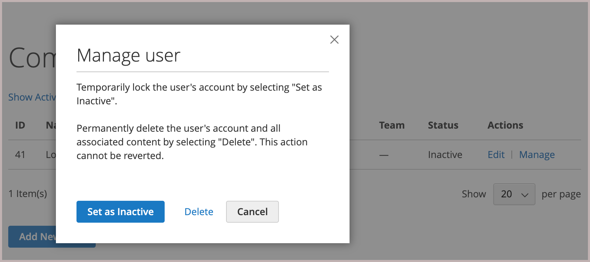

# Gestion des comptes utilisateur d’entreprise

Sur le storefront, les utilisateurs de l’entreprise sont affectés par l’administrateur de l’entreprise et sont visibles à partir de la page _[!UICONTROL Company Users]_. Ces personnes sont généralement des acheteurs disposant de différents niveaux d’autorisation pour accéder aux services et aux ressources du magasin.

L’administrateur ou l’administratrice d’entreprise commence par configurer la [structure de l’entreprise](account-company-structure.md), puis effectue les tâches suivantes selon les besoins :

- Créer des utilisateurs d’entreprise et affecter des utilisateurs aux équipes

- Définir des rôles et des autorisations, et affecter des utilisateurs et utilisatrices à des rôles

Seuls les administrateurs de l’entreprise peuvent ajouter, modifier, désactiver ou supprimer des utilisateurs.

- Lorsqu’un utilisateur est supprimé, le statut du compte passe à *inactif* et le client ne peut plus se connecter à l’entreprise. Les administrateurs peuvent toujours accéder à tout le contenu associé à l’utilisateur. L’administrateur de compte peut restaurer l’accès en modifiant le statut du compte sur *[!UICONTROL Active]* à partir de la page [!UICONTROL Company Users] .

- Lorsqu’un compte utilisateur est supprimé, le compte et tout contenu associé sont supprimés du storefront. Cette action ne peut pas être annulée.

## Ajouter des utilisateurs d’entreprise

1. À partir du storefront, l’administrateur de l’entreprise se connecte à son compte.

1. Dans le panneau de gauche, sélectionne **[!UICONTROL Company Users]**.

   {width="700" zoomable="yes"}

1. Clique sur **[!UICONTROL Add New User]** et effectue les opérations suivantes :

   - Entre le **[!UICONTROL Job Title]** du nouvel utilisateur.

   - Choisit la **[!UICONTROL User Role]** appropriée si les rôles et les autorisations sont définis. Sinon, ils peuvent revenir ultérieurement pour attribuer le rôle.

     {width="700" zoomable="yes"}

   - Ajoute les informations utilisateur dans les champs restants :
      - **[!UICONTROL First Name]** et **[!UICONTROL Last Name]**
      - **[!UICONTROL Email]**
      - **[!UICONTROL Work Phone Number]**

   Par défaut, le **[!UICONTROL Status]** du compte est `Active`.

1. Une fois l’opération terminée, cliquez sur **[!UICONTROL Save]**.

1. Répète le processus pour créer autant d’utilisateurs de l’entreprise que nécessaire.

   Les nouveaux utilisateurs apparaissent dans la liste Utilisateurs de l’entreprise, avec l’administrateur de l’entreprise.

Pour gagner du temps lors de leur première commande, l’administrateur de la société peut rappeler à chaque utilisateur de la société d’ajouter l’adresse de facturation et d’expédition par défaut de la société à son [carnet d’adresses](../customers/account-dashboard-address-book.md).

## Supprimer un utilisateur de la [!UICONTROL Company structure]

Les administrateurs de l’entreprise peuvent supprimer un utilisateur du [!UICONTROL Company Structure].

Après la suppression d’un compte, le statut du compte utilisateur passe à *inactif* et l’utilisateur ne peut plus se connecter au storefront.
L’administrateur peut réactiver un compte en modifiant les informations de ce compte utilisateur à partir de la page Utilisateurs de l’entreprise.

1. À partir du storefront, l’administrateur de l’entreprise se connecte à son compte.

1. Dans le panneau de gauche, sélectionne **[!UICONTROL Company Structure]**.

1. Sélectionne l&#39;utilisateur société dans la structure société.

1. Effectue un clic sur **[!UICONTROL Remove from Structure]**.

   {width="600" zoomable="yes"}

1. Lorsque vous êtes invité à confirmer, cliquez sur **[!UICONTROL Remove]**.

   Dans l’interface d’administration, l’utilisateur de la société reste répertorié dans la grille [Clients](../customers/customers-all.md), mais avec un statut `Inactive`.

## Affichage et gestion des comptes utilisateur d’entreprise

Les administrateurs et administratrices d’entreprise peuvent afficher et gérer les comptes utilisateur de l’entreprise à l’aide des filtres d’affichage de la page [!UICONTROL Company Users].

{width="700" zoomable="yes"}

- Affichez uniquement les utilisateurs inactifs en sélectionnant **[!UICONTROL Show Inactive Users]**.
- Affichez uniquement les utilisateurs actifs en sélectionnant **[!UICONTROL Show Active Users]**.
- Affichez tous les utilisateurs en sélectionnant **[!UICONTROL Show All Users]**.

L’administrateur d’entreprise peut gérer un compte individuel à l’aide de la *[!UICONTROL Actions]* d’éléments de ligne pour modifier les informations du compte, gérer le statut du compte ou supprimer un compte.

### Modifier les informations du compte d’utilisateur de la société

Les administrateurs d’entreprise peuvent mettre à jour les informations de profil du compte utilisateur et modifier le statut du compte.

1. Sur la page [!UICONTROL Company Users], recherchez le compte utilisateur à mettre à jour. Cliquez sur **[!UICONTROL Edit]**.

1. Apportez les modifications nécessaires aux informations du compte d’utilisateur, y compris le changement de statut du compte.

1. Appliquez les modifications en cliquant sur **[!UICONTROL Save]**.

>[!NOTE]
>
>Si vous modifiez le compte utilisateur d’une société et que vous constatez qu’il manque au profil des informations de compte requises telles que l’intitulé de la fonction et le numéro de téléphone professionnel, cela indique que le compte a été ajouté par un administrateur du site Commerce. Ces comptes ne peuvent pas être modifiés à partir du storefront. Pour mettre à jour les informations ou modifier le statut du compte, contactez l’administrateur de votre site.

### Désactiver ou supprimer un compte actif

1. Sur la page [!UICONTROL Company Users], recherchez le compte utilisateur à mettre à jour. Cliquez sur **[!UICONTROL Manage]**.

   {width="600" zoomable="yes"}

1. Lorsque vous y êtes invité, désactivez ou supprimez le compte utilisateur selon les besoins.

>[!IMPORTANT]
>
>La suppression d’un compte utilisateur d’entreprise supprime le compte et tout le contenu associé du système. Cette action ne peut pas être annulée.

## Descriptions des champs du profil de compte utilisateur d’entreprise

| Champ | Description |
|--------------------------------|---------------|
| [!UICONTROL Job Title] | Fonction de l&#39;utilisateur de la société. |
| [!UICONTROL User Role] | [rôle](account-company-roles-permissions.md) affecté à l’utilisateur ou à l’utilisatrice de la société. Options : `Default User` / (autres rôles) |
| [!UICONTROL First Name] | Prénom de l’utilisateur de la société. |
| [!UICONTROL Last Name] | Nom de l’utilisateur de la société. |
| [!UICONTROL Email] | Adresse e-mail de l’utilisateur de la société. |
| [!UICONTROL Work Phone Number] | Numéro de téléphone professionnel de l’utilisateur de la société. |
| [!UICONTROL Status] | Statut du compte utilisateur de la société. Options : `Active` / `Inactive` |

{style="table-layout:auto"}
