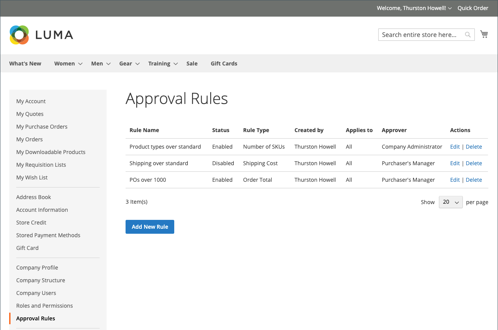

# Règles de validation des commandes

La plupart des sociétés exigent l’approbation des commandes pour les commandes d’achat. En ajoutant des règles d’approbation pour le compte de leur société, ils peuvent contrôler qui peut créer des commandes d’achat et combien ils peuvent dépenser. Par exemple :

* Toute valeur de bon de commande inférieure à X est automatiquement approuvée.
* Les commandes dont la valeur est supérieure à X mais inférieure à Q doivent être approuvées par Y.
* Toute valeur PO supérieure à X doit être approuvée par Y et Z.
* Un bon de commande créé par toute personne au niveau Director ou supérieur est automatiquement approuvé.

Selon le rôle et les autorisations de l’entreprise, les utilisateurs peuvent créer, modifier, supprimer ou afficher des règles d’approbation.

>[!IMPORTANT]
>
>La configuration des règles d’approbation nécessite une [structure d’entreprise](account-company-structure.md) définie afin de spécifier l’approbation par le responsable du client acheteur.

## Modes de paiement

Les flux d’approbation de commande prennent en charge les modes de paiement en ligne et hors ligne. Tous les modes de paiement hors ligne par défaut sont pris en charge pour les approbations de commande. Pour les paiements en ligne, les méthodes suivantes sont prises en charge :

* PayPal Express
* Paiements Braintree

## Configuration des règles d’approbation

Avec les [autorisations requises pour leur rôle](account-company-roles-permissions.md), les clients B2B peuvent configurer des règles d’approbation pour appliquer les stratégies de l’entreprise en cliquant sur **[!UICONTROL Approval Rules]** dans le panneau de gauche pour leur compte client.

{width="700" zoomable="yes"}

Pour créer une règle d’approbation, un client effectue les étapes suivantes :

1. Cliquez sur **[!UICONTROL Add New Rule]** pour créer une règle.

1. Si nécessaire, la règle passe de **[!UICONTROL Enabled]** à **[!UICONTROL Disabled]**.

   La règle est activée comme valeur par défaut, mais un client peut créer la règle à l’aide d’un paramètre désactivé, puis l’activer ultérieurement lorsqu’il est prêt à l’appliquer.

1. Pour **[!UICONTROL Rule name]**, saisit un nom court mais descriptif pour la règle, tel que `Orders less than $100`.

   Les noms des règles doivent être uniques.

1. Pour **[!UICONTROL Description]**, saisit une explication plus longue de la règle.

1. Pour **[!UICONTROL Applies to]**, choisissez un ou plusieurs rôles de société utilisés pour appliquer la règle.

1. Choisit le **[!UICONTROL Rule Type]** et définit la règle.

   Les sections suivantes fournissent une explication détaillée et un exemple pour chaque type de règle.

   {width="700" zoomable="yes"}

1. Pour **[!UICONTROL Requires approval from]**, choisissez un ou plusieurs approbateurs requis en fonction du type de validation.

   >[!NOTE]
   >
   >* Lors de l’attribution d’un rôle en tant qu’approbateur, assurez-vous qu’au moins un utilisateur possède ce rôle.
   >* Si plusieurs utilisateurs possèdent le même rôle d’approbateur, le créateur du bon de commande ne peut pas l’approuver. Dans ce cas, une approbation manuelle est requise par tout autre utilisateur disposant de ce rôle d’approbateur. Cependant, si l’option `Auto-approve POs created within this role` est définie dans les [autorisations de rôle](account-company-roles-permissions.md), le bon de commande est automatiquement approuvé.
   >* Si un seul utilisateur dispose du rôle d’approbateur et que cet utilisateur est le créateur, le bon de commande est toujours approuvé automatiquement ; le paramètre d’autorisation `Auto-approve POs created within this role` est ignoré.

1. Cliquez sur **[!UICONTROL Save]**.

### [!UICONTROL Order Total]

Ce type de règle est utilisé pour exiger une validation du bon de commande en fonction du total de la commande, y compris la taxe.

1. Choisissez une option **[!UICONTROL Order Total amount]** :

   * `is more than`
   * `is less than`
   * `is more than or equal to`
   * `is less than or equal to`

1. Sélection du type de devise et saisie du montant.

{width="600" zoomable="yes"}

### [!UICONTROL Shipping Cost]

Ce type de règle est utilisé pour exiger une validation de bon de commande en fonction des frais d’expédition, dont de nombreuses entreprises ont besoin.

1. Définit le **[!UICONTROL Shipping cost value]** :

   * `is more than`
   * `is less than`
   * `is more than or equal to`
   * `is less than or equal to`

1. Définit le montant de livraison souhaité.

{width="600" zoomable="yes"}

### [!UICONTROL Number of SKUs]

Ce type de règle est utilisé pour exiger une approbation de bon de commande en fonction du nombre de SKU ou de produits uniques dans la commande. Il contrôle le nombre de types d’éléments distincts, et non le nombre d’éléments en cours de commande. Par exemple, un bon de commande peut inclure :

* Deux grandes chemises blanches
* Trois Chemises blanches moyennes

Cet exemple spécifie cinq éléments, mais deux SKU distincts.

1. Définit la valeur **[!UICONTROL Number of SKUs]** :

   * `is more than`
   * `is less than`
   * `is more than or equal to`
   * `is less than or equal to`

1. Définit la quantité de SKU.

{width="600" zoomable="yes"}

## Modifier les règles de validation

Pour modifier une règle de validation existante, un client peut procéder comme suit :

1. Dans la barre latérale de leur compte, le client sélectionne **[!UICONTROL Approval Rules]**.

1. Recherche l&#39;entrée de la règle de validation à éditer.

1. Clics **[!UICONTROL Edit]**.

1. Effectue toutes les modifications nécessaires et clique sur **[!UICONTROL Save]**.

## Supprimer les règles de validation

Pour supprimer une règle d’approbation existante, un client peut effectuer les étapes suivantes :

1. Dans la barre latérale de leur compte, sélectionne **[!UICONTROL Approval Rules]**.

1. Recherche l&#39;entrée de la règle de validation à supprimer.

1. Clics **[!UICONTROL Delete]**.

1. Pour confirmer l’action, cliquez sur **[!UICONTROL OK]**.

## Démonstration des validations de commande

Regardez cette vidéo pour en savoir plus sur les validations de commande :

>[!VIDEO](https://video.tv.adobe.com/v/344450?quality=12)
