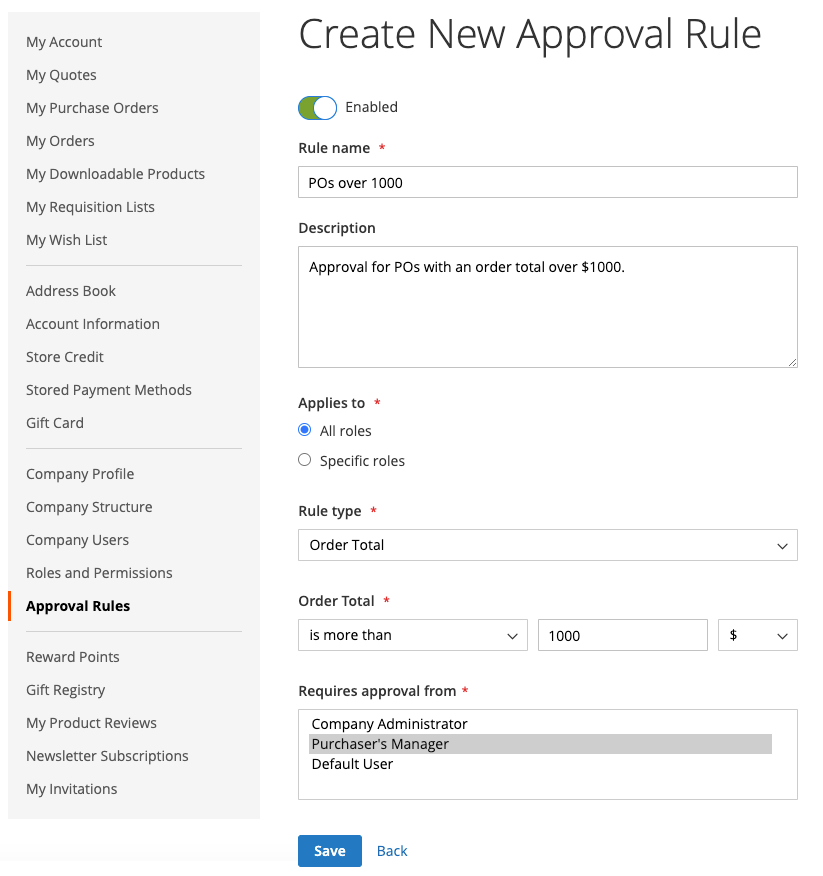

# Règles d&#39;approbation des commandes fournisseur

La plupart des entreprises exigent l&#39;approbation de la commande pour les commandes fournisseur. En ajoutant des règles d’approbation pour le compte de leur société, ils peuvent contrôler qui peut créer des commandes fournisseur et combien ils peuvent dépenser. Par exemple :

* Toute commande inférieure à X est automatiquement approuvée.
* Les commandes supérieures à X mais inférieures à Q doivent être approuvées par Y.
* Toute valeur PO sur X doit être approuvée par Y et Z.
* Un bon de commande créé par une personne de niveau directeur ou supérieur est automatiquement approuvé.

Selon le rôle et les autorisations de l’entreprise, les utilisateurs et utilisatrices peuvent créer, modifier, supprimer ou afficher des règles d’approbation.

>[!IMPORTANT]
>
>La configuration des règles d&#39;approbation nécessite une [structure de société](account-company-structure.md) définie pour spécifier l&#39;approbation par le responsable du client acheteur.

## Modes de paiement

Les flux d&#39;approbation des commandes fournisseur prennent en charge les modes de paiement en ligne et hors ligne. Tous les modes de paiement hors ligne par défaut sont pris en charge pour les approbations de commande fournisseur. Pour les paiements en ligne, les méthodes suivantes sont prises en charge :

* PayPal Express
* Paiements Braintree

## Paramétrage des règles d&#39;approbation

Avec les [autorisations requises pour leur rôle](account-company-roles-permissions.md), les clients B2B peuvent configurer des règles d’approbation pour appliquer les politiques d’entreprise en cliquant sur **[!UICONTROL Approval Rules]** dans le panneau de gauche pour leur compte client.

{width="700" zoomable="yes"}

Pour créer une règle de validation, un client effectue les étapes suivantes :

1. Clique sur **[!UICONTROL Add New Rule]** pour créer une règle.

1. Si nécessaire, modifie la règle de **[!UICONTROL Enabled]** en **[!UICONTROL Disabled]**.

   La règle est activée par défaut, mais un client peut la créer à l’aide d’un paramètre désactivé, puis l’activer ultérieurement lorsqu’il est prêt à l’appliquer.

1. Par **[!UICONTROL Rule name]**, saisit un nom court mais descriptif pour la règle, tel que `Orders less than $100`.

   Les noms des règles doivent être uniques.

1. Par **[!UICONTROL Description]**, entre une explication plus longue de la règle.

1. Par **[!UICONTROL Applies to]**, sélectionne un ou plusieurs rôles de société utilisés pour appliquer la règle.

1. Choisit la **[!UICONTROL Rule Type]** et définit la règle.

   Les sections suivantes fournissent une explication détaillée et un exemple pour chaque type de règle.

   {width="700" zoomable="yes"}

1. Par **[!UICONTROL Requires approval from]**, sélectionne un ou plusieurs approbateurs requis en fonction du type d&#39;approbation.

   >[!NOTE]
   >
   >* Lors de l’affectation d’un rôle en tant qu’approbateur, assurez-vous qu’au moins un utilisateur possède ce rôle.
   >* Si plusieurs utilisateurs ont le même rôle d&#39;approbateur, le créateur de la commande fournisseur ne peut pas l&#39;approuver. Dans ce cas, une approbation manuelle est requise de la part de tout autre utilisateur disposant de ce rôle d’approbateur. Cependant, si `Auto-approve POs created within this role` option est définie dans les [Autorisations de rôle](account-company-roles-permissions.md), la commande fournisseur est automatiquement approuvée.
   >* Si un seul utilisateur possède le rôle d&#39;approbateur et que cet utilisateur est le créateur, la commande fournisseur est toujours approuvée automatiquement. Le paramètre d&#39;autorisation `Auto-approve POs created within this role` est ignoré.

1. Cliquez sur **[!UICONTROL Save]**.

### [!UICONTROL Order Total]

Ce type de règle est utilisé pour demander l&#39;approbation d&#39;une commande fournisseur en fonction du total de la commande, taxes comprises.

1. Choisit une option de **[!UICONTROL Order Total amount]** :

   * `is more than`
   * `is less than`
   * `is more than or equal to`
   * `is less than or equal to`

1. Sélectionne le type de devise et saisit le montant.

{width="600" zoomable="yes"}

### [!UICONTROL Shipping Cost]

Ce type de règle est utilisé pour exiger l&#39;approbation d&#39;une commande d&#39;achat en fonction des frais d&#39;expédition, dont de nombreuses sociétés ont besoin.

1. Définit le **[!UICONTROL Shipping cost value]** :

   * `is more than`
   * `is less than`
   * `is more than or equal to`
   * `is less than or equal to`

1. Définit le montant d’expédition souhaité.

{width="600" zoomable="yes"}

### [!UICONTROL Number of SKUs]

Ce type de règle est utilisé pour exiger une approbation de commande basée sur le nombre de SKU ou de produits uniques dans la commande. Il contrôle le nombre de types d’articles distincts, et non le nombre d’articles commandés. Par exemple, un bon de commande peut inclure :

* Deux grandes chemises blanches
* Trois chemises blanches moyennes

Cet exemple spécifie cinq éléments, mais deux SKU distincts.

1. Définit la valeur **[!UICONTROL Number of SKUs]** :

   * `is more than`
   * `is less than`
   * `is more than or equal to`
   * `is less than or equal to`

1. Définit la quantité de SKU.

{width="600" zoomable="yes"}

## Modifier les règles d&#39;approbation

Pour modifier une règle d’approbation existante, un client peut effectuer les étapes suivantes :

1. Dans la barre latérale de son compte, le client sélectionne **[!UICONTROL Approval Rules]**.

1. Recherche l&#39;entrée de règle d&#39;approbation à modifier.

1. Effectue un clic sur **[!UICONTROL Edit]**.

1. Apporte toutes les modifications nécessaires et clique **[!UICONTROL Save]**.

## Supprimer les règles d&#39;approbation

Pour supprimer une règle d’approbation existante, un client peut effectuer les étapes suivantes :

1. Dans la barre latérale de leur compte, sélectionne **[!UICONTROL Approval Rules]**.

1. Recherche l&#39;entrée de règle d&#39;approbation à supprimer.

1. Effectue un clic sur **[!UICONTROL Delete]**.

1. Pour confirmer l’action, cliquez sur **[!UICONTROL OK]**.

## Démonstration des approbations de commande fournisseur

Regardez cette vidéo pour en savoir plus sur les approbations de bon de commande :

>[!VIDEO](https://video.tv.adobe.com/v/3410765?captions=fre_fr&quality=12&learn=on)
