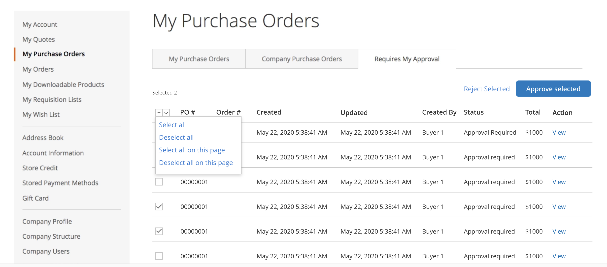

# [!UICONTROL My Purchase Orders]

Lorsque les commandes fournisseur sont [activées pour une société](purchase-order-flow.md), toute commande client connectée à un compte utilisateur de société est automatiquement créée en tant que commande fournisseur (PO). Les utilisateurs de la société disposant des autorisations requises peuvent créer, modifier et supprimer les ordres d&#39;achat qu&#39;ils créent, ainsi que les ordres d&#39;achat créés par les utilisateurs subordonnés.

{width="700" zoomable="yes"}

>[!NOTE]
>
>Les commandes fournisseur créent un _instantané_ des prix d&#39;article, des remises et des prix d&#39;expédition au moment où la commande a été créée. Si le prix d&#39;un article change après la création de la commande, le prix d&#39;origine est utilisé.

## Gérer les commandes fournisseur

Sur la page _Afficher le bon de commande_, le client peut gérer le bon de commande, en fonction de ses [autorisations de rôle](account-company-roles-permissions.md).

- Pour afficher le bon de commande, cliquez sur **[!UICONTROL View]**.
- Pour afficher des commentaires sur le bon de commande, cliquez sur l&#39;onglet **[!UICONTROL Comments]**.
- Pour afficher un historique complet des commandes, cliquez sur l’onglet **[!UICONTROL History Log]** .

>[!IMPORTANT]
>
>Si un article d&#39;une commande fournisseur est en rupture de stock ou a une quantité insuffisante disponible, une erreur se produit lorsque la commande fournisseur est convertie en commande réelle. Si les reliquats sont activés, la commande est traitée normalement.

## Nouvelle commande fournisseur à partir d&#39;une commande fournisseur existante

Si le client possède une commande existante et souhaite ajouter de nouveaux articles, il peut générer une commande en double avec de nouveaux produits ajoutés à la nouvelle commande. Le client effectue les étapes suivantes :

1. Sur la page _Mon bon de commande_, le client localise le bon de commande et clique sur le lien **[!UICONTROL View]**.

1. Le client clique sur **[!UICONTROL Add Items to Shopping Cart]**.

   La page Panier s’ouvre avec tous les articles répertoriés.

1. Apporte des ajouts ou des modifications.

1. (Facultatif) Utilise le **[!UICONTROL Custom Reference Number]** pour ajouter un numéro de facture/commande interne à la commande.

1. Suit le workflow de passage en caisse normal et clique sur **[!UICONTROL Place Purchase Order]**.

S’il y a des articles dans son panier lorsqu’il clique sur _[!UICONTROL Add Items to Shopping Cart]_, le système affiche une boîte de dialogue. Cette boîte de dialogue leur permet de choisir entre fusionner les articles du panier avec les nouveaux articles ou remplacer les articles du panier par les articles de la commande.

Le bon de commande d&#39;origine peut être fermé s&#39;il n&#39;est plus nécessaire.

## Approbations de commande fournisseur

Pour un client désigné comme approbateur en fonction de la structure de l’entreprise ou du rôle d’entreprise affecté, la page _[!UICONTROL My Purchase Orders]_&#x200B;un tableau de bord affiche l’onglet **[!UICONTROL Requires My Approval]**. Le client clique sur cet onglet pour consulter les commandes en attente d&#39;approbation. Le compteur indique le nombre de commandes en attente d&#39;approbation.

Après avoir cliqué sur **[!UICONTROL View]** pour une commande fournisseur et examiné les détails, l’approbateur peut cliquer sur **[!UICONTROL Approve]** ou **[!UICONTROL Reject]**.

### Approbation/rejet en bloc

À partir d’Adobe Commerce 2.4.1, les approbateurs peuvent approuver ou rejeter plusieurs commandes fournisseur à la fois.

1. Sur la page _[!UICONTROL My Purchase Order]_, cliquez sur l’onglet **[!UICONTROL Requires My Approval]**.

1. Cochez la case correspondant à chaque commande fournisseur à approuver ou rejeter.

1. Clics **[!UICONTROL Approve Selected]** ou **[!UICONTROL Reject Selected]**.

Un client ne peut sélectionner que les commandes fournisseur dont le statut autorise une action. Les administrateurs d&#39;entreprise peuvent approuver ou rejeter en bloc les commandes fournisseur actives de leur entreprise.
