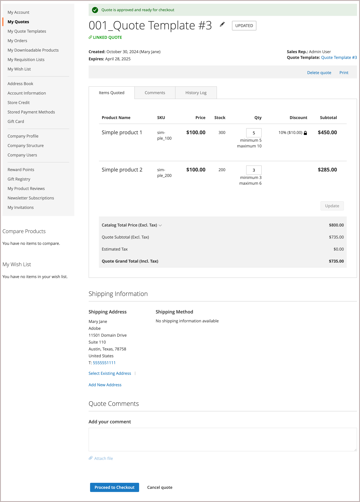

# [!UICONTROL My Quote Templates]

Si les devis sont activés, la _[!UICONTROL My Quotes Template]_&#x200B;section du tableau de bord du compte client répertorie tous les modèles de devis associés au compte client. En fonction de leurs autorisations, seuls les acheteurs qui effectuent des achats au nom d’une entreprise peuvent demander un modèle de devis et négocier le prix du devis et les conditions pour les commandes récurrentes.

{width="700" zoomable="yes"}

La liste des modèles de devis classe les modèles par état.

- **[!UICONTROL Active Quote Templates]** répertorie les modèles qui ont été négociés et approuvés pour utilisation. Les informations incluent le total minimum du devis et les commandes passées si ces options ont été configurées pendant le processus de négociation. Les acheteurs peuvent générer un devis lié à partir du modèle pour soumettre une commande basée sur les conditions du devis.

- **[!UICONTROL In Review]** Répertorie les modèles dans le processus de négociation indiquant l’état actuel et fournissant un lien pour ouvrir le modèle.

- **[!UICONTROL Inactive]** Répertorie les modèles qui ont expiré, qui ont été annulés ou qui ne sont plus valides parce qu’un acheteur a épuisé le nombre de commandes validées autorisées.

Pour l’acheteur, la *[!UICONTROL My Quotes Templates]* page est le point focal de toutes les communications entre l’acheteur et le vendeur pendant le processus de négociation.

Un acheteur qui accepte les conditions négociées proposées par le vendeur peut accepter le modèle, puis l’utiliser pour générer des devis liés pré-approuvés qui peuvent être utilisés pour passer des commandes.

- Actions liées à la gestion du modèle de devis :

   - Annuler un modèle
   - Envoyer au vendeur pour révision
   - Accepter le modèle de devis
   - Modifier la date d’expiration du modèle de devis
   - Ajouter une adresse de livraison
   - Gestion des liens vers les documents de référence

- Actions de mise à jour du détail du modèle de devis au cours du processus de négociation :

   - Consultez les tarifs et les mises à jour des articles.
   - Si des seuils de quantité ont été configurés sur le modèle de devis, ajustez les valeurs minimale et maximale.
   - Suivez le processus de négociation à partir de [!UICONTROL Comments] et [!UICONTROL History] des sections.
   - Pour les modèles en cours de révision, l&#39;acheteur peut modifier le modèle de devis en supprimant des articles.
   - Communiquez et négociez avec le vendeur en ajoutant des notes au niveau de la ligne et du devis.
   - Ajouter, modifier ou supprimer des liens de documents de référence vers des contrats et des accords externes.

  Après avoir apporté des modifications, l&#39;acheteur retourne le modèle au vendeur pour révision.

- Actions générales lors de la négociation :

   - Envoyer le modèle de devis au vendeur pour révision
   - Accepter le modèle de devis
   - Annuler pour terminer la négociation et fermer le devis

L&#39;exemple suivant illustre un modèle de devis qui a été mis à jour par l&#39;acheteur et renvoyé au vendeur pour révision.

{width="700" zoomable="yes"}

Les modèles avec le statut `Submitted` sont verrouillés jusqu&#39;à ce que le vendeur examine et mette à jour le modèle et le renvoie à l&#39;acheteur.

## Créer un modèle de devis

L&#39;acheteur peut lancer le processus de négociation du modèle de devis à l&#39;aide de l&#39;une des méthodes suivantes :

- Créez un modèle à partir d&#39;un devis existant en cliquant sur **[!UICONTROL Create quote template]** action.

- Envoyez une demande de devis depuis le storefront et ajoutez des commentaires demandant au commercial de créer un modèle de devis à partir de la demande de devis.

## Afficher un modèle de devis

1. L&#39;acheteur se connecte à son compte.

1. Dans le panneau de gauche, sélectionne **[!UICONTROL My Quote Templates]**.

1. Trouve le modèle de devis dans la liste et clique sur **[!UICONTROL View]** dans la colonne _[!UICONTROL Action]_.

## Ajouter une adresse de livraison

L&#39;acheteur ne peut pas accepter un modèle de devis tant qu&#39;il n&#39;a pas d&#39;adresse de livraison.

1. L&#39;acheteur se connecte à son compte.

1. Dans le panneau de gauche, choisissez .**[!UICONTROL My Quote Templates]**

1. Sélectionnez le modèle de devis souhaité.

1. Dans la **[!UICONTROL Shipping Information]** section, cliquez sur .**[!UICONTROL Add New Address]**

1. Précise les détails de la nouvelle adresse.

1. Clics **[!UICONTROL Save Address]**.

Une fois que l’acheteur a ajouté l’adresse, il renvoie le modèle au vendeur pour examen. Le vendeur fournit les options d&#39;expédition et de livraison. Ces mises à jour peuvent affecter le prix négocié du devis. Les options d’expédition sont verrouillées lors du passage en caisse.

## Générer un devis lié

Une fois que l&#39;acheteur a accepté un modèle de devis, il peut l&#39;utiliser pour générer des devis préapprouvés et liés à partir du *[!UICONTROL My Quote Templates dashboard]* ou du modèle de devis à l&#39;aide de l&#39;action **[!UICONTROL Generate a quote]**.

Le devis lié inclut une notification indiquant qu&#39;il est approuvé et prêt pour le passage en caisse. Elle fournit également un lien vers le modèle de devis dans les informations d’en-tête.

{width="700" zoomable="yes"}

Si le modèle de devis a été configuré avec un seuil de commande, le nombre est incrémenté lorsque le devis lié est généré.

Les acheteurs peuvent effectuer les actions suivantes à partir d&#39;un devis lié :

- Si le devis est configuré avec des seuils de quantité, ajustez la quantité de commande pour les lignes.
- Passez en caisse pour envoyer une commande.
- Supprimez ou imprimez le devis.
- Ouvrez le modèle de devis utilisé pour générer le devis.

## Annuler un modèle de devis

Dans la page du modèle de devis, cliquez sur **[!UICONTROL Cancel Quote Template]**.

Le modèle de devis est annulé et le statut du devis passe à `Closed`. Le guillemet fermé reste dans votre liste de *[!UICONTROL Inactive]* guillemets et reste répertorié dans la _[!UICONTROL Quote Templates]_&#x200B;grille de l’administrateur.

## Gestion des liens vers les documents de référence

La fonctionnalité de liens de documents de référence permet aux acheteurs et aux vendeurs d’ajouter, de modifier et de gérer des liens vers des documents externes (tels que des contrats, des accords ou des spécifications) pendant le processus de modèle de devis.

### Ajouter un lien vers un document de référence

1. Ouvrez le modèle de devis.

1. Dans la **[!UICONTROL Reference Documents]** section, cliquez sur **[!UICONTROL Add]**.

1. Dans la boîte de dialogue Document Information :
   - Entrez un **[!UICONTROL Document Name]** (obligatoire)
   - Entrez un **[!UICONTROL Document Identifier]** (facultatif)
   - Entrez un **[!UICONTROL Reference Document URL]** (obligatoire)

1. Cliquez sur **[!UICONTROL Add to Quote Template]**.

   Le lien vers le document de référence est ajouté au modèle de devis avec le format suivant :
   `Document Name, Document Identifier https://document-url`

### Modifier un lien vers un document de référence

1. Ouvrez le modèle de devis.

1. Dans la **[!UICONTROL Reference Documents]** section, cliquez en **[!UICONTROL Edit]** regard du lien du document que vous souhaitez modifier.

1. Mettez à jour les informations sur le document dans la boîte de dialogue :
   - Nom du document
   - Identifiant du document
   - URL du document de référence

1. Cliquez sur **[!UICONTROL Add to Quote Template]**.

### Supprimer un lien de document de référence

1. Ouvrez le modèle de devis.

1. Dans la section **[!UICONTROL Reference Documents]**, cliquez sur **[!UICONTROL Remove]** en regard du lien du document à supprimer.

### Afficher un document de référence

1. Ouvrez le modèle de devis.

1. Dans la section **[!UICONTROL Reference Documents]**, cliquez sur le lien du nom du document.

   Le document s’ouvre dans une nouvelle fenêtre de navigateur.

### Restrictions des liens de documents de référence

- Les liens de documents de référence ne peuvent être ajoutés, modifiés ou supprimés que lorsque le modèle de devis est dans un état modifiable.
- Une fois le modèle de devis envoyé pour révision ou accepté, les liens du document de référence deviennent en lecture seule.
- Le champ Nom du document est obligatoire lors de l&#39;ajout ou de la modification d&#39;un lien de document de référence.
- Les liens du document de référence restent accessibles même après acceptation ou saisie du modèle de devis.
