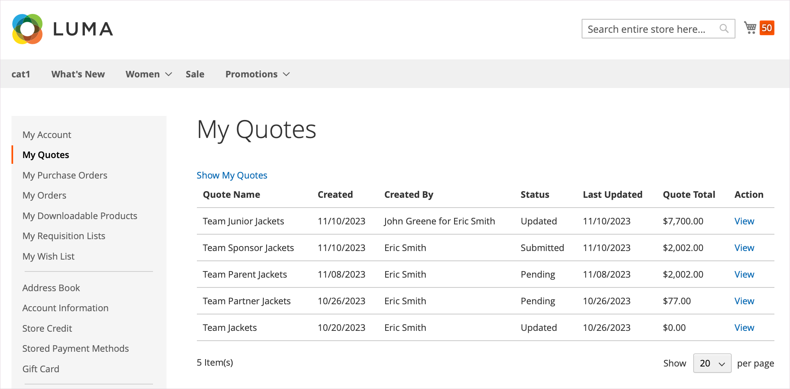

# [!UICONTROL My Quotes]

Si les devis sont activés, la section _[!UICONTROL My Quotes]_du tableau de bord du compte client répertorie tous les devis soumis par le client. Selon leurs autorisations, seuls les acheteurs qui effectuent des achats pour le compte d’une entreprise peuvent soumettre des demandes pour négocier le prix d’un achat.

{width="700" zoomable="yes"}

L&#39;acheteur commence le processus en [soumettant une demande](quote-request.md) pour obtenir un devis à partir du panier. L&#39;e-mail est échangé entre l&#39;acheteur et le vendeur pendant le [processus de négociation](quote-price-negotiation.md). Pour l&#39;acheteur, la page [!UICONTROL My Quotes] est le point focal pour toutes les communications entre l&#39;acheteur et le vendeur pendant le processus de négociation. Un acheteur qui accepte le prix négocié proposé par le vendeur peut passer directement à la page de passage en caisse à partir du devis. Impossible d&#39;ajouter des remises supplémentaires au devis négocié.

Lors de la négociation d&#39;un devis, un acheteur dispose de plusieurs options pour gérer le devis ou mettre à jour les détails du devis.

* Actions liées à la gestion du devis :

   * Créer une copie du devis
   * Fermer le devis
   * Supprimer le devis
   * Renommer le devis
   * Imprimer le devis
   * Créer un modèle

* Actions de mise à jour des détails du devis :

   * Consulter la tarification et les mises à jour des articles
   * Suivre le processus de négociation à partir des sections [!UICONTROL Comments] et [!UICONTROL History]
   * Modifier le devis pour supprimer des articles
   * Communiquez et négociez avec le vendeur en ajoutant des notes au niveau de la ligne et du devis
   * Ajouter une adresse de livraison
   * Déplacer les lignes vers une liste de demandes d&#39;approvisionnement
   * Convertir le devis en commande si les conditions sont acceptables

* Actions générales lors de la négociation :

   * Envoyer le devis au vendeur pour révision
   * Passer en caisse

L&#39;exemple suivant illustre un devis qui a été mis à jour par l&#39;acheteur et renvoyé au vendeur pour révision.

{width="700" zoomable="yes"}

Les devis avec le statut `Updated` sont verrouillés jusqu&#39;à ce que le vendeur renvoie le devis.

## Afficher les devis

Avec les [autorisations requises pour leur rôle](account-company-roles-permissions.md), les acheteurs associés à un compte d&#39;entreprise peuvent voir les devis demandés par [utilisateurs subordonnés](account-company-structure.md). Les administrateurs de la société peuvent afficher tous les devis pour le compte de la société.

1. L&#39;acheteur se connecte à son compte sur le storefront.

1. Clique sur **[!UICONTROL My Quotes]** dans le volet de navigation de gauche.

1. Pour afficher tous les devis qu&#39;ils ont créés, cliquez sur le lien **[!UICONTROL Show My Quotes]** (affiché uniquement pour l&#39;administrateur de la société ou le compte avec les utilisateurs subordonnés).

1. Pour afficher tous les devis de tous les utilisateurs de la société, cliquez sur **[!UICONTROL Show All Quotes]**.

## Afficher un devis

1. L&#39;acheteur se connecte à son compte.

1. Dans le panneau de gauche, sélectionne **[!UICONTROL My Quotes]**.

1. Trouve le devis dans la liste et clique sur **[!UICONTROL View]** dans la colonne _[!UICONTROL Action]_.

## Copier un devis

1. L’acheteur se connecte au compte de sa société sur le storefront.

1. Dans le panneau de gauche, sélectionne **[!UICONTROL My Quotes]**.

1. Recherchez et accédez au devis souhaité dans la liste, puis cliquez sur **[!UICONTROL Create Copy]** dans le devis d’origine.

## Créer un modèle

1. L&#39;acheteur se connecte à son compte.

1. Dans le panneau de gauche, sélectionne **[!UICONTROL My Quote Templates]**.

1. Trouve le devis dans la liste **[!UICONTROL My Quotes]** et clique sur **[!UICONTROL Create Quote Template]** dans la colonne _[!UICONTROL Action]_.

## Déplacer les lignes d&#39;un devis vers une liste de demandes d&#39;approvisionnement

1. L&#39;acheteur se connecte à son compte.

1. Dans le panneau de gauche, sélectionne **[!UICONTROL My Quotes]**.

1. Recherchez et accédez au devis souhaité dans la liste.

1. Sélectionnez les éléments de ligne.

1. Cliquez sur **[!UICONTROL Move to Requisition list]** dans la liste déroulante _[!UICONTROL Actions]_.

1. Sélectionnez une liste de demandes d&#39;approvisionnement existante pour déplacer les articles sélectionnés.

1. Cliquez sur **[!UICONTROL Move item]**.

Voir [Ajouter des produits à une liste de demandes d&#39;approvisionnement](requisition-lists.md) pour en savoir plus sur ce processus.

>[!NOTE]
>
> Vous ne pouvez pas créer de liste de demandes d&#39;approvisionnement lorsque vous déplacez des articles. Les articles ne peuvent être déplacés que vers une liste de demandes d&#39;approvisionnement existante.

## Déplacer les lignes vers un nouveau devis

1. L&#39;acheteur se connecte à son compte.

1. Dans le panneau de gauche, sélectionne **[!UICONTROL My Quotes]**.

1. Recherchez et accédez au devis souhaité dans la liste.

1. Sélectionnez les éléments de ligne.

1. Cliquez sur **[!UICONTROL Move item to new quote]** dans la liste déroulante _[!UICONTROL Actions]_.

1. Nommez la nouvelle citation dans la boîte de dialogue modale.

1. Sélectionnez **[!UICONTROL Move to quote]** pour déplacer l&#39;article sélectionné vers le nouveau devis.

>[!NOTE]
>
> Lorsque vous sélectionnez plusieurs éléments, la boîte de dialogue modale s’affiche sous la forme **[!UICONTROL Move selected items to new quote]**.

## Ajout d’une adresse de livraison

1. L&#39;acheteur se connecte à son compte.

1. Dans le panneau de gauche, sélectionne **[!UICONTROL My Quotes]**.

1. Sélectionne le devis souhaité.

1. Dans la section **[!UICONTROL Shipping Information]**, cliquez sur **[!UICONTROL Add New Address]**.

1. Renseigne les détails de la nouvelle adresse.

1. Effectue un clic sur **[!UICONTROL Save Address]**.

Lorsque l&#39;acheteur ajoute l&#39;adresse, le vendeur fournit les options d&#39;expédition et de livraison. Ces mises à jour peuvent affecter le prix négocié du devis. Les options d’expédition sont verrouillées lors du passage en caisse.

## Imprimer un devis

1. Dans le devis ouvert situé à droite de la section _[!UICONTROL Items Quoted]_, l&#39;acheteur clique sur **[!UICONTROL Print]**.

1. Vérifie le **[!UICONTROL Destination]** en tant qu’imprimante ou PDF.

1. Effectue un clic sur **[!UICONTROL Print]**.

## Annuler une demande de soumission

1. Dans le devis ouvert juste au-dessus de la section Articles mis en vente, clique sur **[!UICONTROL Close quote]**.

   La demande est annulée et le statut du devis passe à `Closed`. Le devis fermé reste dans votre liste de devis et reste répertorié dans la grille de _[!UICONTROL Quotes]_de l&#39;administrateur.

1. Pour supprimer le devis annulé de la liste des devis, cliquez sur **[!UICONTROL Delete]**.

1. Lorsque vous êtes invité à confirmer, cliquez sur **[!UICONTROL OK]**.

   Le devis fermé est supprimé de leur liste de devis. Cependant, il reste répertorié dans la grille de _[!UICONTROL Quotes]_de l’administrateur, avec le statut `Closed` .

## Actions de devis

| Action | Description |
|---------------|------------------------------------------------------------------------------------------------------------------------------------------------------------------------------------------------------------------------------|
| Renommer | Modifier le nom du devis |
| Créer une copie | Un acheteur peut créer un devis à partir du devis actuel en le copiant et en le renommant. |
| Fermer le devis | Une fois qu&#39;un acheteur a clôturé un devis, il ne peut plus le rouvrir. Si nécessaire, l&#39;acheteur peut la recréer en utilisant l&#39;action [!UICONTROL Create Copy]. Cette option n&#39;est pas disponible si le statut du devis est `Draft`. |
| Créer un modèle | Créer un modèle de devis basé sur le devis actuel. Les modèles de devis simplifient la négociation de devis en permettant aux acheteurs et aux vendeurs de s&#39;entendre sur des conditions contractuelles et tarifaires qui peuvent être appliquées à plusieurs devis.  Avec l&#39;accord de l&#39;acheteur, celui-ci peut générer un devis lié préapprouvé à partir du modèle pour les commandes suivantes au lieu de relancer le processus de demande de devis. |
| Supprimer le devis | Lorsqu&#39;un acheteur supprime un devis, il est supprimé du système et n&#39;est plus disponible. |
| Imprimer | Ouvre un formulaire d’impression pour enregistrer le devis en tant que PDF, fichier ou l’imprimer sur une imprimante configurée. |

## Descriptions des colonnes

| Colonne | Description |
|-------------------------|-------------------------------------------------------------------------------------------------------------------------------------------------------------------------------------------------------------------------------------------------------------------------------------------------------------------------------------------------------------------------------------------------------------------------------------------------------------------------------------------------------------------------------------------------------------------------------------------------------------------------------------------------------------------------------------------------------------------------------------------------------------------------------------------------------------------------------------------------------------------------------------------------------------------------------------------------------------------------------------------------------------------------------------------------------------------------------------------------------------------------------------------------------------------------------------------------------------------------------------------------------------------------------------------------------------------------------------------------------------------------------------------------------------------------------------------------------------------------------------------------------------------------------------------------------------------------------------------------------------------------------------------------------------------------------------------------------------------------------------------------------------------------------------------------------------------------------------------------------------------------------------------------------------------------------------------------------------------------------------------------------------------------------------------------------------------------------------------------------------------------------------------------------------------------------------------------------------------------------------------------------------------------------------------------------------------------------------------------------------------------------------------------------------------------------------------------------------------------------------------------------------------------------------------|
| [!UICONTROL Quote Name] | Nom attribué à la demande de devis par l&#39;acheteur. |
| [!UICONTROL Created] | Date de la première soumission de la demande de devis. |
| [!UICONTROL Created By] | Prénom et nom de l&#39;acheteur qui a soumis la demande de devis. |
| [!UICONTROL Status] | Indique le statut du devis. Le statut d&#39;un devis ne peut être modifié que par une action de l&#39;acheteur ou du vendeur.  **[!UICONTROL Submitted]**- Le vendeur n&#39;a pas encore ouvert la demande de devis de l&#39;acheteur. Dans ce cas, l&#39;acheteur peut toujours modifier la demande de devis. Actions disponibles : `View` / `Close` / `Edit Quantity` / `Delete SKU` / `Add Comments` / `Edit Shipping Address` **[!UICONTROL Pending]** - Le vendeur a ouvert la demande et est en train de l&#39;examiner et de préparer une réponse. Actions disponibles : `View` / `Close`  **[!UICONTROL Updated]**- Le vendeur a envoyé une réponse à l&#39;acheteur et le bouton _[!UICONTROL Proceed to Checkout]_est activé. Dans ce cas, l&#39;acheteur peut continuer à modifier le devis. Actions disponibles : `View` / `Send for Review` / `Proceed to Checkout` / `Delete Quote` / `Close` / `Edit Quantity` / `Delete SKU` / `Add comments` / `Edit Shipping Address` **[!UICONTROL Open]**- L&#39;acheteur met toujours à jour le devis et le bouton_[!UICONTROL Proceed to Checkout]_ est désactivé. Actions disponibles : `View` / `Send for Review` / `Delete Quote` / `Edit quantity` / `Delete SKU` / `Add Comments` / `Edit Shipping Address`  **[!UICONTROL Ordered]**- L&#39;acheteur a passé une commande basée sur le devis négocié. La citation est verrouillée et ne peut pas être modifiée. Action disponible : Afficher **[!UICONTROL Closed]** - L&#39;acheteur a terminé la négociation et annule le devis. Le devis est verrouillé et ne peut pas être modifié par l&#39;acheteur ou le vendeur. Actions disponibles : `View` / `Delete`  **[!UICONTROL Declined]**- Le vendeur a refusé la demande de devis ou d&#39;effectuer une modification proposée pendant le processus de négociation. Un devis peut être refusé à n&#39;importe quelle étape du workflow. Toute tarification personnalisée est supprimée du devis. L&#39;acheteur peut continuer à modifier le devis et le soumettre à nouveau, ou effectuer l&#39;achat à des prix de catalogue standard. Actions disponibles : `View` / `Send for Review` / `Delete Quote` / `Edit Quantity` / `Delete SKU` / `Add Comments` / `Edit Shipping Address` **[!UICONTROL Expired]** - La durée de vie du devis a expiré. Tous les prix proposés sont réinitialisés. L&#39;acheteur peut effectuer l&#39;achat en fonction des prix catalogue standard ou entamer un autre cycle de négociations. Actions disponibles : `View` / `Send for Review` / `Delete Quote` / `Edit Quantity` / `Delete SKU` / `Add Comments` / `Edit Shipping Address` |

{style="table-layout:auto"}
