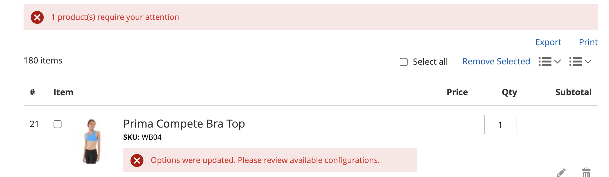

# [!UICONTROL My Requisition Lists]

La principale raison de tenir à jour une liste de demandes d&#39;approvisionnement est de faciliter la réorganisation des produits. Les clients autorisés peuvent facilement réorganiser les articles d&#39;une liste de demandes d&#39;approvisionnement en les ajoutant au panier, et déplacer ou copier des articles d&#39;une liste à une autre.

{width="700" zoomable="yes"}

## Ouvrir une liste de demandes internes

1. Dans le tableau de bord de son compte, le client choisit **[!UICONTROL My Requisition Lists]**.

1. Localise la liste de demandes d&#39;approvisionnement à ouvrir, clique sur **[!UICONTROL View]** et effectue l&#39;une des opérations suivantes :

### Ajouter des produits au panier

1. Le client effectue l’une des opérations suivantes pour sélectionner les produits à ajouter :

   - Sélectionne la case à cocher de chaque élément.
   - Effectue un clic sur **[!UICONTROL Select All]**.

1. Saisit le **[!UICONTROL Qty]** à ajouter au panier.

1. Pour modifier les options d’un produit, procédez comme suit :

   - Dans l’élément de ligne, clique sur l’icône _Modifier_ ().
   - Modifie toutes les options nécessaires.
   - Effectue un clic sur **[!UICONTROL Update Requisition List]**.

1. Effectue un clic sur **[!UICONTROL Add to Cart]**.

   {width="700" zoomable="yes"}

### Copier des éléments dans une autre liste

1. Le client coche la case de chaque élément à déplacer.

1. Clique **[!UICONTROL Copy Selected]** et effectue l’une des opérations suivantes :

   - Choisit une liste de demandes d&#39;approvisionnement existante.
   - Effectue un clic sur **[!UICONTROL Create New Requisition List]**.

### Exporter une liste

1. Le client ouvre la liste des demandes d&#39;approvisionnement à exporter.

1. Clique sur le lien **[!UICONTROL Export]**.

Adobe Commerce génère et télécharge une liste CSV avec des valeurs `sku` et `qty`.

### Déplacer des éléments vers une autre liste

1. Le client coche la case de chaque élément à déplacer.

1. Cliquez sur **[!UICONTROL Move Selected]** et effectuez l’une des opérations suivantes :

   - Choisit une liste de demandes d&#39;approvisionnement existante.
   - Effectue un clic sur **[!UICONTROL Create New Requisition List]**.

### Imprimer une liste

1. Dans le coin supérieur droit de la liste, le client clique sur **[!UICONTROL Print]**.

1. Vérifie le périphérique de sortie et clique sur **[!UICONTROL Print]**.

   {width="500" zoomable="yes"}

### Modifier les options du produit

Pour modifier les options du produit dans la liste, le client effectue les opérations suivantes :

1. Clique sur l’icône _Crayon_ () pour ouvrir la page du produit.

1. Modifie toutes les options nécessaires.

1. Effectue un clic sur **[!UICONTROL Update Requisition List]**.

   {width="700" zoomable="yes"}

Un produit de la liste de demandes d&#39;approvisionnement peut être modifié dans les cas suivants :

- Le produit a **[!UICONTROL all options set]** (s&#39;il s&#39;agit d&#39;un produit [configuré](../catalog/product-create-configurable.md) dans la liste des demandes d&#39;approvisionnement).

  Le produit est **[!UICONTROL added to this Requisition List]**.

- Le produit est [un produit simple avec des options](../catalog/settings-advanced-custom-options.md)

- La modification est autorisée pour le type de produit.

### Supprimer des éléments

1. Le client coche la case de chaque élément à supprimer.

1. Effectue un clic sur **[!UICONTROL Remove Selected]**.

1. Lorsque vous êtes invité à confirmer, cliquez sur **[!UICONTROL Delete]**.

### Renommer une liste

1. Après le titre de la liste, le client clique sur **[!UICONTROL Rename]**.

1. Entre dans un autre **[!UICONTROL Requisition List Name]**.

1. Effectue un clic sur **[!UICONTROL Save]**.

   {width="300"}

### Supprimer une liste de demandes

1. Le client ouvre la liste des demandes d&#39;approvisionnement à supprimer.

1. Effectue un clic sur **[!UICONTROL Delete Requisition List]**.

1. Lorsque vous êtes invité à confirmer, cliquez sur **[!UICONTROL Delete]**.

>[!NOTE]
>
>Cette action est irréversible.

## Actions

| Action | Description |
|--- |--- |
| [!UICONTROL Rename] | Permet de renommer la liste de demandes d&#39;approvisionnement et de mettre à jour la description. |
| [!UICONTROL Export] | Exporte la liste des demandes d&#39;approvisionnement dans un fichier CSV. |
| [!UICONTROL Print] | Imprime la liste de demandes d&#39;approvisionnement actuelle. |
| [!UICONTROL Select] | Gère les sélections d&#39;éléments qui doivent faire l&#39;objet d&#39;une action.  **[!UICONTROL Select All]**- Sélectionne tous les articles de la liste des demandes d&#39;approvisionnement. **[!UICONTROL Remove Selected]** - Supprime tous les articles sélectionnés de la liste des demandes d&#39;approvisionnement.  **[!UICONTROL Copy Selected]**- Copie tous les articles sélectionnés dans une autre liste de demandes d&#39;approvisionnement. |
| [!UICONTROL Add to Cart] | Ajoute les articles sélectionnés au panier. |
| [!UICONTROL Update List] | Recalcule le sous-total pour refléter un changement de quantité. |
| [!UICONTROL Delete Requisition List] | Supprime la liste des demandes d&#39;approvisionnement du compte de l&#39;utilisateur de la société. |

{style="table-layout:auto"}

## Contrôles de pagination

Les contrôles de pagination apparaissent au bas de la liste lorsque le nombre total d&#39;éléments de la liste de demandes d&#39;approvisionnement dépasse les éléments sélectionnés par page.

{width="700" zoomable="yes"}

>[!NOTE]
>
> Les produits qui nécessitent votre attention (par exemple, les produits en rupture de stock) s’affichent en haut de la liste s’ils se trouvent dans la page active de la pagination. Le nombre de produits nécessitant votre attention est indiqué au-dessus de la liste.
> {width="500"}

### Contrôles de pagination de Storefront

| Contrôle | Description |
|----------------------------------------------------------------|----------------------------------------------------------------------------------------------------------------------------------------------------------------------------------|
|  | [!UICONTROL Show Per Page] - Détermine le nombre d&#39;éléments de la liste de demandes d&#39;approvisionnement qui apparaissent par page. Vous pouvez choisir 20, 50, 100, 500 ou 1 000 articles de la liste de demandes d&#39;approvisionnement à afficher sur la page. |
|  | [!UICONTROL Pagination links] - Fournit des liens de navigation vers d’autres pages. |