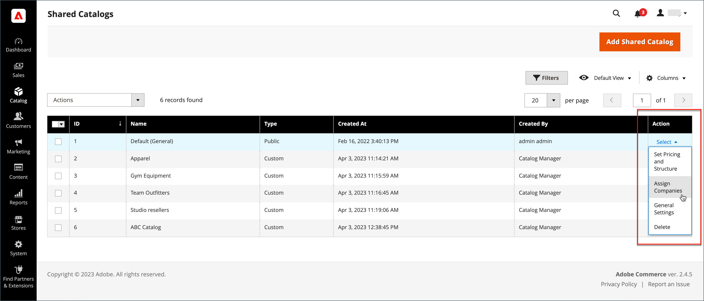

# Affecter des entreprises à un catalogue partagé

Il existe deux manières d’affecter une société à un catalogue partagé. Vous pouvez effectuer l’affectation à partir de la grille _[!UICONTROL Shared Catalogs]_, ou modifier l’entreprise et affecter le catalogue partagé comme vous le feriez pour choisir un groupe de clients.

{width="700" zoomable="yes"}

## Méthode 1 : attribuer des sociétés du catalogue partagé

1. Sur la barre latérale _Admin_, accédez à **[!UICONTROL Catalog]** > **[!UICONTROL Shared Catalogs]**.

1. Pour le catalogue partagé dans la grille où vous souhaitez affecter une société, accédez à la colonne **[!UICONTROL Action]** et sélectionnez **[!UICONTROL Assign Companies]**.

   La liste des entreprises disponibles apparaît dans la grille.

1. Sélectionnez la société que vous souhaitez affecter au catalogue partagé, cliquez sur le menu **[!UICONTROL Actions]** et choisissez **[!UICONTROL Assign Catalog]**.

   {width="700" zoomable="yes"}

   Vous pouvez également cliquer sur **[!UICONTROL Assign]** dans la colonne **[!UICONTROL Action]** pour n’importe quelle société qui n’est pas affectée au catalogue.

1. Répétez l’opération pour chaque entreprise que vous souhaitez affecter au catalogue partagé.

   L’entreprise est affectée au catalogue partagé.

1. Une fois l’opération terminée, cliquez sur **[!UICONTROL Save]**.

## Méthode 2 : modification de la société

1. Sur la barre latérale _Admin_, accédez à **[!UICONTROL Customers]** > **[!UICONTROL Companies]**.

1. Pour la société affichée dans la grille, accédez à la colonne **[!UICONTROL Action]** et cliquez sur **[!UICONTROL Edit]**.

   {width="700" zoomable="yes"}

1. Sur la page de l’entreprise, faites défiler l’écran vers le bas et développez la section  sur **[!UICONTROL Advanced Settings]** .

1. Définissez **[!UICONTROL Customer Group]** sur le catalogue partagé approprié.

   La modification de l’affectation du catalogue partagé modifie également l’affectation du groupe de clients pour tous les membres de l’entreprise.

   {width="600"}

1. Lorsque vous êtes invité à confirmer l’opération, cliquez sur **[!UICONTROL Proceed]**, puis sur **[!UICONTROL Save]**.
