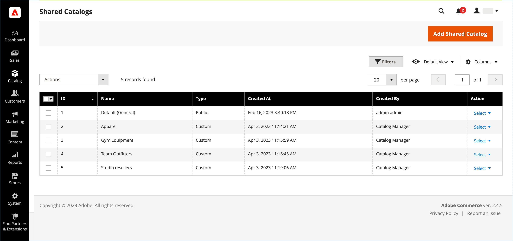

# Création d’un catalogue partagé

Lors de la création d&#39;un [catalogue partagé](catalog-shared.md), le système crée automatiquement un [groupe client](account-company-customer-group.md) du même nom. Par exemple, si vous créez un catalogue partagé appelé _Catalogue ABC_, le système crée également un groupe de clients _Catalogue ABC_ correspondant. L’affectation d’une entreprise au catalogue personnalisé partagé est essentiellement la même chose que l’affectation à un groupe de clients.

Un nouveau catalogue partagé n’inclut pas les produits, les prix personnalisés ou les associations de société. Un catalogue public, qui est le catalogue partagé par défaut créé lorsque les catalogues partagés sont activés, est automatiquement attribué aux invités et aux clients qui ne sont pas associés à une entreprise.

{width="700" zoomable="yes"}

Les aspects suivants d’un catalogue partagé doivent être configurés avant de pouvoir être utilisés :

- Portée du catalogue
- Sélection de produit
- Prix personnalisés
- Affectations d’entreprise

## Étendue du prix

Si vous disposez d’une installation multi-site, veillez à configurer la portée des prix avant de créer vos catalogues partagés. La [portée du prix](../catalog/catalog-price-scope.md) peut être définie sur `Global` ou `Website`. Cependant, il ne peut être défini qu’au début du processus de configuration. Le programme de sélection de site web apparaît à l’étape 2 de la [configuration de catalogue partagée](catalog-shared-pricing-structure.md).

{width="600" zoomable="yes"}

1. Sur la barre latérale _Admin_, accédez à **[!UICONTROL Stores]** > _[!UICONTROL Settings]_>**[!UICONTROL Configuration]**.

1. Dans le panneau de gauche, développez **Catalog** et sélectionnez **Catalog** en dessous.

1. Développez la section  **Price** .

1. Définissez **Portée du prix du catalogue** sur `Website`.

   {width="600" zoomable="yes"}

1. Cliquez sur **[!UICONTROL Save Config]**.

## Étape 1 : création du catalogue partagé

Il existe deux façons de créer un catalogue partagé. Vous pouvez créer un catalogue partagé de type ou dupliquer un catalogue partagé existant. Un nouveau catalogue partagé n’inclut aucun produit et n’est pas encore attribué à une entreprise.

### Méthode 1 : ajouter un nouveau catalogue partagé

1. Sur la barre latérale _Admin_, accédez à **[!UICONTROL Catalog]** > **[!UICONTROL Shared Catalogs]**.

1. Dans le coin supérieur droit, cliquez sur **[!UICONTROL Add Shared Catalog]** et procédez comme suit :

   - Saisissez un **[!UICONTROL Name]** pour le catalogue partagé.

     Le nom que vous attribuez est utilisé dans l’ensemble du tableau de bord Admin et Client, le cas échéant, pour faire référence au catalogue partagé. Il devient également le nom du groupe de clients correspondant.

   - Sélectionnez **[!UICONTROL Type]** : `Custom` ou `Public`.

   - Sélectionnez le **[!UICONTROL Customer Tax Class]** approprié qui s&#39;applique aux achats effectués à partir du catalogue partagé.

     Pour plus d’informations sur la configuration et la définition des classes d’impôts, voir [classes d’impôts](../stores-purchase/tax-class.md).

     L’exemple suivant illustre un nouveau catalogue personnalisé pour un client de gros spécifique.

     {width="600" zoomable="yes"}

   - Entrée **[!UICONTROL Description]**

1. Une fois l’opération terminée, cliquez sur **[!UICONTROL Save]**.

   Le nouveau catalogue apparaît dans la grille _[!UICONTROL Shared Catalogs]_.

### Méthode 2 : duplication d’un catalogue partagé existant

Un catalogue personnalisé en double conserve le modèle de prix et la structure de l’original, mais pas les associations de l’entreprise. Un groupe de clients correspondant est également créé avec le même nom que le catalogue en double. Par défaut, un catalogue en double est nommé _Dupliquer de_ le catalogue d’origine.

Si un catalogue partagé public est dupliqué, le type du catalogue dupliqué passe à `custom`.

1. Sur la barre latérale _Admin_, accédez à **[!UICONTROL Catalog]** > **[!UICONTROL Shared Catalogs]**.

1. Pour le catalogue partagé dans la grille que vous souhaitez dupliquer, accédez à la colonne **[!UICONTROL Action]** et sélectionnez **[!UICONTROL General Settings]**.

1. Dans les options situées en haut de la page, cliquez sur **[!UICONTROL Duplicate]**.

   {width="600" zoomable="yes"}

1. Mettez à jour les champs suivants pour le nouveau catalogue :

   - **[!UICONTROL Name]**
   - **[!UICONTROL Type]**
   - **[!UICONTROL Customer Tax Class]**
   - **[!UICONTROL Description]**

1. Une fois l’opération terminée, cliquez sur **[!UICONTROL Save]**.

   Le doublon apparaît dans la grille _[!UICONTROL Shared Catalogs]_, avec un identifiant unique.

## Étape 2 : terminer la configuration

Après la création d’un catalogue partagé, il doit être configuré avec la sélection de produits appropriée, les [affectations de l’entreprise](catalog-shared-assign-companies.md) et les [autorisations de catégorie](../catalog/category-permissions.md). Pour continuer, voir [Définition de la tarification et de la structure](catalog-shared-pricing-structure.md).

>[!NOTE]
>
>**[Version B2B 1.3.0](release-notes.md#b2b-v130) et ultérieure** — Lorsque vous créez un catalogue partagé, chaque [autorisation de catégorie](../catalog/category-permissions.md) pour le catalogue est définie sur _[!UICONTROL Allow for the Display Product Prices]_&#x200B;et&#x200B;_[!UICONTROL Add to Cart]_ pour les groupes de clients auxquels cet accès est affecté dans les paramètres d’autorisation du catalogue. Auparavant, ces paramètres étaient automatiquement définis sur `Deny` même lorsque les autorisations du catalogue étaient définies sur `Allow`.

## Démonstration du catalogue partagé

Pour voir une démonstration de la gestion de catalogue partagée, regardez cette vidéo :

>[!VIDEO](https://video.tv.adobe.com/v/3410753?quality=12&learn=on&captions=fre_fr)

## Référence de page de catalogue partagée

### Barre de boutons

| Bouton | Description |
|--- |--- |
| [!UICONTROL Back] | Renvoie à la page Catalogues partagés sans enregistrer le nouveau catalogue partagé. |
| [!UICONTROL Reset] | Efface le formulaire des modifications non enregistrées et restaure les informations détaillées du catalogue d’origine. |
| [!UICONTROL Save and Continue Edit] | Enregistre toutes les modifications et conserve le formulaire ouvert en mode d’édition. |
| [!UICONTROL Save] | Enregistre les modifications, ferme le formulaire et revient à la page Catalogues partagés . |

{style="table-layout:auto"}

### Détails du catalogue

| Champ | Description |
|--- |--- |
| [!UICONTROL Name] | Identifie le catalogue partagé dans l’ensemble de l’administrateur et dans les comptes clients où il est disponible. Le nom du catalogue doit être descriptif et ne pas dépasser 32 caractères. Vous ne pouvez pas avoir deux catalogues partagés portant le même nom. Nombre maximum de caractères : 32 |
| [!UICONTROL Type] | **[!UICONTROL Custom]** : identifie un catalogue avec des tarifs personnalisés disponibles uniquement pour les entreprises spécifiques auxquelles il est affecté. **[!UICONTROL Public]**- Identifie le catalogue partagé disponible pour tous les visiteurs invités et pour les clients connectés qui ne sont pas associés à une entreprise. Un catalogue partagé public par défaut est créé lorsque [!DNL Adobe Commerce B2B] est installé, mais doit être configuré par un administrateur de magasin. Un seul catalogue partagé public peut exister à la fois. |
| [!UICONTROL Customer Tax Class] | Détermine la classe de taxe utilisée pour les achats effectués à partir du catalogue. Les options incluent toutes les classes d’impôts disponibles. |
| [!UICONTROL Description] | Une brève explication de l’utilisation du catalogue. |

{style="table-layout:auto"}

### Colonnes de grille

| Champ | Description |
|--- |--- |
| [!UICONTROL ID] | Identifiant numérique unique attribué à l’entité de catalogue partagée. |
| [!UICONTROL Name] | Nom du catalogue partagé. |
| [!UICONTROL Type] | Indique le type de catalogue partagé. Peut être `Public` ou `Custom`. |
| [!UICONTROL Created At] | Date à laquelle le catalogue partagé a été créé dans le système. |
| [!UICONTROL Created By] | Nom de l’utilisateur administrateur qui a créé un catalogue partagé. |
| [!UICONTROL Action] | Liste des actions. Options : `Set Pricing and Structure`, `Assign Companies`, `General Settings`, `Delete`. |

{style="table-layout:auto"}
