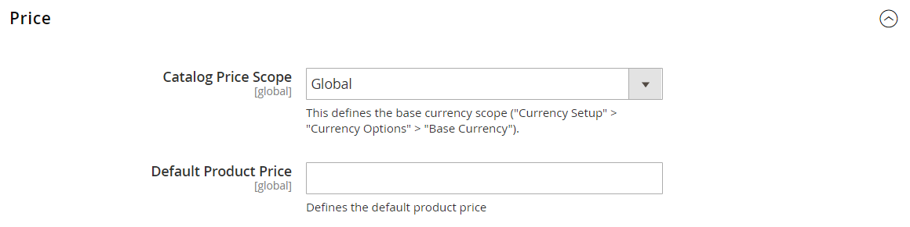
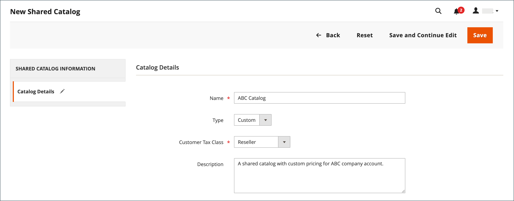
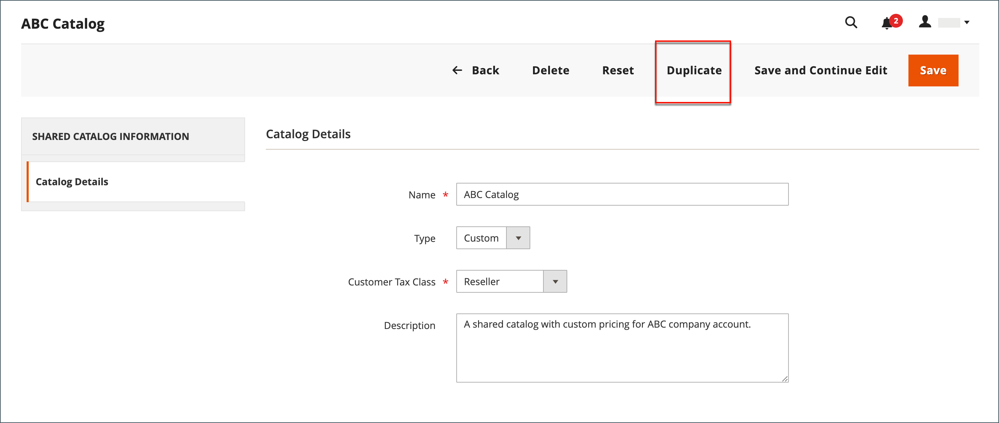

# Création d’un catalogue partagé

Lors de la création d’un [catalogue partagé](catalog-shared.md), le système crée automatiquement un [groupe de clients](account-company-customer-group.md) du même nom. Par exemple, si vous créez un catalogue partagé appelé _Catalogue ABC_, le système crée également un groupe de clients _Catalogue ABC_ correspondant. L’affectation d’une entreprise au catalogue personnalisé partagé est essentiellement identique à leur affectation à un groupe de clients.

Un nouveau catalogue partagé n’inclut pas les produits, les prix personnalisés ou les associations d’entreprises. Un catalogue public, qui est le catalogue partagé par défaut créé lorsque les catalogues partagés sont activés, est automatiquement affecté aux invités et aux clients qui ne sont pas associés à une société.

{width="700" zoomable="yes"}

Les aspects suivants d’un catalogue partagé doivent être configurés avant de pouvoir être utilisés :

- Portée du catalogue
- Sélection de produits
- Prix sur mesure
- Affectations d&#39;entreprise

## Périmètre du prix

Si vous disposez d’une installation multisite, veillez à configurer la portée des prix avant de créer vos catalogues partagés. Le [périmètre des prix](../catalog/catalog-price-scope.md) peut être défini sur `Global` ou `Website`. Cependant, elle ne peut être définie qu’au début du processus de configuration. Le programme de sélection de sites web s’affiche à l’étape 2 de la [configuration du catalogue partagé](catalog-shared-pricing-structure.md).

{width="600" zoomable="yes"}

1. Dans la barre latérale _Admin_, accédez à **[!UICONTROL Stores]** > _[!UICONTROL Settings]_>**[!UICONTROL Configuration]**.

1. Dans le panneau de gauche, développez **Catalogue** et choisissez **Catalogue** sous.

1. Développez  la section **Prix**.

1. Définissez **Étendue du prix du catalogue** sur `Website`.

   {width="600" zoomable="yes"}

1. Cliquez sur **[!UICONTROL Save Config]**.

## Étape 1 : créer le catalogue partagé

Il existe deux façons de créer un catalogue partagé. Vous pouvez créer un catalogue partagé de l’un de ces types ou dupliquer un catalogue partagé existant. Un nouveau catalogue partagé n’inclut aucun produit et n’est pas encore affecté à une entreprise.

### Méthode 1 : ajouter un nouveau catalogue partagé

1. Dans la barre latérale _Admin_, accédez à **[!UICONTROL Catalog]** > **[!UICONTROL Shared Catalogs]**.

1. Dans le coin supérieur droit, cliquez sur **[!UICONTROL Add Shared Catalog]** et procédez comme suit :

   - Saisissez un **[!UICONTROL Name]** pour le catalogue partagé.

     Le nom que vous attribuez est utilisé dans tout le tableau de bord de l’administrateur et du client, le cas échéant, pour faire référence au catalogue partagé. Il devient également le nom du groupe de clients correspondant.

   - Sélectionnez **[!UICONTROL Type]** : `Custom` ou `Public`.

   - Sélectionnez la **[!UICONTROL Customer Tax Class]** appropriée qui s’applique aux achats effectués à partir du catalogue partagé.

     Pour plus d&#39;informations sur la configuration et la définition des classes de taxe, voir [&#x200B; Classes de taxe &#x200B;](../stores-purchase/tax-class.md).

     L’exemple suivant illustre un nouveau catalogue personnalisé pour un client en gros spécifique.

     {width="600" zoomable="yes"}

   - Enter **[!UICONTROL Description]**

1. Une fois l’opération terminée, cliquez sur **[!UICONTROL Save]**.

   Le nouveau catalogue s’affiche dans la grille de _[!UICONTROL Shared Catalogs]_.

### Méthode 2 : duplication d’un catalogue partagé existant

Un catalogue personnalisé en double conserve le modèle et la structure de tarification de l’original, mais pas les associations d’entreprises. Un groupe de clients correspondant est également créé et porte le même nom que le catalogue en double. Par défaut, un catalogue en double est nommé _Dupliquer de_ catalogue d’origine.

Si un catalogue public partagé est dupliqué, le type du catalogue dupliqué devient `custom`.

1. Dans la barre latérale _Admin_, accédez à **[!UICONTROL Catalog]** > **[!UICONTROL Shared Catalogs]**.

1. Pour le catalogue partagé de la grille que vous souhaitez dupliquer, accédez à la colonne **[!UICONTROL Action]** et sélectionnez **[!UICONTROL General Settings]**.

1. Dans les options situées en haut de la page, cliquez sur **[!UICONTROL Duplicate]**.

   {width="600" zoomable="yes"}

1. Mettez à jour les champs suivants pour le nouveau catalogue :

   - **[!UICONTROL Name]**
   - **[!UICONTROL Type]**
   - **[!UICONTROL Customer Tax Class]**
   - **[!UICONTROL Description]**

1. Une fois l’opération terminée, cliquez sur **[!UICONTROL Save]**.

   Le duplicata apparaît dans la grille de _[!UICONTROL Shared Catalogs]_, avec un ID unique.

## Étape 2 : terminer la configuration

Après la création d’un catalogue partagé, il doit être configuré avec la sélection de produits, les [affectations d’entreprise](catalog-shared-assign-companies.md) et les [autorisations de catégorie](../catalog/category-permissions.md) appropriées. Pour continuer, voir [Définir la tarification et la structure](catalog-shared-pricing-structure.md).

>[!NOTE]
>
>**[Version 1.3.0](release-notes.md#b2b-v130) B2B et versions ultérieures** — Lorsque vous créez un catalogue partagé, chaque autorisation [de catégorie](../catalog/category-permissions.md) pour le catalogue est définie sur _[!UICONTROL Allow for the Display Product Prices]_&#x200B;et&#x200B;_[!UICONTROL Add to Cart]_ pour les groupes de clients auxquels cet accès est affecté dans les paramètres d’autorisation du catalogue. Auparavant, ces paramètres étaient automatiquement définis sur `Deny` même lorsque les autorisations de catalogue étaient définies sur `Allow`.

## Démonstration du catalogue partagé

Pour voir une démonstration de la gestion de catalogue partagé, regardez cette vidéo :

>[!VIDEO](https://video.tv.adobe.com/v/3410753?captions=fre_fr&quality=12&learn=on)

## Référence de page de catalogue partagé

### Barre de boutons

| Bouton | Description |
|--- |--- |
| [!UICONTROL Back] | Retourne à la page Catalogues partagés sans enregistrer le nouveau catalogue partagé. |
| [!UICONTROL Reset] | Efface le formulaire des modifications non enregistrées et restaure les informations détaillées d’origine du catalogue. |
| [!UICONTROL Save and Continue Edit] | Enregistre toutes les modifications et maintient le formulaire ouvert en mode d’édition. |
| [!UICONTROL Save] | Enregistre les modifications, ferme le formulaire et revient à la page Catalogues partagés. |

{style="table-layout:auto"}

### Détails du catalogue

| Champ | Description |
|--- |--- |
| [!UICONTROL Name] | Identifie le catalogue partagé dans l’ensemble de l’administration et dans les comptes clients où il est disponible. Le nom du catalogue doit être explicite et ne pas dépasser 32 caractères. Vous ne pouvez pas avoir deux catalogues partagés avec le même nom. Nombre maximal de caractères : 32 |
| [!UICONTROL Type] | **[!UICONTROL Custom]** - Identifie un catalogue avec tarification personnalisée qui n&#39;est disponible que pour les sociétés spécifiques auxquelles il est affecté. **[!UICONTROL Public]**- Identifie le catalogue partagé qui est disponible pour tous les visiteurs invités et pour les clients connectés qui ne sont pas associés à une entreprise. Un catalogue public partagé par défaut est créé lors de l’installation de [!DNL Adobe Commerce B2B], mais doit être configuré par un administrateur de magasin. Un seul catalogue public partagé peut exister à la fois. |
| [!UICONTROL Customer Tax Class] | Détermine la classe de taxe utilisée pour les achats effectués à partir du catalogue. Les options incluent toutes les classes de taxe disponibles. |
| [!UICONTROL Description] | Brève explication de l’utilisation du catalogue. |

{style="table-layout:auto"}

### Colonnes de grille

| Champ | Description |
|--- |--- |
| [!UICONTROL ID] | Identifiant numérique unique attribué à l’entité de catalogue partagée. |
| [!UICONTROL Name] | Nom du catalogue partagé. |
| [!UICONTROL Type] | Indique le type de catalogue partagé. Peut être `Public` ou `Custom`. |
| [!UICONTROL Created At] | Date de création du catalogue partagé dans le système. |
| [!UICONTROL Created By] | Nom de l’utilisateur administrateur qui a créé un catalogue partagé. |
| [!UICONTROL Action] | La liste des actions. Options : `Set Pricing and Structure`, `Assign Companies`, `General Settings`, `Delete`. |

{style="table-layout:auto"}
