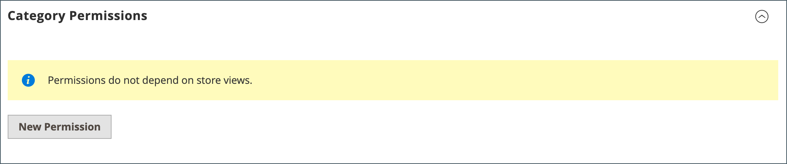
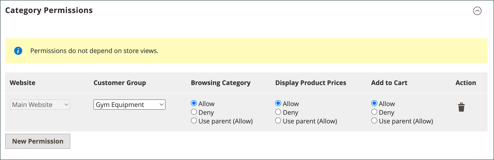
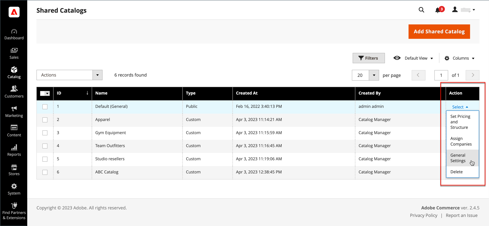

# Gestion des catalogues partagés

La page _[!UICONTROL Shared Catalogs]_&#x200B;donne accès aux outils nécessaires à la gestion de vos catalogues partagés. La page est similaire à l’espace de travail Admin standard, avec des filtres et des contrôles d’action. La grille répertorie tous les catalogues partagés, y compris le catalogue partagé public par défaut et tous les catalogues personnalisés que vous avez configurés.

## Mettre à jour la sélection de produits

La sélection de produits dans n’importe quel catalogue partagé peut être facilement mise à jour à partir de la colonne _[!UICONTROL Action]_&#x200B;de la grille des catalogues partagés. Les modifications que vous apportez sont visibles par les membres de tout compte d’entreprise associé. Le processus est essentiellement le même que le choix de produits pour une nouvelle [structure de catalogue](catalog-shared-pricing-structure.md), sauf que la portée de la configuration ne peut pas être modifiée.

1. Sur la barre latérale _Admin_, accédez à **[!UICONTROL Catalog]** > **[!UICONTROL Shared Catalogs]**.

1. Pour le catalogue partagé dans la grille, accédez à la colonne **[!UICONTROL Action]** et sélectionnez **[!UICONTROL Set Pricing and Structure]**.

   {width="700" zoomable="yes"}

1. Suivez les instructions de l’ [Étape 2 : Sélection de produits](catalog-shared-pricing-structure.md#step-2-choose-the-products).

   Vous pouvez ignorer le premier élément, car la portée d’un catalogue partagé ne peut pas être modifiée après son enregistrement initial.

Si vous travaillez avec un produit spécifique, la section _[!UICONTROL Products In Shared Catalog]_&#x200B;répertorie chaque catalogue partagé où le produit est disponible. Pour en savoir plus, voir [Ajout de produits à un catalogue partagé](catalog-shared-product-add.md).

{width="600" zoomable="yes"}

## Mise à jour de la tarification personnalisée

La tarification personnalisée des produits d’un catalogue partagé peut être facilement mise à jour à partir de la colonne Action de la grille Catalogues partagés. Les modifications que vous apportez sont visibles dans le storefront aux membres de la société ou du groupe de clients associé. Le processus est essentiellement identique à la définition de la tarification personnalisée pour un nouveau [catalogue partagé](catalog-shared-pricing-structure.md), sauf que la portée de la configuration ne peut pas être modifiée.

1. Sur la barre latérale _Admin_, accédez à **[!UICONTROL Catalog]** > **[!UICONTROL Shared Catalogs]**.

1. Pour le catalogue partagé dans la grille que vous souhaitez mettre à jour, accédez à la colonne **[!UICONTROL Action]** et sélectionnez **[!UICONTROL Set Pricing and Structure]**.

1. Sur la page _[!UICONTROL Catalog Structure]_, cliquez sur **[!UICONTROL Configure]**&#x200B;et effectuez l’une des opérations suivantes :

   - Dans l’indicateur de progression en haut de la page, cliquez sur **[!UICONTROL Pricing]**.
   - Dans le coin supérieur droit, cliquez sur **[!UICONTROL Next]**.

1. Suivez les instructions de l’ [Étape 3 : définir les prix personnalisés](catalog-shared-pricing-structure.md#step-3-set-custom-prices).

## Mise à jour des autorisations de catégorie

[Les autorisations de catégorie](../catalog/category-permissions.md) sont automatiquement définies sur `Allow` pour les produits ajoutés de l’arborescence des catégories à un catalogue partagé. Vous pouvez ensuite ajuster les autorisations ou créer des règles supplémentaires, si nécessaire.

>[!NOTE]
>
>**[Version B2B 1.3.0](release-notes.md#b2b-v130) et ultérieure** — Lorsque vous créez un catalogue partagé, chaque [autorisation de catégorie](../catalog/category-permissions.md) pour le catalogue est définie sur `Allow` pour les _[!UICONTROL Display Product Prices]_&#x200B;et&#x200B;_[!UICONTROL Add to Cart]_ pour les groupes de clients auxquels cet accès est affecté dans les paramètres d’autorisation du catalogue. Auparavant, ces paramètres étaient automatiquement définis sur `Deny` même lorsque les autorisations du catalogue étaient définies sur `Allow`.

>[!IMPORTANT]
>
>Tous les [paramètres d&#39;autorisation de groupe](../configuration-reference/catalog/catalog.md#category-permissions) existants sont ignorés par **_toutes_** catégories dans le catalogue lorsque la fonction **_[!UICONTROL Shared Catalog]_** est activée. [!UICONTROL Shared Catalog] contrôle entièrement toutes les autorisations de catégorie dans le catalogue lorsqu’il est activé.

1. Sur la barre latérale _Admin_, accédez à **[!UICONTROL Catalog]** > **[!UICONTROL Categories]**.

1. Dans l&#39;arborescence des catégories, sélectionnez la catégorie des produits que vous souhaitez mettre à jour.

   Pour inclure tous les produits, sélectionnez la catégorie de niveau supérieur dans l’arborescence.

1. Faites défiler l’écran vers le bas et développez la section  sur **[!UICONTROL Category Permissions]** .

1. Cliquez sur **[!UICONTROL New Permission]** et procédez comme suit :

   {width="600" zoomable="yes"}

   - Sélectionnez le **[!UICONTROL Customer Group]** correspondant au catalogue partagé et modifiez les paramètres d’autorisation si nécessaire.

     {width="600" zoomable="yes"}

   - Pour créer une règle d’autorisation pour un autre groupe de clients, cliquez sur **[!UICONTROL New Permissions]** et répétez le processus.

   - Pour supprimer une règle d’autorisation, cliquez sur l’icône _Supprimer_  .

1. Une fois l’opération terminée, cliquez sur **[!UICONTROL Save]**.

## Mise à jour des détails du catalogue

Les informations détaillées de tout catalogue partagé peuvent être facilement mises à jour à partir de la colonne Action de la grille Catalogues partagés. Les modifications que vous apportez sont répercutées dans les comptes d’entreprise associés.

{width="700" zoomable="yes"}

1. Sur la barre latérale _Admin_, accédez à **[!UICONTROL Catalog]** > **[!UICONTROL Shared Catalogs]**.

1. Pour le catalogue partagé que vous souhaitez mettre à jour, accédez à la colonne **[!UICONTROL Action]** et sélectionnez **[!UICONTROL General Settings]**.

   {width="600" zoomable="yes"}

1. Mettez à jour les informations détaillées du catalogue si nécessaire.

   - La modification du nom d’un catalogue partagé modifie également le nom du groupe de clients correspondant.
   - La modification du type de catalogue de `Custom` à `Public` convertit le catalogue public existant en catalogue personnalisé. Toutes les entreprises associées au catalogue public d’origine sont réaffectées au remplacement. Un catalogue public ne peut pas être converti en catalogue personnalisé.

1. Une fois l’opération terminée, cliquez sur **[!UICONTROL Save]**.

## Référence de page de catalogue partagée

### Barre de boutons

| Bouton | Description |
|--- |--- |
| [!UICONTROL Back] | Renvoie à la page Catalogues partagés sans enregistrer le nouveau catalogue partagé. |
| [!UICONTROL Delete] | Supprime le catalogue et réaffecte toutes les entreprises associées et leurs membres au catalogue partagé public. |
| [!UICONTROL Reset] | Efface le formulaire des modifications non enregistrées et restaure les informations détaillées du catalogue d’origine. |
| [!UICONTROL Duplicate] | Crée une [copie en double du catalogue](catalog-shared-create.md). Pour un catalogue personnalisé, le modèle de prix et la structure de l’original, mais sans les associations de l’entreprise. Si un catalogue partagé public est dupliqué, le type du catalogue dupliqué passe à `custom`. Un groupe de clients correspondant est également créé avec le même nom que le catalogue en double. Par défaut, un catalogue en double est nommé _Dupliquer de_ le catalogue d’origine. |
| [!UICONTROL Save and Continue Edit] | Enregistre toutes les modifications et conserve le formulaire ouvert en mode d’édition. |
| [!UICONTROL Save] | Enregistre les modifications, ferme le formulaire et revient à la page Catalogues partagés . |

{style="table-layout:auto"}

### Détails du catalogue

| Champ | Description |
|--- |--- |
| [!UICONTROL Name] | Identifie le catalogue partagé dans l’ensemble de l’administrateur et dans les comptes clients où il est disponible. Le nom du catalogue doit être descriptif et ne pas dépasser 32 caractères. Vous ne pouvez pas avoir deux catalogues partagés portant le même nom. Nombre maximum de caractères : 32 |
| [!UICONTROL Type] | **[!UICONTROL Custom]** : identifie un catalogue avec des tarifs personnalisés disponibles uniquement pour les entreprises spécifiques auxquelles il est affecté. **[!UICONTROL Public]**- Identifie le catalogue partagé disponible pour tous les visiteurs invités et pour les clients connectés qui ne sont pas associés à une entreprise. Un catalogue partagé public &quot;par défaut&quot; est créé lorsque Adobe Commerce B2B est installé, mais doit être configuré par l’administrateur. Un seul catalogue partagé public peut exister à la fois. |
| [!UICONTROL Customer Tax Class] | Détermine la classe de taxe utilisée pour les achats effectués à partir du catalogue. Les options incluent toutes les classes d’impôts disponibles. |
| [!UICONTROL Description] | Une brève explication de l’utilisation du catalogue. |

{style="table-layout:auto"}
