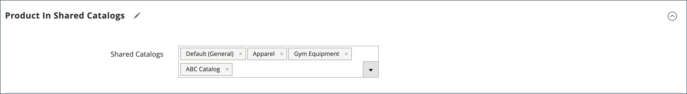
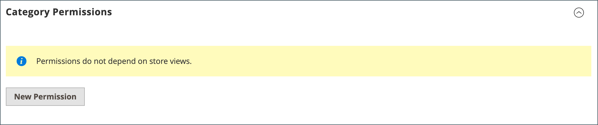

# Gestion des catalogues partagés

La page _[!UICONTROL Shared Catalogs]_permet d’accéder aux outils nécessaires à la gestion des catalogues partagés. La page est similaire à l’espace de travail d’administration standard, avec des filtres et des commandes d’action. La grille répertorie tous les catalogues partagés, y compris le catalogue public partagé par défaut et tous les catalogues personnalisés que vous avez configurés.

## Mettre à jour la sélection de produits

La sélection de produits dans un catalogue partagé peut être facilement mise à jour à partir de la colonne _[!UICONTROL Action]_de la grille de catalogues partagés. Les modifications que vous apportez sont visibles pour les membres de tous les comptes de société associés. Le processus est essentiellement identique à la sélection de produits pour une nouvelle [structure de catalogue](catalog-shared-pricing-structure.md), sauf que la portée de la configuration ne peut pas être modifiée.

1. Dans la barre latérale _Admin_, accédez à **[!UICONTROL Catalog]** > **[!UICONTROL Shared Catalogs]**.

1. Pour le catalogue partagé dans la grille, accédez à la colonne **[!UICONTROL Action]** et sélectionnez **[!UICONTROL Set Pricing and Structure]**.

   {width="700" zoomable="yes"}

1. Suivez les instructions de l’[étape 2 : sélection des produits](catalog-shared-pricing-structure.md#step-2-choose-the-products).

   Vous pouvez ignorer le premier élément, car l’étendue d’un catalogue partagé ne peut pas être modifiée après son premier enregistrement.

Si vous utilisez un produit spécifique, la section _[!UICONTROL Products In Shared Catalog]_répertorie chaque catalogue partagé dans lequel le produit est disponible. Pour en savoir plus, voir [Ajouter des produits à un catalogue partagé](catalog-shared-product-add.md).

{width="600" zoomable="yes"}

## Mettre à jour la tarification personnalisée

La tarification personnalisée des produits dans un catalogue partagé peut être facilement mise à jour à partir de la colonne Action de la grille Catalogues partagés. Les modifications que vous apportez sont visibles dans le storefront pour les membres de la société ou du groupe de clients associé. Le processus est essentiellement identique à la définition du prix personnalisé pour un nouveau [catalogue partagé](catalog-shared-pricing-structure.md), sauf que la portée de la configuration ne peut pas être modifiée.

1. Dans la barre latérale _Admin_, accédez à **[!UICONTROL Catalog]** > **[!UICONTROL Shared Catalogs]**.

1. Pour le catalogue partagé de la grille que vous souhaitez mettre à jour, accédez à la colonne **[!UICONTROL Action]** et sélectionnez **[!UICONTROL Set Pricing and Structure]**.

1. Sur la page _[!UICONTROL Catalog Structure]_, cliquez sur **[!UICONTROL Configure]**et effectuez l’une des opérations suivantes :

   - Dans l’indicateur de progression en haut de la page, cliquez sur **[!UICONTROL Pricing]**.
   - Dans le coin supérieur droit, cliquez sur **[!UICONTROL Next]**.

1. Suivez les instructions de l’[étape 3 : définir des prix personnalisés](catalog-shared-pricing-structure.md#step-3-set-custom-prices).

## Mettre à jour les autorisations de catégorie

Les [autorisations de catégorie](../catalog/category-permissions.md) sont automatiquement définies sur `Allow` pour les produits ajoutés à partir de l’arborescence des catégories à un catalogue partagé. Vous pouvez ensuite ajuster les autorisations ou créer des règles supplémentaires, si nécessaire.

>[!NOTE]
>
>**[Version 1.3.0](release-notes.md#b2b-v130) B2B et versions ultérieures** — Lorsque vous créez un catalogue partagé, chaque autorisation [de catégorie](../catalog/category-permissions.md) du catalogue est définie sur `Allow` pour le _[!UICONTROL Display Product Prices]_et_[!UICONTROL Add to Cart]_ pour les groupes de clients auxquels cet accès est affecté dans les paramètres d’autorisation du catalogue. Auparavant, ces paramètres étaient automatiquement définis sur `Deny` même lorsque les autorisations de catalogue étaient définies sur `Allow`.

>[!IMPORTANT]
>
>Toutes les [paramètres d’autorisation de groupe](../configuration-reference/catalog/catalog.md#category-permissions) existantes sont ignorées par les catégories **_all_** du catalogue lorsque la fonction **_[!UICONTROL Shared Catalog]_** est activée. [!UICONTROL Shared Catalog] contrôle entièrement toutes les autorisations de catégorie du catalogue lorsqu’il est activé.

1. Dans la barre latérale _Admin_, accédez à **[!UICONTROL Catalog]** > **[!UICONTROL Categories]**.

1. Dans l’arborescence des catégories, sélectionnez la catégorie des produits à mettre à jour.

   Pour inclure tous les produits, sélectionnez la catégorie de niveau supérieur dans l’arborescence.

1. Faites défiler vers le bas et développez  la section **[!UICONTROL Category Permissions]** .

1. Cliquez sur **[!UICONTROL New Permission]** et procédez comme suit :

   {width="600" zoomable="yes"}

   - Sélectionnez le **[!UICONTROL Customer Group]** correspondant au catalogue partagé et modifiez les paramètres d’autorisation si nécessaire.

     {width="600" zoomable="yes"}

   - Pour créer une règle d’autorisations pour un autre groupe de clients, cliquez sur **[!UICONTROL New Permissions]** et répétez le processus.

   - Pour supprimer une règle d’autorisation, cliquez sur l’icône _Supprimer_ .

1. Une fois l’opération terminée, cliquez sur **[!UICONTROL Save]**.

## Mettre à jour les détails du catalogue

Les informations détaillées de tout catalogue partagé peuvent être facilement mises à jour à partir de la colonne Action de la grille Catalogues partagés. Les modifications que vous apportez sont répercutées dans les comptes de société associés.

{width="700" zoomable="yes"}

1. Dans la barre latérale _Admin_, accédez à **[!UICONTROL Catalog]** > **[!UICONTROL Shared Catalogs]**.

1. Pour le catalogue partagé que vous souhaitez mettre à jour, accédez à la colonne **[!UICONTROL Action]** et sélectionnez **[!UICONTROL General Settings]**.

   {width="600" zoomable="yes"}

1. Mettez à jour les informations détaillées du catalogue si nécessaire.

   - La modification du nom d’un catalogue partagé modifie également le nom du groupe de clients correspondant.
   - Si vous remplacez le type de catalogue `Custom` par `Public`, le catalogue public existant est converti en catalogue personnalisé. Toutes les sociétés associées au catalogue public d’origine sont réaffectées au remplacement. Un catalogue public ne peut pas être converti en catalogue personnalisé.

1. Une fois l’opération terminée, cliquez sur **[!UICONTROL Save]**.

## Référence de page de catalogue partagé

### Barre de boutons

| Bouton | Description |
|--- |--- |
| [!UICONTROL Back] | Retourne à la page Catalogues partagés sans enregistrer le nouveau catalogue partagé. |
| [!UICONTROL Delete] | Supprime le catalogue et réaffecte toutes les sociétés associées et leurs membres au catalogue public partagé. |
| [!UICONTROL Reset] | Efface le formulaire des modifications non enregistrées et restaure les informations détaillées d’origine du catalogue. |
| [!UICONTROL Duplicate] | Crée une [copie en double du catalogue](catalog-shared-create.md). Pour un catalogue personnalisé, modèle et structure de tarification de l’original, mais sans les associations d’entreprises. Si un catalogue public partagé est dupliqué, le type du catalogue dupliqué devient `custom`. Un groupe de clients correspondant est également créé et porte le même nom que le catalogue en double. Par défaut, un catalogue en double est nommé _Dupliquer de_ catalogue d’origine. |
| [!UICONTROL Save and Continue Edit] | Enregistre toutes les modifications et maintient le formulaire ouvert en mode d’édition. |
| [!UICONTROL Save] | Enregistre les modifications, ferme le formulaire et revient à la page Catalogues partagés. |

{style="table-layout:auto"}

### Détails du catalogue

| Champ | Description |
|--- |--- |
| [!UICONTROL Name] | Identifie le catalogue partagé dans l’ensemble de l’administration et dans les comptes clients où il est disponible. Le nom du catalogue doit être explicite et ne pas dépasser 32 caractères. Vous ne pouvez pas avoir deux catalogues partagés avec le même nom. Nombre maximal de caractères : 32 |
| [!UICONTROL Type] | **[!UICONTROL Custom]** - Identifie un catalogue avec tarification personnalisée qui n&#39;est disponible que pour les sociétés spécifiques auxquelles il est affecté. **[!UICONTROL Public]**- Identifie le catalogue partagé qui est disponible pour tous les visiteurs invités et pour les clients connectés qui ne sont pas associés à une entreprise. Un catalogue public partagé « par défaut » est créé lors de l’installation d’Adobe Commerce B2B, mais doit être configuré par l’administrateur. Un seul catalogue public partagé peut exister à la fois. |
| [!UICONTROL Customer Tax Class] | Détermine la classe de taxe utilisée pour les achats effectués à partir du catalogue. Les options incluent toutes les classes de taxe disponibles. |
| [!UICONTROL Description] | Brève explication de l’utilisation du catalogue. |

{style="table-layout:auto"}
