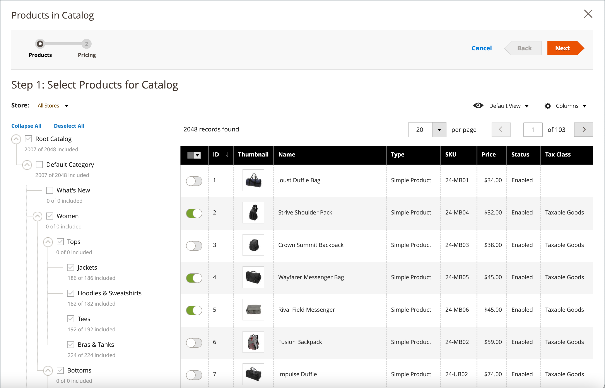
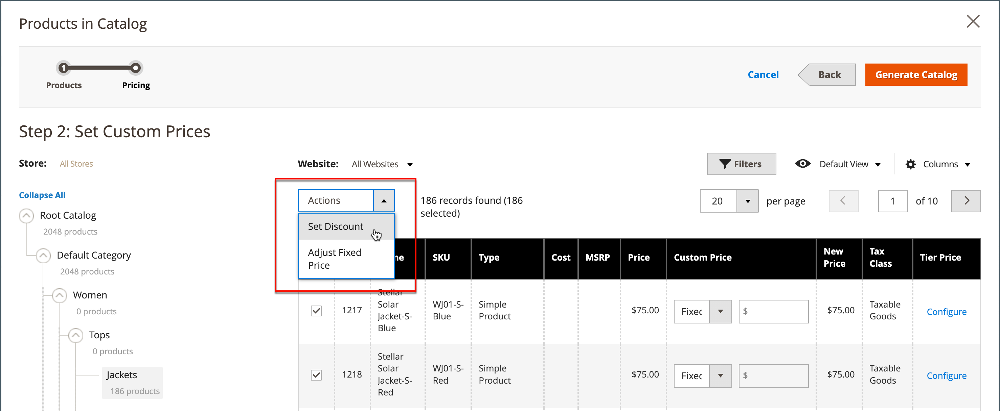
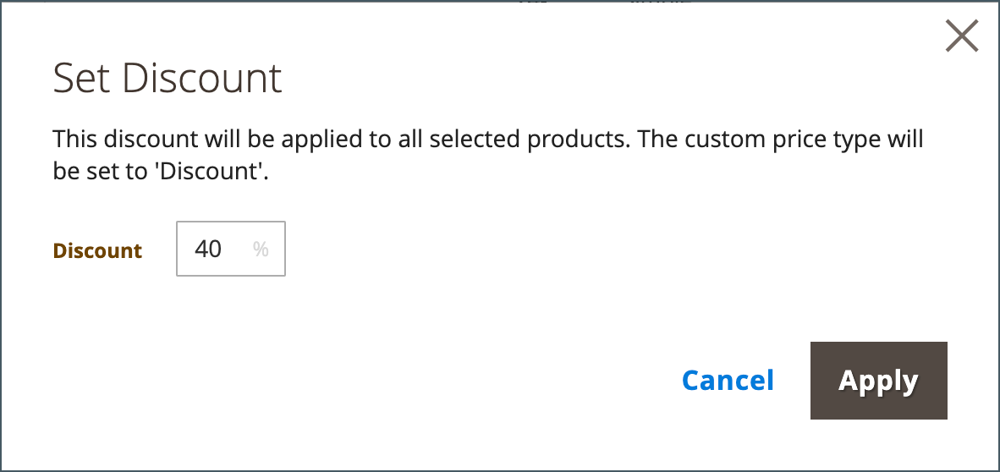
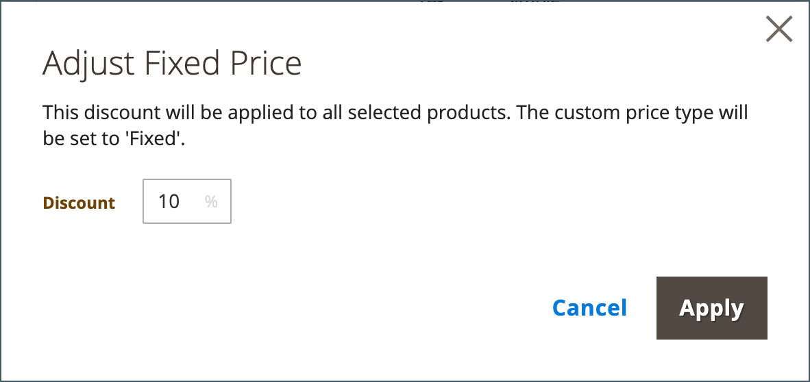
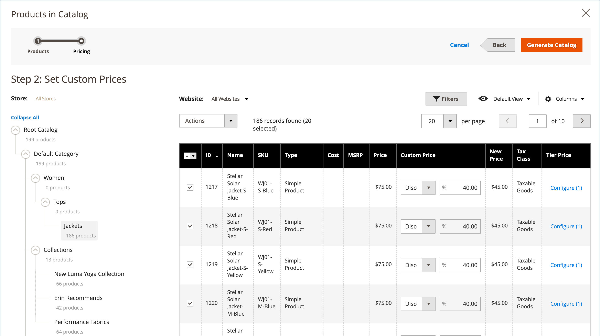
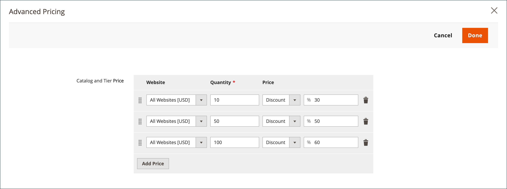
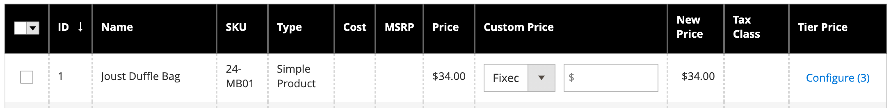

# Définir la structure et le prix du catalogue partagé

La configuration de la tarification et de la structure d’un catalogue partagé est un processus en deux étapes. Votre place actuelle dans le processus est mise en surbrillance avec un nombre dans la barre de progression en haut de la page. Vous pouvez à tout moment afficher l’autre étape du processus en cliquant sur la barre de progression. Par exemple, si vous travaillez sur une tarification personnalisée, vous pouvez revenir à la page de sélection de produits pour référence. Il vous suffit de cliquer sur **[!UICONTROL Products]** dans la barre de progression en haut de la page, puis de cliquer sur **[!UICONTROL Pricing]** pour revenir à la page de tarification personnalisée. Votre travail n&#39;est pas perdu dans ce processus.

{width="700" zoomable="yes"}

Dans l’arborescence de catégories standard, la catégorie racine est le conteneur le plus élevé et est appelée _Catégorie par défaut_ dans les exemples de données. Cependant, lorsque les catalogues partagés sont activés, l’arborescence de catégories comporte un conteneur externe appelé _Catalogue racine_. Le catalogue racine englobe toutes les autres structures de catégories qui existent dans le système. Pour plus d’informations, voir [Portée du catalogue](../catalog/introduction.md#catalog-scope).

## Étape 1 : ouvrir la configuration de tarification et de structure du catalogue partagé

1. Dans la barre latérale _Admin_, accédez à **[!UICONTROL Catalog]** > **[!UICONTROL Shared Catalogs]**

1. Pour le catalogue partagé dans la grille, accédez à la colonne _[!UICONTROL Action]_&#x200B;et cliquez sur **[!UICONTROL Set Pricing and Structure]**.

   {width="700" zoomable="yes"}

1. La première fois que le catalogue partagé est configuré, cliquez sur **[!UICONTROL Configure]** pour suivre les étapes suivantes.

## Etape 2 : Choix des produits

La première étape du processus consiste à choisir les produits que vous souhaitez inclure dans le catalogue partagé. La page de sélection de produits comprend l’arborescence [de catégories](../catalog/category-create.md) à gauche, ainsi qu’une grille de produits synchronisée à droite. Si vous cliquez sur une catégorie dans l’arborescence, les produits de la catégorie apparaissent dans la grille.

Seules les catégories comprenant des produits sélectionnés s’affichent dans la [navigation supérieure](../catalog/navigation-top.md) lorsque le catalogue partagé est affiché à partir du storefront. Par défaut, seuls les trois premiers niveaux de catégorie sont inclus dans la navigation du storefront, sans inclure la catégorie racine.

1. Utilisez le sélecteur **Store** pour définir la [portée](../catalog/introduction.md#product-scope) de la configuration.

   La portée de la configuration ne peut être définie que avant le premier enregistrement du catalogue partagé. Si vous modifiez ultérieurement la sélection de produits, le sélecteur de magasins n’est pas disponible.

   {width="600" zoomable="yes"}

1. Dans l’arborescence des catégories, effectuez l’une des opérations suivantes :

   - Pour inclure tous les produits, cliquez sur **[!UICONTROL Select all]** ou cochez la case de la catégorie parent.
   - Pour inclure des catégories spécifiques de produits, cochez la case de chaque catégorie à inclure.
   - Pour inclure ou exclure un produit individuel, cochez ou décochez la case du produit.

   La notation sous chaque catégorie de l’arborescence indique le nombre de produits de la catégorie actuellement inclus dans le catalogue partagé. La notation sous la [catégorie racine](../catalog/category-root.md) indique le nombre total de produits de toutes les catégories actuellement sélectionnées pour le catalogue partagé.

1. Pour afficher les produits de catégorie dans la grille, cliquez sur le nom de la catégorie dans l’arborescence. Lorsqu’une catégorie est sélectionnée, les événements suivants se produisent :

   - Le bouton (bascule) de la première colonne de la grille est défini sur la position verte _On_ pour chaque produit sélectionné.
   - Si un produit est affecté à plusieurs catégories et n’est pas sélectionné dans l’une d’entre elles, il reste disponible dans les autres catégories, ainsi que lors de l’utilisation de la [recherche catalogue](../catalog/search.md).
   - Le système définit automatiquement les [autorisations de catégorie](../catalog/category-permissions.md) sur `Allow` pour les produits sélectionnés.

1. Si nécessaire, utilisez les filtres et d’autres contrôles de grille pour rechercher les produits à inclure dans le catalogue partagé.

   Vous pouvez sélectionner ou omettre individuellement des produits en cliquant sur le bouton (bascule) dans la première colonne.

   Si vous sélectionnez une catégorie qui ne comporte aucun produit, mais qui est liée à du contenu CMS ou à un lien externe, elle s’affiche dans la barre de navigation supérieure du storefront.

   Les paramètres de catégorie que vous définissez ne sont pas enregistrés de manière permanente dans la base de données tant que la configuration n’est pas enregistrée. Toutefois, elles sont enregistrées temporairement lorsque vous travaillez sur la structure et la tarification.

1. Cliquez sur **[!UICONTROL Next]**.

   {width="600" zoomable="yes"}

## Étape 3 : définir des prix personnalisés

Vous pouvez définir une tarification personnalisée pour chaque produit individuellement ou utiliser le contrôle _[!UICONTROL Action]_&#x200B;pour définir une tarification personnalisée sous la forme d&#39;un montant ou d&#39;un pourcentage fixe pour plusieurs enregistrements de produit.

- **[!UICONTROL Fixed]** : indique le prix final du produit. Par exemple, si vous saisissez un prix fixe de 10 $, le prix en storefront pour la société correspondante est de 10 $.

  >[!NOTE]
  >
  >La valeur minimale entre le prix de base et la valeur fixe saisie est utilisée comme prix final du produit.

  >[!NOTE]
  >
  >**_Prix fixe_** les options personnalisables du produit ne sont _pas_ affectées par les règles Prix du groupe, Prix de niveau, Prix spécial ou Prix catalogue.

- **[!UICONTROL Percentage]** : détermine le prix personnalisé en fonction du pourcentage de remise. Par exemple, pour offrir une remise de 10 %, définissez le type de prix personnalisé sur `Percentage` et saisissez `10`. Le prix personnalisé réduit est de 90 % du prix initial du produit.

Pour définir la remise sur un montant fixe ou un pourcentage pour les types de produits suivants, utilisez la colonne _[!UICONTROL Custom Price]_&#x200B;de la grille :

- [Simple](../catalog/product-create-simple.md) (y compris les variations de produits configurables)
- [Bundle](../catalog/product-create-bundle.md)
- [Téléchargeable](../catalog/product-create-downloadable.md)
- [Virtuel](../catalog/product-create-virtual.md)

La colonne Prix personnalisé est vide pour les types de produits [configurables](../catalog/product-create-configurable.md) et [groupés](../catalog/product-create-grouped.md) et pour les [cartes-cadeaux](../catalog/product-gift-card-create.md).

La sélection de produits dans la grille ne peut pas être modifiée à partir de la page _Prix personnalisés_. Cependant, vous pouvez utiliser l’indicateur de progression en haut de la page pour revenir à l’étape précédente et modifier la sélection de produits.

{width="600" zoomable="yes"}

### Appliquer un prix personnalisé

1. Dans le cas d’une installation multisite, définissez **[!UICONTROL Website]** sur le site web auquel les prix personnalisés s’appliquent.

   {width="600" zoomable="yes"}

1. Utilisez l’une des méthodes suivantes pour sélectionner les produits sur lesquels le prix personnalisé doit s’appliquer.

   - Utilisez l’arborescence des catégories pour sélectionner tous les produits d’une catégorie spécifique.
   - Définissez le contrôle _[!UICONTROL Mass Actions]_&#x200B;dans l’en-tête sur `Select All`.
   - Cochez la case de chaque produit.

   La grille affiche les produits dans les catégories actuellement sélectionnées. Vous pouvez utiliser les commandes standard pour rechercher des produits et filtrer la liste.

   {width="600" zoomable="yes"}

1. Définissez **[!UICONTROL Actions]** sur l’une des options suivantes :

   - `Set Discount` - Applique un pourcentage de remise à tous les produits sélectionnés. Chaque prix de produit concerné s’affiche sous la forme d’un prix **_réduit_**.
   - `Adjust Fixed Price` - Applique un pourcentage de remise sur prix fixe à tous les produits sélectionnés. Chaque prix de produit concerné s’affiche sous la forme d’un prix fixe **_ajusté_**.

   {width="600" zoomable="yes"}

1. Lorsque vous y êtes invité, saisissez la remise ou l&#39;ajustement de prix et cliquez sur **[!UICONTROL Apply]**.

   {width="400"} 

   {width="400"}

   La remise est appliquée à tous les produits sélectionnés et la colonne _Prix personnalisé_ reflète le type de remise et le montant appliqués.

   {width="600" zoomable="yes"}

### Appliquer un prix de niveau

[Hiérarchiser les prix](../catalog/product-price-tier.md) vous permet d’offrir une remise sur la quantité pour les produits du catalogue partagé. La colonne _Prix de niveau_ de la grille contient un lien vers les options _Tarification avancée_ qui s’appliquent spécifiquement au catalogue partagé. Si le produit inclut déjà une tarification de niveau, le nombre de niveaux existants apparaît entre parenthèses après le lien.

Les instructions suivantes indiquent comment appliquer une tarification de niveau à un seul produit. Pour appliquer une tarification de niveau à plusieurs produits, reportez-vous à [Importer des prix de niveau](../systems/data-import-price-tier.md).

1. Pour le produit dans la grille, accédez à la colonne _Prix de niveau_ et cliquez sur **[!UICONTROL Configure]**.

   {width="600" zoomable="yes"}

1. Sur la page _Tarification avancée_, cliquez sur **[!UICONTROL Add Price]** et procédez comme suit :

   {width="600" zoomable="yes"}

   - Définissez **[!UICONTROL Website]** sur le site web où le prix de niveau s’applique.
   - Entrez la quantité de produit qui doit être achetée pour bénéficier de la remise.
   - Définissez **[!UICONTROL Price]** sur l’un des types de remise suivants :
      - `Fixed`
      - `Discount`
   - Saisissez le montant de la remise.
   - Pour entrer un autre niveau, cliquez sur **Ajouter un prix** et répétez le processus pour définir le niveau suivant.

   {width="600" zoomable="yes"}

1. Cliquez ensuite sur **[!UICONTROL Done]**.

   Dans la grille, le nombre de niveaux est indiqué entre parenthèses dans la colonne _[!UICONTROL Tier Price]_.

   {width="600" zoomable="yes"}

## Sauvegarde de la structure et de la tarification

Une fois la tarification personnalisée terminée, cliquez sur **[!UICONTROL Generate Catalog]** puis sur **[!UICONTROL Save]**.

Le catalogue partagé est maintenant enregistré dans la base de données. Son nom apparaît dans la colonne _[!UICONTROL Shared Catalog]_&#x200B;de la grille de&#x200B;_[!UICONTROL Products]_. L’étape suivante consiste à [affecter le catalogue partagé à une entreprise](./catalog-shared-assign-companies.md).
