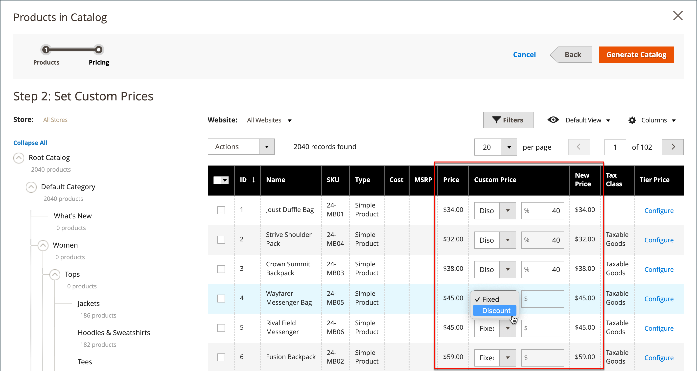

# Définition de la tarification et de la structure du catalogue partagées

La configuration de la tarification et de la structure d’un catalogue partagé est un processus en deux étapes. Votre emplacement actuel dans le processus est mis en surbrillance avec un numéro dans la barre de progression en haut de la page. Vous pouvez à tout moment afficher l’autre étape du processus en cliquant sur la barre de progression. Par exemple, si vous travaillez sur une tarification personnalisée, vous pouvez revenir à la page de sélection de produits à titre de référence. Il vous suffit de cliquer sur **[!UICONTROL Products]** dans la barre de progression en haut de la page, puis de cliquer sur **[!UICONTROL Pricing]** pour revenir à la page de tarification personnalisée. Votre travail n&#39;est pas perdu dans ce processus.

{width="700" zoomable="yes"}

Dans l’arborescence de catégorie standard, la catégorie racine est le conteneur le plus élevé et est appelée _Catégorie par défaut_ dans les exemples de données. Cependant, lorsque les catalogues partagés sont activés, l’arborescence de catégories comporte un conteneur externe appelé _Catalogue racine_. Le catalogue racine englobe toutes les autres structures de catégorie existant dans le système. Pour plus d’informations, voir [Portée du catalogue](../catalog/introduction.md#catalog-scope).

## Étape 1 : ouverture de la configuration de la structure et du prix du catalogue partagé

1. Sur la barre latérale _Admin_, accédez à **[!UICONTROL Catalog]** > **[!UICONTROL Shared Catalogs]**

1. Pour le catalogue partagé dans la grille, accédez à la colonne _[!UICONTROL Action]_&#x200B;et cliquez sur **[!UICONTROL Set Pricing and Structure]**.

   {width="700" zoomable="yes"}

1. La première fois que le catalogue partagé est configuré, cliquez sur **[!UICONTROL Configure]** pour passer aux étapes suivantes.

## Etape 2 : Sélection des produits

La première étape du processus consiste à choisir les produits que vous souhaitez inclure dans le catalogue partagé. La page de sélection de produits contient l’[arborescence de catégorie](../catalog/category-create.md) sur la gauche et une grille de produits synchronisée sur la droite. Si vous cliquez sur une catégorie dans l&#39;arborescence, les produits de la catégorie apparaissent dans la grille.

Seules les catégories avec des produits sélectionnés apparaissent dans la [navigation supérieure](../catalog/navigation-top.md) lorsque le catalogue partagé est affiché à partir du storefront. Par défaut, seuls les trois premiers niveaux de catégorie sont inclus dans la navigation du storefront, à l’exception de la catégorie racine.

1. Utilisez le sélecteur **Store** pour définir la [portée](../catalog/introduction.md#product-scope) de la configuration.

   La portée de la configuration ne peut être définie qu’avant que le catalogue partagé ne soit enregistré pour la première fois. Si vous modifiez ultérieurement la sélection de produits, le programme de sélection de magasin n’est pas disponible.

   {width="600" zoomable="yes"}

1. Dans l’arborescence des catégories, effectuez l’une des opérations suivantes :

   - Pour inclure tous les produits, cliquez sur **[!UICONTROL Select all]** ou cochez la case de la catégorie parente.
   - Pour inclure des catégories spécifiques de produits, cochez la case de chaque catégorie à inclure.
   - Pour inclure ou exclure un produit individuel, cochez ou désélectionnez la case correspondant.

   La notation sous chaque catégorie de l’arborescence indique le nombre de produits de la catégorie qui sont actuellement inclus dans le catalogue partagé. La notation sous la [catégorie racine](../catalog/category-root.md) indique le nombre total de produits de toutes les catégories actuellement sélectionnées pour le catalogue partagé.

1. Pour visualiser les produits de la catégorie dans la grille, cliquez sur le nom de la catégorie dans l&#39;arborescence. Lorsqu’une catégorie est sélectionnée, les événements suivants se produisent :

   - Le bouton bascule dans la première colonne de la grille est défini sur la position verte _On_ pour chaque produit sélectionné.
   - Si un produit est affecté à plusieurs catégories et n’est pas sélectionné dans l’une d’elles, il reste disponible dans les autres catégories, ainsi que lors de l’utilisation de la [recherche catalogue](../catalog/search.md).
   - Le système définit automatiquement les [autorisations de catégorie](../catalog/category-permissions.md) sur `Allow` pour les produits sélectionnés.

1. Si nécessaire, utilisez les filtres et autres contrôles de grille pour trouver les produits que vous souhaitez inclure dans le catalogue partagé.

   Vous pouvez sélectionner ou omettre individuellement des produits en cliquant sur le bouton de sélection dans la première colonne.

   Si vous sélectionnez une catégorie sans produit, mais liée au contenu CMS ou à un lien externe, elle s’affiche dans la barre de navigation supérieure du storefront.

   Les paramètres de catégorie que vous effectuez ne sont pas enregistrés définitivement dans la base de données tant que la configuration n’a pas été enregistrée. Cependant, elles sont temporairement enregistrées lorsque vous travaillez sur la structure et le prix.

1. Cliquez sur **[!UICONTROL Next]**.

   {width="600" zoomable="yes"}

## Étape 3 : définition de prix personnalisés

Vous pouvez définir une tarification personnalisée pour chaque produit individuellement ou utiliser le contrôle _[!UICONTROL Action]_&#x200B;pour définir la tarification personnalisée en tant que montant ou pourcentage fixe pour plusieurs enregistrements de produit.

- **[!UICONTROL Fixed]** : indique le prix final du produit. Par exemple, si vous saisissez un prix fixe de 10,00 $, le prix dans la vitrine de la société correspondante est de 10,00 $.

  >[!NOTE]
  >
  >La valeur minimale entre le Prix de base et la valeur fixe saisie est utilisée comme prix final du produit.

  >[!NOTE]
  >
  >Les options personnalisables du produit **_Prix fixe_** sont _non_ affectées par les règles de prix de groupe, de niveau, de prix spécial ou de catalogue.

- **[!UICONTROL Percentage]** : détermine le prix personnalisé en fonction du pourcentage de remise. Par exemple, pour offrir une remise de 10 %, définissez le type de prix personnalisé sur `Percentage` et saisissez `10`. Le prix personnalisé escompté est 90 % du prix du produit d’origine.

Pour définir la remise sur un montant fixe ou un pourcentage pour les types de produits suivants, utilisez la colonne _[!UICONTROL Custom Price]_&#x200B;de la grille :

- [Simple](../catalog/product-create-simple.md) (y compris les variations de produit configurables)
- [Bundle](../catalog/product-create-bundle.md)
- [Téléchargeable](../catalog/product-create-downloadable.md)
- [Virtuel](../catalog/product-create-virtual.md)

La colonne Prix personnalisé est vide pour les types de produits [configurable](../catalog/product-create-configurable.md) et [groupés](../catalog/product-create-grouped.md) et pour les [cartes-cadeaux](../catalog/product-gift-card-create.md).

La sélection de produits dans la grille ne peut pas être modifiée à partir de la page _Prix personnalisés_ . Vous pouvez toutefois utiliser l’indicateur de progression en haut de la page pour revenir à l’étape précédente et modifier la sélection de produits.

{width="600" zoomable="yes"}

### Appliquer un prix personnalisé

1. Pour une installation multi-site, définissez **[!UICONTROL Website]** sur le site web où les prix personnalisés s&#39;appliquent.

   {width="600" zoomable="yes"}

1. Utilisez l’une des méthodes suivantes pour sélectionner les produits auxquels s’applique la tarification personnalisée.

   - Utilisez l’arborescence des catégories pour sélectionner tous les produits d’une catégorie spécifique.
   - Définissez le contrôle _[!UICONTROL Mass Actions]_&#x200B;dans l’en-tête sur `Select All`.
   - Cochez la case correspondant aux produits individuels.

   La grille affiche les produits des catégories actuellement sélectionnées. Vous pouvez utiliser les commandes standard pour rechercher des produits et filtrer la liste.

   {width="600" zoomable="yes"}

1. Définissez **[!UICONTROL Actions]** sur l’une des options suivantes :

   - `Set Discount` - Applique un pourcentage de remise à tous les produits sélectionnés. Chaque prix du produit concerné est affiché sous la forme d’un prix **_réduit_**.
   - `Adjust Fixed Price` : applique un pourcentage de remise fixe sur le prix à tous les produits sélectionnés. Chaque prix du produit concerné est affiché sous la forme d’un prix **_ajusté_**.

   {width="600" zoomable="yes"}

1. Lorsque vous y êtes invité, saisissez la remise ou l’ajustement de prix, puis cliquez sur **[!UICONTROL Apply]**.

   {width="400"} 

   {width="400"}

   La remise est appliquée à tous les produits sélectionnés et la colonne _Prix personnalisé_ reflète le type de remise et le montant appliqué.

   {width="600" zoomable="yes"}

### Appliquer un prix de niveau

Le [&#x200B; niveau de prix](../catalog/product-price-tier.md) vous permet d’offrir une remise sur une quantité donnée pour les produits du catalogue partagé. La colonne _Prix de niveau_ de la grille contient un lien vers les options _de tarification avancée_ qui s’appliquent spécifiquement au catalogue partagé. Si le produit comprend déjà le niveau de prix, le nombre de niveaux existants s’affiche entre parenthèses après le lien.

Les instructions suivantes expliquent comment appliquer un niveau de prix à un seul produit. Pour appliquer des tarifs de niveau à plusieurs produits, reportez-vous à la section [Prix de niveau d&#39;importation](../systems/data-import-price-tier.md).

1. Pour le produit dans la grille, accédez à la colonne _Niveau de prix_ et cliquez sur **[!UICONTROL Configure]**.

   {width="600" zoomable="yes"}

1. Sur la page _Advanced PrTarification_, cliquez sur **[!UICONTROL Add Price]** et procédez comme suit :

   {width="600" zoomable="yes"}

   - Définissez **[!UICONTROL Website]** sur le site web où s’applique le prix du niveau.
   - Saisissez la quantité de produit à acheter pour bénéficier de la remise.
   - Définissez **[!UICONTROL Price]** sur l’un des types de remise suivants :
      - `Fixed`
      - `Discount`
   - Saisissez le montant de la remise.
   - Pour entrer dans un autre niveau, cliquez sur **Ajouter le prix** et répétez le processus pour définir le niveau suivant.

   {width="600" zoomable="yes"}

1. Une fois l’opération terminée, cliquez sur **[!UICONTROL Done]**.

   Dans la grille, le nombre de niveaux est indiqué entre parenthèses dans la colonne _[!UICONTROL Tier Price]_.

   {width="600" zoomable="yes"}

## Enregistrer la structure et le prix

Une fois la tarification personnalisée terminée, cliquez sur **[!UICONTROL Generate Catalog]** puis sur **[!UICONTROL Save]**.

Le catalogue partagé est maintenant enregistré dans la base de données. Son nom apparaît dans la colonne _[!UICONTROL Shared Catalog]_&#x200B;de la grille&#x200B;_[!UICONTROL Products]_. L’étape suivante consiste à [attribuer le catalogue partagé à une entreprise](./catalog-shared-assign-companies.md).
