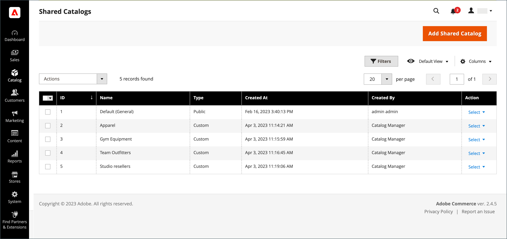

# Présentation du catalogue partagé

Adobe Commerce B2B vous permet de gérer des catalogues _partagés_ avec des prix personnalisés pour différentes sociétés. Outre le catalogue de produits standard _principal_, il permet aux clients d’accéder à deux types de catalogues partagés avec des structures de tarification différentes.

Si la fonction [Catalogue partagé](enable-basic-features.md) est activée dans la configuration, le catalogue principal d’origine reste visible depuis l’administration, mais seul le catalogue public partagé par défaut (général) est visible depuis le storefront. En outre, vous pouvez créer des catalogues personnalisés visibles uniquement pour les membres de comptes [société](account-companies.md) spécifiques.

Pour le catalogue public partagé `Default (General)`, vous devez affecter des produits pour afficher le catalogue sur le storefront. Par défaut, il est vide et ne contient aucun produit.

>[!NOTE]
>
>**[Version 1.3.0](release-notes.md#b2b-v130) B2B et versions ultérieures** — Lorsque vous créez un catalogue partagé, chaque autorisation [de catégorie](../catalog/category-permissions.md) pour le catalogue est définie sur _[!UICONTROL Allow for the Display Product Prices]_&#x200B;et&#x200B;_[!UICONTROL Add to Cart]_ pour les groupes de clients auxquels cet accès est affecté dans les paramètres d’autorisation du catalogue. Auparavant, ces paramètres étaient automatiquement définis sur `Deny` même lorsque les autorisations de catalogue étaient définies sur `Allow`.

>[!IMPORTANT]
>
>Toutes les [paramètres d’autorisation de groupe](../configuration-reference/catalog/catalog.md#category-permissions) existantes sont ignorées par les catégories **_all_** du catalogue lorsque la fonction **_[!UICONTROL Shared Catalog]_** est activée. [!UICONTROL Shared Catalog] contrôle entièrement toutes les autorisations de catégorie du catalogue lorsqu’il est activé.

La page _[!UICONTROL Shared Catalogs]_&#x200B;permet d’accéder aux outils utilisés pour gérer vos catalogues partagés. La page est similaire à l’espace de travail standard [Admin](../getting-started/admin-workspace.md), avec des filtres et des commandes d’action. La grille répertorie tous les catalogues partagés, y compris le catalogue public partagé par défaut et tous les catalogues personnalisés que vous avez configurés.

{width="700" zoomable="yes"}

## Accès à la page [!UICONTROL Shared Catalogs]

Dans la barre latérale _Admin_, accédez à **[!UICONTROL Catalog]** > **[!UICONTROL Shared Catalogs]**.

## Contrôles des actions

Les contrôles [actions](../getting-started/admin-actions-control.md) situés dans le coin supérieur gauche peuvent être utilisés avec le contrôle des actions en masse pour supprimer les catalogues partagés sélectionnés qui ne sont plus nécessaires. Dans la grille, la colonne _[!UICONTROL Actions]_&#x200B;contient la sélection complète d’outils pour gérer vos catalogues partagés.

{width="350"}

| Contrôle | Description |
|------|-----------|
| [[!UICONTROL Set Pricing and Structure]](catalog-shared-pricing-structure.md) | Détermine la sélection de produits et la tarification personnalisée disponibles dans le catalogue partagé. |
| [[!UICONTROL Assign Companies]](catalog-shared-assign-companies.md) | Détermine quelles sociétés peuvent accéder à un catalogue partagé. |
| [[!UICONTROL General Settings]](catalog-shared-manage.md) | Détermine les informations détaillées du catalogue, notamment le nom, le type de catalogue, la classe de taxe du client et la description. |
| [!UICONTROL Delete] | Supprime les catalogues partagés sélectionnés. |

{style="table-layout:auto"}

## Descriptions des colonnes

| Titre | Description |
|--- |--- |
| [!UICONTROL Select] | Sélectionne les enregistrements de catalogue partagé pour appliquer une action. Le contrôle de l’en-tête peut être utilisé pour sélectionner tous les enregistrements de catalogue partagés de la grille ou pour les désélectionner. Pour sélectionner un catalogue partagé individuel, cochez la case. |
| [!UICONTROL ID] | Identifiant numérique unique attribué en séquence lors de la création du catalogue. |
| [!UICONTROL Name] | Nom du catalogue partagé. Par défaut, le catalogue partagé par défaut (Général) est disponible. |
| [!UICONTROL Type] | Identifie le type de catalogue partagé comme suit :  **[!UICONTROL Public]**- Le catalogue public partagé par défaut est créé automatiquement lors de l’installation d’Adobe Commerce B2B. Il est initialement affecté aux groupes de clients `General` et `Not Logged In` et est visible par les invités et les clients connectés individuels qui ne sont pas associés à une entreprise. Le système ne prend en charge qu’un seul catalogue public partagé à la fois. **[!UICONTROL Custom]** - Un catalogue partagé personnalisé contient une tarification visible uniquement pour les associés connectés des comptes de société affectés. Vous pouvez créer autant de catalogues partagés personnalisés que nécessaire. |
| [!UICONTROL Customer Tax Class] | Classe de taxe affectée au groupe de clients correspondant. Cette colonne n’apparaît pas dans la grille par défaut, mais peut être ajoutée en modifiant la disposition des colonnes. |
| [!UICONTROL Created At] | Date et heure de création du catalogue partagé. |
| [!UICONTROL Created By] | Prénom et nom de l’administrateur du magasin qui a créé le catalogue partagé. |
| [!UICONTROL Action] | Répertorie les actions à appliquer aux catalogues sélectionnés. Options : `Set Pricing and Structure` / `Assign Companies` / `General Settings` / `Delete` |

{style="table-layout:auto"}
