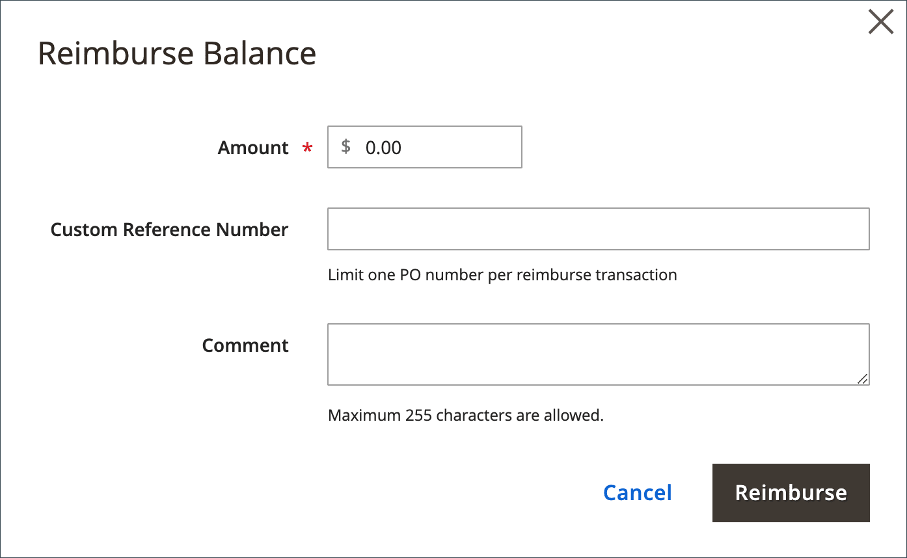

# Gérer le crédit de l’entreprise

Si le [paiement sur le compte](../getting-started/../b2b/enable-basic-features.md#configure-payment-on-account) est activé dans la configuration, les entreprises peuvent effectuer des achats sur leur compte jusqu’à la limite de crédit qui est accordée à la société. Lorsqu’ils sont activés, les clients peuvent vérifier le statut du crédit de leur société à partir du tableau de bord de leur compte.

{width="700" zoomable="yes"}

Vous pouvez définir les paramètres liés au crédit suivants pour chaque profil d’entreprise :

- Devise de crédit
- Limite de crédit
- Autoriser à dépasser la limite de crédit
- Motif du changement

Si la société dispose d’un solde en suspens, un avis à l’administrateur du magasin s’affiche en haut de la commande client lorsqu’elle est consultée depuis l’administrateur. Pour en savoir plus, voir [Création d’un compte d’entreprise](account-company-create.md).

## Activité de crédit de la société

La section [!UICONTROL Company Credit] du profil de la société affiche un résumé de l’activité de crédit client, avec une grille de l’historique de crédit de la société.

{width="700" zoomable="yes"}

| Colonne | Description |
|--- |--- |
| [!UICONTROL Date] | Date de la transaction. Pour afficher la date et l’heure, survolez la date avec la souris. |
| [!UICONTROL Operation] | Type d’activité associé à la transaction. Valeurs :  **[!UICONTROL Allocated]**- Crédit attribué à la société. **[!UICONTROL Updated]** - Une modification a été appliquée à l’un des champs suivants : [!UICONTROL Credit limit] / [!UICONTROL Credit currency] / [!UICONTROL Allow to exceed credit limit]  **[!UICONTROL Purchased]**- Une commande a été passée. **[!UICONTROL Reimbursed]** - Le solde impayé a été remboursé.  **[!UICONTROL Refunded]**- Un montant de note de crédit a été remboursé. **[!UICONTROL Reverted]** - La commande a été annulée et le montant renvoyé au solde du crédit. |
| [!UICONTROL Amount] | Le montant de la transaction associée aux types de transaction suivants : `Purchased` / `Reimbursed` / `Refunded` / `Reverted`  Pour les montants d’achat, le montant apparaît dans la devise d’affichage du magasin et dans le format du paramètre de devise de crédit, suivi du taux de conversion actuel (le cas échéant). Par exemple :  EUR 20 000,00 (22 400,00 $)  USD/EUR 0,8928 |
| [!UICONTROL Outstanding Balance] | Le montant remboursé, moins le total dû sur toutes les commandes passées via le mode paiement sur le compte . Le montant peut apparaître sous la forme d’une valeur positive ou négative.  **[!UICONTROL Positive value]**- Un versement anticipé est représenté sous la forme d’une valeur positive. **[!UICONTROL Negative value]** - Un montant dû est représenté sous la forme d’une valeur négative. |
| [!UICONTROL Available Credit] | La somme de _[!UICONTROL Credit Limit]_et de_[!UICONTROL Outstanding Balance]_. Si la société a dépassé la limite de crédit, le montant apparaît comme une valeur négative. |
| [!UICONTROL Credit Limit] | Montant du crédit accordé à la société. |
| [!UICONTROL Updated By] | Nom de la personne qui a lancé l’opération. |
| [!UICONTROL Custom Reference Number] | Numéro de référence personnalisé associé à la transaction. |
| [!UICONTROL Comment] | Une compilation des valeurs du champ `Reason for Change`, en fonction du type d’opération.  **[!UICONTROL Purchased]**- Inclut les commentaires de l’achat, le numéro de commande et le lien vers la commande. **[!UICONTROL Reimbursed]** - Inclut les commentaires de la transaction remboursée. |
| [!UICONTROL Action] | Pour les opérations `Reimbursed` uniquement. **[!UICONTROL Edit]** - Permet de mettre à jour le montant du remboursement. |

{style="table-layout:auto"}

## Mettre à jour les informations de crédit

Lorsque le client verse le paiement de son crédit impayé au commerçant, un administrateur de magasin doit alors mettre à jour les informations de crédit du client dans l’administrateur.

1. Dans la barre latérale _Admin_, accédez à **Clients > Entreprises**.

1. Recherchez l’entreprise dans la grille et ouvrez-la en mode _Édition_ .

1. Développez la section **Crédit de la société** .

1. Pour **Limite de crédit**, saisissez la nouvelle valeur.

1. Modifiez les autres valeurs selon vos besoins.

1. Une fois les mises à jour terminées, cliquez sur **[!UICONTROL Save]**.

## Recevoir des paiements

Un solde remboursé est un paiement hors ligne effectué par une société vers le solde de son compte. L&#39;administrateur du magasin saisit le montant manuellement dans le profil de l&#39;entreprise, à l&#39;aide du bouton _Rembourser le solde_ . Lors de l’envoi du montant, le système recalcule le solde impayé et le crédit disponible de la société, et enregistre l’action dans l’historique de crédit de la société. Le montant remboursé est saisi dans la devise du crédit, comme indiqué dans le paramétrage.

### Appliquer un paiement à un compte d’entreprise

1. Sur la barre latérale _Admin_, accédez à **[!UICONTROL Customers]** > **[!UICONTROL Companies]**.

1. Recherchez l’enregistrement de la société dans la liste et ouvrez-le en mode **[!UICONTROL Edit]**.

1. En haut de la page, cliquez sur **Solde de remboursement**.

1. Dans la boîte de dialogue, ajoutez les informations de paiement :

   {width="500"}

   - Saisissez le **montant** du paiement.

     Le montant peut être renseigné sous la forme d’une valeur positive ou négative.

   - Le cas échéant, saisissez le **numéro de référence personnalisé** à titre de référence.

     Un seul numéro de référence personnalisé peut être saisi par remboursement. Pour appliquer le paiement à plusieurs PO, créez un remboursement distinct pour chacun d&#39;eux.

   - Au besoin, saisissez un **commentaire** pour décrire le remboursement.

1. Cliquez sur **Remboursement**.

   Le solde de l&#39;encours et le crédit disponible de l&#39;entreprise sont recalculés et l&#39;historique du crédit de l&#39;entreprise est mis à jour pour tenir compte du remboursement.

### Modifier un remboursement

1. Ouvrez le profil de la société en mode **[!UICONTROL Edit]** .

1. Développez la section  sur **Crédit de société** .

1. Recherchez la transaction de remboursement dans la grille et cliquez sur **[!UICONTROL Edit]**.

1. Apportez les modifications nécessaires à **Numéro de référence personnalisé** et **Commentaire**.

   Le montant du remboursement ne peut être modifié.

1. Cliquez sur **[!UICONTROL Save]**.

## Informations de crédit de Storefront

Pour l’administrateur de la société, le tableau de bord du compte affiche la section _Crédit de la société_ . Il indique le solde en cours, le crédit disponible et la limite de crédit allouée au compte de l’entreprise, suivie d’une liste des factures en suspens.

Si le commerçant annule une commande qui a été imputée au crédit de la société, le montant de la commande est renvoyé au solde de la société et l’_historique d’attribution de crédit_ comprend un enregistrement de l’action.

{width="700" zoomable="yes"}

## Démonstration du crédit de l’entreprise

Découvrez la gestion du crédit de l’entreprise en regardant cette vidéo de démonstration :

>[!VIDEO](https://video.tv.adobe.com/v/344445?quality=12&learn=on)
