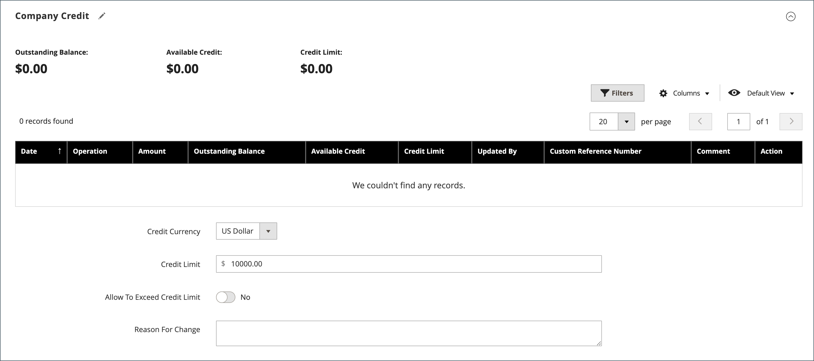
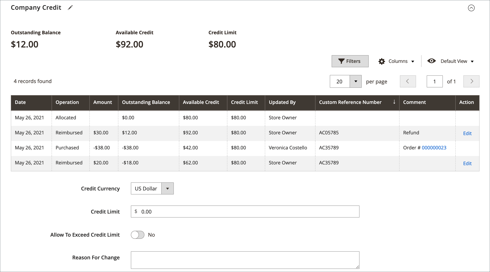

# Gérer le crédit d’entreprise

Le crédit d’entreprise permet aux entreprises B2B d’effectuer des achats sur une ligne de crédit préapprouvée plutôt que d’exiger un paiement immédiat. Lorsque l’option [Paiement en compte](../b2b/enable-basic-features.md#configure-payment-on-account) est activée, les sociétés peuvent acheter jusqu’à leur limite de crédit et consulter leur statut de crédit depuis le tableau de bord du compte.

{width="700" zoomable="yes"}

Le crédit d’entreprise vous permet d’effectuer les opérations suivantes :

* **Prolonger les conditions de crédit**—Autoriser les clients d&#39;affaires de confiance à acheter en compte avec paiement différé
* **Fixer des limites de crédit**—Contrôlez l&#39;exposition financière en établissant des limites de crédit pour chaque entreprise
* **Suivre l&#39;activité de crédit**—Surveillez en temps réel tous les mouvements de crédit, les paiements et les soldes impayés
* **Rationaliser les transactions B2B**—Simplifier le processus d&#39;achat pour les entreprises ayant des relations de crédit établies
* **Prise en charge de workflows complexes**—Intégration avec les commandes fournisseur, les devis et les processus d&#39;approbation

## Conditions préalables

Avant de configurer le crédit d&#39;entreprise, assurez-vous que :

* Les fonctionnalités B2B sont activées dans votre installation Adobe Commerce
* [Paiement sur le compte](../b2b/enable-basic-features.md#configure-payment-on-account) est configuré et activé
* Les comptes d’entreprise sont correctement configurés avec les informations commerciales nécessaires
* Vous disposez des autorisations administratives nécessaires pour gérer les paramètres de crédit d’entreprise
* Les paramètres de devise sont configurés s’ils fonctionnent dans plusieurs devises

## Cas d’utilisation

Le crédit d&#39;entreprise est idéal pour :

* **Relations B2B établies** : clients commerciaux à long terme ayant des antécédents de paiement éprouvés
* **Clients des grandes entreprises**—Les entreprises qui font des achats importants et réguliers nécessitant des délais de paiement prolongés
* **Entreprises saisonnières** - Entreprises ayant des flux de trésorerie cycliques qui ont besoin d&#39;un calendrier de paiement flexible
* **Approvisionnement d&#39;entreprise** - Organisations ayant des achats centralisés mais un traitement des paiements distribué
* **Partenaires**—Distributeurs, revendeurs et partenaires de distribution ayant besoin de facilités de crédit

## Comprendre les paramètres de crédit d’entreprise

Vous pouvez configurer les paramètres de crédit suivants pour chaque profil de société :

* **Devise de crédit**—Devise pour tous les mouvements et soldes de crédit
* **Limite de crédit**— Montant maximal que l&#39;entreprise peut devoir à tout moment
* **Autoriser à dépasser la limite de crédit**— Si les entreprises peuvent passer des commandes dépassant le crédit disponible
* **Motif de la modification**—Champ de documentation pour enregistrer les modifications des paramètres de crédit

Pour plus d’informations sur ces paramètres et la configuration du profil d’entreprise, voir [Créer un compte d’entreprise](account-company-create.md).

>[!NOTE]
>
>Si une société a un solde impayé, un avis apparaît à l&#39;administrateur du magasin en haut des commandes client lorsqu&#39;il est consulté par l&#39;administrateur. Cela permet de s’assurer de la connaissance du statut de crédit lors du traitement des commandes.

## Activité de crédit d’entreprise

La section [!UICONTROL Company Credit] du profil de la société affiche un historique complet de toutes les transactions de crédit, les modifications de solde et les activités de paiement sous la forme d&#39;une grille.

{width="700" zoomable="yes"}

La grille affiche les informations suivantes pour chaque transaction :

| Colonne | Description |
|--- |--- |
| [!UICONTROL Date] | Date de la transaction. Pour afficher la date et l’heure, passez la souris sur la date. |
| [!UICONTROL Operation] | Type d’activité associé à la transaction. Valeurs :  **[!UICONTROL Allocated]**- Crédit attribué à la société. **[!UICONTROL Updated]** - Une modification a été appliquée à l’un des champs suivants : [!UICONTROL Credit limit] / [!UICONTROL Credit currency] / [!UICONTROL Allow to exceed credit limit]  **[!UICONTROL Purchased]**- Une commande a été passée. **[!UICONTROL Reimbursed]** - Le solde restant dû a été remboursé.  **[!UICONTROL Refunded]**- Un montant d&#39;avoir a été remboursé. **[!UICONTROL Reverted]** - La commande a été annulée et le montant a été renvoyé au solde créditeur. |
| [!UICONTROL Amount] | Montant de la transaction associé aux types de transaction suivants : `Purchased` / `Reimbursed` / `Refunded` / `Reverted`  Pour les montants d’achat, le montant apparaît dans la devise d’affichage du magasin et au format du paramètre de devise de crédit, suivi du taux de conversion actuel (le cas échéant). Par exemple :  2 000,00 EUR (22 400,00 $)  USD/EUR 0,8928 |
| [!UICONTROL Outstanding Balance] | Montant remboursé, moins le total dû de toutes les commandes passées à l&#39;aide de la méthode de paiement en compte. Le montant peut apparaître comme une valeur positive ou négative.  **[!UICONTROL Positive value]**- Un paiement anticipé est représenté comme une valeur positive. **[!UICONTROL Negative value]** - Un montant dû est représenté sous la forme d’une valeur négative. |
| [!UICONTROL Available Credit] | La somme des _[!UICONTROL Credit Limit]_&#x200B;et des&#x200B;_[!UICONTROL Outstanding Balance]_. Si la société a dépassé la limite de crédit, le montant apparaît comme une valeur négative. |
| [!UICONTROL Credit Limit] | Montant du crédit accordé à la société. |
| [!UICONTROL Updated By] | Nom de la personne qui a initié l’opération. |
| [!UICONTROL Custom Reference Number] | Numéro de référence personnalisé associé à la transaction. |
| [!UICONTROL Comment] | Une compilation des valeurs du champ `Reason for Change`, en fonction du type d’opération.  **[!UICONTROL Purchased]**- Inclut les commentaires de l’achat, ainsi que le numéro de commande et le lien vers la commande. **[!UICONTROL Reimbursed]** - Inclut les commentaires de la transaction remboursée. |
| [!UICONTROL Action] | Pour les opérations `Reimbursed` uniquement. **[!UICONTROL Edit]** - Permet de mettre à jour le montant du remboursement. |

{style="table-layout:auto"}

## Mettre à jour les informations de crédit

Lorsque les clients effectuent des paiements, les administrateurs mettent à jour les informations de crédit dans l’administrateur.

1. Dans la barre latérale _Admin_, accédez à **Clients > Entreprises**.

1. Recherchez la société dans la grille et ouvrez en mode _Modifier_.

1. Développez la section **Crédit d’entreprise**.

1. Pour **Limite de crédit**, saisissez la nouvelle valeur.

1. Modifiez les autres valeurs si nécessaire.

1. Une fois les mises à jour terminées, cliquez sur **[!UICONTROL Save]**.

## Recevoir des paiements

Un solde remboursé est un paiement hors ligne effectué par une entreprise pour le solde de son compte. L&#39;administrateur du magasin saisit le montant manuellement dans le profil de la société, à l&#39;aide du bouton _Rembourser le solde_. Lorsque le montant est soumis, le système recalcule le solde impayé et le crédit d&#39;entreprise disponible et enregistre l&#39;action dans l&#39;historique de crédit de la société. Le montant remboursé est saisi dans la devise du crédit, comme indiqué dans la configuration.

### Lettrer un paiement sur un compte d&#39;entreprise

1. Dans la barre latérale _Admin_, accédez à **[!UICONTROL Customers]** > **[!UICONTROL Companies]**.

1. Recherchez l’enregistrement de la société dans la liste et ouvrez-le en mode **[!UICONTROL Edit]**.

1. En haut de la page, cliquez sur **Rembourser le solde**.

1. Dans la boîte de dialogue, ajoutez les informations de paiement :

   {width="500"}

   * Saisissez le **Montant** du paiement.

     Le montant peut être saisi en tant que valeur positive ou négative.

   * Le cas échéant, saisissez le **Numéro de référence personnalisé** pour référence.

     Un seul numéro de référence personnalisé peut être saisi par remboursement. Pour appliquer le paiement à plusieurs commandes, créez un remboursement distinct pour chacune d&#39;elles.

   * Au besoin, saisissez un **Commentaire** pour décrire le remboursement.

1. Cliquez sur **Rembourser**.

   Le système met automatiquement à jour les soldes et l&#39;historique de crédit pour refléter le remboursement.

### Modifier un remboursement

1. Ouvrez le profil d’entreprise en mode **[!UICONTROL Edit]**.

1. Développez  la section **Crédit société**.

1. Recherchez la transaction de remboursement dans la grille et cliquez sur **[!UICONTROL Edit]**.

1. Apportez les modifications nécessaires au **Numéro de référence personnalisé** et au **Commentaire**.

   Le montant du remboursement ne peut pas être modifié.

1. Cliquez sur **[!UICONTROL Save]**.

## Informations de crédit du storefront

Les administrateurs et administratrices d’entreprise peuvent consulter leurs informations de crédit dans le tableau de bord du compte, y compris le solde impayé, le crédit disponible, la limite de crédit et les factures impayées. Lorsque les commandes sont annulées, les montants reviennent au solde de la société et apparaissent dans le champ Historique d&#39;affectation de crédit.

{width="700" zoomable="yes"}

## Démonstration du crédit d’entreprise

Découvrez la gestion du crédit d’entreprise en regardant cette vidéo de démonstration :

>[!VIDEO](https://video.tv.adobe.com/v/3410759?captions=fre_fr&quality=12&learn=on)

## Considérations relatives à la sécurité

Lors de la gestion du crédit d’entreprise, mettez en œuvre des mesures de sécurité robustes pour protéger les données financières sensibles :

* **Contrôle d&#39;accès**—Restreindre les autorisations de gestion du crédit au personnel autorisé uniquement
* **Journal d&#39;audit**—Tenez à jour des journaux complets de toutes les transactions et modifications de crédit
* **Protection des données**—Chiffrez les informations financières sensibles en transit et au repos
* **Workflows d&#39;approbation** : implémentez des processus d&#39;approbation à plusieurs niveaux pour les ajustements de crédit importants.
* **Examens réguliers** — Effectuer des vérifications périodiques des relations d&#39;accès aux utilisateurs et de crédit

## Bonnes pratiques

* &#x200B;
   * **Gestion de la politique de crédit** - Lors de la gestion du crédit d&#39;entreprise, établissez des politiques claires pour définir les limites de crédit en fonction de l&#39;historique des paiements du client et des relations commerciales. Examinez régulièrement les soldes impayés et les modes de paiement afin d&#39;évaluer le risque, et documentez toujours les modifications apportées aux paramètres de crédit avec des raisons détaillées à des fins d&#39;audit.

Traitez les paiements rapidement pour maintenir des soldes précis et vous assurer que les paramètres de devise de crédit correspondent aux principales opérations commerciales de chaque entreprise.

* **Conformité et sécurité** : limitez les autorisations de gestion du crédit au personnel autorisé uniquement, implémentez des workflows d’approbation pour les ajustements de crédit importants et protégez les informations financières sensibles en fonction des politiques de sécurité de votre entreprise. Des examens réguliers de l’accès des utilisateurs et des relations de crédit permettent de maintenir une surveillance et une conformité adéquates.

>[!MORELIKETHIS]
>
>* [Activer les fonctionnalités B2B](enable-basic-features.md) * Configurer le paiement sur le compte et d’autres fonctionnalités B2B
>* [Créer un compte d’entreprise](account-company-create.md) * Configurer des comptes d’entreprise avec des fonctionnalités de crédit
>* [Gérer les entreprises](manage-companies.md) * Présentation des fonctionnalités de gestion des entreprises
>* [Rôles et autorisations de l’entreprise](account-company-roles-permissions.md) * Configurer l’accès des utilisateurs et utilisatrices à la gestion du crédit
>* [Workflow de commande](purchase-order-flow.md) * Comprendre comment le crédit s’intègre aux commandes fournisseur
>* [Référence de configuration B2B](../configuration-reference/general/b2b-features.md) - Paramètres de configuration détaillés pour les fonctionnalités B2B
