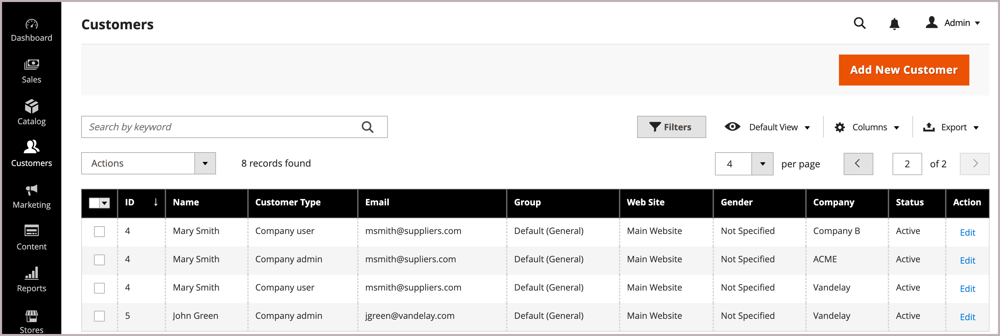

# Ajouter des utilisateurs à un compte d’entreprise

Lorsqu’elle est activée dans la configuration, l’administrateur d’entreprise ajoute et gère les utilisateurs de l’entreprise à partir du storefront. Cependant, les comptes des utilisateurs de l’entreprise peuvent également être ajoutés et gérés à partir de l’administrateur.

Si nécessaire, vous pouvez affecter un utilisateur à plusieurs sociétés. Par exemple, si les acheteurs B2B prennent en charge plusieurs sociétés, vous pouvez ajouter leurs comptes d’utilisateur à toutes les sociétés avec lesquelles ils font affaire. Sur le storefront, les acheteurs affectés à plusieurs sociétés peuvent passer d’un compte de société à l’autre en sélectionnant l’une des sociétés disponibles dans le menu *[!UICONTROL Company]*.

{width="700"}

>[!NOTE]
>
>Si une personne possède déjà un compte personnel dans votre boutique et qu’elle travaille ensuite pour une entreprise, n’affectez pas son compte personnel à l’entreprise. Créez plutôt un compte utilisateur d’entreprise pour la personne qui dispose d’une adresse e-mail d’entreprise.

## Ajout d’un utilisateur d’entreprise

Lorsque vous ajoutez un utilisateur de société, la première société que vous associez au compte utilisateur est la société par défaut.

1. Dans la barre latérale Admin, accédez à **[!UICONTROL Customers > All Customers]**.

1. Cliquez sur **[!UICONTROL Add new customer]**.

1. Configurez le nouveau compte.

   1. Spécifiez le statut initial du compte en définissant le bouton (bascule) **[!UICONTROL Customer Active]**.

      Activez-le pour activer immédiatement le compte ou désactivez-le pour créer un compte inactif.

   1. Sélectionnez l’étendue du site web dans la liste **[!UICONTROL Associate to Website]**.

   1. Cliquez sur **[!UICONTROL Associate to Company]** pour afficher les sociétés disponibles.

      {width="675"}

      Si nécessaire, filtrez la liste en saisissant les premières lettres du nom de la société dans la zone de saisie.

   1. Dans la liste, sélectionnez une ou plusieurs sociétés auxquelles vous souhaitez affecter le client, puis cliquez sur **[!UICONTROL Done]**.

      Les utilisateurs d’entreprise sont automatiquement ajoutés au groupe de clients (ou [catalogue partagé](catalog-shared.md)) pour chaque société associée à leur compte.

   1. Saisissez les informations de compte utilisateur requises : **[!UICONTROL First Name]**, **[!UICONTROL Last Name]** et **[!UICONTROL Email]**.

   1. Autorisez les représentants commerciaux à se connecter au storefront au nom du client en activant **[!UICONTROL Allow remote shopping assistance]**.

   1. Appliquez les modifications en cliquant sur **[!UICONTROL Save Customer]**.

      {width="675"}

La [!UICONTROL Customers grid] affiche une ligne distincte pour chaque société à laquelle l’utilisateur est affecté. Les colonnes suivantes sont mises à jour.

- La colonne _[!UICONTROL Customer Type]_&#x200B;se met à jour pour afficher le rôle attribué à l’utilisateur.

  Si c’est la première fois que le client est affecté à une société, la colonne _[!UICONTROL Customer Type]_&#x200B;est mise à jour de&#x200B;_[!UICONTROL Individual user]_ à _[!UICONTROL Company User]_.

- La colonne _[!UICONTROL Group]_&#x200B;est remplacée par le nom du groupe de clients (ou du catalogue partagé) affecté à la société.

- La colonne _[!UICONTROL Company]_&#x200B;affiche le nom de la société à laquelle le profil client est désormais associé.

## Affectation d’un utilisateur à un ou plusieurs comptes d’entreprise

Lorsque vous affectez un nouvel utilisateur, la première société que vous associez au compte utilisateur est la société par défaut.

1. Dans la barre latérale _Admin_, accédez à **[!UICONTROL Customers]** > **[!UICONTROL All Customers]**.

1. Recherchez le client dans la grille et cliquez sur **[!UICONTROL Edit]** dans la colonne _[!UICONTROL Action]_.

1. Dans le panneau de gauche, choisissez **[!UICONTROL Account Information]**.

1. Dans la liste **[!UICONTROL Associate to Company]**, sélectionnez une ou plusieurs sociétés à affecter à l’utilisateur de la société et cliquez sur **[!UICONTROL Done]**.

1. Appliquez les modifications en cliquant sur **[!UICONTROL Save Customer]**.

## Supprimer l’affectation d’entreprise d’un compte utilisateur

La suppression d’une entreprise d’un profil utilisateur révoque l’accès des utilisateurs à cette entreprise. Les données utilisateur restent accessibles dans l’administration. Si vous supprimez toutes les affectations d’entreprise, la _[!UICONTROL Customer Type]_&#x200B;passe à&#x200B;*[!UICONTROL Individual user]*&#x200B;désactivation des fonctionnalités B2B pour le compte.

1. Dans la grille Client de l’Administration, modifiez le profil client à mettre à jour.

1. Dans la section *[!UICONTROL Account Information] , supprimez une société affectée du champ **[!UICONTROL Associate to Company]** en cliquant sur le **[!UICONTROL X]** dans le libellé du nom de la société.

1. Appliquez les modifications en cliquant sur **[!UICONTROL Save Customer]**.

>[!NOTE]
>
>Si un utilisateur société est affecté en tant qu&#39;administrateur d&#39;entreprise, vous ne pouvez pas affecter l&#39;association d&#39;entreprise de cet utilisateur tant que vous n&#39;avez pas mis à jour le compte Société pour affecter un nouvel administrateur d&#39;entreprise.
