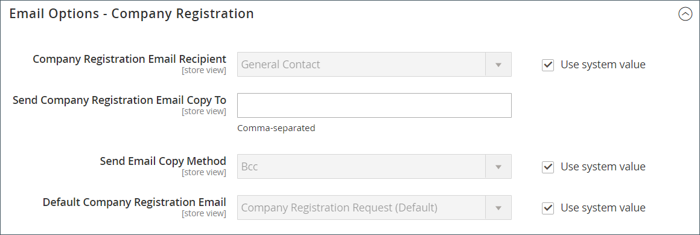

# Configuration des options de courrier électronique de l’entreprise

La variable [représentant commercial](account-company-manage.md) qui est affecté en tant que contact principal pour une entreprise est configuré par défaut en tant qu’expéditeur de nombreux messages électroniques automatisés envoyés à la société.

1. Sur le _Administration_ barre latérale, accédez à **[!UICONTROL Stores]** > _[!UICONTROL Settings]_>**[!UICONTROL Configuration]**.

1. Dans le panneau de gauche, développez **[!UICONTROL Customers]** et choisissez **[!UICONTROL Company Configuration]**.

1. Si nécessaire, définissez **[!UICONTROL Store View]** en mode magasin pour définir la variable [scope](../getting-started/websites-stores-views.md#scope-settings) de la configuration.

1. Procédez comme suit : **[!UICONTROL Company Registration]** section :

   >[!NOTE]
   >
   >Effacez la variable **[!UICONTROL Use system value]** pour rendre le champ modifiable.

   - Définir **[!UICONTROL Company Registration Email Recipient]** à la fonction [contact de magasin](../getting-started/store-details.md#store-email-addresses) qui doit être informé lorsqu’une nouvelle demande d’enregistrement d’entreprise est reçue.

   - Dans le **[!UICONTROL Send Company Registration Email Copy To]** saisissez l’adresse email de chaque personne devant recevoir une copie de la notification d’enregistrement. Séparez plusieurs adresses électroniques par une virgule.

   - Pour déterminer comment la copie de la notification est envoyée, définissez **[!UICONTROL Send Email Copy Method]** à l’une des options suivantes :

      - `Bcc` - Envoie un _copie de courtoisie aveugle_ en incluant le destinataire dans l’en-tête du même email que celui envoyé au client. Le destinataire Cci n&#39;est pas visible par le client.
      - `Separate Email` - Envoie la copie en tant que courrier électronique distinct.

   - Si vous avez préparé un modèle d’email à utiliser à la place de la valeur par défaut, définissez **[!UICONTROL Default Company Registration Email]** au nom du modèle. Par défaut, la variable `Company Registration Request` est utilisé.

     {width="600" zoomable="yes"}

1. Procédez comme suit : **[!UICONTROL Customer-Related Emails]** section :

   Si vous avez préparé d’autres modèles d’email à utiliser à la place des valeurs par défaut, choisissez le modèle que vous souhaitez utiliser pour chacun des éléments suivants :

   - **[!UICONTROL Default 'Sales Rep Assigned' Email]**
   - **[!UICONTROL Default 'Assign Company to Customer' Email]**
   - **[!UICONTROL Default 'Assign Company Admin' Email]**
   - **[!UICONTROL Default 'Company Admin Inactive' Email]**
   - **[!UICONTROL Default 'Company Admin Changed to Member' Email]**
   - **[!UICONTROL Default 'Customer Status Active' Email]**
   - **[!UICONTROL Default 'Customer Status Inactive' Email]**

   {width="600" zoomable="yes"}

1. Procédez comme suit : **[!UICONTROL Company Status Change]** section :

   - Définir **[!UICONTROL Company Status Change for Email Recipient]** à la fonction [contact de magasin](../getting-started/store-details.md#store-email-addresses) qui doit être informé lorsque le statut d’une société change.

   - Dans le **[!UICONTROL Send Company Status Change Email Copy To]** , saisissez l’adresse email de chaque personne devant recevoir une copie de la notification de changement de statut. Séparez plusieurs adresses électroniques par une virgule.

   - Pour déterminer comment la copie de la notification est envoyée, définissez **[!UICONTROL Send Email Copy Method]** à l’une des options suivantes :

      - `Bcc` - Envoie un _copie de courtoisie aveugle_ en incluant le destinataire dans l’en-tête du même email que celui envoyé au client. Le destinataire Cci n&#39;est pas visible par le client.
      - `Separate Email` - Envoie la copie en tant que courrier électronique distinct.

   - Si vous disposez d’un modèle de courrier électronique préparé qui doit être utilisé au lieu de la valeur par défaut lorsque l’état de l’entreprise passe de `Pending Approval` to `Active`, définit **[!UICONTROL Default 'Company Status Change to Active 1' Email]** à ce modèle. Par défaut, la variable `Company Status Active 1` est utilisé.

   - Si vous disposez d’un modèle de courrier électronique préparé qui doit être utilisé au lieu de la valeur par défaut lorsque l’état de l’entreprise passe de `Rejected` ou `Blocked` to `Active`, définit **[!UICONTROL Default 'Company Status Change to Active 2' Email]** à ce modèle. Par défaut, la variable `Company Status Active 2` est utilisé.

   - Si vous disposez d’un modèle de courrier électronique préparé qui doit être utilisé au lieu de la valeur par défaut lorsque l’état de l’entreprise passe à `Rejected`, définit **[!UICONTROL Default 'Company Status Change to Rejected' Email]** à ce modèle. Par défaut, la variable `Company Status Rejected` est utilisé.

   - Si vous disposez d’un modèle de courrier électronique préparé qui doit être utilisé au lieu de la valeur par défaut lorsque l’état de l’entreprise passe à `Blocked`, définit **[!UICONTROL Default 'Company Status Change to Blocked' Email]** à ce modèle. Par défaut, la variable `Company Status Blocked` est utilisé.

   - Si vous disposez d’un modèle de courrier électronique préparé qui doit être utilisé au lieu de la valeur par défaut lorsque l’état de l’entreprise passe à `Pending Approval`, définit **[!UICONTROL Default 'Company Status Change to Pending Approval' Email]** à ce modèle. Par défaut, la variable `Company Status Pending Approval` est utilisé.

     {width="600" zoomable="yes"}

1. Procédez comme suit : **[!UICONTROL Company Credit Emails]** section :

   - Définir **[!UICONTROL Company Credit Change Email Sender]** à la fonction [contact de magasin](../getting-started/store-details.md#store-email-addresses) qui doit être informé lorsqu’une modification est apportée à la limite de crédit affectée à une entreprise. Par défaut, la notification est envoyée à _représentant commercial_.

   - Dans le **[!UICONTROL Send Company Credit Change Email Copy To]** saisissez l’adresse email de chaque personne devant recevoir une copie de la notification de changement de crédit. Séparez plusieurs adresses électroniques par une virgule.

   - Pour déterminer comment la copie de la notification est envoyée, définissez **[!UICONTROL Send Email Copy Method]** à l’une des options suivantes :

      - `Bcc` - Envoie un _copie de courtoisie aveugle_ en incluant le destinataire dans l’en-tête du même email que celui envoyé au client. Le destinataire Cci n&#39;est pas visible par le client.
      - `Separate Email` - Envoie la copie en tant que courrier électronique distinct.

   - Si vous avez préparé des modèles d’email à utiliser à la place des valeurs par défaut, choisissez le modèle de chacune des notifications suivantes envoyées à l’administrateur de l’entreprise.

      - **[!UICONTROL Allocated Email Template]**
      - **[!UICONTROL Updated Email Template]**
      - **[!UICONTROL Reimbursed Email Template]**
      - **[!UICONTROL Refunded Email Template]**
      - **[!UICONTROL Reverted Email Template]**

   {width="600" zoomable="yes"}

1. Lorsque vous avez terminé, cliquez sur **[!UICONTROL Save Config]**.
