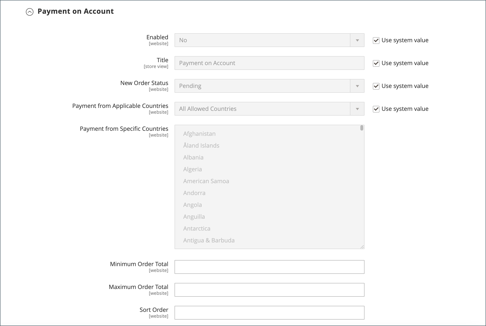

# Activation des fonctionnalités B2B

Par défaut, toutes les fonctionnalités B2B sont initialement désactivées. Un administrateur de magasin peut activer ou désactiver les fonctionnalités B2B si nécessaire pour les magasins Commerce. Pour obtenir la liste complète des paramètres de configuration B2B, voir [Référence de configuration des fonctionnalités B2B](../configuration-reference/general/b2b-features.md).

Lorsque vous activez la prise en charge des entreprises clientes, d’autres fonctionnalités B2B sont activées automatiquement :

- [!DNL Shared Catalog]

  Prend en charge la configuration de prix personnalisée pour différentes entreprises et active également des autorisations de catégorie pour tous les magasins.

- [!DNL Enable Shared Catalog direct products price assigning]

  Améliore les performances du site en ne stockant que les produits affectés à un catalogue partagé dans l’indice de prix. L’activation de cette fonctionnalité est une bonne pratique pour les Marchands qui ont de nombreux catalogues partagés afin de gérer les tarifs personnalisés pour différentes entreprises.

- [!DNL B2B Quotes]

  Permet aux vendeurs et aux acheteurs de la société de négocier les prix.

- [!DNL B2B default payment and shipping methods]

  Détermine la sélection des options de paiement et d’expédition disponibles pour les acheteurs B2B sur le storefront.

Les paramètres de configuration de ces fonctionnalités ne sont visibles que lorsque [!DNL Enable Company] est défini sur `Yes`.

B2B [!DNL Quick Order] et [!DNL Requisition List] Les fonctions peuvent être activées et désactivées indépendamment.

## Configuration des fonctionnalités B2B

1. Sur le _Administration_ barre latérale, accédez à **[!UICONTROL Stores]** > _[!UICONTROL Settings]_>**[!UICONTROL Configuration]**.

   Si vous disposez d’une installation multi-site, définissez la variable **[!UICONTROL Store View]** dans le coin supérieur gauche du site web où s’applique la configuration.

1. Dans le panneau de gauche, sous _[!UICONTROL General]_, choisissez **[!UICONTROL B2B Features]**:

   {width="600"}

   - Autoriser les clients à gérer leurs propres comptes d’entreprise et activer la prise en charge de fonctionnalités B2B supplémentaires en définissant **[!UICONTROL Enable Company]**  to `Yes`.

     Lorsque vous activez la prise en charge de l’entreprise, le catalogue partagé, les devis B2B, les modes de paiement B2B et les modes de livraison B2B sont activés automatiquement.

   - Pour permettre aux clients et aux invités de passer rapidement des commandes en fonction du SKU ou du nom du produit, définissez **[!UICONTROL Enable Quick Order]** to `Yes`.

   - Pour permettre aux clients de créer et de gérer des listes de demandes d’achat à partir du tableau de bord de leur compte, définissez **[!UICONTROL Enable Requisition List]** to `Yes`.

     Vous pouvez également [configurer le nombre maximal de listes](configure-requisition-lists.md) un client peut avoir pour son compte.

1. Lorsque vous avez terminé, cliquez sur **[!UICONTROL Save Config]**.

## Configuration des modes de paiement et de livraison B2B par défaut

1. Développer  la valeur **[!UICONTROL Default B2B Payment Methods]** .

1. Pour définir les méthodes de paiement par défaut pour les commandes B2B, définissez **[!UICONTROL Applicable Payment Methods]** à l’une des options suivantes :

   - `All Payment Methods`

   - `Selected Payment Methods`

     Pour l’option spécifique, sélectionnez l’option **[!UICONTROL Payment Methods]** que vous souhaitez mettre à la disposition de vos clients en maintenant la touche Ctrl (PC) ou la touche Commande (Mac) enfoncée lorsque vous cliquez sur chaque option.

   La liste des [mode de paiement](../configuration-reference/sales/payment-methods.md) affiche les options actuellement activées ou désactivées dans votre magasin. Outre les moyens de paiement standard, la liste comprend également les éléments suivants :

   - Aucune information de paiement n’est requise
   - [Paiement sur compte](#configure-payment-on-account)
   - Comptes stockés
   - Cartes stockées

   {width="600"}

1. Développer  la valeur **[!UICONTROL Default B2B Shipping Methods]** .

1. Pour spécifier les méthodes de livraison par défaut pour les commandes B2B, définissez **[!UICONTROL Applicable Shipping Methods]** à l’une des options suivantes :

   - `All Shipping Methods`
   - `Selected Shipping Methods`

     Pour l’option spécifique, sélectionnez l’option **[!UICONTROL Shipping Methods]** que vous souhaitez mettre à la disposition de vos clients en maintenant la touche Ctrl (PC) ou la touche Commande (Mac) enfoncée lorsque vous cliquez sur chaque option.

     La liste des méthodes d’expédition répertorie actuellement les [activée ou désactivée](../configuration-reference/sales/delivery-methods.md).

   {width="600"}

1. Lorsque vous avez terminé, cliquez sur **[!UICONTROL Save Config]**.

## Configuration des options de courrier électronique de l’entreprise

La variable [représentant commercial](account-company-manage.md#assign-a-sales-representative) qui est affecté en tant que contact principal pour une entreprise est configuré par défaut en tant qu’expéditeur de nombreux messages électroniques automatisés envoyés à la société.

1. Sur le _Administration_ barre latérale, accédez à **[!UICONTROL Stores]** > _[!UICONTROL Settings]_>**[!UICONTROL Configuration]**.

1. Dans le panneau de gauche, développez **[!UICONTROL Customers]** et choisissez **[!UICONTROL Company Configuration]**.

1. Si nécessaire, définissez **[!UICONTROL Store View]** en mode magasin pour définir la variable [scope](../getting-started/websites-stores-views.md#scope-settings) de la configuration.

1. Procédez comme suit : **[!UICONTROL Company Registration]** section :

   >[!NOTE]
   >
   >Effacez la variable **[!UICONTROL Use system value]** pour rendre le champ modifiable.

   - Définir **[!UICONTROL Company Registration Email Recipient]** à la fonction [contact de magasin](../getting-started/store-details.md#store-email-addresses) qui doit être informé lorsqu’une nouvelle demande d’enregistrement d’entreprise est reçue.

   - Pour **[!UICONTROL Send Company Registration Email Copy To]**, saisissez l’adresse électronique de chaque personne devant recevoir une copie de la notification d’enregistrement. Séparez plusieurs adresses électroniques par une virgule.

   - Pour déterminer comment la copie de la notification est envoyée, définissez **Méthode d’envoi de copie de courrier électronique** à l’une des options suivantes :

      - `Bcc` - Envoie un _copie de courtoisie aveugle_ en incluant le destinataire dans l’en-tête du même email que celui envoyé au client. Le destinataire Cci n&#39;est pas visible par le client.
      - `Separate Email` - Envoie la copie en tant que courrier électronique distinct.

   - Si vous avez préparé un modèle d’email à utiliser à la place de la valeur par défaut, définissez **[!UICONTROL Default Company Registration Email]** au nom du modèle. Par défaut, la variable `Company Registration Request` est utilisé.

     {width="600"}

1. Procédez comme suit : **[!UICONTROL Customer-Related Emails]** section :

   Si vous avez préparé d’autres modèles d’email à utiliser à la place des valeurs par défaut, choisissez le modèle que vous souhaitez utiliser pour chacun des éléments suivants :

   - **[!UICONTROL Default 'Sales Rep Assigned' Email]**
   - **[!UICONTROL Default 'Assign Company to Customer' Email]**
   - **[!UICONTROL Default 'Assign Company Admin' Email]**
   - **[!UICONTROL Default 'Company Admin Inactive' Email]**
   - **[!UICONTROL Default 'Company Admin Changed to Member' Email]**
   - **[!UICONTROL Default 'Customer Status Active' Email]**
   - **[!UICONTROL Default 'Customer Status Inactive' Email]**

   {width="600"}

1. Procédez comme suit : **[!UICONTROL Company Status Change]** section :

   - Pour **[!UICONTROL Send Company Status Change Email Copy To]**, saisissez l’adresse électronique de chaque personne devant recevoir une copie de la notification de changement d’état. Séparez plusieurs adresses électroniques par une virgule.

   - Pour déterminer comment la copie de la notification est envoyée, définissez **Méthode d’envoi de copie de courrier électronique** à l’une des options suivantes :

      - `Bcc` - Envoie un _copie de courtoisie aveugle_ en incluant le destinataire dans l’en-tête du même email que celui envoyé au client. Le destinataire Cci n&#39;est pas visible par le client.
      - `Separate Email` - Envoie la copie en tant que courrier électronique distinct.

   - Si vous avez préparé un modèle de courrier électronique à utiliser lorsque l’état de l’entreprise passe de `Pending Approval` to `Active`, définit **[!UICONTROL Default 'Company Status Change to Active 1' Email]** au nom du modèle. Par défaut, la variable `Company Status Active 1` est utilisé.

   - Si vous avez préparé un modèle de courrier électronique à utiliser lorsque l’état de l’entreprise passe de `Rejected` ou `Blocked` to `Active`, définit **[!UICONTROL Default 'Company Status Change to Active 2' Email]** au nom du modèle. Par défaut, la variable `Company Status Active 2` est utilisé.

   - Si vous avez préparé un modèle de courrier électronique à utiliser lorsque l’état de l’entreprise passe à `Rejected`, définit **[!UICONTROL Default 'Company Status Change to Rejected' Email]** au nom du modèle. Par défaut, la variable `Company Status Rejected` est utilisé.

   - Si vous avez préparé un modèle de courrier électronique à utiliser lorsque l’état de l’entreprise passe à `Blocked`, définit **[!UICONTROL Default 'Company Status Change to Blocked' Email]** au nom du modèle. Par défaut, la variable `Company Status Blocked` est utilisé.

   - Si vous avez préparé un modèle de courrier électronique à utiliser lorsque l’état de l’entreprise passe à `Pending Approval`, définit **[!UICONTROL Default 'Company Status Change to Pending Approval' Email]** au nom du modèle. Par défaut, la variable `Company Status Pending Approval` est utilisé.

   {width="600"}

1. Procédez comme suit : **[!UICONTROL Company Credit Emails]** section :

   - Définir **[!UICONTROL Company Credit Change Email Sender]** à la fonction [contact de magasin](../getting-started/store-details.md#store-email-addresses) qui doit être informé lorsqu’une modification est apportée à la limite de crédit affectée à une entreprise. Par défaut, la notification est envoyée à _représentant commercial_.

   - Pour **[!UICONTROL Send Company Credit Change Email Copy To]**, saisissez l’adresse électronique de chaque personne devant recevoir une copie de la notification de changement de crédit. Séparez plusieurs adresses électroniques par une virgule.

   - Pour déterminer comment la copie de la notification est envoyée, définissez **Méthode d’envoi de copie de courrier électronique** à l’une des options suivantes :

      - `Bcc` - Envoie un _copie de courtoisie aveugle_ en incluant le destinataire dans l’en-tête du même email que celui envoyé au client. Le destinataire Cci n&#39;est pas visible par le client.
      - `Separate Email` - Envoie la copie en tant que courrier électronique distinct.

   - Si vous avez préparé des modèles d’email à utiliser à la place des valeurs par défaut, choisissez le modèle de chacune des notifications suivantes envoyées à l’administrateur de l’entreprise.

      - **[!UICONTROL Allocated Email Template]**
      - **[!UICONTROL Updated Email Template]**
      - **[!UICONTROL Reimbursed Email Template]**
      - **[!UICONTROL Refunded Email Template]**
      - **[!UICONTROL Reverted Email Template]**

   {width="600"}

1. Lorsque vous avez terminé, cliquez sur **[!UICONTROL Save Config]**.

## Configurer la validation de la commande

La possibilité de suivre le traitement des commandes et les commandes permet aux administrateurs de la société de contrôler les actions des acheteurs de la société. La fonction d’approbation des commandes est disponible lorsque la fonction des commandes est activée par un administrateur de magasin.

1. Sur le _Administration_ barre latérale, accédez à **[!UICONTROL Stores]** > _[!UICONTROL Settings]_>**[!UICONTROL Configuration]**.

1. Dans le panneau de gauche, développez **[!UICONTROL General]** et choisissez **[!UICONTROL B2B Features]**.

1. Développer  la valeur **[!UICONTROL Order Approval Configuration]** .

   {width="600"}

1. Pour permettre aux entreprises de créer leurs propres commandes, définissez **[!UICONTROL Enable Purchase Orders]** to `Yes`.

1. Lorsque vous avez terminé, cliquez sur **[!UICONTROL Save Config]**.

   La fonction Commandes d’achat est activée au niveau du site web. Pour activer ce type de commande pour une société, procédez de la même manière avec les paramètres appropriés dans chaque [profil de la société](account-company-manage.md).

## Configuration des commandes d’achat

1. Sur le _Administration_ barre latérale, accédez à **[!UICONTROL Customers]** > **[!UICONTROL Companies]**.

1. Recherchez l’entreprise dans la liste, puis cliquez sur **[!UICONTROL Edit]**.

1. Développer  la valeur **[!UICONTROL Advanced Settings]** .

1. Définir **[!UICONTROL Enable Purchase Orders]** to `Yes`.

1. Une fois terminé, cliquez sur **[!UICONTROL Save]**.

Après l’activation, la variable **[!UICONTROL Approval Rules]** s’affiche sur le storefront. [Tableau de bord du compte](../customers/account-dashboard.md) pour un administrateur de société.

>[!NOTE]
>
>L’accès au bon de commande sur le storefront doit être accordé par l’administrateur de l’entreprise en fonction des [autorisations de rôles utilisateur de société](account-company-roles-permissions.md).

## Configuration du paiement sur le compte

Le paiement sur compte est un mode de paiement hors ligne qui permet aux entreprises d’effectuer des achats jusqu’à la limite de crédit spécifiée dans leur profil. Le paiement sur compte peut être activé globalement, ou par entreprise, et s’affiche uniquement lors de l’extraction si cette option est activée. When _Paiement sur compte_ est utilisé comme mode de paiement. Un message s’affiche en haut de la commande pour indiquer le statut du compte. Pour configurer ce mode de paiement pour une société spécifique, voir [Gestion des comptes d’entreprise](account-company-manage.md).

>[!NOTE]
>
>Le paiement sur le compte n’est pas pris en charge pour les commandes avec [plusieurs adresses d’expédition](../stores-purchase/shipping-settings.md#multiple-addresses) et n’apparaît pas parmi les options de paiement pour ces commandes.

Pour activer le paiement sur le compte de votre boutique :

1. Sur le _Administration_ barre latérale, accédez à **[!UICONTROL Stores]** > _[!UICONTROL Settings]_>**[!UICONTROL Configuration]**.

1. Dans le panneau de gauche, développez **[!UICONTROL Sales]** et choisissez **[!UICONTROL Payment Methods]**.

1. Développer  la valeur **[!UICONTROL Payment on Account]** .

   {width="600"}

   >[!NOTE]
   >
   >Si nécessaire, désélectionnez tout d’abord l’option **[!UICONTROL Use system value]** pour modifier ces paramètres.

1. Pour autoriser le paiement sur le compte, définissez **[!UICONTROL Enabled]** to `Yes`.

1. Saisissez un **[!UICONTROL Title]** qui identifie le mode de paiement lors de l’extraction ou vous pouvez accepter la variable `Payment on Account` titre par défaut.

1. Si les commandes attendent généralement leur approbation, acceptez la valeur par défaut **[!UICONTROL New Order Status]** as `Pending` jusqu’à ce qu’elle soit approuvée.

   Si vous préférez, vous pouvez utiliser la variable `Processing` ou `Suspected Fraud` statut des nouvelles commandes avec ce mode de paiement.

1. Définir **[!UICONTROL Payment from Applicable Countries]** à l’une des options suivantes :

   - `All Allowed Countries` - Clients de tous les [pays](../getting-started/store-details.md#country-options) spécifié dans votre configuration de magasin peut utiliser ce mode de paiement.
   - `Specific Countries` - Après avoir choisi cette option, la variable _[!UICONTROL Payment from Specific Countries]_s’affiche. Pour sélectionner plusieurs pays, maintenez la touche Ctrl (PC) ou la touche Commande (Mac) enfoncée, puis cliquez sur chaque option.

1. Définir **[!UICONTROL Minimum Order Total]** et **[!UICONTROL Maximum Order Total]** aux montants de commande requis pour bénéficier de ce mode de paiement.

   >[!NOTE]
   >
   >Une commande est admissible si le total est compris entre, ou correspond exactement, les valeurs totales minimales ou maximales.

1. Saisissez un **[!UICONTROL Sort Order]** nombre qui définit la position de cet élément dans la liste des méthodes de paiement affichées lors du passage en caisse.

   La valeur est relative aux autres modes de paiement. (`0` = first, `1` = second, `2` = troisième, etc.)

1. Lorsque vous avez terminé, cliquez sur **[!UICONTROL Save Config]**.
