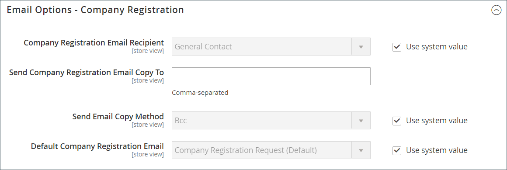
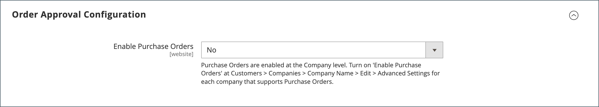

# Activer les fonctionnalités B2B

Par défaut, toutes les fonctionnalités B2B sont initialement désactivées. Un administrateur de magasin peut activer ou désactiver les fonctionnalités B2B selon les besoins des magasins Commerce. Pour obtenir une liste complète des paramètres de configuration B2B, consultez la référence de configuration des fonctionnalités [B2B](../configuration-reference/general/b2b-features.md).

Lorsque vous activez la prise en charge des sociétés clientes, des fonctionnalités B2B supplémentaires sont automatiquement activées :

- [[!DNL Shared Catalog]](catalog-shared.md)

  Prend en charge une configuration de tarification personnalisée pour différentes sociétés et active également des autorisations de catégorie pour tous les magasins.

- [!DNL Enable Shared Catalog direct products price assigning]

  Améliore les performances du site en stockant uniquement les produits affectés à un catalogue partagé dans l’indice des prix. L’activation de cette fonctionnalité est une bonne pratique pour les commerçants qui ont de nombreux catalogues partagés afin de gérer les prix personnalisés pour différentes sociétés.

- [[!DNL B2B Quotes]](quotes.md)

  Permet aux vendeurs et aux acheteurs de l&#39;entreprise de négocier les prix.

- [!DNL B2B default payment and shipping methods]

  Détermine la sélection des options de paiement et d’expédition disponibles pour les acheteurs B2B sur le storefront.

Les paramètres de configuration de ces fonctionnalités ne sont visibles que lorsque [!DNL Enable Company] est défini sur `Yes`.

Les fonctionnalités [[!DNL Quick Order]](quick-order.md) et [[!DNL Requisition List]](requisition-lists.md) B2B peuvent être activées et désactivées indépendamment.

## Configuration des fonctionnalités B2B

Les options de configuration des fonctionnalités Adobe Commerce B2B ne sont disponibles que sur les projets Commerce où l’extension [Adobe Commerce B2B est installée](install.md).

1. Dans la barre latérale _Admin_, accédez à **[!UICONTROL Stores]** > _[!UICONTROL Settings]_>**[!UICONTROL Configuration]**.

   Si vous disposez d’une installation multisite, définissez la commande **[!UICONTROL Store View]** dans le coin supérieur gauche sur le site web auquel s’applique la configuration.

1. Dans le panneau de gauche sous _[!UICONTROL General]_, choisissez **[!UICONTROL B2B Features]**:

   {width="600"}

   - Permettre aux clients de gérer leurs propres comptes d’entreprise et activer la prise en charge de fonctionnalités B2B supplémentaires en définissant **[!UICONTROL Enable Company]** sur `Yes`.

     Lorsque vous activez la prise en charge de l’entreprise, le catalogue partagé, le devis B2B, les modes de paiement B2B et les modes d’expédition B2B sont automatiquement activés.

     {width="600"}

   - Pour permettre aux clients et aux invités de passer rapidement des commandes en fonction du SKU ou du nom du produit, définissez **[!UICONTROL Enable Quick Order]** sur `Yes`.

   - Pour permettre aux clients de créer et de gérer des listes de demandes d&#39;approvisionnement à partir du tableau de bord de leur compte, définissez **[!UICONTROL Enable Requisition List]** sur `Yes`.

     Vous pouvez également [configurer le nombre maximal de listes](configure-requisition-lists.md) qu’un client peut avoir pour son compte.

1. Cliquez ensuite sur **[!UICONTROL Save Config]**.

## Configurer les modes de paiement et d’expédition B2B par défaut

1. Développez  la section **[!UICONTROL Default B2B Payment Methods]** .

1. Pour établir les modes de paiement par défaut pour les commandes B2B, définissez **[!UICONTROL Applicable Payment Methods]** sur l&#39;un des modes suivants :

   - `All Payment Methods`

   - `Selected Payment Methods`

     Pour l’option spécifique, sélectionnez les **[!UICONTROL Payment Methods]** que vous souhaitez mettre à la disposition de vos clients en maintenant la touche Ctrl (PC) ou la touche Commande (Mac) enfoncée lorsque vous cliquez sur chaque option.

   La liste des [modes de paiement](../configuration-reference/sales/payment-methods.md) indique quelles options sont actuellement activées ou désactivées dans votre boutique. Outre les modes de paiement standard, la liste comprend également les éléments suivants :

   - Aucune information de paiement n&#39;est requise
   - [Paiement sur le compte](#configure-payment-on-account)
   - Comptes stockés
   - Cartes stockées

   {width="600"}

1. Développez  la section **[!UICONTROL Default B2B Shipping Methods]** .

1. Pour spécifier les méthodes d&#39;expédition par défaut pour les commandes B2B, définissez **[!UICONTROL Applicable Shipping Methods]** sur l&#39;une des méthodes suivantes :

   - `All Shipping Methods`
   - `Selected Shipping Methods`

     Pour l’option spécifique, sélectionnez les **[!UICONTROL Shipping Methods]** que vous souhaitez mettre à la disposition de vos clients en maintenant la touche Ctrl (PC) ou la touche Commande (Mac) enfoncée lorsque vous cliquez sur chaque option.

     La liste des méthodes d’expédition indique celles qui sont actuellement [activées ou désactivées](../configuration-reference/sales/delivery-methods.md).

   {width="600"}

1. Cliquez ensuite sur **[!UICONTROL Save Config]**.

## Configurer les options d’e-mail de la société

Le [commercial](account-company-manage.md#assign-a-sales-representative) qui est affecté en tant que contact principal pour une entreprise est configuré par défaut comme expéditeur de nombreux e-mails automatisés envoyés à l’entreprise.

1. Dans la barre latérale _Admin_, accédez à **[!UICONTROL Stores]** > _[!UICONTROL Settings]_>**[!UICONTROL Configuration]**.

1. Dans le panneau de gauche, développez **[!UICONTROL Customers]** et choisissez **[!UICONTROL Company Configuration]**.

1. Si nécessaire, définissez **[!UICONTROL Store View]** à la vue du magasin pour définir la [&#x200B; portée &#x200B;](../getting-started/websites-stores-views.md#scope-settings) de la configuration.

1. Renseignez la section **[!UICONTROL Company Registration]** :

   >[!NOTE]
   >
   >Décochez la case **[!UICONTROL Use system value]** pour rendre le champ modifiable.

   - Définissez la **[!UICONTROL Company Registration Email Recipient]** sur le [contact du magasin](../getting-started/store-details.md#store-email-addresses) qui doit être averti lorsqu’une nouvelle demande d’enregistrement d’entreprise est reçue.

   - Par **[!UICONTROL Send Company Registration Email Copy To]**, saisissez l’adresse e-mail de chaque personne qui doit recevoir une copie de la notification d’enregistrement. Séparez plusieurs adresses e-mail par une virgule.

   - Pour déterminer comment la copie de la notification est envoyée, définissez **Méthode Envoyer une copie d’e-mail** sur l’une des options suivantes :

      - `Bcc` - Envoie une _copie de courtoisie invisible_ en incluant le destinataire dans l’en-tête du même e-mail envoyé au client. Le destinataire en Cci n’est pas visible pour le client.
      - `Separate Email` - Envoie la copie sous forme d’e-mail distinct.

   - Si vous avez préparé un modèle d’e-mail à utiliser à la place du modèle par défaut, définissez **[!UICONTROL Default Company Registration Email]** sur le nom du modèle. Par défaut, le modèle de `Company Registration Request` est utilisé.

     {width="600"}

1. Renseignez la section **[!UICONTROL Customer-Related Emails]** :

   Si vous avez préparé d’autres modèles d’e-mail à utiliser au lieu des valeurs par défaut, choisissez le modèle à utiliser pour chacun des éléments suivants :

   - **[!UICONTROL Default 'Sales Rep Assigned' Email]**
   - **[!UICONTROL Default 'Assign Company to Customer' Email]**
   - **[!UICONTROL Default 'Assign Company Admin' Email]**
   - **[!UICONTROL Default 'Company Admin Inactive' Email]**
   - **[!UICONTROL Default 'Company Admin Changed to Member' Email]**
   - **[!UICONTROL Default 'Customer Status Active' Email]**
   - **[!UICONTROL Default 'Customer Status Inactive' Email]**

   {width="600"}

1. Renseignez la section **[!UICONTROL Company Status Change]** :

   - Par **[!UICONTROL Send Company Status Change Email Copy To]**, saisissez l’adresse e-mail de chaque personne qui doit recevoir une copie de la notification de changement de statut. Séparez plusieurs adresses e-mail par une virgule.

   - Pour déterminer comment la copie de la notification est envoyée, définissez **Méthode Envoyer une copie d’e-mail** sur l’une des options suivantes :

      - `Bcc` - Envoie une _copie de courtoisie invisible_ en incluant le destinataire dans l’en-tête du même e-mail envoyé au client. Le destinataire en Cci n’est pas visible pour le client.
      - `Separate Email` - Envoie la copie sous forme d’e-mail distinct.

   - Si vous avez préparé un modèle d’e-mail à utiliser lorsque le statut de la société passe de `Pending Approval` à `Active`, définissez **[!UICONTROL Default 'Company Status Change to Active 1' Email]** sur le nom du modèle. Par défaut, le modèle de `Company Status Active 1` est utilisé.

   - Si vous avez préparé un modèle d’e-mail à utiliser lorsque le statut de la société passe de `Rejected` ou `Blocked` à `Active`, définissez **[!UICONTROL Default 'Company Status Change to Active 2' Email]** sur le nom du modèle. Par défaut, le modèle de `Company Status Active 2` est utilisé.

   - Si vous avez préparé un modèle d’e-mail à utiliser lorsque le statut de la société passe à `Rejected`, définissez **[!UICONTROL Default 'Company Status Change to Rejected' Email]** sur le nom du modèle. Par défaut, le modèle de `Company Status Rejected` est utilisé.

   - Si vous avez préparé un modèle d’e-mail à utiliser lorsque le statut de la société passe à `Blocked`, définissez **[!UICONTROL Default 'Company Status Change to Blocked' Email]** sur le nom du modèle. Par défaut, le modèle de `Company Status Blocked` est utilisé.

   - Si vous avez préparé un modèle d’e-mail à utiliser lorsque le statut de la société passe à `Pending Approval`, définissez **[!UICONTROL Default 'Company Status Change to Pending Approval' Email]** sur le nom du modèle. Par défaut, le modèle de `Company Status Pending Approval` est utilisé.

   {width="600"}

1. Renseignez la section **[!UICONTROL Company Credit Emails]** :

   - Définissez **[!UICONTROL Company Credit Change Email Sender]** sur le [contact du magasin](../getting-started/store-details.md#store-email-addresses) qui doit être averti lorsqu’une modification est apportée à la limite de crédit affectée à une société. Par défaut, la notification est envoyée au _représentant commercial_.

   - Par **[!UICONTROL Send Company Credit Change Email Copy To]**, saisissez l&#39;adresse e-mail de chaque personne qui doit recevoir une copie de la notification de modification de crédit. Séparez plusieurs adresses e-mail par une virgule.

   - Pour déterminer comment la copie de la notification est envoyée, définissez **Méthode Envoyer une copie d’e-mail** sur l’une des options suivantes :

      - `Bcc` - Envoie une _copie de courtoisie invisible_ en incluant le destinataire dans l’en-tête du même e-mail envoyé au client. Le destinataire en Cci n’est pas visible pour le client.
      - `Separate Email` - Envoie la copie sous forme d’e-mail distinct.

   - Si vous avez préparé des modèles d’e-mail à utiliser à la place des valeurs par défaut, choisissez le modèle pour chacune des notifications suivantes envoyées à l’administrateur de la société.

      - **[!UICONTROL Allocated Email Template]**
      - **[!UICONTROL Updated Email Template]**
      - **[!UICONTROL Reimbursed Email Template]**
      - **[!UICONTROL Refunded Email Template]**
      - **[!UICONTROL Reverted Email Template]**

   {width="600"}

1. Cliquez ensuite sur **[!UICONTROL Save Config]**.

## Configurer la validation de la commande

La possibilité de suivre le traitement des commandes et des commandes permet aux administrateurs de l&#39;entreprise de contrôler les actions des acheteurs de l&#39;entreprise. La fonctionnalité d&#39;approbation de commande est disponible lorsque la fonction des commandes fournisseur est activée par un administrateur de magasin.

1. Dans la barre latérale _Admin_, accédez à **[!UICONTROL Stores]** > _[!UICONTROL Settings]_>**[!UICONTROL Configuration]**.

1. Dans le panneau de gauche, développez **[!UICONTROL General]** et choisissez **[!UICONTROL B2B Features]**.

1. Développez  la section **[!UICONTROL Order Approval Configuration]** .

   {width="600"}

1. Pour permettre aux sociétés de créer leurs propres bons de commande, définissez **[!UICONTROL Enable Purchase Orders]** sur `Yes`.

1. Cliquez ensuite sur **[!UICONTROL Save Config]**.

   La fonctionnalité de bons de commande est activée au niveau du site web. Pour activer ce type de commande pour une société, procédez de la même manière avec les paramètres appropriés dans chaque [profil de société](account-company-manage.md).

## Configurer les commandes fournisseur

1. Dans la barre latérale _Admin_, accédez à **[!UICONTROL Customers]** > **[!UICONTROL Companies]**.

1. Recherchez la société dans la liste et cliquez sur **[!UICONTROL Edit]**.

1. Développez  la section **[!UICONTROL Advanced Settings]** .

1. Définissez **[!UICONTROL Enable Purchase Orders]** sur `Yes`.

1. Une fois l’opération terminée, cliquez sur **[!UICONTROL Save]**.

Après activation, la section **[!UICONTROL Approval Rules]** s’affiche sur le storefront [tableau de bord du compte](../customers/account-dashboard.md) pour un administrateur d’entreprise.

>[!NOTE]
>
>L’accès au bon de commande sur le storefront doit être accordé par l’administrateur de l’entreprise en fonction des [autorisations des rôles utilisateur de l’entreprise](account-company-roles-permissions.md).

## Configurer le paiement en compte

Paiement en compte est une méthode de paiement hors ligne qui permet aux sociétés d’effectuer des achats jusqu’à la limite de crédit spécifiée dans leur profil. Le paiement en compte peut être activé globalement ou par société. Il n’apparaît lors du passage en caisse que s’il est activé. Lorsque le mode de paiement _Paiement en compte_ est utilisé, un message s’affiche en haut de la commande pour indiquer le statut du compte. Pour configurer ce mode de paiement pour une société spécifique, voir [Gérer les comptes de société](account-company-manage.md).

>[!NOTE]
>
>Le paiement en compte n’est pas pris en charge pour les commandes avec [plusieurs adresses d’expédition](../stores-purchase/shipping-settings.md#multiple-addresses) et n’apparaît pas parmi les options de paiement pour ces commandes.

Pour activer le paiement en compte pour votre boutique :

1. Dans la barre latérale _Admin_, accédez à **[!UICONTROL Stores]** > _[!UICONTROL Settings]_>**[!UICONTROL Configuration]**.

1. Dans le panneau de gauche, développez **[!UICONTROL Sales]** et choisissez **[!UICONTROL Payment Methods]**.

1. Développez  la section **[!UICONTROL Payment on Account]** .

   {width="600"}

   >[!NOTE]
   >
   >Si nécessaire, décochez d’abord la case **[!UICONTROL Use system value]** pour modifier ces paramètres.

1. Pour autoriser un paiement en acompte, définissez **[!UICONTROL Enabled]** sur `Yes`.

1. Saisissez un **[!UICONTROL Title]** qui identifie le mode de paiement lors du passage en caisse, ou vous pouvez accepter le titre par défaut `Payment on Account`.

1. Si les commandes sont généralement en attente d&#39;approbation, acceptez le **[!UICONTROL New Order Status]** par défaut comme `Pending` jusqu&#39;à ce qu&#39;il soit approuvé.

   Si vous préférez, vous pouvez utiliser le statut `Processing` ou `Suspected Fraud` pour les nouvelles commandes avec ce mode de paiement.

1. Définissez **[!UICONTROL Payment from Applicable Countries]** sur l’une des options suivantes :

   - `All Allowed Countries` - Les clients de tous les [pays](../getting-started/store-details.md#country-options) spécifiés dans la configuration de votre boutique peuvent utiliser ce mode de paiement.
   - `Specific Countries` - Une fois cette option sélectionnée, la liste des _[!UICONTROL Payment from Specific Countries]_&#x200B;s’affiche. Pour sélectionner plusieurs pays, maintenez la touche Ctrl (PC) ou Commande (Mac) enfoncée et cliquez sur chaque option.

1. Définissez **[!UICONTROL Minimum Order Total]** et **[!UICONTROL Maximum Order Total]** sur les montants de commande requis pour bénéficier de ce mode de paiement.

   >[!NOTE]
   >
   >Une commande est qualifiée si le total est compris entre les valeurs totales minimales ou maximales ou s’il correspond exactement à ces valeurs.

1. Saisissez un numéro de **[!UICONTROL Sort Order]** qui définit la position de cet article dans la liste des modes de paiement affichée lors du passage en caisse.

   La valeur est relative aux autres modes de paiement. (`0` = premier, `1` = deuxième, `2` = troisième, etc.)

1. Cliquez ensuite sur **[!UICONTROL Save Config]**.
