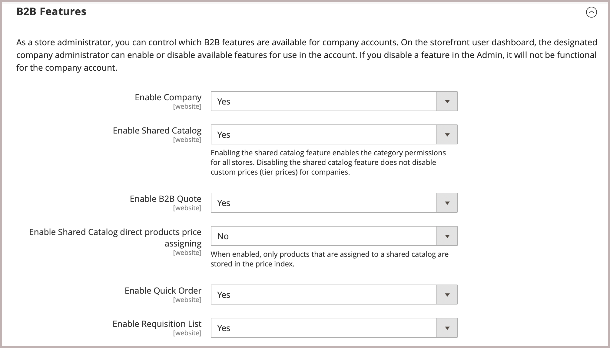
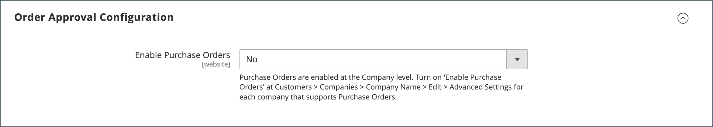

# Activation des fonctionnalités B2B

Par défaut, toutes les fonctionnalités B2B sont initialement désactivées. Un administrateur de magasin peut activer ou désactiver les fonctionnalités B2B si nécessaire pour les magasins Commerce. Pour obtenir la liste complète des paramètres de configuration B2B, voir [Référence de configuration des fonctionnalités B2B](../configuration-reference/general/b2b-features.md).

Lorsque vous activez la prise en charge des entreprises clientes, d’autres fonctionnalités B2B sont activées automatiquement :

- [[!DNL Shared Catalog]](catalog-shared.md)

  Prend en charge la configuration de prix personnalisée pour différentes entreprises et active également des autorisations de catégorie pour tous les magasins.

- [!DNL Enable Shared Catalog direct products price assigning]

  Améliore les performances du site en ne stockant que les produits affectés à un catalogue partagé dans l’indice de prix. L’activation de cette fonctionnalité est une bonne pratique pour les Marchands qui ont de nombreux catalogues partagés afin de gérer les tarifs personnalisés pour différentes entreprises.

- [[!DNL B2B Quotes]](quotes.md)

  Permet aux vendeurs et aux acheteurs de la société de négocier les prix.

- [!DNL B2B default payment and shipping methods]

  Détermine la sélection des options de paiement et d’expédition disponibles pour les acheteurs B2B sur le storefront.

Les paramètres de configuration de ces fonctionnalités ne sont visibles que lorsque [!DNL Enable Company] est défini sur `Yes`.

Les fonctionnalités B2B [[!DNL Quick Order]](quick-order.md) et [[!DNL Requisition List]](requisition-lists.md) peuvent être activées et désactivées indépendamment.

## Configuration des fonctionnalités B2B

Les options de configuration des fonctionnalités Adobe Commerce B2B sont disponibles uniquement pour les projets Commerce dont l’extension [Adobe Commerce B2B est installée](install.md).

1. Sur la barre latérale _Admin_, accédez à **[!UICONTROL Stores]** > _[!UICONTROL Settings]_>**[!UICONTROL Configuration]**.

   Si vous disposez d’une installation multi-site, définissez la commande **[!UICONTROL Store View]** dans le coin supérieur gauche sur le site web où s’applique la configuration.

1. Dans le panneau de gauche sous _[!UICONTROL General]_, choisissez **[!UICONTROL B2B Features]**:

   {width="600"}

   - Permet aux clients de gérer leurs propres comptes d’entreprise et d’activer la prise en charge de fonctionnalités B2B supplémentaires en définissant **[!UICONTROL Enable Company]** sur `Yes`.

     Lorsque vous activez la prise en charge de l’entreprise, le catalogue partagé, les devis B2B, les modes de paiement B2B et les modes de livraison B2B sont activés automatiquement.

     {width="600"}

   - Pour permettre aux clients et aux invités de passer rapidement des commandes en fonction du SKU ou du nom du produit, définissez **[!UICONTROL Enable Quick Order]** sur `Yes`.

   - Pour permettre aux clients de créer et de gérer des listes de demandes à partir du tableau de bord de leur compte, définissez **[!UICONTROL Enable Requisition List]** sur `Yes`.

     Vous pouvez également [configurer le nombre maximal de listes](configure-requisition-lists.md) qu&#39;un client peut avoir pour son compte.

1. Une fois l’opération terminée, cliquez sur **[!UICONTROL Save Config]**.

## Configuration des modes de paiement et de livraison B2B par défaut

1. Développez la section  sur **[!UICONTROL Default B2B Payment Methods]** .

1. Pour établir les méthodes de paiement par défaut pour les commandes B2B, définissez **[!UICONTROL Applicable Payment Methods]** sur l’une des options suivantes :

   - `All Payment Methods`

   - `Selected Payment Methods`

     Pour l’option spécifique, sélectionnez le **[!UICONTROL Payment Methods]** que vous souhaitez mettre à la disposition de vos clients en maintenant la touche Ctrl (PC) ou la touche Commande (Mac) enfoncée lorsque vous cliquez sur chaque option.

   La liste des [méthodes de paiement](../configuration-reference/sales/payment-methods.md) indique les options actuellement activées ou désactivées dans votre boutique. Outre les moyens de paiement standard, la liste comprend également les éléments suivants :

   - Aucune information de paiement n’est requise
   - [Paiement sur compte](#configure-payment-on-account)
   - Comptes stockés
   - Cartes stockées

   {width="600"}

1. Développez la section  sur **[!UICONTROL Default B2B Shipping Methods]** .

1. Pour spécifier les méthodes de livraison par défaut pour les commandes B2B, définissez **[!UICONTROL Applicable Shipping Methods]** sur l’une des options suivantes :

   - `All Shipping Methods`
   - `Selected Shipping Methods`

     Pour l’option spécifique, sélectionnez le **[!UICONTROL Shipping Methods]** que vous souhaitez mettre à la disposition de vos clients en maintenant la touche Ctrl (PC) ou la touche Commande (Mac) enfoncée lorsque vous cliquez sur chaque option.

     La liste des méthodes d’expédition indique celles qui sont actuellement [activées ou désactivées](../configuration-reference/sales/delivery-methods.md).

   {width="600"}

1. Une fois l’opération terminée, cliquez sur **[!UICONTROL Save Config]**.

## Configuration des options de courrier électronique de l’entreprise

Le [représentant commercial](account-company-manage.md#assign-a-sales-representative) qui est affecté comme contact principal pour une entreprise est configuré par défaut comme l’expéditeur de nombreux messages électroniques automatisés envoyés à la société.

1. Sur la barre latérale _Admin_, accédez à **[!UICONTROL Stores]** > _[!UICONTROL Settings]_>**[!UICONTROL Configuration]**.

1. Dans le panneau de gauche, développez **[!UICONTROL Customers]** et choisissez **[!UICONTROL Company Configuration]**.

1. Si nécessaire, définissez **[!UICONTROL Store View]** sur la vue de magasin pour définir la [portée](../getting-started/websites-stores-views.md#scope-settings) de la configuration.

1. Renseignez la section **[!UICONTROL Company Registration]** :

   >[!NOTE]
   >
   >Décochez la case **[!UICONTROL Use system value]** pour rendre le champ modifiable.

   - Définissez **[!UICONTROL Company Registration Email Recipient]** sur le [contact du magasin](../getting-started/store-details.md#store-email-addresses) qui doit être averti lorsqu’une nouvelle demande d’enregistrement de la société est reçue.

   - Pour **[!UICONTROL Send Company Registration Email Copy To]**, saisissez l’adresse électronique de chaque personne devant recevoir une copie de la notification d’enregistrement. Séparez plusieurs adresses électroniques par une virgule.

   - Pour déterminer comment la copie de la notification est envoyée, définissez **Méthode d’envoi de copie d’email** sur l’une des options suivantes :

      - `Bcc` - Envoie une _copie de politesse aveugle_ en incluant le destinataire dans l’en-tête du même email qui est envoyé au client. Le destinataire Cci n&#39;est pas visible par le client.
      - `Separate Email` - Envoie la copie en tant qu’email distinct.

   - Si vous avez préparé un modèle d’email qui doit être utilisé à la place de la valeur par défaut, définissez **[!UICONTROL Default Company Registration Email]** sur le nom du modèle. Par défaut, le modèle `Company Registration Request` est utilisé.

     {width="600"}

1. Renseignez la section **[!UICONTROL Customer-Related Emails]** :

   Si vous avez préparé d’autres modèles d’email à utiliser à la place des valeurs par défaut, choisissez le modèle que vous souhaitez utiliser pour chacun des éléments suivants :

   - **[!UICONTROL Default 'Sales Rep Assigned' Email]**
   - **[!UICONTROL Default 'Assign Company to Customer' Email]**
   - **[!UICONTROL Default 'Assign Company Admin' Email]**
   - **[!UICONTROL Default 'Company Admin Inactive' Email]**
   - **[!UICONTROL Default 'Company Admin Changed to Member' Email]**
   - **[!UICONTROL Default 'Customer Status Active' Email]**
   - **[!UICONTROL Default 'Customer Status Inactive' Email]**

   {width="600"}

1. Renseignez la section **[!UICONTROL Company Status Change]** :

   - Pour **[!UICONTROL Send Company Status Change Email Copy To]**, saisissez l’adresse électronique de chaque personne devant recevoir une copie de la notification de changement d’état. Séparez plusieurs adresses électroniques par une virgule.

   - Pour déterminer comment la copie de la notification est envoyée, définissez **Méthode d’envoi de copie d’email** sur l’une des options suivantes :

      - `Bcc` - Envoie une _copie de politesse aveugle_ en incluant le destinataire dans l’en-tête du même email qui est envoyé au client. Le destinataire Cci n&#39;est pas visible par le client.
      - `Separate Email` - Envoie la copie en tant qu’email distinct.

   - Si vous avez préparé un modèle de courrier électronique à utiliser lorsque l’état de l’entreprise passe de `Pending Approval` à `Active`, définissez **[!UICONTROL Default 'Company Status Change to Active 1' Email]** sur le nom du modèle. Par défaut, le modèle `Company Status Active 1` est utilisé.

   - Si vous avez préparé un modèle de courrier électronique à utiliser lorsque l’état de l’entreprise passe de `Rejected` ou `Blocked` à `Active`, définissez **[!UICONTROL Default 'Company Status Change to Active 2' Email]** sur le nom du modèle. Par défaut, le modèle `Company Status Active 2` est utilisé.

   - Si vous avez préparé un modèle de courrier électronique à utiliser lorsque l’état de l’entreprise passe à `Rejected`, définissez **[!UICONTROL Default 'Company Status Change to Rejected' Email]** sur le nom du modèle. Par défaut, le modèle `Company Status Rejected` est utilisé.

   - Si vous avez préparé un modèle de courrier électronique à utiliser lorsque l’état de l’entreprise passe à `Blocked`, définissez **[!UICONTROL Default 'Company Status Change to Blocked' Email]** sur le nom du modèle. Par défaut, le modèle `Company Status Blocked` est utilisé.

   - Si vous avez préparé un modèle de courrier électronique à utiliser lorsque l’état de l’entreprise passe à `Pending Approval`, définissez **[!UICONTROL Default 'Company Status Change to Pending Approval' Email]** sur le nom du modèle. Par défaut, le modèle `Company Status Pending Approval` est utilisé.

   {width="600"}

1. Renseignez la section **[!UICONTROL Company Credit Emails]** :

   - Définissez **[!UICONTROL Company Credit Change Email Sender]** sur le [contact de magasin](../getting-started/store-details.md#store-email-addresses) qui doit être averti lorsqu’une modification est apportée à la limite de crédit affectée à une entreprise. Par défaut, la notification est envoyée à _Représentant commercial_.

   - Pour **[!UICONTROL Send Company Credit Change Email Copy To]**, saisissez l’adresse électronique de chaque personne devant recevoir une copie de la notification de changement de crédit. Séparez plusieurs adresses électroniques par une virgule.

   - Pour déterminer comment la copie de la notification est envoyée, définissez **Méthode d’envoi de copie d’email** sur l’une des options suivantes :

      - `Bcc` - Envoie une _copie de politesse aveugle_ en incluant le destinataire dans l’en-tête du même email qui est envoyé au client. Le destinataire Cci n&#39;est pas visible par le client.
      - `Separate Email` - Envoie la copie en tant qu’email distinct.

   - Si vous avez préparé des modèles d’email à utiliser à la place des valeurs par défaut, choisissez le modèle de chacune des notifications suivantes envoyées à l’administrateur de l’entreprise.

      - **[!UICONTROL Allocated Email Template]**
      - **[!UICONTROL Updated Email Template]**
      - **[!UICONTROL Reimbursed Email Template]**
      - **[!UICONTROL Refunded Email Template]**
      - **[!UICONTROL Reverted Email Template]**

   {width="600"}

1. Une fois l’opération terminée, cliquez sur **[!UICONTROL Save Config]**.

## Configurer la validation de la commande

La possibilité de suivre le traitement des commandes et les commandes permet aux administrateurs de la société de contrôler les actions des acheteurs de la société. La fonction d’approbation des commandes est disponible lorsque la fonction des commandes est activée par un administrateur de magasin.

1. Sur la barre latérale _Admin_, accédez à **[!UICONTROL Stores]** > _[!UICONTROL Settings]_>**[!UICONTROL Configuration]**.

1. Dans le panneau de gauche, développez **[!UICONTROL General]** et choisissez **[!UICONTROL B2B Features]**.

1. Développez la section  sur **[!UICONTROL Order Approval Configuration]** .

   {width="600"}

1. Pour permettre aux entreprises de créer leurs propres commandes, définissez **[!UICONTROL Enable Purchase Orders]** sur `Yes`.

1. Une fois l’opération terminée, cliquez sur **[!UICONTROL Save Config]**.

   La fonction Commandes d’achat est activée au niveau du site web. Pour activer ce type de commande pour une société, procédez de la même manière avec les paramètres appropriés dans chaque [profil de société](account-company-manage.md).

## Configuration des commandes d’achat

1. Sur la barre latérale _Admin_, accédez à **[!UICONTROL Customers]** > **[!UICONTROL Companies]**.

1. Recherchez l’entreprise dans la liste et cliquez sur **[!UICONTROL Edit]**.

1. Développez la section  sur **[!UICONTROL Advanced Settings]** .

1. Définissez **[!UICONTROL Enable Purchase Orders]** sur `Yes`.

1. Une fois l’opération terminée, cliquez sur **[!UICONTROL Save]**.

Après l’activation, la section **[!UICONTROL Approval Rules]** s’affiche sur le [tableau de bord du compte](../customers/account-dashboard.md) du storefront pour un administrateur de société.

>[!NOTE]
>
>L’accès aux commandes sur le storefront doit être accordé par l’administrateur de l’entreprise en fonction des [&#x200B; autorisations de rôle utilisateur de l’entreprise &#x200B;](account-company-roles-permissions.md).

## Configuration du paiement sur le compte

Le paiement sur compte est un mode de paiement hors ligne qui permet aux entreprises d’effectuer des achats jusqu’à la limite de crédit spécifiée dans leur profil. Le paiement sur compte peut être activé globalement, ou par entreprise, et s’affiche uniquement lors de l’extraction si cette option est activée. Lorsque _Paiement sur le compte_ est utilisé comme mode de paiement, un message s’affiche en haut de la commande pour indiquer le statut du compte. Pour configurer ce mode de paiement pour une société spécifique, voir [Gestion des comptes d’entreprise](account-company-manage.md).

>[!NOTE]
>
>Le paiement sur compte n’est pas pris en charge pour les commandes comportant [&#x200B; plusieurs adresses de livraison &#x200B;](../stores-purchase/shipping-settings.md#multiple-addresses) et n’apparaît pas parmi les options de paiement pour ces commandes.

Pour activer le paiement sur le compte de votre boutique :

1. Sur la barre latérale _Admin_, accédez à **[!UICONTROL Stores]** > _[!UICONTROL Settings]_>**[!UICONTROL Configuration]**.

1. Dans le panneau de gauche, développez **[!UICONTROL Sales]** et choisissez **[!UICONTROL Payment Methods]**.

1. Développez la section  sur **[!UICONTROL Payment on Account]** .

   {width="600"}

   >[!NOTE]
   >
   >Si nécessaire, désélectionnez tout d’abord la case à cocher **[!UICONTROL Use system value]** pour modifier ces paramètres.

1. Pour autoriser le paiement sur le compte, définissez **[!UICONTROL Enabled]** sur `Yes`.

1. Saisissez un **[!UICONTROL Title]** qui identifie le mode de paiement lors de l’extraction ou vous pouvez accepter le titre par défaut `Payment on Account`.

1. Si les commandes attendent généralement l’approbation, acceptez le **[!UICONTROL New Order Status]** par défaut comme `Pending` jusqu’à ce qu’il soit approuvé.

   Si vous préférez, vous pouvez utiliser l’état `Processing` ou `Suspected Fraud` pour les nouvelles commandes avec ce mode de paiement.

1. Définissez **[!UICONTROL Payment from Applicable Countries]** sur l’une des options suivantes :

   - `All Allowed Countries` - Les clients de tous les [pays](../getting-started/store-details.md#country-options) spécifiés dans votre configuration de magasin peuvent utiliser ce mode de paiement.
   - `Specific Countries` - Une fois cette option sélectionnée, la liste _[!UICONTROL Payment from Specific Countries]_&#x200B;s’affiche. Pour sélectionner plusieurs pays, maintenez la touche Ctrl (PC) ou la touche Commande (Mac) enfoncée, puis cliquez sur chaque option.

1. Définissez **[!UICONTROL Minimum Order Total]** et **[!UICONTROL Maximum Order Total]** sur les montants de commande requis pour être admissible pour ce mode de paiement.

   >[!NOTE]
   >
   >Une commande est admissible si le total est compris entre, ou correspond exactement, les valeurs totales minimales ou maximales.

1. Entrez un nombre **[!UICONTROL Sort Order]** qui définit la position de cet élément dans la liste des méthodes de paiement affichées lors du passage en caisse.

   La valeur est relative aux autres modes de paiement. (`0` = premier, `1` = deuxième, `2` = troisième, etc.)

1. Une fois l’opération terminée, cliquez sur **[!UICONTROL Save Config]**.
