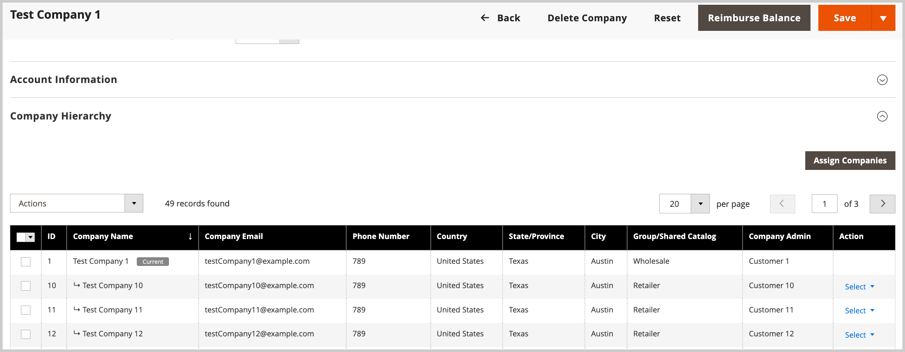

# Gestion d&#39;entreprise

La gestion des entreprises dans Adobe Commerce fournit des outils complets permettant aux administrateurs d’organiser, de configurer et de superviser les relations commerciales B2B. Cette fonctionnalité est essentielle pour les entreprises qui travaillent avec plusieurs clients d’entreprise, filiales ou structures organisationnelles complexes.

La gestion d’entreprise vous permet d’effectuer les opérations suivantes :

* **Organiser les relations commerciales**—Créez et gérez des comptes d&#39;entreprise individuels pour vos clients B2B
* **Établir des hiérarchies organisationnelles**—Structurer les relations parent-enfant qui reflètent les organisations commerciales réelles
* **Centralisation de l’administration**—Gérez plusieurs sociétés et leurs paramètres à partir d’une seule interface d’administration
* **Rationalisation des opérations** : appliquez des configurations et des politiques cohérentes entre les sociétés associées.
* **Support des structures complexes**—Gérez les filiales, les franchises, les entreprises multi-sites et les divisions d&#39;entreprise

Les utilisateurs administrateurs peuvent créer une hiérarchie d’entreprise pour refléter une organisation B2B en affectant des entreprises à une société parent désignée. Cette affectation permet à l&#39;administrateur de la société parent d&#39;afficher et de gérer les sociétés au sein de l&#39;organisation.

Lancez les tâches de gestion de l&#39;entreprise à partir de la vue *[!UICONTROL Companies]*. Dans l’administration, accédez à **[!UICONTROL Customers]** > **[!UICONTROL Companies]**.

{width="700" zoomable="yes"}

## Conditions préalables

Avant de gérer des entreprises, assurez-vous que :

* Les fonctionnalités B2B sont activées dans votre installation Adobe Commerce
* Vous disposez d’un accès administratif avec les autorisations de gestion d’entreprise
* Les comptes d’entreprise sont correctement configurés avec les informations commerciales nécessaires
* Les rôles utilisateur et les autorisations sont définis pour les administrateurs et les utilisateurs de l’entreprise

## Cas d’utilisation

La gestion d&#39;entreprise est idéale pour :

* **Entreprises multi-sites** avec achat centralisé mais besoins spécifiques à chaque site
* **Opérations de franchise** nécessitant à la fois la supervision de l&#39;entreprise et l&#39;autonomie locale
* **Filiales d’entreprise** avec des politiques partagées mais des opérations indépendantes
* **Grandes entreprises** avec plusieurs divisions ou unités commerciales
* **Réseaux de distribution** avec revendeurs, revendeurs ou partenaires de distribution

## Présentation de la hiérarchie des entreprises et des types d’entreprises

La hiérarchie d&#39;entreprise structure les relations d&#39;affaires en organisant plusieurs sociétés sous une seule société mère. Cette fonctionnalité reflète les structures organisationnelles réelles tout en permettant une gestion centralisée et en préservant les identités individuelles de l’entreprise.

### Types d’entreprise

La colonne *[!UICONTROL Company Type]* de la grille Entreprises indique la place de chaque entreprise dans votre organisation B2B :

* **Parent** : hub central avec une ou plusieurs sociétés affectées
   * Contrôle plusieurs sociétés enfants, mais ne peut pas être affecté à un autre parent
   * **Cas d’utilisation** : siège social, organisation de franchise principale ou société de portefeuille

* **Enfant**—Société affectée à une organisation parent
   * Fonctionne sous la gouvernance parente et peut hériter de configurations.
   * Ne peut appartenir qu&#39;à un seul parent à la fois
   * **Cas d’utilisation** : filiales, franchises ou divisions régionales.

* **Société**—Société indépendante unique
   * Fonctionne indépendamment sans relations hiérarchiques
   * Peut être converti en parent (en attribuant des sociétés) ou enfant (en attribuant au parent)
   * **Cas d’utilisation** : clients professionnels individuels ou clients autonomes

### Conversion des types d’entreprise

* **Société unique → parent** : attribuez-lui d&#39;autres sociétés
* **Société unique → enfant** : affectez-la à une société parent existante.
* **Enfant → célibataire** : annulez l&#39;affectation de la société enfant à son parent
* **Parent → enfant** : impossible sans supprimer au préalable toutes les sociétés affectées

### Gestion des hiérarchies d&#39;entreprise

Lors de la modification de sociétés dans une hiérarchie, développez *[!UICONTROL Company Hierarchy]* pour afficher toutes les sociétés associées. Un indicateur de `Current` indique la société en cours de modification.

{width="700" zoomable="yes"}

Pour obtenir des instructions détaillées, voir [Gérer la hiérarchie de l’entreprise](manage-company-hierarchy.md).

## Tâches de gestion de l&#39;entreprise

Lors de la gestion des sociétés à partir de la grille d’entreprise, les administrateurs peuvent effectuer les tâches suivantes à partir de la grille d’*[!UICONTROL Company Hierarchy]* :

* **Afficher et gérer les relations d’entreprise**
   * **Afficher les sociétés associées**—Reportez-vous à toutes les sociétés liées à une organisation parent dans une vue centralisée
   * **Surveiller le statut de la société** : suivez les sociétés actives, en attente et inactives dans la hiérarchie.
   * **Accéder aux détails de la société**—Accédez directement aux pages de configuration de chaque société

* **Créer et modifier des hiérarchies**
   * **Affecter des sociétés** : ajoutez des sociétés existantes à une organisation parent à partir de la page des détails de la société
   * **Créer des relations parent-enfant**—Structurer les entreprises pour refléter les relations commerciales réelles
   * **Réorganiser les structures**—Déplacer les entreprises entre les différentes organisations parentes en fonction de l&#39;évolution des besoins de l&#39;entreprise

* **Gestion des configurations en bloc**
   * **Appliquer les paramètres à plusieurs sociétés**—Mettez à jour les paramètres avancés de plusieurs sociétés simultanément à l&#39;aide du contrôle [!UICONTROL Actions] sur la grille Société
   * **Normaliser les configurations**—Garantir des politiques cohérentes entre les organisations associées
   * **Remplacer les paramètres individuels**—Transmettre les configurations de la société parent aux sociétés enfants sélectionnées.

* **Mesures administratives**
   * **Supprimer les relations d&#39;entreprise**—Utilisez l&#39;action *[!UICONTROL Unassign from parent]* pour dissoudre les liens d&#39;organisation
   * **Gérer l’accès de l’entreprise** - Contrôler quels administrateurs peuvent consulter et modifier les relations de l’entreprise
   * **Surveiller les modifications de hiérarchie**—Suivre les modifications apportées aux structures organisationnelles

## Bonnes pratiques

Lorsque vous gérez des entreprises, tenez compte des bonnes pratiques suivantes :

* **Création de hiérarchies d&#39;entreprise**—Lorsque vous gérez des structures d&#39;entreprise complexes, planifiez votre hiérarchie de manière à ce qu&#39;elle corresponde aux relations d&#39;affaires réelles tout en conservant des structures simples pour éviter toute confusion chez les utilisateurs. Documentez toutes les relations d’entreprise et leurs relations commerciales pour référence ultérieure.

* **Gestion de la configuration** : testez les modifications de configuration sur des sociétés individuelles avant de les appliquer à des hiérarchies entières, et documentez toujours les paramètres actuels avant d’apporter des modifications en bloc. Communiquez à l’avance les modifications prévues aux administrateurs de l’entreprise concernés.

* **Sécurité** : limitez les autorisations de gestion de l&#39;entreprise aux administrateurs approuvés uniquement, vérifiez régulièrement les relations de l&#39;entreprise et les autorisations d&#39;accès, et surveillez tous les changements de hiérarchie à des fins d&#39;audit.

>[!MORELIKETHIS]
>
>* [Créer un compte d’entreprise](account-company-create.md)
>* [Gérer les hiérarchies d&#39;entreprise](manage-company-hierarchy.md)
>* [Rôles et autorisations de l’entreprise](account-company-roles-permissions.md)
>* [Gestion du crédit d’entreprise](credit-company.md)
>* [Activer les fonctionnalités B2B](enable-basic-features.md)
