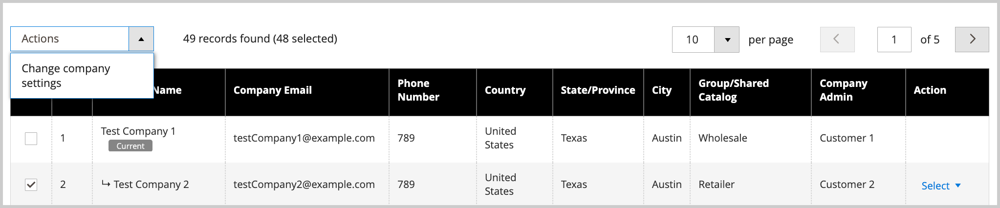

# Gérer les hiérarchies d&#39;entreprise

La fonction [!UICONTROL Company Hierarchy] vous permet d&#39;organiser plusieurs sociétés associées sous une structure de société parent unique. Cette solution est idéale pour les entreprises ayant des filiales, des franchises, plusieurs sites ou des structures organisationnelles complexes qui nécessitent une gestion centralisée tout en conservant les identités individuelles de l’entreprise.

## Cas d’utilisation

* **Gestion centralisée** : appliquez les paramètres et les configurations à plusieurs sociétés à partir d&#39;une seule société mère
* **Tenir à jour la structure**—Organisez les sociétés selon une hiérarchie logique qui reflète l&#39;organisation de votre entreprise
* **Rationaliser les opérations**— Gérez les devis, les commandes, les modes de paiement et les paramètres d&#39;expédition pour l&#39;ensemble de l&#39;organisation
* **Préserver l’autonomie** : les entreprises individuelles conservent leur identité tout en bénéficiant de configurations partagées

## Conditions préalables

Avant de créer une hiérarchie d’entreprise, assurez-vous des points suivants :

* Les fonctionnalités B2B sont activées dans votre installation Commerce
* Vous disposez d’un accès administrateur pour gérer les sociétés
* Les sociétés parents et enfants sont déjà créées en tant que sociétés individuelles
* Vous comprenez que l’application des paramètres parents remplacera les configurations d’entreprise enfant existantes

## Fonctionnement

Les administrateurs peuvent créer une hiérarchie d&#39;entreprise en attribuant des sociétés apparentées à une société parent désignée, c&#39;est-à-dire la société au sommet de la hiérarchie organisationnelle.

Dans l’administration, créez une société parent en modifiant une société individuelle (`[!UICONTROL Company Type] = Company`) et en affectant des sociétés associées dans la configuration de [!UICONTROL Company Hierarchy].

{width="700"}

>[!NOTE]
>
>Pour plus d’informations sur la grille de [!UICONTROL Company Hierarchy], voir la description des champs [Hiérarchie de l’entreprise](account-company-create.md#company-hierarchy).

Gérez les affectations d&#39;entreprise en modifiant une société parent et en utilisant la grille de *[!UICONTROL Company Hierarchy]* pour ajouter ou supprimer des sociétés. Utilisez le contrôle *[!UICONTROL Actions]* pour gérer la [configuration des paramètres avancés](#change-company-settings) pour les sociétés de l’organisation.

## Affecter des sociétés à une société parent

1. Dans la barre latérale _Admin_, accédez à **[!UICONTROL Customers]** > **[!UICONTROL Companies]**.

   {width="700" zoomable="yes"}

1. Dans la grille de [!UICONTROL Companies], ouvrez la page des détails de la société pour créer les affectations.

   * Pour affecter des sociétés supplémentaires à une société parent existante, sélectionnez l&#39;action **[!UICONTROL Edit]** pour la société parent.
   * Pour créer une société parent, sélectionnez l&#39;action **[!UICONTROL Edit]** de la société désignée comme société parent.

     Vous ne pouvez pas créer une nouvelle société parent à partir d&#39;une société parent ou enfant existante.

1. Sur la page Détails de l’entreprise, développez **[!UICONTROL Company Hierarchy]**, puis sélectionnez **[!UICONTROL Assign Companies]**.

   {width="675" zoomable="yes"}

1. Dans la liste des sociétés disponibles, sélectionnez les sociétés à affecter, puis sélectionnez **[!UICONTROL Assign Selected Companies]**.

   {width="675" zoomable="yes"}

1. Lorsque vous y êtes invité, complétez l’affectation de la société en sélectionnant **[!UICONTROL Assign]**.

## Annuler l’affectation des sociétés d’une société parent

1. Sur la page Entreprises , ouvrez la page des détails de l’entreprise pour la société parent en sélectionnant l’action **[!UICONTROL Edit]**.

   {width="700" zoomable="yes"}

1. Affichez la liste des sociétés affectées en développant les **[!UICONTROL Company Hierarchy]**.

1. Supprimez la société de l’organisation.

   * Dans la colonne [!UICONTROL Action] de la société à supprimer, **[!UICONTROL Select]** > **[!UICONTROL Unassign from parent]**.

     {width="640" zoomable="yes"}

   * Lorsque vous y êtes invité, supprimez la société affectée de la hiérarchie en sélectionnant **[!UICONTROL Unassign]**.

## Gérer les paramètres d’entreprise pour une organisation

Mettez à jour la configuration [Paramètres avancés](account-company-create.md#advanced-settings) pour une organisation. Vous pouvez :

* Appliquer les paramètres de configuration parent à toutes les sociétés enfants
* Appliquer les mêmes paramètres aux sociétés sélectionnées de l’organisation

Vous pouvez appliquer l’un des paramètres suivants :

* **Gestion des devis** : activez ou désactivez la possibilité pour les entreprises de demander et de gérer des devis
* **Bons de commande**—Déterminez si les entreprises peuvent créer et gérer des bons de commande
* **Configuration du mode de paiement** : permet de définir les modes de paiement disponibles pour les sociétés.
* **Paramètres du mode de paiement** : configurez des paramètres et des limites de mode de paiement spécifiques
* **Disponibilité du mode d&#39;expédition** : permet de définir les modes d&#39;expédition que les sociétés peuvent utiliser
* **Configuration du mode d&#39;expédition** : définissez les paramètres et les restrictions du mode d&#39;expédition.

Pendant le processus de mise à jour, les valeurs de configuration initiales sont définies par défaut sur les valeurs actuelles configurées pour la société parent. Vous devez cocher la case Modifier pour au moins un paramètre afin d’appliquer les paramètres aux sociétés sélectionnées. Vous pouvez également mettre à jour la valeur par défaut de chaque paramètre avant d’appliquer les modifications.

>[!WARNING]
>
>L’application des paramètres de la société parent remplace les configurations existantes de la société enfant, y compris les limites de crédit, les modes de paiement, les paramètres d’expédition et les restrictions personnalisées. Après avoir appliqué les paramètres, vous pouvez toujours gérer et personnaliser les paramètres avancés pour les sociétés parents et enfants individuelles en modifiant l’élément de ligne de la société.

### Bonnes pratiques

Lors de l’application des paramètres de la société parent aux sociétés enfant, tenez compte des bonnes pratiques suivantes :

* Vérifier les paramètres d’entreprise enfants existants avant d’appliquer les configurations parents
* Tester d’abord les modifications des paramètres sur une seule entreprise enfant
* Communiquez les modifications aux administrateurs de l’entreprise qui peuvent être affectés

### Appliquer les paramètres de configuration parent aux sociétés enfants

1. Dans la barre latérale _Admin_, accédez à **[!UICONTROL Customers]** > **[!UICONTROL Companies]**.

1. Dans la grille de [!UICONTROL Companies], modifiez la société parent en sélectionnant **[!UICONTROL Edit]** dans la colonne **[!UICONTROL Action]**.

1. Sur la page des détails de la société parent, développez **[!UICONTROL Company Hierarchy]** section pour afficher les sociétés incluses dans l&#39;organisation.

1. Sélectionnez les sociétés à configurer.

   {width="675" zoomable="yes"}

1. Sélectionnez **[!UICONTROL Actions]** dans le contrôle **[!UICONTROL Change company settings]** situé au-dessus de la grille.

   {width="675" zoomable="yes"}

1. Modifiez la configuration des paramètres.

   * Sur la page [!UICONTROL Change company settings], recherchez le paramètre de configuration à modifier.

   * Cochez la case **[!UICONTROL Change]** pour activer le paramètre.

   * Mettez à jour la valeur si nécessaire.

     {width="575" zoomable="yes"}

1. Après avoir mis à jour la configuration, sélectionnez **[!UICONTROL Apply Changes]**.

1. Lorsque vous y êtes invité, sélectionnez **[!UICONTROL Change settings]** pour mettre à jour la configuration pour les sociétés sélectionnées.

>[!MORELIKETHIS]
>
>* [Créer un compte d’entreprise](account-company-create.md) - Découvrez comment créer des entreprises individuelles avant de créer des hiérarchies
>* [Rôles et autorisations de l’entreprise](account-company-roles-permissions.md) - Comprendre l’accès des utilisateurs dans les structures de l’entreprise
>* [Gestion du crédit d’entreprise](credit-company.md) - Configurez les limites de crédit et les conditions de paiement pour les entreprises
>* [Gérer les entreprises](manage-companies.md) - Présentation des fonctionnalités de gestion des entreprises
>* [Activer les fonctionnalités B2B](enable-basic-features.md) - Activer et configurer la fonctionnalité B2B
