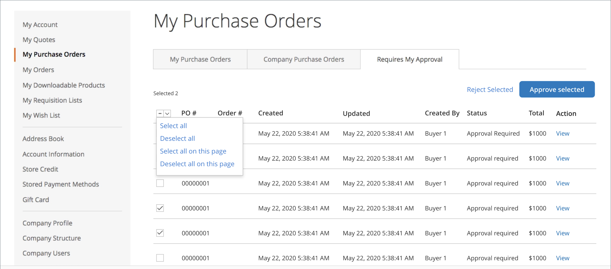

# Commandes d’achat pour les entreprises

Les bons de commande sont un moyen courant pour les entreprises de suivre et de contrôler les dépenses. [Commande d’achat](../stores-purchase/purchase-order.md) est l’un des modes de paiement hors ligne standard pris en charge dans Adobe Commerce et Magento Open Source. Lorsque B2B d’Adobe Commerce est installé et que l’option [_Activer les commandes_](account-company-manage.md#advanced-settings) est activée pour un compte de société, toutes les commandes sont automatiquement créées en tant que commandes d’achat (PO). Les utilisateurs de l’entreprise disposant des [autorisations](account-company-roles-permissions.md) requises peuvent créer, modifier et supprimer des PO qu’ils créent et des PO créés par des utilisateurs subordonnés.

## Flux de commande d’achat

En fonction de leur rôle et de l’ordre, les utilisateurs de l’entreprise peuvent être soumis à plusieurs règles d’approbation. Et selon que vous utilisez des méthodes de paiement en ligne ou hors ligne, le flux est légèrement différent. Les administrateurs d’entreprise peuvent créer des commandes automatiquement, en contournant les règles de validation. Le stockage des informations de paiement en ligne lors du processus de validation étant un risque de sécurité, ces informations sont ajoutées après validation, puis la commande est convertie en commande réelle.

{width="600" zoomable="yes"}

>[!NOTE]
>
>Une commande ne peut pas être passée si un ou plusieurs produits du bon de commande sont actuellement désactivés ou en rupture de stock.

Le workflow du bon de commande d’une société peut varier de plusieurs façons :

- Si aucune règle de validation n&#39;est définie, les commandes d&#39;achat peuvent être passées et la commande passée directement.

  >[!NOTE]
  >
  >Par défaut, un message `Purchase order has been submitted for approval` est toujours affiché pour les utilisateurs de l’entreprise, même lorsqu’aucune règle d’approbation n’est définie. Lorsqu’aucun processus d’approbation n’est requis, les utilisateurs de l’entreprise reçoivent automatiquement un courrier électronique les informant que la commande a été créée et approuvée.

- Si les règles d’approbation sont définies par l’administrateur de la société, les utilisateurs passent par le processus d’approbation.
- Si plusieurs règles d’approbation s’appliquent à un bon de commande, tous les approbateurs uniques requis doivent l’approuver.
- Les informations de paiement hors ligne sont saisies lors de la création du bon de commande.
- Les informations de paiement en ligne sont saisies une fois la commande d’achat validée.

>[!NOTE]
>
>Les commandes d’achat créent un _instantané_ des prix des articles, des remises et des prix d’expédition au moment de la création de la commande. Si le prix d’un article change après la création du bon de commande, le prix d’origine est utilisé.

### Exemple de workflow de base

Les sociétés utilisent des commandes d’achat pour contrôler ce que les employés peuvent acheter pour le compte de l’entreprise et configurent souvent des règles d’approbation pour appliquer les directives de l’entreprise. Selon les règles d’approbation, plusieurs personnes peuvent avoir à approuver la commande.

1. L’utilisateur crée une commande d’achat d’une valeur de 25 000 $ pour des marchandises.
1. Leur directeur doit approuver.
1. Comme la commande est supérieure à 10 000 $, le fournisseur doit également l’approuver.
1. Selon le mode de paiement, après les validations, le bon de commande est automatiquement converti en commande ou l’utilisateur revient pour saisir les détails du paiement.

### Règles de validation

Les règles d’approbation sont utilisées pour contrôler les dépenses en fonction des directives de l’entreprise. Voici quelques exemples de règles de validation :

- Toute commande de plus de 100 $ nécessite l’approbation de votre responsable.
- Toute commande de plus de 1 000 $ nécessite l’approbation de votre responsable et de l’administrateur de la société.
- Toute commande comportant plus de 30 SKU uniques doit être approuvée par l’administrateur de l’entreprise.

Une fois ces règles en place pour une société, un utilisateur de la société peut terminer la commande immédiatement lorsque la commande est inférieure à 100 €. Pour en savoir plus sur la définition des règles d’approbation, voir [Règles d’approbation](account-dashboard-approval-rules.md).

### Types d’utilisateurs de magasins

Le workflow du bon de commande peut également être différent en fonction de l’entité qui effectue l’achat.

- Un employé régulier peut être soumis à toutes les règles de validation.
- Un responsable peut avoir plus de pouvoir d’achat et des règles d’approbation différentes.
- Les administrateurs d’entreprise peuvent contourner toutes les règles de validation et faire en sorte que leurs commandes soient automatiquement exécutées.

Tous ces facteurs peuvent avoir une influence sur le processus de passage en caisse exact.

## [!UICONTROL My Purchase Orders]

Lorsque les commandes d’achat sont activées pour une société, l’élément **[!UICONTROL My Purchase Orders]** s’affiche dans le panneau de gauche pour les clients connectés à un compte utilisateur de société. Il existe trois onglets qui fournissent différentes listes et fonctions de bon de commande :

- **[!UICONTROL My Purchase Orders]** : PO créés par le client.
- **[!UICONTROL Company Purchase Orders]** : PO effectués par des utilisateurs subordonnés au sein de l’entreprise (dépend de la structure et des rôles de l’entreprise).
- **[!UICONTROL Requires My Approval]** : (visibles pour les approbateurs désignés) PO qui attendent la validation du client. Le compteur indique le nombre de commandes en attente d’approbation.

{width="700" zoomable="yes"}

Pour plus d’informations sur les fonctions de bon de commande prises en charge pour les utilisateurs de l’entreprise sur le storefront, voir [Mes commandes](account-dashboard-my-purchase-orders.md).

## Méthodes de paiement hors ligne ou en ligne

Les workflows peuvent varier en fonction du mode de paiement. Pour en savoir plus sur les méthodes de paiement Adobe Commerce, consultez la section [Méthodes de paiement](../stores-purchase/payments.md) du _Guide d’expérience de vente et d’achat_.

>[!IMPORTANT]
>
>Les commandes d’achat doivent utiliser une expérience de passage en caisse _In-Context_. _Les passages en caisse hors contexte_ ne sont pas pris en charge car ils contournent le flux de passage en caisse normal. En règle générale, _In-Context_ signifie que le client reste sur votre site commercial pour terminer le processus. _Out-of-Context_ est le moment où le client est amené sur un autre site pour terminer l’achat.

### Paiements en ligne

Pour des raisons de sécurité, les magasins en ligne ne souhaitent généralement pas collecter les détails de la carte de crédit de magasin en attendant que le processus d’approbation soit terminé. Par conséquent, si une option de paiement en ligne est sélectionnée, le créateur du bon de commande retourne dans la boutique après approbation, saisit les détails du paiement et termine la commande. Voici quelques exemples de paiements en ligne :

- Cartes de crédit/débit
- PayPal
- Braintree

>[!IMPORTANT]
>
>L’utilisation de cartes-cadeaux, de crédits de magasin ou de points de récompense avec des méthodes de paiement en ligne pour les commandes d’achat n’est pas prise en charge. L’activation de ces fonctionnalités avec des paiements en ligne peut entraîner un comportement inattendu. Il est recommandé de désactiver les cartes-cadeaux, le crédit de magasin et les points de récompense lorsque les paiements en ligne sont activés pour les commandes d’achat.

### Paiements hors ligne

Comme les méthodes de paiement hors ligne, telles qu’un mandat, sont gérées en dehors du site web, elles sont plus sûres. Les commandes d’achat avec paiements hors ligne peuvent être traitées automatiquement, après tout processus d’approbation.

Voici quelques exemples de paiements hors ligne :

- Commande d’archivage/d’argent
- Paiement sur compte
- Espèces à la livraison
- Transferts bancaires
- Crédit de la boutique
