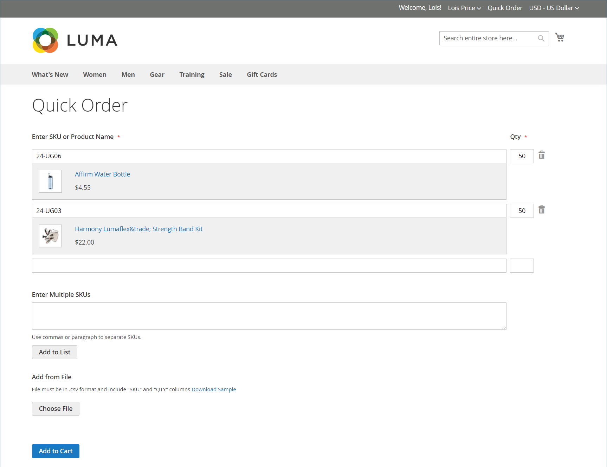

# Commandes rapides

La variable _Ordre rapide_ Cette fonctionnalité réduit le processus de commande à plusieurs clics pour les clients qui connaissent le nom ou le SKU du produit qu’ils souhaitent commander. Les commandes comportant plusieurs SKU peuvent être saisies manuellement ou importées dans le formulaire de commande rapide. La commande rapide peut être utilisée par les clients connectés à leurs comptes, ainsi que par les invités. Lorsque cette option est activée, la variable _Ordre rapide_ s’affiche en haut de la page, en regard du nom du client.

{width="700" zoomable="yes"}

## Activation des commandes rapides pour votre boutique

1. Sur le _Administration_ barre latérale, accédez à **[!UICONTROL Stores]** > _[!UICONTROL Settings]_>**[!UICONTROL Configuration]**.

1. Dans le _[!UICONTROL General]_dans le panneau de gauche, choisissez **[!UICONTROL B2B Features]**.

1. Définir **[!UICONTROL Enable Quick Order]** to `Yes`.

   {width="600" zoomable="yes"}

1. Cliquez sur **[!UICONTROL Save Config]**.

1. Lorsque vous y êtes invité, cliquez sur [Gestion du cache](../systems/cache-management.md) et actualisez les caches non valides.

## Workflows de commande rapide

Les clients peuvent spécifier des produits pour les commandes rapides à l’aide de l’une des méthodes suivantes.

### Méthode 1 : saisie de produits individuels

1. Le client clique sur la variable **[!UICONTROL Quick Order]** lien.

1. Sélection du produit par SKU ou nom du produit :

   Pour placer une **commande rapide par SKU**, le client effectue les opérations suivantes :

   - entre dans la variable **[!UICONTROL SKU]**.

   - Clics **[!UICONTROL Add to List]**.

     Le SKU apparaît dans la ligne de saisie, avec les détails du produit ci-dessous.

     {width="600" zoomable="yes"}

   Pour placer une **commande rapide par nom de produit**, le client effectue les opérations suivantes :

   - Entrez les premiers caractères de la variable **[!UICONTROL Product Name]**.

     >[!NOTE]
     >
     >N’utilisez pas la variable _Entrée_ pour choisir le nom du produit.

   - Lorsque la liste des correspondances possibles apparaît, le client clique sur le produit qu’il souhaite commander.

     {width="700" zoomable="yes"}

1. entre dans la variable **[!UICONTROL Qty]**.

1. En utilisant la ligne d’entrée suivante, répète ce processus autant de fois que nécessaire.

1. Clics **[!UICONTROL Add to Cart]**.

### Méthode 2 : saisissez plusieurs produits

1. Dans le **[!UICONTROL Enter Multiple SKUs]** , le client effectue l’une des opérations suivantes :

   - Saisie d’un SKU par ligne

   - Saisissez tous les SKU sur la même ligne, séparés par des virgules, et sans espaces.

     {width="600" zoomable="yes"}

1. Pour ajouter les produits à la liste, cliquez sur **[!UICONTROL Add to List]**.

1. entre dans la variable **[!UICONTROL Qty]** pour chaque élément de la liste.

   {width="600" zoomable="yes"}

   >[!NOTE]
   >
   >Si le produit dispose des options requises, le client est invité à les sélectionner. Ils peuvent attendre d’accéder au panier pour ajouter des options de produit.

   {width="600" zoomable="yes"}

### Méthode 3 : téléchargement d’une liste de produits

1. Dans le _[!UICONTROL Add from File]_, cliquez sur **[!UICONTROL Download Sample]**pour télécharger un modèle de commande.

   {width="600" zoomable="yes"}

1. Ouvre le fichier téléchargé.

1. Utilise le modèle pour ajouter les SKU du produit à charger pour la liste de commandes rapides.

1. Une fois l’opération terminée, cliquez sur **[!UICONTROL Save]**.

   {width="400" zoomable="yes"}

1. Pour charger le fichier, cliquez sur **[!UICONTROL Choose]** et sélectionne le fichier sur son système.

   Les éléments sont ajoutés à la liste Ordre rapide.

1. Une fois prêt, cliquez sur **[!UICONTROL Add to Cart]**.

Une fois que le client a créé la commande rapide, il peut procéder à l’extraction comme d’habitude.

{width="700" zoomable="yes"}
