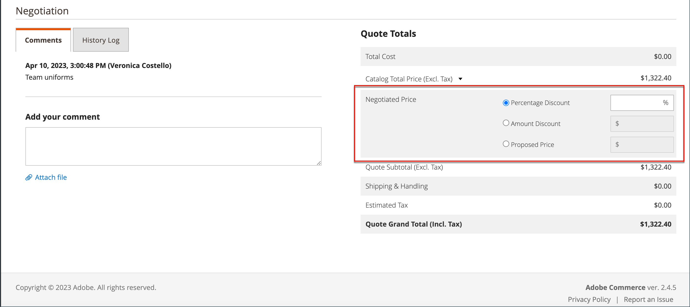
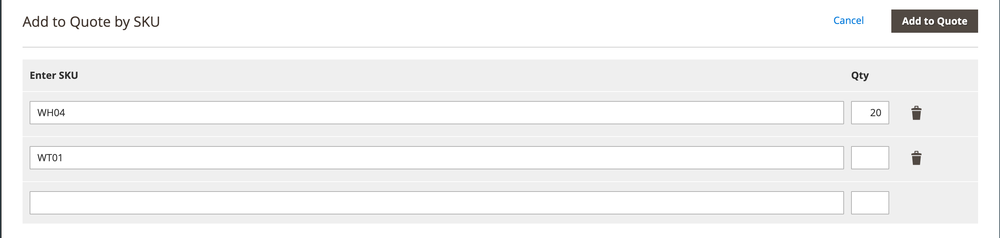
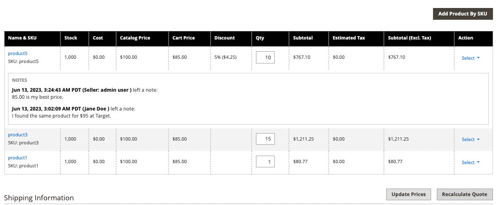

# Négocier un devis

Si les devis [B2B) sont activés](configure-quotes.md) dans la configuration, la négociation de prix peut être initiée par un acheteur autorisé d&#39;une société ou un représentant commercial.

Les acheteurs lancent le processus de négociation des prix en [demandant un devis](quote-request.md) dans le panier. Les représentants commerciaux peuvent lancer la négociation en [créant un devis provisoire pour un acheteur](sales-rep-initiates-quote.md), en mettant à jour le devis avec les articles de commande et la tarification initiaux et en l&#39;envoyant à l&#39;acheteur.

Lorsque la négociation des prix commence, les devis sont répertoriés dans la grille [Devis](quotes.md). Toutes les négociations entre l&#39;acheteur et le vendeur ont lieu par e-mail, et sont initiées et suivies à partir de la vue détaillée du devis.

Au cours du processus de négociation, le vendeur peut effectuer les opérations suivantes auprès de l&#39;administrateur :

- Ajouter ou supprimer des produits
- Modifier la quantité
- Appliquer une remise aux lignes ou à l&#39;ensemble du devis
- Ajouter ou modifier le mode d&#39;expédition
- Ajouter des commentaires
- Envoyez le devis mis à jour à l&#39;acheteur ou enregistrez-le en tant que brouillon

Les acheteurs gèrent le processus de négociation des devis à partir du storefront à l&#39;aide de [[!UICONTROL My Quotes]](account-dashboard-my-quotes.md). Bien que le devis soit ouvert à la révision, son statut dans le compte de l&#39;acheteur est défini sur `Pending`. L&#39;acheteur peut modifier et soumettre à nouveau le devis même s&#39;il a été refusé ou s&#39;il a expiré.

## Étape 1 : afficher la demande

1. Dans la barre latérale d’administration, accédez à **[!UICONTROL Sales]** > **[!UICONTROL Quotes]**.

   La nouvelle demande apparaît dans la grille de _[!UICONTROL Quotes]_.

1. Dans la colonne _Actions_, cliquez sur **[!UICONTROL View]**.

   {width="700" zoomable="yes"}

## Etape 2 : Modifier le devis

1. Sous _[!UICONTROL Quote & Account Information]_, cliquez sur l’icône_ Calendrier _().

   {width="575" zoomable="yes"}

1. Choisissez un **[!UICONTROL Expiration Date]** pour le devis.

1. Faites défiler l’écran jusqu’à la section _[!UICONTROL Quote Totals]_et mettez à jour la **[!UICONTROL Negotiated Price]**selon vos besoins.

   {width="600" zoomable="yes"}

   Si l&#39;acheteur modifie la quantité des articles du devis, un avis apparaît en haut du devis, indiquant que la liste des articles a changé et que le prix négocié doit être mis à jour.

   {width="600" zoomable="yes"}

### Ajouter de nouveaux produits au devis

1. Cliquez sur **[!UICONTROL Add Products by SKU]**.

1. Saisissez les **[!UICONTROL SKU]** et **[!UICONTROL Qty]** à ajouter.

   {width="600" zoomable="yes"}

### Appliquer les mises à jour des lignes

Appliquez les modifications d&#39;élément de ligne dans la section _[!UICONTROL Items Quoted]_si nécessaire.

{width="600" zoomable="yes"}

- Modifiez le **[!UICONTROL Quantity]** qui doit être acheté au prix proposé.

- Sélectionnez **[!UICONTROL Configure]** et modifiez les options du produit.

  L’option [!UICONTROL Configure] n’est disponible que sur une ligne pour un produit configurable

- Dans le menu **[!UICONTROL Action]**, sélectionnez une action pour mettre à jour l’élément :
   - **Article de remise** pour appliquer une remise sous la forme d&#39;un pourcentage, d&#39;un montant fixe ou d&#39;une tarification préférée.
Vous pouvez éventuellement verrouiller le montant de la remise pour empêcher toute remise supplémentaire. Si la remise n&#39;est pas verrouillée,
la remise ligne et la remise de niveau devis sont appliquées au prix du produit.
   - **Laisser une note à l&#39;acheteur** pour lui fournir des informations supplémentaires sur un objet
   - **Supprimer** pour supprimer un article du devis.

### Appliquer les modifications et mettre à jour

- Pour appliquer les modifications, cliquez sur **[!UICONTROL Add to Quote]**.

- Pour mettre à jour le devis, cliquez sur **[!UICONTROL Recalculate the Quote]**.

- Pour appliquer les modifications et mettre à jour le devis dans le catalogue partagé et les règles de prix, cliquez sur **[!UICONTROL Update Prices]**, puis sur **[!UICONTROL Proceed]** pour confirmer la mise à jour.

  {width="600" zoomable="yes"}

### Mettre à jour les informations d’expédition

1. Si l&#39;acheteur inclut une adresse _Adresse de livraison_ dans le devis, cliquez sur **[!UICONTROL Get shipping methods and rates]**.

1. Choisissez un mode d&#39;expédition parmi les options disponibles.

1. Saisissez un **[!UICONTROL Proposed Shipping Price]**.

   Les _[!UICONTROL Quote Totals]_sont mis à jour pour refléter le prix d’expédition proposé.

### Joindre un document justificatif

1. Sous la zone _Ajouter votre commentaire_, cliquez sur **[!UICONTROL Attach file]**.

   Par défaut, les [fichiers joints](../configuration-reference/sales/quotes.md) peuvent atteindre 2 Mo dans l’un des formats de fichiers suivants : DOC, DOCX, XLS, XLSX, PDF, TXT, JPG ou JPEG, PNG.

1. Sélectionnez le fichier dans votre répertoire.

## Étape 3 : mettre à jour les informations au niveau du devis et envoyer votre réponse

1. Dans la section _[!UICONTROL Negotiation]_de l’onglet_[!UICONTROL Comments]_ , saisissez votre réponse dans la section **[!UICONTROL Add your comment]** .

1. Pour inclure un document complémentaire, cliquez sur **[!UICONTROL Attach file]** et sélectionnez le fichier dans votre répertoire.

   La taille de fichier maximale autorisée pour les pièces jointes est de 2 Mo.

1. Pour appliquer une remise au devis :

   - Sous _[!UICONTROL Quote Totals]_dans la section_[!UICONTROL Negotiated Price]_ , choisissez l’un des types de remise suivants :

      - `Percentage Discount` : une remise en pourcentage réduit le prix d&#39;origine d&#39;un pourcentage spécifique.
      - `Amount Discount` : une remise sur montant applique une réduction de prix fixe.
      - `Proposed Price` : une remise proposée définit le prix final sur un montant spécifique, quel que soit le prix d&#39;origine.

   - Entrez le montant en pourcentage ou en prix forfaitaire.

     {width="600" zoomable="yes"}

   - Vous pouvez appliquer des remises à chaque ligne ou au devis dans son ensemble :

      - **Remises ligne** : les remises ligne sont appliquées à des articles individuels du panier. La remise peut être une `percentage`, un `amount` spécifique ou un `proposed price`.
      - **Remises au niveau du panier** : les remises au niveau du panier sont appliquées à l’ensemble du panier. La remise peut être une `percentage` ou un `amount` spécifique et est appliquée à la valeur totale du panier.
      - **Combinaison de remises sur panier et article de ligne** : dans certains cas, des remises peuvent être appliquées au niveau du panier et des articles de ligne. La remise ligne est appliquée en premier, suivie de la remise au niveau du panier sur le total restant.

1. Envoyer ou enregistrer le devis :

   - Si le devis est prêt à être renvoyé à l&#39;acheteur, cliquez sur **[!UICONTROL Send]**.

   - Pour continuer à travailler sur le devis plus tard, cliquez sur **[!UICONTROL Save as Draft]**.

>[!NOTE]
>
> Pendant la négociation du devis, les remises peuvent être verrouillées pour empêcher d&#39;autres modifications. Une fois un devis verrouillé, ni le type de remise ni le montant ne peuvent être modifiés sans déverrouiller le devis au préalable. Ce mécanisme de verrouillage garantit que les conditions convenues entre le représentant commercial et l&#39;acheteur sont préservées.

## Étape 4 : Suivi d&#39;un devis

Lorsque vous envoyez un devis, le système en informe à la fois l&#39;acheteur et le commercial qui gère le compte de la société. L&#39;e-mail contient un lien vers le devis dans le compte de l&#39;acheteur et la date d&#39;expiration du devis. À tout moment de la négociation, l&#39;acheteur peut effectuer l&#39;une des opérations suivantes :

- Acceptez le devis négocié et effectuez l&#39;achat.
- Envoyez une réponse avec une contre-offre et poursuivez la négociation.
- Termine la négociation.

Pour surveiller sa position dans le workflow, vérifiez votre e-mail et le statut du devis dans la grille. Vous pouvez poursuivre le processus de négociation aussi longtemps que nécessaire.

## Barre de boutons

| Bouton | Description |
|----------------------------|---------------------------------------------------------------------------------------------------------------------------------------------------------------------------------------------------------------------------------------------------------------------------------------------------------------------------------------------------------------|
| [!UICONTROL Back] | Retourne à la page _[!UICONTROL Quotes]_sans enregistrer les modifications. |
| [!UICONTROL Print] | Envoie le devis à une imprimante ou l&#39;enregistre en tant que fichier PDF. |
| [!UICONTROL Create Copy] | Crée et ouvre une copie du devis actuel avec `(copy)` ajouté au nom d&#39;origine. Renommez la nouvelle citation en modifiant le champ [!UICONTROL Name]. Traitez le nouveau devis en l&#39;enregistrant en tant que brouillon ou en l&#39;envoyant au client. |
| Créer un modèle | Créer un modèle de devis basé sur le devis actuel. Les modèles de devis simplifient la négociation de devis en permettant aux acheteurs et aux vendeurs de s&#39;entendre sur des conditions contractuelles et tarifaires qui peuvent être appliquées à plusieurs devis. . Avec l&#39;accord de l&#39;acheteur, celui-ci peut générer un devis lié préapprouvé à partir du modèle pour les commandes suivantes au lieu de relancer le processus de demande de devis. |
| [!UICONTROL Save as Draft] | Enregistrez les modifications apportées au devis, mais ne le renvoyez pas à l&#39;acheteur. |
| [!UICONTROL Decline] | rejette la demande de négocier les prix, soit lors de l&#39;enquête initiale, soit au cours des négociations en cours. Lorsqu&#39;un devis est refusé, le vendeur doit ajouter un commentaire pour expliquer sa décision. Lorsqu&#39;un devis est refusé, tous les prix négociés sont rétablis aux valeurs d&#39;origine. Ce bouton est désactivé lorsque le vendeur attend une réponse de l&#39;acheteur. |
| [!UICONTROL Send] | Envoie le devis mis à jour en réponse à la demande de l&#39;acheteur. Ce bouton est désactivé si le vendeur attend une réponse de l&#39;acheteur. |

{style="table-layout:auto"}

## Descriptions des champs

Les informations sur les devis et les fonctions d’administration sont organisées dans les sections suivantes.

### [!UICONTROL Quote & Account Information]

| Champ | Description |
|-------------------------------------------------|------------------------------------------------------------------------------------------------------------------------------------------------------------------------------------------------------------------------------------------------------------------------------------------------------------------------------------------------------------------------------------------------------------------------------------------------------------------------------------------------------------------------------------------------------------------------------------------------------------------------------------------------------------------------------------------------------------------------------------------------------------------------------------------------------------------------------------------------------------------------------------------------------------------------------------------------------------------------------------------------------------------------------------------------------------------------------------------------------------|
| [!UICONTROL Name] | Nom attribué à une demande de devis par l&#39;[acheteur](account-company-roles-permissions.md). |
| [!UICONTROL Status] | Indique le statut actuel du devis. Le statut d&#39;un devis ne peut être modifié que par une action de l&#39;acheteur ou du vendeur. Consultez également les [Paramètres de statut](quotes.md) de l&#39;administrateur et du [compte de l&#39;acheteur](account-dashboard-my-quotes.md). |
| [!UICONTROL Created] | Date et heure auxquelles l&#39;acheteur a soumis pour la première fois la demande de devis. |
| [!UICONTROL Created By] | Prénom et nom de l&#39;acheteur de la société qui a soumis la demande de devis. |
| [!UICONTROL Expiration Date] | Indique le dernier jour de validité du devis actuel. La date d&#39;expiration par défaut est définie dans la configuration 30 jours après l&#39;envoi d&#39;une demande de devis par un acheteur.   Le vendeur peut remplacer la date d&#39;expiration par défaut en saisissant une autre date (JJ MMM AAAA ) ou en choisissant la date dans le calendrier. Le devis n’expire jamais si le champ n’est pas renseigné.   Pour les devis ouverts, le vendeur reçoit une notification [par e-mail](../systems/email-templates.md) 48 heures avant l&#39;expiration du devis. Les acheteurs sont avertis 24 heures avant la date d&#39;expiration.   Le statut du devis passe à _Expiré_ et l&#39;acheteur ne peut plus le modifier. Les prix proposés dans le devis reviennent aux valeurs d&#39;origine du catalogue.   Si un devis est ouvert pour examen par le vendeur au moment de son expiration, la date d&#39;expiration est réinitialisée en fonction de la plage définie dans la configuration.   La date d’expiration est le seul champ de la section _Devis et compte_ qui peut être modifié pendant le processus de révision. |
| [!UICONTROL Company] | Nom légal de la [société](account-companies.md) que l’acheteur représente. |
| [!UICONTROL Company Admin Email] | Adresse électronique de l’[administrateur de la société](account-company-admin.md). |
| [!UICONTROL Sales Rep] | [représentant commercial](account-company-manage.md) qui travaille pour le vendeur et qui est le contact principal affecté au compte de la société. |
| [!UICONTROL Shared Catalog (or Customer Group)] | Le [catalogue partagé](catalog-shared.md) ou [groupe de clients](account-company-customer-group.md) auquel la société est affectée. Le devis peut inclure des prix personnalisés du catalogue partagé affecté à la société. |

{style="table-layout:auto"}

### [!UICONTROL Add to Quote by SKU]

| Champ | Description |
|---------------------------|-----------------------------------------------------------|
| [!UICONTROL Enter SKU] | SKU du produit à ajouter au devis. |
| [!UICONTROL Qty] | Nombre d&#39;articles de ce SKU à ajouter au devis. |
| [!UICONTROL Add to Quote] | Ajoute la quantité de produit spécifiée au devis. |

{style="table-layout:auto"}

### [!UICONTROL Items Quoted]

| Champ | Description |
|-----------------------------------------|---------------------------------------------------------------------------------------------------------------------------------------------------------------------------------------------------------------------------|
| [!UICONTROL Name & SKU] | Nom du produit lié et unité de stock (SKU). |
| [!UICONTROL Stock] | Nombre de produits sous ce SKU actuellement disponibles à la vente. |
| [!UICONTROL Cost] | Montant payé par le vendeur pour acheter le produit. |
| [!UICONTROL Catalog Price] | Prix du produit dans le catalogue de l&#39;acheteur, en fonction du groupe de clients ou du catalogue partagé affecté à la société de l&#39;acheteur. |
| [!UICONTROL Cart Price] | Prix d’origine de l’article dans le panier, moins les remises appliquées à partir du panier. Le prix du panier peut différer du prix catalogue si des remises ou des règles de panier s&#39;appliquent au groupe de clients de l&#39;acheteur. |
| [!UICONTROL Discount] | Remise ligne appliquée à l&#39;article. La valeur peut être un pourcentage, un montant fixe ou un prix proposé. |
| [!UICONTROL Qty] | Nombre d&#39;unités dans ce SKU qui est la base du prix coté. Seul un nombre positif supérieur à zéro peut être saisi. Si vous souhaitez modifier la quantité à zéro, supprimez l&#39;article du devis. |
| [!UICONTROL Subtotal] | Prix proposé multiplié par la quantité d&#39;articles commandés. |
| [!UICONTROL Estimated Tax] | Montant de taxe estimé pour cet élément de ligne, en fonction de la configuration. Selon les paramètres de calcul de la taxe, la taxe estimée peut être basée sur l&#39;un des éléments suivants : Prix unitaire / Total de la ligne / Total |
| [!UICONTROL Subtotal (Incl./Excl. Tax)] | Selon la configuration, cette colonne peut afficher le sous-total avec ou sans estimation des taxes. |
| [!UICONTROL Action] | Menu de sélection des opérations pouvant être appliquées à un élément de ligne :<ul><li>**[!UICONTROL Discount item]**</li><li>**[!UICONTROL Leave a note to Buyer]**</li><li>**[!UICONTROL Remove an item from the quote]**</li></ul>. |
| [!UICONTROL Configure] | Permet de modifier les options d’un produit configurable. |
| [!UICONTROL Update Prices] | Met à jour le devis avec les dernières modifications du catalogue partagé et les règles de prix. |
| [!UICONTROL Recalculate Quote] | Recalcule tous les prix de devis, les règles de prix de panier et la taxe pour refléter les modifications apportées au devis. |

{style="table-layout:auto"}

### [!UICONTROL Shipping Information]

| Champ | Description |
|--------------------------------------|------------------------------------------------------------------------------------------------------------------------------------------------------------------------------|
| [!UICONTROL Shipping Address] | Affiche l&#39;adresse de livraison indiquée dans le compte de l&#39;acheteur. L&#39;adresse de livraison est vide si l&#39;acheteur n&#39;a pas indiqué d&#39;adresse avant de soumettre la demande. |
| [!UICONTROL Shipping Method & Price] | Le lien Obtenir les méthodes et les taux d&#39;expédition s&#39;affiche si l&#39;acheteur inclut une adresse _Adresse de livraison_ dans le devis. |

{style="table-layout:auto"}

### [!UICONTROL Negotiation]

| Champ | Description |
|--------------------------|----------------------------------------------------------------------------------------------------------------------------------------------------------------------------------------------------------------------------------------------------------------------------------------------------------------------------------------------------------------------------------------------------------------------------------------------------------------------------------------------------------------------------------------------------------------------------------------------------------------------------------------------------------|
| [!UICONTROL Comments] | L&#39;onglet Commentaires de la section Négociation permet de saisir un message concernant le devis à l&#39;intention de l&#39;acheteur.  **[!UICONTROL Add your comment]**- Les commentaires sont utilisés pour communiquer avec l&#39;acheteur pendant le processus de négociation. Utilisez les commentaires pour expliquer les remises proposées dans le devis ou la raison pour laquelle une demande de devis est refusée. **[!UICONTROL Attach file]** - La taille maximale du fichier et les types de fichiers pris en charge pour les [fichiers joints](configure-quotes.md) sont déterminés par la configuration. Par défaut, un fichier joint peut faire jusqu’à 2 Mo, et parmi les types de fichiers suivants : DOC, DOCX, XLS, XLSX, PDF, TXT, JPG ou JPEG, PNG. |
| [!UICONTROL History Log] | Cet onglet affiche l&#39;historique complet du devis avec les dates, le statut du devis et les commentaires. |

{style="table-layout:auto"}

### [!UICONTROL Quote Totals]

| Champ | Description |
|-----------------------------------------------------|-----------------------------------------------------------------------------------------------------------------------------------------------------------------------------------------------------------------------------------------------------------------------------------------------------------------------------------------------------------------------------------------------------------------------------------------------------------------------------------------------------------------------------------------------------------------------------------------------------------------------------------------------------------------------|
| [!UICONTROL Total Cost] | Coût total pour le vendeur des articles inclus dans le devis. |
| [!UICONTROL Catalog Total Price  (Incl./Excl. Tax)] | Prix total des articles du devis sans taxe, en fonction des prix du catalogue partagé ou du catalogue principal utilisé comme base du devis. Développez la section pour afficher les valeurs utilisées dans le calcul, en fonction du paramètre [Afficher le sous-total](../configuration-reference/sales/tax.md) de la configuration. Options :  **[!UICONTROL Subtotal (Excl. Tax)]**- Prix total du catalogue sans taxe estimée. **[!UICONTROL Subtotal (Incl. Tax)]** - Prix total du catalogue sans taxe estimée.  **[!UICONTROL Estimated Tax]**- Montant de taxe estimé s&#39;appliquer au prix total du catalogue. |
| Prix Négocié | La remise proposée à l&#39;acheteur peut être basée sur l&#39;un des éléments suivants :  **[!UICONTROL Percentage Discount]**- La remise en pourcentage. **[!UICONTROL Amount Discount]** - La remise sous la forme d&#39;un montant fixe.  **[!UICONTROL Proposed Price]**- Prix proposé par le vendeur.
Si tous les articles du devis ont une remise article verrouillée, la section [!UICONTROL Negotiated Price] est désactivée car aucune remise supplémentaire ne peut être appliquée.

Si un produit a une remise ligne qui n&#39;est pas verrouillée, la remise ligne et la remise au niveau du devis sont appliquées au prix du produit.
 |
| [!UICONTROL Quote Subtotal (Incl./Excl. Tax)] | Prix total proposé de chaque article du devis, avec ou sans taxe, selon les paramètres [calcul de la taxe](../configuration-reference/sales/tax.md) de la configuration. |
| [!UICONTROL Shipping & Handling] | Montant saisi par le vendeur dans le champ Prix d&#39;expédition proposé dans la section Informations d&#39;expédition du devis. Si ce champ est vide, le montant est basé sur le mode d’expédition sélectionné. |
| [!UICONTROL Estimated Tax] | Montant de taxe estimé dû, comme spécifié dans la configuration [paramètres d’affichage](../configuration-reference/sales/tax.md). |
| [!UICONTROL Quote Grand Total (Incl. Tax)] | Le total final au bas du devis qui comprend le prix négocié, la taxe estimée et l&#39;expédition et la manutention proposées. |

{style="table-layout:auto"}
