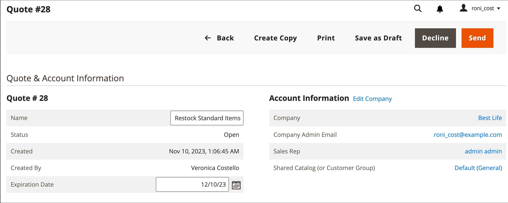

# Négocier une citation

Si les [devis B2B sont activés](configure-quotes.md) dans la configuration, la négociation des prix peut être initiée par un acheteur autorisé d’une société ou d’un représentant commercial.

Les acheteurs lancent le processus de négociation des prix en demandant un devis](quote-request.md) auprès du panier. [ Les représentants commerciaux peuvent lancer des négociations en [créant un projet de devis pour un acheteur](sales-rep-initiates-quote.md), en mettant à jour le devis avec les articles de commande et le prix initiaux, puis en l’envoyant à l’acheteur.

Lorsque la négociation des prix démarre, les guillemets sont répertoriés dans la grille [Quotes](quotes.md). Toutes les négociations entre l&#39;acheteur et le vendeur se font par email, et sont initiées et suivies depuis le détail du devis.

Au cours du processus de négociation, le vendeur peut effectuer les opérations suivantes auprès de l’administrateur :

- Ajout ou suppression de produits
- Modifier la quantité
- Appliquez une remise sur les éléments de ligne ou le prix total
- Ajouter ou modifier le mode de livraison
- Ajouter des commentaires
- Envoyer le devis mis à jour à l’acheteur ou enregistrer en tant que brouillon

Les acheteurs gèrent le processus de négociation des devis à partir du storefront à l’aide de [[!UICONTROL My Quotes]](account-dashboard-my-quotes.md). Bien que le devis soit ouvert pour révision, son statut dans le compte de l’acheteur est défini sur `Pending`. L&#39;acheteur peut modifier et soumettre à nouveau le devis même s&#39;il a été refusé ou s&#39;il a expiré.

## Étape 1 : afficher la requête

1. Dans la barre latérale Admin, accédez à **[!UICONTROL Sales]** > **[!UICONTROL Quotes]**.

   La nouvelle requête apparaît dans la grille _[!UICONTROL Quotes]_.

1. Dans la colonne _Actions_, cliquez sur **[!UICONTROL View]**.

   {width="700" zoomable="yes"}

## Etape 2 : modifier le guillemet

1. Sous _[!UICONTROL Quote & Account Information]_, cliquez sur l&#39;icône_ Calendrier _().

   {width="575" zoomable="yes"}

1. Sélectionnez un **[!UICONTROL Expiration Date]** pour le guillemet.

1. Faites défiler l’écran jusqu’à la section _[!UICONTROL Quote Totals]_et mettez à jour **[!UICONTROL Negotiated Price]**si nécessaire.

   {width="600" zoomable="yes"}

   Si l’acheteur modifie la quantité d’articles du devis, un avis s’affiche en haut du devis, indiquant que la liste des articles a changé et que le prix négocié doit être mis à jour.

   {width="600" zoomable="yes"}

### Ajouter de nouveaux produits au devis

1. Cliquez sur **[!UICONTROL Add Products by SKU]**.

1. Saisissez les **[!UICONTROL SKU]** et **[!UICONTROL Qty]** à ajouter.

   {width="600" zoomable="yes"}

### Application des mises à jour des éléments de ligne

Appliquez les modifications d’élément de ligne dans la section _[!UICONTROL Items Quoted]_si nécessaire.

{width="600" zoomable="yes"}

- Modifiez le **[!UICONTROL Quantity]** qui doit être acheté au prix proposé.

- Sélectionnez **[!UICONTROL Configure]** et modifiez les options du produit.

  L’option [!UICONTROL Configure] n’est disponible que sur une ligne pour un produit configurable.

- Dans le menu **[!UICONTROL Action]**, sélectionnez une action pour mettre à jour l’élément :
   - **Article de réduction** pour appliquer une remise sous forme de pourcentage, de montant fixe ou de prix préférentiels.
Vous pouvez éventuellement verrouiller le montant de la remise pour éviter toute remise supplémentaire. Si la remise n&#39;est pas verrouillée,
la remise d’article et toute remise de niveau de prix sont appliquées au prix du produit.
   - **Laissez une note à l’acheteur** pour fournir à l’acheteur des informations supplémentaires sur un article.
   - **Supprimer** pour supprimer un élément du guillemet.

### Appliquer les modifications et les mettre à jour

- Pour appliquer des modifications, cliquez sur **[!UICONTROL Add to Quote]**.

- Pour mettre à jour le guillemet, cliquez sur **[!UICONTROL Recalculate the Quote]**.

- Pour appliquer les modifications et mettre à jour le devis au catalogue partagé et aux règles de prix, cliquez sur **[!UICONTROL Update Prices]**, puis sur **[!UICONTROL Proceed]** pour confirmer la mise à jour.

  {width="600" zoomable="yes"}

### Mise à jour des informations d’expédition

1. Si l’acheteur inclut une adresse _Ship To_ dans le devis, cliquez sur **[!UICONTROL Get shipping methods and rates]**.

1. Choisissez un mode de livraison parmi les options disponibles.

1. Saisissez un **[!UICONTROL Proposed Shipping Price]**.

   Les _[!UICONTROL Quote Totals]_sont mis à jour pour prendre en compte le prix d’expédition proposé.

### Joindre un document de prise en charge

1. Sous la zone _Ajouter votre commentaire_, cliquez sur **[!UICONTROL Attach file]**.

   Par défaut, les [fichiers joints](../configuration-reference/sales/quotes.md) peuvent atteindre 2 Mo dans n’importe quel format de fichier suivant : DOC, DOCX, XLS, XLSX, PDF, TXT, JPG ou JPEG, PNG.

1. Sélectionnez le fichier dans votre répertoire.

## Étape 3 : mettre à jour les informations au niveau du devis et envoyer votre réponse

1. Dans la section _[!UICONTROL Negotiation]_de l&#39;onglet_[!UICONTROL Comments]_, saisissez votre réponse dans la section **[!UICONTROL Add your comment]** .

1. Pour inclure un document de prise en charge, cliquez sur **[!UICONTROL Attach file]** et sélectionnez le fichier dans votre répertoire.

   La taille de fichier maximale autorisée pour les pièces jointes est de 2 Mo.

1. Pour appliquer une remise au devis dans son ensemble :

   - Sous _[!UICONTROL Quote Totals]_de la section_[!UICONTROL Negotiated Price]_, sélectionnez l’un des types de remise suivants :

      - `Percentage Discount`
      - `Amount Discount`
      - `Proposed Price`

   - Saisissez le montant en pourcentage ou en prix forfaitaire.

     {width="600" zoomable="yes"}

1. Envoyez ou enregistrez le guillemet :

   - Si le devis est prêt à être renvoyé à l’acheteur, cliquez sur **[!UICONTROL Send]**.

   - Pour continuer à travailler ultérieurement sur la citation, cliquez sur **[!UICONTROL Save as Draft]**.

## Étape 4 : suivre une citation

Lorsque vous envoyez un devis, le système informe à la fois l’acheteur et le représentant commercial qui gère le compte de la société. L&#39;email inclut un lien vers le devis dans le compte de l&#39;acheteur et la date d&#39;expiration du devis. A tout moment dans la négociation, l&#39;acheteur peut effectuer l&#39;une des opérations suivantes :

- Acceptez le devis négocié et effectuez l’achat.
- Envoyez une réponse avec une offre de compteur et continuez la négociation.
- Termine la négociation.

Pour contrôler sa position dans le workflow, vérifiez votre email et l&#39;état du guillemet dans la grille. Vous pouvez poursuivre le processus de négociation aussi longtemps que nécessaire.

## Barre de boutons

| Bouton | Description |
|----------------------------|---------------------------------------------------------------------------------------------------------------------------------------------------------------------------------------------------------------------------------------------------------------------------------------------------------------------------------------------------------------|
| [!UICONTROL Back] | Renvoie à la page _[!UICONTROL Quotes]_sans enregistrer les modifications. |
| [!UICONTROL Print] | Envoie le guillemet à une imprimante ou l’enregistre sous la forme d’un fichier de PDF. |
| [!UICONTROL Create Copy] | [!BADGE 1.5.0-beta features]{type=Informative url=&quot;/help/b2b/release-notes.md&quot; tooltip=&quot;Disponible uniquement pour les participants au programme Beta&quot;} Crée et ouvre une copie du guillemet actuel avec `(copy)` ajouté au nom d’origine. Renommez le nouveau guillemet en modifiant le champ [!UICONTROL Name]. Traitez le nouveau guillemet en l’enregistrant en tant que brouillon ou en l’envoyant au client. |
| [!UICONTROL Save as Draft] | Enregistrez les modifications apportées au devis, mais ne le renvoyez pas à l’acheteur. |
| [!UICONTROL Decline] | Refusent de négocier les prix, soit lors de l&#39;enquête initiale, soit pendant les négociations en cours. Lorsqu&#39;une citation est refusée, le vendeur doit ajouter un commentaire pour expliquer la décision. Lorsqu’un guillemet est refusé, tous les prix négociés sont réinitialisés aux valeurs d’origine. Ce bouton est désactivé lorsque le vendeur attend une réponse de l&#39;acheteur. |
| [!UICONTROL Send] | Envoie la citation mise à jour comme réponse à l&#39;enquête de l&#39;acheteur. Ce bouton est désactivé si le vendeur attend une réponse de l&#39;acheteur. |

{style="table-layout:auto"}

## Descriptions des champs

Les informations et fonctions des citations dans l’administration sont organisées dans les sections suivantes.

### [!UICONTROL Quote & Account Information]

| Champ | Description |
|-------------------------------------------------|------------------------------------------------------------------------------------------------------------------------------------------------------------------------------------------------------------------------------------------------------------------------------------------------------------------------------------------------------------------------------------------------------------------------------------------------------------------------------------------------------------------------------------------------------------------------------------------------------------------------------------------------------------------------------------------------------------------------------------------------------------------------------------------------------------------------------------------------------------------------------------------------------------------------------------------------------------------------------------------------------------------------------------------------------------------------------------------------------------|
| [!UICONTROL Name] | Nom attribué à une demande de devis par l’[acheteur](account-company-roles-permissions.md). |
| [!UICONTROL Status] | Indique l’état actuel du guillemet. Le statut d&#39;un devis ne peut être modifié que par une action de la part de l&#39;acheteur ou du vendeur. Voir aussi les [Paramètres d&#39;état](quotes.md) de l&#39;administrateur et le [compte de l&#39;acheteur](account-dashboard-my-quotes.md). |
| [!UICONTROL Created] | Date et heure auxquelles l’acheteur a d’abord soumis la demande de devis. |
| [!UICONTROL Created By] | Prénom et nom de l’acheteur de la société qui a soumis la demande de devis. |
| [!UICONTROL Expiration Date] | Indique le dernier jour de validité du guillemet actuel. La date d’expiration par défaut est définie dans la configuration sur 30 jours après l’envoi par un acheteur d’une demande de devis.   Le vendeur peut remplacer la date d’expiration par défaut en saisissant une autre date (MMM JJ AAAA ) ou en choisissant une autre dans le calendrier. Le guillemet n’expire jamais si le champ est laissé vide.   Pour les devis ouverts, le vendeur reçoit une [notification par e-mail](../systems/email-templates.md) 48 heures avant l’expiration programmée du devis. Les acheteurs sont avertis 24 heures avant la date d&#39;expiration.   Le statut du devis passe à _Expiré_ et l’acheteur ne peut pas apporter d’autres modifications au devis. Les prix proposés dans le devis reviennent aux valeurs originales du catalogue.   Si un guillemet est ouvert pour révision par le vendeur lorsque le guillemet est défini pour expirer, la date d’expiration est réinitialisée selon la plage définie dans la configuration.   La Date d’expiration est le seul champ de la section _Devis et compte_ qui peut être modifié pendant le processus de révision. |
| [!UICONTROL Company] | Nom légal de la [société](account-companies.md) que l’acheteur représente. |
| [!UICONTROL Company Admin Email] | Adresse électronique de l’administrateur de la société [.](account-company-admin.md) |
| [!UICONTROL Sales Rep] | [représentant commercial](account-company-manage.md) qui travaille pour le vendeur et est le contact principal affecté au compte de la société. |
| [!UICONTROL Shared Catalog (or Customer Group)] | Le [catalogue partagé](catalog-shared.md) ou le [groupe de clients](account-company-customer-group.md) auquel la société est affectée. Le devis peut inclure des prix personnalisés du catalogue partagé affecté à la société. |

{style="table-layout:auto"}

### [!UICONTROL Add to Quote by SKU]

| Champ | Description |
|---------------------------|-----------------------------------------------------------|
| [!UICONTROL Enter SKU] | SKU du produit à ajouter au guillemet. |
| [!UICONTROL Qty] | Nombre d’éléments de ce SKU à ajouter au guillemet. |
| [!UICONTROL Add to Quote] | Ajoute la quantité de produit spécifiée au guillemet. |

{style="table-layout:auto"}

### [!UICONTROL Items Quoted]

| Champ | Description |
|-----------------------------------------|---------------------------------------------------------------------------------------------------------------------------------------------------------------------------------------------------------------------------|
| [!UICONTROL Name & SKU] | Nom du produit et unité de gestion des stocks associés (SKU). |
| [!UICONTROL Stock] | Nombre de produits sous ce SKU qui sont actuellement disponibles à la vente. |
| [!UICONTROL Cost] | Montant que le vendeur a payé pour acheter le produit. |
| [!UICONTROL Catalog Price] | Prix du produit dans le catalogue de l’acheteur, en fonction du groupe de clients ou du catalogue partagé affecté à la société de l’acheteur. |
| [!UICONTROL Cart Price] | Prix d’origine de l’article dans le panier, moins les remises appliquées au panier. Le prix du panier peut différer du prix du catalogue s’il existe des remises ou des règles de panier qui s’appliquent au groupe de clients de l’acheteur. |
| [!UICONTROL Discount] | La remise d’article appliquée à l’article. La valeur peut être un pourcentage, un montant fixe ou un prix proposé. |
| [!UICONTROL Qty] | Le nombre d’unités de ce SKU qui est la base du prix cité. Seul un nombre positif supérieur à zéro peut être saisi. Si vous souhaitez définir la quantité sur zéro, supprimez l’élément de ligne du guillemet. |
| [!UICONTROL Subtotal] | Le prix proposé multiplié par la quantité d&#39;articles commandés. |
| [!UICONTROL Estimated Tax] | Montant de la taxe estimée pour cet élément de ligne, selon le paramétrage. Selon les paramètres de calcul de la taxe, la taxe estimée peut être basée sur l’une des valeurs suivantes : Prix unitaire / Total ligne / Total |
| [!UICONTROL Subtotal (Incl./Excl. Tax)] | Selon le paramétrage, cette colonne peut afficher le sous-total avec ou sans estimation des taxes. |
| [!UICONTROL Action] | Menu de sélection des opérations pouvant être appliquées à un élément de ligne :<ul><li>**[!UICONTROL Discount item]**</li><li>**[!UICONTROL Leave a note to Buyer]**</li><li>**[!UICONTROL Remove an item from the quote]**</li></ul>. |
| [!UICONTROL Configure] | Permet de modifier les options d’un produit configurable. |
| [!UICONTROL Update Prices] | Met à jour le devis avec les dernières modifications du catalogue partagé et des règles de prix. |
| [!UICONTROL Recalculate Quote] | Recalcule tous les prix, règles de prix du panier et taxes pour tenir compte des modifications apportées au devis. |

{style="table-layout:auto"}

### [!UICONTROL Shipping Information]

| Champ | Description |
|--------------------------------------|------------------------------------------------------------------------------------------------------------------------------------------------------------------------------|
| [!UICONTROL Shipping Address] | Affiche l’adresse de livraison spécifiée dans le compte de l’acheteur. L’adresse de livraison est vide si l’acheteur n’a pas spécifié d’adresse avant de soumettre la demande. |
| [!UICONTROL Shipping Method & Price] | Le lien Obtenir les méthodes et taux d’expédition s’affiche si l’acheteur inclut une adresse _Ship To_ dans le devis. |

{style="table-layout:auto"}

### [!UICONTROL Negotiation]

| Champ | Description |
|--------------------------|----------------------------------------------------------------------------------------------------------------------------------------------------------------------------------------------------------------------------------------------------------------------------------------------------------------------------------------------------------------------------------------------------------------------------------------------------------------------------------------------------------------------------------------------------------------------------------------------------------------------------------------------------------|
| [!UICONTROL Comments] | L&#39;onglet Commentaires de la section Négociation permet de saisir un message à l&#39;acheteur au sujet du devis.  **[!UICONTROL Add your comment]**- Les commentaires sont utilisés pour communiquer avec l’acheteur pendant le processus de négociation. Utilisez les commentaires pour expliquer les remises proposées dans le devis, ou la raison pour laquelle une demande de devis est refusée. **[!UICONTROL Attach file]** - La taille de fichier maximale et les types de fichiers pris en charge pour [les fichiers joints](configure-quotes.md) sont déterminés par la configuration. Par défaut, un fichier joint peut contenir jusqu’à 2 Mo et l’un des types de fichiers suivants : DOC, DOCX, XLS, XLSX, PDF, TXT, JPG ou JPEG, PNG. |
| [!UICONTROL History Log] | Cet onglet affiche un historique complet du guillemet avec les dates, l’état et les commentaires. |

{style="table-layout:auto"}

### [!UICONTROL Quote Totals]

| Champ | Description |
|-----------------------------------------------------|-----------------------------------------------------------------------------------------------------------------------------------------------------------------------------------------------------------------------------------------------------------------------------------------------------------------------------------------------------------------------------------------------------------------------------------------------------------------------------------------------------------------------------------------------------------------------------------------------------------------------------------------------------------------------|
| [!UICONTROL Total Cost] | Le coût total pour le vendeur des articles inclus dans le devis. |
| [!UICONTROL Catalog Total Price  (Incl./Excl. Tax)] | Prix total des articles du devis, sans taxe, selon les prix du catalogue partagé ou du catalogue principal utilisé comme base du devis. Développez la section pour afficher les valeurs utilisées dans le calcul, en fonction du paramètre [Afficher le sous-total](../configuration-reference/sales/tax.md) de la configuration. Options :  **[!UICONTROL Subtotal (Excl. Tax)]**- Prix total du catalogue sans taxe estimée. **[!UICONTROL Subtotal (Incl. Tax)]** - Prix total du catalogue sans taxe estimée.  **[!UICONTROL Estimated Tax]**- Montant de la taxe estimée s’appliquer au prix total du catalogue. |
| Prix négocié | La remise proposée à l&#39;acheteur peut être basée sur l&#39;un des éléments suivants :  **[!UICONTROL Percentage Discount]**- La remise en pourcentage. **[!UICONTROL Amount Discount]** - La remise sous la forme d’un montant fixe.  **[!UICONTROL Proposed Price]**- Prix proposé par le vendeur.
Si tous les articles du guillemet ont une remise verrouillée, la section [!UICONTROL Negotiated Price] est désactivée car aucune remise supplémentaire ne peut être appliquée.

Si un produit comporte une remise d’article qui n’est pas verrouillée, la remise d’article et la remise de niveau du devis sont appliquées au prix du produit.
 |
| [!UICONTROL Quote Subtotal (Incl./Excl. Tax)] | Le prix total proposé pour chaque ligne du devis, avec ou sans taxe, selon les paramètres [calcul de la taxe](../configuration-reference/sales/tax.md) de la configuration. |
| [!UICONTROL Shipping & Handling] | Montant saisi par le vendeur dans le champ Prix de livraison proposé de la section Informations sur la livraison du devis. Si ce champ est vide, le montant est basé sur le mode de livraison sélectionné. |
| [!UICONTROL Estimated Tax] | Montant de la taxe qui est estimé à payer, comme spécifié dans la configuration [paramètres d&#39;affichage](../configuration-reference/sales/tax.md). |
| [!UICONTROL Quote Grand Total (Incl. Tax)] | Le total final au bas du devis qui inclut le prix négocié, la taxe estimée et les frais d’expédition et de gestion proposés. |

{style="table-layout:auto"}
