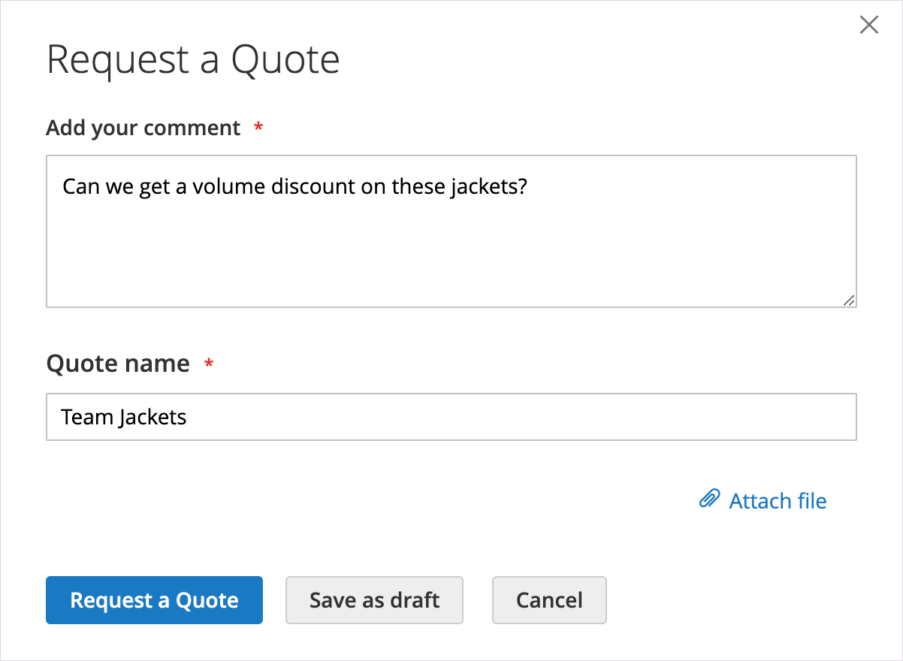

# Demande de devis

Si les devis sont activés dans la configuration [Fonctionnalités de vente](configure-quotes.md), un acheteur autorisé d&#39;une société peut lancer le processus de négociation des prix en demandant un devis dans son panier. Si un acheteur n&#39;est pas prêt à soumettre un devis pour négociation, il peut l&#39;enregistrer en tant que brouillon.

>[!NOTE]
>
>Une demande de devis ne peut pas inclure de codes réduction ou de cartes-cadeaux.

## Expérience de demande de devis client

1. Le client se connecte à son compte utilisateur en tant qu’acheteur avec l’autorisation [autorisation](account-company-roles-permissions.md) pour demander un devis.

1. Ajoute au panier les produits à inclure dans le devis.

   >[!TIP]
   > 
   >Les clients peuvent ajouter plus rapidement une liste de SKU de produit au panier à l’aide de [Commande rapide](quick-order.md).

1. Sélectionne des **[!UICONTROL Request a Quote]**.

   {width="700" zoomable="yes"}

1. Dans la zone de **[!UICONTROL Add your comment]**, le client saisit une brève note pour décrire la demande.

1. Saisit un **[!UICONTROL Quote Name]**.

   {width="400" zoomable="yes"}

1. Si nécessaire, joint un document ou une image à la citation :

   - Sélectionne des **[!UICONTROL Attach file]**.
   - Choisit le fichier à partir de son système.

   Par défaut, un [fichier joint](configure-quotes.md) peut atteindre 2 Mo, dans l’un des formats de fichiers suivants : DOC, DOCX, XLS, XLSX, PDF, TXT, JPG ou JPEG, PNG.

1. Crée et traite le devis :

   - Envoie le devis au vendeur en sélectionnant **[!UICONTROL Request a Quote]**.
   - Enregistre le devis en tant que brouillon en sélectionnant **[!UICONTROL Save as Draft]**.

     Si l&#39;acheteur enregistre le devis en tant que brouillon, le devis est disponible en [!UICONTROL My Quotes] à l&#39;état `Draft`. Le vendeur n&#39;a pas accès aux devis provisoires tant que l&#39;acheteur ne les a pas envoyés pour révision.
