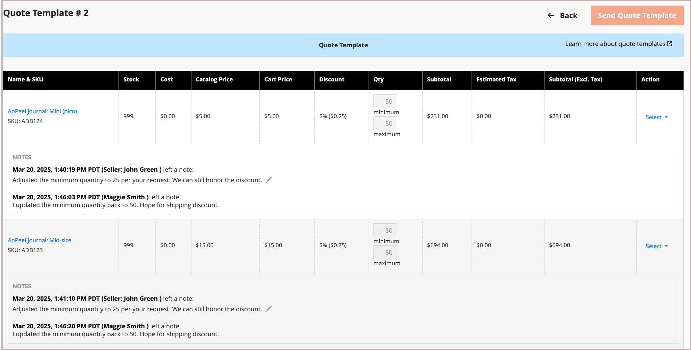

# Cas d’utilisation et workflows des modèles de devis

La fonctionnalité de modèle de devis permet aux acheteurs et aux vendeurs de rationaliser le processus de devis en créant des modèles de devis réutilisables et personnalisables.

- **Devis personnalisables** : les acheteurs peuvent générer des devis liés à partir d&#39;un modèle prévalidé, ce qui permet de les personnaliser selon des paramètres spécifiques tels que les quantités et les sélections d&#39;articles.
- **Seuils de commande** : les vendeurs peuvent définir des engagements de commande minimum et maximum, ce qui garantit que les acheteurs respectent les volumes d&#39;achat convenus. Une fois que l&#39;acheteur a accepté le modèle de devis, le nombre de seuils de commande est incrémenté chaque fois qu&#39;un devis lié est généré. Si le devis lié est fermé sans être converti en commande, la commande est soustraite du nombre seuil. Lorsque le seuil maximum de commande est atteint, le modèle de devis expire.
- **Dates d&#39;expiration** : les modèles peuvent avoir des périodes de validité (*[!UICONTROL Valid Until]*), ce qui garantit que les conditions ne sont applicables que dans une période spécifiée. À l&#39;expiration, le modèle est fermé et tous les devis liés associés sont fermés.
- **Remises et tarification**- Les vendeurs peuvent utiliser les mêmes fonctionnalités d&#39;escompte de ligne, de niveau devis et de prix d&#39;expédition que celles disponibles pour les devis afin de définir des remises pour les commandes récurrentes, ce qui simplifie le processus de négociation.
- **Suivi et reporting** : le système effectue le suivi du nombre de devis liés générés à partir du modèle et des commandes exécutées avec succès afin de fournir des informations sur l&#39;exécution des quotas de commande convenus.
- **Liens de document de référence** : les acheteurs et les vendeurs peuvent ajouter, modifier et gérer des liens de document externes (tels que DocuSign, Adobe Sign ou d&#39;autres services en ligne) au modèle de devis. Vous pouvez ainsi accéder facilement aux contrats et accords associés pendant le processus de modèle de devis.

## Cas d’utilisation

Un acheteur d&#39;entreprise peut utiliser un modèle de devis pour commander un ensemble spécifique de produits sur une période donnée. L&#39;acheteur configure les options de modèle de devis suivantes pour rendre le processus de devis plus efficace, cohérent et aligné sur les accords d&#39;achat stratégiques.

- Seuil de commande permettant de spécifier le nombre minimal et maximal de commandes pouvant bénéficier d’une tarification négociée. Vous pouvez l&#39;utiliser pour appliquer et suivre les quotas de commande spécifiés dans les accords contractuels.

- Seuils de quantité (quantités minimales/maximales) Le modèle spécifie un seuil de quantité pour définir la quantité minimale et maximale pouvant être achetée pour chaque commande, afin que le vendeur puisse gérer efficacement les niveaux de stock tout en offrant à l&#39;acheteur la possibilité d&#39;ajuster les quantités selon ses besoins.

- Des liens vers des documents de référence permettent de maintenir des liens avec des contrats et des accords externes, ce qui facilite l&#39;accès à la documentation connexe pendant le processus de devis.

## Workflow du modèle de devis

Les modèles de devis peuvent être créés par l&#39;acheteur ou le vendeur.

**Etape 1 : Création du modèle de devis (Nouveau)**

- **L&#39;acheteur crée le modèle de devis**

  Lors de la révision d&#39;un devis existant, l&#39;acheteur décide que l&#39;entreprise doit soumettre plusieurs commandes au cours de l&#39;année suivante et souhaite demander des remises supplémentaires en fonction des affaires répétées. Il crée un modèle de devis en utilisant l&#39;action *[!UICONTROL Create quote template]* sur le devis. L&#39;acheteur peut ajouter des liens de documents de référence à des contrats ou des accords externes à l&#39;aide du contrôle *[!UICONTROL Add]* dans la section des documents de référence. Ensuite, il lance la négociation en envoyant le modèle de devis au vendeur pour révision.

  Les acheteurs peuvent également demander un modèle de devis en ajoutant au panier les produits qu&#39;ils souhaitent acheter régulièrement. Ensuite, demandez un devis et indiquez dans les commentaires la fréquence à laquelle ils souhaitent répéter l’achat.

- **Représentant commercial** — Un représentant commercial peut créer un modèle de devis à partir de l&#39;administrateur pour le compte d&#39;un acheteur de société spécifique. Le représentant commercial peut créer le modèle de devis dans l&#39;administrateur à partir d&#39;un devis existant ou de la grille de [!UICONTROL Quote Templates] et l&#39;enregistrer en tant que `draft` ou l&#39;envoyer à l&#39;acheteur pour démarrer la négociation. A l&#39;état de brouillon, le devis n&#39;est visible que par le vendeur. Une fois le devis envoyé, le statut est `Submitted`. Il ne peut pas être modifié par le vendeur tant que l&#39;acheteur ne l&#39;a pas renvoyé.

  {width="700" zoomable="yes"}

  Lorsque le vendeur crée le modèle de devis, la date d&#39;expiration (champ de date de [!UICONTROL Valid until]) est définie par défaut sur 180 jours. Si l&#39;acheteur a créé le modèle, la date d&#39;expiration est vide.  L&#39;acheteur doit définir la date d&#39;expiration avant de renvoyer le modèle à l&#39;acheteur pour révision.

  Lorsque le vendeur crée le modèle de devis, la date d&#39;expiration (champ de date de *[!UICONTROL Valid until]*) est définie par défaut sur 180 jours. Si l&#39;acheteur a créé le modèle, la date d&#39;expiration est vide.  L&#39;acheteur doit définir la date d&#39;expiration avant de renvoyer le modèle à l&#39;acheteur pour révision.

**Étape 2 : Examen et négociation de devis (Examen)**

La consultation ou la négociation d&#39;un modèle de devis peut inclure la modification des quantités, la suppression d&#39;articles, l&#39;ajout de commentaires sur les lignes, l&#39;application de remises sur les lignes ou les devis (vendeur), l&#39;ajout d&#39;une adresse d&#39;expédition (acheteur) et la gestion des liens vers des documents de référence.

- **Le vendeur consulte la demande et envoie la réponse** - Dans l&#39;interface administrateur, le vendeur consulte le modèle de devis dans la grille *[!UICONTROL Quote Templates]** ou l&#39;ouvre à partir du lien dans l&#39;e-mail de notification. Sur le storefront, le statut du devis passe à `Pending`, et l&#39;acheteur ne peut effectuer aucune modification. En suivant le même processus pour [négociation de devis](quote-price-negotiation.md), le vendeur répond en offrant des remises sur les prix et en ajustant les quantités et les articles selon les besoins, saisit un commentaire et renvoie le modèle de devis à l&#39;acheteur. Le vendeur peut également ajouter, modifier ou supprimer des liens vers des documents de référence au cours de ce processus. L&#39;acheteur et le représentant commercial sont informés par courrier électronique que le vendeur a répondu.

- **L&#39;acheteur consulte le modèle de devis du vendeur et envoie une réponse** - L&#39;acheteur clique sur le lien dans l&#39;e-mail de notification pour ouvrir le modèle de devis ou l&#39;ouvre à partir de la page _Mes modèles de devis_ du tableau de bord du compte. L&#39;acheteur peut laisser des notes au vendeur au niveau de la ligne ou du devis, modifier les quantités, supprimer des articles et gérer les liens vers les documents de référence.

L&#39;acheteur et le vendeur poursuivent le processus de négociation jusqu&#39;à ce qu&#39;un accord soit conclu ou jusqu&#39;à ce que le vendeur refuse le modèle de devis. Si l&#39;acheteur apporte des modifications au modèle de devis (ajout ou suppression de produits, modification des quantités de produits ou modification des liens de document de référence), il doit le retourner au vendeur pour révision.

- **L&#39;acheteur ajoute une adresse de livraison** - S&#39;il n&#39;en a pas, l&#39;acheteur doit ajouter une au modèle de devis. Une fois que l&#39;acheteur a ajouté l&#39;adresse, le vendeur peut fournir des options d&#39;expédition et de livraison. Les méthodes d’expédition affichées dépendent de la configuration de Storefront.

Si l&#39;acheteur ajoute une adresse d&#39;expédition, l&#39;accord de négociation doit être examiné, et le vendeur peut poursuivre le processus de négociation jusqu&#39;à ce qu&#39;un accord soit conclu, ou le vendeur refuse le modèle de devis.

**Étape 3 : L&#39;acheteur accepte le modèle de devis**

L&#39;acheteur accepte les conditions négociées dans le modèle. Une fois le modèle de devis accepté, l&#39;acheteur peut l&#39;utiliser pour [générer des devis préapprouvés et liés](account-dashboard-my-quote-templates.md#generate-a-linked-quote) qui peuvent être utilisés pour soumettre des commandes sans nécessiter de négociation supplémentaire.

Les options d’expédition sont verrouillées lors du passage en caisse.

Les modèles de devis restent actifs jusqu&#39;à leur expiration, leur annulation ou leur fermeture, ou jusqu&#39;à ce que l&#39;acheteur n&#39;ait plus atteint le nombre maximum de commandes.

### Afficher un modèle de devis

1. Dans la colonne **[!UICONTROL Actions]** d&#39;un enregistrement, cliquez sur **[!UICONTROL View]**.

1. Pour répondre à la demande du client, suivez les instructions et lancez le même processus [négociation de prix](quote-price-negotiation.md) que celui utilisé pour négocier les devis.

### Afficher l&#39;activité du modèle de devis

Affichez le calendrier de négociation, la communication et toute autre activité de modèle de devis à partir de l&#39;[!UICONTROL Comments] et du [!UICONTROL History Log]. Les informations incluent les changements de statut, les mises à jour des informations sur le client et l&#39;expédition, les mises à jour d&#39;article et de prix, ainsi que d&#39;autres informations importantes.

1. Ouvrez un modèle de devis.

1. Affichez les commentaires et l&#39;historique des négociations de devis en faisant défiler l&#39;écran jusqu&#39;à **[!UICONTROL Negotiation]**, puis en sélectionnant **[!UICONTROL Comments]** et **[!UICONTROL History Log]**.

   {width="400" zoomable="yes"}

1. L’historique est également suivi au niveau des lignes.

   {width="400" zoomable="yes"}

### Refuser un modèle de devis

Seuls les modèles de devis avec un statut `In Review` peuvent être refusés.

1. Dans la grille de *[!UICONTROL Quote Templates]*, ouvrez le modèle de devis que vous souhaitez refuser.

1. Dans le modèle de devis, cliquez sur **[!UICONTROL Decline]**.

1. Lorsque vous y êtes invité, saisissez le motif du refus du devis et cliquez sur **[!UICONTROL Confirm]**.
