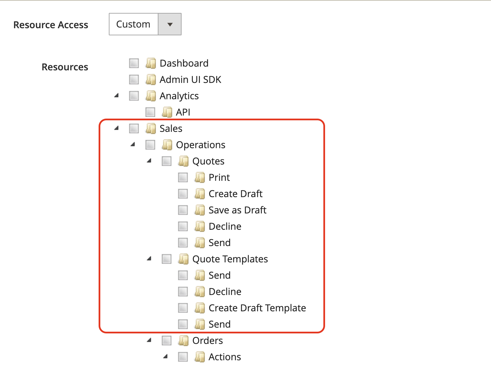

# Devis Négociables

Les acheteurs et les vendeurs utilisent des devis pour gérer le processus de négociation d&#39;un article à ajouter à une commande, mettre à jour les quantités, demander et appliquer des remises, etc., jusqu&#39;à ce qu&#39;ils parviennent à un accord. Le processus de négociation de devis peut être initié par un acheteur autorisé de la société ou par un représentant commercial de la société.

{width="700" zoomable="yes"}

Une fois le devis créé, le processus de négociation commence lorsque l&#39;acheteur ou le vendeur soumet le devis pour révision. La grille _Devis_ qui répertorie chaque devis reçu et conserve un historique de la communication entre l&#39;acheteur et le vendeur. Utilisez les [contrôles de lieu de travail](../getting-started/admin-workspace.md) standard pour filtrer la liste, modifier la disposition des colonnes, enregistrer les vues et exporter les données.

- En vitrine, les acheteurs envoient le devis sous la forme d’une [demande de négociation](quote-price-negotiation.md) du prix figurant dans le panier. Lors de la création de la demande de devis, un acheteur peut enregistrer le devis en tant que brouillon ou l&#39;envoyer directement au vendeur.

- Dans l&#39;administrateur, les représentants commerciaux peuvent créer des devis au nom de l&#39;acheteur de la société. Lors de la création du devis, un vendeur peut enregistrer le devis en tant que brouillon ou le soumettre directement à l&#39;acheteur pour lancer le processus de négociation.

Au cours du processus de négociation, le devis ne peut être mis à jour que par la personne qui examine et propose les conditions en vue d&#39;une négociation ultérieure.

## Conditions préalables

Les devis négociables ne sont disponibles que si Adobe Commerce dispose des paramètres de configuration suivants :

- [L’extension Adobe Commerce B2B est installée](install.md)
- [Fonctionnalités B2B configurées](enable-basic-features.md)
   - Activer les comptes d’entreprise
   - Activer le devis B2B

## Workflow de devis

Les devis peuvent être initiés par l&#39;acheteur ou le vendeur.

Ce diagramme montre les statuts d&#39;un devis pour un acheteur et un vendeur (administrateur) dans les différentes étapes lorsque vous lancez un devis.

{width="700" zoomable="yes"}

**Etape 1 : Création de devis (Nouveau)**

- **L&#39;acheteur demande un devis** - L&#39;acheteur [demande un devis](quote-request.md) dans le panier. La demande apparaît dans la liste _Mes devis_ du tableau de bord du compte de l&#39;acheteur et une notification par e-mail est envoyée au vendeur affecté au compte de la société. Dans l’Administration, la demande apparaît dans la grille _Devis_, avec un statut de `New`. Une demande de devis peut être modifiée par l&#39;acheteur jusqu&#39;à ce qu&#39;elle soit ouverte par le vendeur.

  {width="700" zoomable="yes"}

- **Représentant commercial** — Un représentant commercial peut [créer un devis](sales-rep-initiates-quote.md) de l&#39;administrateur pour le compte d&#39;un acheteur de société spécifique. Le représentant commercial doit mettre à jour le devis pour ajouter des produits et d&#39;autres informations telles que des remises et des notes à l&#39;acheteur. Le représentant commercial peut enregistrer le devis en tant que `draft` ou l&#39;envoyer à l&#39;acheteur pour commencer la négociation. A l&#39;état de brouillon, le devis n&#39;est visible que par le vendeur. Une fois le devis envoyé, le statut est `Submitted`. Il ne peut pas être modifié par le vendeur tant que l&#39;acheteur ne l&#39;a pas renvoyé.

  {width="700" zoomable="yes"}

**Étape 2 : Examen et négociation de devis (Examen)**

La consultation ou la négociation d&#39;un devis peut inclure la modification des quantités, la suppression d&#39;articles, l&#39;ajout de commentaires sur les lignes, l&#39;application de remises sur les lignes ou les devis (vendeur) et l&#39;ajout d&#39;une adresse de livraison (acheteur).

- **Le vendeur consulte la demande et envoie une réponse** - Dans l’administration, le vendeur consulte la demande de devis. Sur le storefront, le statut du devis passe à `Pending`, et l&#39;acheteur ne peut effectuer aucune modification. Le [vendeur répond](quote-price-negotiation.md) en offrant des remises sur les prix et en ajustant les quantités et les articles selon les besoins, saisit un commentaire et renvoie le devis à l&#39;acheteur. L&#39;acheteur et le représentant commercial sont informés par courrier électronique que le vendeur a répondu.

- **L&#39;acheteur consulte le devis du vendeur et envoie une réponse** - L&#39;acheteur clique sur le lien dans l&#39;e-mail de notification pour ouvrir le devis, ou ouvre le devis à partir de la page _Mes devis_ du tableau de bord du compte. L&#39;acheteur peut laisser des notes au vendeur au niveau de la ligne ou du devis, modifier les quantités et supprimer des articles.

L&#39;acheteur et le vendeur peuvent poursuivre le processus de négociation jusqu&#39;à ce qu&#39;un accord soit conclu ou jusqu&#39;à ce que le vendeur refuse le devis. Si l&#39;acheteur apporte des modifications au devis (ajout ou suppression de produits ou modification de la quantité de produits), le devis doit être retourné au vendeur pour examen.

- **L&#39;acheteur ajoute une adresse de livraison** - L&#39;acheteur peut ajouter une adresse de livraison au devis. Une fois que l&#39;acheteur a ajouté l&#39;adresse, le vendeur peut fournir des options d&#39;expédition et de livraison. Les méthodes d’expédition affichées dépendent de la configuration de Storefront.

Si l&#39;acheteur ajoute une adresse d&#39;expédition, l&#39;accord de négociation doit être examiné, et le vendeur peut poursuivre le processus de négociation jusqu&#39;à ce qu&#39;un accord soit conclu, ou le vendeur refuse le devis.

**Étape 3 : l&#39;acheteur accepte le devis (passage en caisse)**

L&#39;acheteur accepte le prix proposé et passe en caisse. Impossible d&#39;ajouter des remises supplémentaires au devis négocié.

Les options d’expédition sont verrouillées lors du passage en caisse.

## Statut du devis

Le statut du devis fournit des informations sur le statut actuel du devis dans le workflow de devis. Le statut d&#39;un devis ne change que lorsqu&#39;un acheteur ou un vendeur effectue une action sur le devis. Par exemple, le statut devient Commande si un acheteur sélectionne [!UICONTROL Proceed to Checkout] dans un devis actif.

- *[!UICONTROL New]** - L&#39;acheteur a soumis une demande de devis, mais le vendeur ne l&#39;a pas consultée. La demande peut être mise à jour par l&#39;acheteur jusqu&#39;à ce qu&#39;elle soit ouverte par le vendeur.

- **[!UICONTROL Draft]** - Le vendeur crée un devis provisoire pour un acheteur. Le devis n&#39;est pas visible pour l&#39;acheteur tant que le vendeur n&#39;a pas ajouté les détails de l&#39;offre (articles, quantité, remise, etc.) et soumis le devis à l&#39;acheteur.

- **[!UICONTROL Open]** - Le vendeur a ouvert la demande et est en train de l&#39;examiner et de préparer une réponse

- **[!UICONTROL Submitted]** - Le vendeur a envoyé une réponse à l&#39;acheteur. L&#39;enregistrement de devis ne peut pas être modifié pendant le processus de négociation.

- **[!UICONTROL Client Reviewed]** - L&#39;acheteur a vu la réponse du vendeur et est en train de préparer une réponse.

- **[!UICONTROL Updated]** - L&#39;acheteur a soumis une réponse, mais le vendeur ne l&#39;a pas vue.

- **[!UICONTROL Ordered]** - L&#39;acheteur a soumis la commande en fonction du devis négocié.

- **[!UICONTROL Closed]** - L&#39;acheteur a annulé la demande de devis.

- **[!UICONTROL Declined]** - Le vendeur a refusé la demande de devis. Toute tarification personnalisée est supprimée du devis et l&#39;enregistrement n&#39;est plus modifié.

- **[!UICONTROL Expired]** - L&#39;acheteur n&#39;a pas répondu à la réponse du vendeur dans le délai imparti et le devis n&#39;est plus valide.

## Ressources de rôle B2B pour les devis de magasin

Les options de configuration des devis sont contrôlées à l&#39;aide de la [ressource de rôle](../systems/permissions-user-roles.md#role-resources). Ces ressources de rôle doivent être définies pour le rôle d’utilisateur administrateur affecté à l’administrateur du magasin.

Pour accorder l’accès aux fonctions de devis dans l’administration, accédez à **[!UICONTROL System]** > _[!UICONTROL Permissions]_>**[!UICONTROL User Roles]**, sélectionnez le rôle, puis accédez à [!UICONTROL Sales] > [!UICONTROL Operations] > [!UICONTROL Quotes] dans l’arborescence_ Ressources de rôle _.

{width="700" zoomable="yes"}

## Appliquer une action

Dans Admin, les administrateurs et les vendeurs B2B peuvent gérer les devis à partir de la grille de devis à l&#39;aide du menu [!UICONTROL Actions].

{width="700" zoomable="yes"}

1. Dans la barre latérale _Admin_, accédez à **[!UICONTROL Sales]** > **[!UICONTROL Quotes]**.

1. Dans la première colonne de la grille, cochez la case de chaque enregistrement auquel vous souhaitez appliquer l&#39;action.

1. Dans la **[!UICONTROL Actions]**, sélectionnez l’action à appliquer.

### Afficher un devis

1. Dans la colonne **[!UICONTROL Actions]** d&#39;un enregistrement, cliquez sur **[!UICONTROL View]**.

1. Pour répondre à la demande du client, suivez les instructions et lancez le processus [négociation des prix](quote-price-negotiation.md).

### Afficher l&#39;activité de devis

Affichez la chronologie de négociation, la communication et les autres activités de devis à partir de l&#39;[!UICONTROL Comments] et du [!UICONTROL History Log]. Les informations incluent les changements de statut, les mises à jour des informations sur le client et l&#39;expédition, les mises à jour d&#39;article et de prix, ainsi que d&#39;autres informations importantes.

1. Ouvrez un devis.

1. Affichez les commentaires et l&#39;historique des négociations de devis en faisant défiler l&#39;écran jusqu&#39;à **[!UICONTROL Negotiation]**, puis en sélectionnant **[!UICONTROL Comments]** et **[!UICONTROL History Log]**.

   {width="400"}

1. L’historique est également suivi au niveau des lignes.

   {width="400"}

### Refuser une demande de devis

Seules les demandes de devis avec un statut `Open` peuvent être refusées.

1. Sélectionnez chaque demande de devis ouverte que vous souhaitez refuser.

1. Définissez la commande _[!UICONTROL Actions]_&#x200B;sur `Declined`.

1. Lorsque vous y êtes invité, saisissez le motif du refus du devis et cliquez sur **[!UICONTROL Confirm]**.

   {width="400"}
