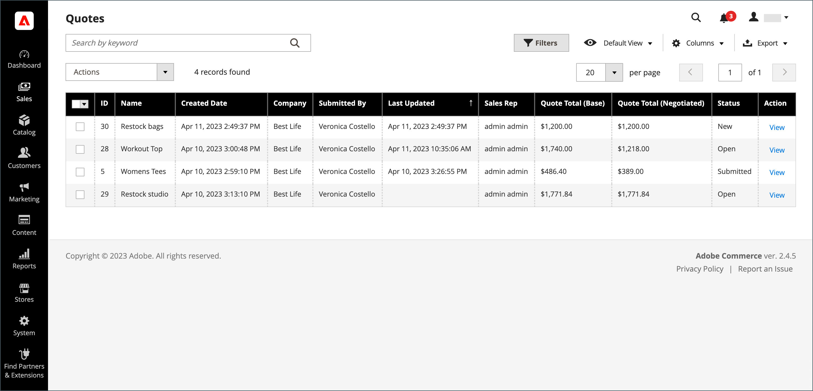

# Devis négociables

Les acheteurs et les vendeurs utilisent les guillemets pour gérer le processus de négociation d’un ajout de commande, de la mise à jour des quantités, de la demande et de l’application de remises, etc., jusqu’à ce qu’ils parviennent à un accord. Le processus de négociation des devis peut être initié par un acheteur autorisé d’une société ou par un représentant commercial de la société.

Les devis peuvent être initiés par un acheteur d&#39;entreprise autorisé ou un représentant commercial. Une fois le devis créé, le processus de négociation commence lorsque l’acheteur ou le vendeur l’envoie pour examen. La variable _Guillemets_ grille qui répertorie chaque devis reçu et garde un historique de la communication entre l&#39;acheteur et le vendeur. Utilisez la méthode standard [contrôles sur le lieu de travail](../getting-started/admin-workspace.md) pour filtrer la liste, modifiez la disposition des colonnes, enregistrez les vues et exportez les données.

- Dans le storefront, les acheteurs soumettent le devis en tant que [demande de négociation](quote-price-negotiation.md) le prix du panier. Lors de la création de la demande de devis, un acheteur peut enregistrer le devis en tant que brouillon ou le soumettre directement au vendeur.

- Dans l’administrateur, les vendeurs peuvent créer des devis pour le compte de l’acheteur de la société. Lors de la création du devis, un vendeur peut enregistrer le devis en tant que brouillon ou le soumettre directement à l&#39;acheteur pour lancer le processus de négociation.

Au cours du processus de négociation, la citation ne peut être mise à jour que par la personne qui examine et qui propose des termes pour d&#39;autres négociations.

## Conditions préalables

Les guillemets négociables ne sont disponibles que si Adobe Commerce dispose des paramètres de configuration suivants :

- [L’extension B2B pour Adobe Commerce est installée.](install.md)
- [Fonctionnalités B2B configurées](enable-basic-features.md)
   - Activation des comptes d’entreprise
   - Activer le guillemet B2B

## Processus des citations

Les devis peuvent être initiés par l&#39;acheteur ou le vendeur.

**Etape 1 : création de citations**

- **Demande de devis pour les acheteurs** - L&#39;acheteur [demande un devis](quote-request.md) du panier. La requête apparaît dans la variable _Mes citations_ La liste figurant dans le tableau de bord du compte de l’acheteur est envoyée par courrier électronique au représentant commercial affecté au compte de la société. Dans l’Admin, la requête apparaît dans la variable _Guillemets_ grille, avec l’état `New`. Une demande de devis peut être modifiée par l&#39;acheteur jusqu&#39;à ce qu&#39;elle soit ouverte par le vendeur.

  {width="700" zoomable="yes"}

- **représentant commercial** — Un représentant commercial peut [créer un guillemet](sales-rep-initiates-quote.md) de l’administrateur au nom d’un acheteur de société spécifique. Le représentant commercial doit mettre à jour le devis pour ajouter à l&#39;acheteur des produits et d&#39;autres informations comme des remises et des notes. La représentation commerciale peut enregistrer le guillemet comme `draft` ou l&#39;envoyer à l&#39;acheteur pour lancer la négociation. En version préliminaire, la citation est visible uniquement pour le vendeur. Une fois le guillemet envoyé, l’état est `Submitted`. Il ne peut pas être modifié par le vendeur tant que l&#39;acheteur ne l&#39;a pas renvoyé.

  {width="700" zoomable="yes"}

**Etape 2 : examen et négociation des citations**

**Le vendeur consulte la demande et envoie une réponse** - Dans l’Admin, le vendeur affiche la demande de devis. Le statut du guillemet change en `Pending`, et l’acheteur ne peut apporter aucune modification. La variable [les réponses du vendeur](quote-price-negotiation.md) en proposant un prix réduit pour les produits du devis, saisit un commentaire et renvoie le devis à l&#39;acheteur. L&#39;acheteur et le représentant commercial sont informés par email que le vendeur a répondu.

**L’utilisateur consulte les citations du vendeur et envoie une réponse** - L’acheteur clique sur le lien contenu dans la notification électronique pour ouvrir le devis ou ouvre le devis à partir du _Mes citations_ du tableau de bord du compte. L’acheteur peut laisser des notes au vendeur au niveau de l’article ou du devis et supprimer des articles.

L&#39;acheteur et le vendeur peuvent poursuivre le processus de négociation jusqu&#39;à ce qu&#39;un accord soit trouvé, ou le vendeur refuse le devis. Si l’acheteur modifie le devis (ajout ou suppression de produits ou modification des quantités de produits), le devis doit être renvoyé au vendeur pour révision.

**Étape 4 : l’acheteur accepte les guillemets** - L&#39;acheteur accepte le prix proposé et continue de faire le paiement. Des remises supplémentaires ne peuvent pas être ajoutées au devis négocié.

## Ressources de rôle B2B pour les guillemets de magasin

Les options de configuration des guillemets sont contrôlées à l’aide de la fonction [ressources de rôle](../systems/permissions-user-roles.md#role-resources). Ces ressources de rôle doivent être définies pour le rôle d’utilisateur administrateur attribué à l’administrateur du magasin.

Pour accorder l’accès aux fonctions de devis dans l’administrateur, accédez à **[!UICONTROL System]** > _[!UICONTROL Permissions]_>**[!UICONTROL User Roles]**, sélectionnez le rôle et accédez à [!UICONTROL Sales] > [!UICONTROL Operations] > [!UICONTROL Quotes] dans le_ Ressources de rôle _arborescence.

## Application d’une action

Dans l’administrateur, les administrateurs et les vendeurs B2B peuvent gérer les guillemets de la grille de devis à l’aide de la fonction [!UICONTROL Actions] .

{width="700" zoomable="yes"}

1. Sur le _Administration_ barre latérale, accédez à **[!UICONTROL Sales]** > **[!UICONTROL Quotes]**.

1. Dans la première colonne de la grille, cochez la case correspondant à chaque enregistrement auquel vous souhaitez appliquer l’action.

1. Dans le **[!UICONTROL Actions]** sélectionnez l’action à appliquer.

### Afficher un guillemet

1. Dans le **[!UICONTROL Actions]** pour un enregistrement, cliquez sur **[!UICONTROL View]**.

1. Pour répondre à la demande du client, suivez les instructions et commencez le [négociation des prix](quote-price-negotiation.md) processus.

### Activité Afficher le guillemet

Affichez la chronologie de la négociation, la communication et toute autre activité de devis à partir de la [!UICONTROL Comments] et [!UICONTROL History Log]: ces informations comprennent les modifications d’état, les mises à jour des informations sur les clients et les envois, les mises à jour des articles et des prix, ainsi que d’autres informations importantes.

1. Ouvre une citation.

1. Affichez les commentaires et l’historique de la négociation de devis en faisant défiler la page vers **[!UICONTROL Negotiation]** et en sélectionnant **[!UICONTROL Comments]** et **[!UICONTROL History Log]**.

   {width="400"}

1. L’historique est également suivi au niveau des éléments de ligne.

   {width="400"}

### Refuser une demande de devis

Seules les requêtes de guillemet avec une `Open` peut être refusé.

1. Sélectionnez chaque demande de devis ouverte que vous souhaitez refuser.

1. Définissez la variable _[!UICONTROL Actions]_contrôler à `Declined`.

1. Lorsque vous y êtes invité, saisissez la raison pour laquelle le devis a été refusé, puis cliquez sur **[!UICONTROL Confirm]**.

   {width="400"}

## Descriptions des colonnes

| Colonne | Description |
|---------------------------------------|------------------------------------------------------------------------------------------------------------------------------------------------------------------------------------------------------------------------------------------------------------------------------------------------------------------------------------------------------------------------------------------------------------------------------------------------------------------------------------------------------------------------------------------------------------------------------------------------------------------------------------------------------------------------------------------------------------------------------------------------------------------------------------------------------------------------------------------------------------------------------------------------------------------------------------------------------------------------------------------------------------------------------------------------------------------------------------------------------------------------------------------------------------------------------------------------------------------------------------------------------------------------------------------------------------------------------------------------------------------------------------------------------------------------------------------------------------------------------------------------------------------------------------------------------------------------------------------------------------------------------------------------------------------------------------------------------------------------------------|
| [!UICONTROL Select] | Pour sélectionner les guillemets à soumettre à une action, cochez la case ou utilisez le contrôle de sélection dans l’en-tête de la colonne. Options : Tout sélectionner/Tout désélectionner |
| [!UICONTROL ID] | Identifiant numérique unique attribué lorsqu’une demande de devis est envoyée depuis le panier d’achat d’un acheteur. Lors de l’affichage du détail du guillemet, l’identifiant s’affiche en haut de la page, au lieu du nom du guillemet. |
| [!UICONTROL Name] | Nom attribué à une demande de devis par l’acheteur. |
| [!UICONTROL Created Date] | Date et heure auxquelles l’acheteur a d’abord soumis la demande de devis. |
| [!UICONTROL Company] | Nom de la société au nom de laquelle un acheteur envoie une demande de devis. |
| [!UICONTROL Submitted By] | Prénom et nom de l’acheteur de la société qui envoie une demande de devis. |
| [!UICONTROL Last Updated] | Date et heure de la dernière communication entre l’acheteur et le vendeur concernant le devis. |
| [!UICONTROL Sales Rep] | Prénom et nom du représentant commercial qui gère le compte de l’acheteur. |
| [!UICONTROL Quote Total (Base)] | Prix total des produits à acheter en fonction du devis original. Le montant total apparaît dans la devise de base du site web et dans la devise du storefront. |
| [!UICONTROL Quote Total (Negotiated)] | Le prix total des produits à acheter selon le devis négocié. Ce total est calculé automatiquement par le système et inclut toutes les remises au niveau des lignes ou des guillemets appliquées par le vendeur. Le montant total apparaît dans la devise de base du site web et dans la devise du storefront. |
| [!UICONTROL Status] | Indique l’état actuel d’une requête de devis. Le statut d&#39;un devis ne peut être modifié que par une action de la part de l&#39;acheteur ou du vendeur. Voir également les paramètres d’état de la section [compte de l&#39;acheteur](account-dashboard-my-quotes.md).<ul><li>**[!UICONTROL New]** - L&#39;acheteur a soumis une demande de devis, mais elle n&#39;a pas été consultée par le vendeur. La demande peut être mise à jour par l&#39;acheteur jusqu&#39;à ce qu&#39;elle soit ouverte par le vendeur.</li><li>**[!UICONTROL Draft]** - Le vendeur crée un devis préliminaire pour un acheteur. Le devis n&#39;est pas visible pour l&#39;acheteur tant que le vendeur n&#39;a pas ajouté les détails de l&#39;offre (articles, quantité, réduction, etc.) et l&#39;a envoyé à l&#39;acheteur.</li> <li>**[!UICONTROL Open]** - Le vendeur a ouvert la demande et est en train de la réviser et de préparer une réponse. </li><li>**[!UICONTROL Submitted]** - Le vendeur a envoyé une réponse à l&#39;acheteur. L’enregistrement de citation ne peut pas être modifié pendant le processus de négociation.</li><li>**[!UICONTROL Client Reviewed]** - L&#39;acheteur a consulté la réponse du vendeur et est en train de préparer une réponse.</li><li>**[!UICONTROL Updated]** - L&#39;acheteur a soumis une réponse, mais elle n&#39;a pas été vue par le vendeur.</li><li>**[!UICONTROL Ordered]** - L&#39;acheteur a soumis la commande sur la base du devis négocié.</li><li>**[!UICONTROL Closed]** - L&#39;acheteur a annulé la demande de devis.</li><li>**[!UICONTROL Declined]** - Le vendeur a refusé la demande de devis. Toute tarification personnalisée est supprimée du devis et l’enregistrement est verrouillé pour les modifications ultérieures.</li><li>**[!UICONTROL Expired]** - L&#39;acheteur n&#39;a pas répondu à la réponse du vendeur dans le délai imparti et le devis n&#39;est plus valable.</li></ul> |
| [!UICONTROL Actions] | **[!UICONTROL View]** - Ouvre la demande de devis et conserve un enregistrement de la négociation entre l&#39;acheteur et le vendeur. |

{style="table-layout:auto"}

## Barre de boutons

| Bouton | Description |
|----------------------------|----------------------------------------------------------------------------------------------------------------------------------------------------------------------------------------------------------------------------------------------------------------------------------------------------------------------------------------------------------------------------------------------------|
| [!UICONTROL Send] | Envoie la citation mise à jour comme réponse à l&#39;enquête de l&#39;acheteur. Ce bouton est désactivé si le vendeur attend une réponse de l&#39;acheteur. |
| [!UICONTROL Back] | Renvoie à la variable _Guillemets_ sans enregistrer les modifications. |
| [!UICONTROL Create Copy] | [!BADGE Fonctionnalités 1.5.0 bêta]{type=Informative url="/help/b2b/release-notes.md" tooltip="Disponible uniquement pour les participants au programme bêta"}`<original quote name> (copy)`. Modifiez le nom en modifiant la valeur dans la variable [!UICONTROL Name] et enregistrer le guillemet en tant que brouillon. |
| [!UICONTROL Print] | Envoie le guillemet à une imprimante ou l’enregistre sous la forme d’un fichier de PDF. |
| [!UICONTROL Create a copy] | Crée une copie du guillemet nommé `<original quote name> (copy)` et l’ouvre. Renommez et mettez à jour le nouveau devis si nécessaire avant de l’enregistrer en tant que brouillon ou de l’envoyer à l’acheteur. |
| [!UICONTROL Save as Draft] | Enregistre les modifications apportées au devis, mais ne le renvoie pas à l’acheteur. |
| [!UICONTROL Decline] | Refusent de négocier les prix, soit lors de l&#39;enquête initiale, soit pendant les négociations en cours. Lorsqu&#39;une citation est refusée, le vendeur doit ajouter un commentaire pour expliquer la décision. Lorsqu’un guillemet est refusé, tous les prix négociés sont réinitialisés aux valeurs d’origine. Ce bouton est désactivé lorsque le vendeur attend une réponse de l&#39;acheteur. |

{style="table-layout:auto"}

## Exemple de guillemet

La figure suivante illustre un exemple de la vue détaillée des guillemets dans l’Admin avec certains paramètres configurés.

{width="700" zoomable="yes"}

>[!NOTE]
>
>[!BADGE Fonctionnalités 1.5.0 bêta]{type=Informative url="/help/b2b/release-notes.md" tooltip="Disponible uniquement pour les participants au programme bêta"}
