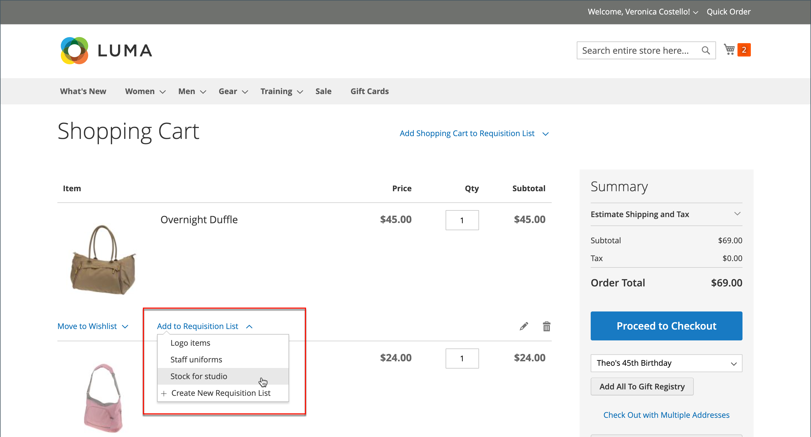

# Listes de demandes

L’utilisation d’une liste de demandes d’achat permet de gagner du temps lors de l’achat de produits fréquemment commandés, car les articles sont ajoutés directement au panier à partir de la liste. Les acheteurs peuvent gérer plusieurs listes qui se concentrent sur des produits provenant de différents fournisseurs, acheteurs, équipes, campagnes ou tout autre élément qui simplifie leur workflow. Il est disponible pour les utilisateurs connectés et les invités.

>[!NOTE]
>
>Pour activer les listes de demande pour votre magasin, voir [Activation des fonctionnalités B2B](enable-basic-features.md). Jusqu’à 999 listes de demandes peuvent être conservées pour chaque compte d’acheteur, selon la [configuration](configure-requisition-lists.md).

La fonctionnalité Liste de demandes est similaire aux listes de souhaits, avec les différences suivantes :

- Une liste de demandes d’achat n’est pas effacée après l’envoi d’articles au panier. Il peut être utilisé plusieurs fois.
- L’interface utilisateur des listes de demandes d’approvisionnement utilise une vue compacte pour afficher de nombreux éléments.

{width="600" zoomable="yes"}

## Création d’une liste de demandes d’approvisionnement à partir du tableau de bord du compte

Un acheteur connecté associé à un compte de société peut créer une liste de demandes à partir du tableau de bord de son compte.

1. Dans la barre latérale de leur compte, choisissez **[!UICONTROL My Requisition Lists]**.

1. Sur la page _[!UICONTROL Requisition Lists]_, cliquez sur **[!UICONTROL Create New Requisition List]**.

1. Entrez les **[!UICONTROL Requisition List Name]** et **[!UICONTROL Description]**.

   {width="300"}

1. Une fois l’opération terminée, cliquez sur **[!UICONTROL Save]**.

## Création d’une liste de demandes d’achat à partir d’une page de produits

Un acheteur connecté associé à un compte de société peut créer une liste de demandes à partir d’une page de produits. Cette méthode fournit un raccourci facile pour créer la liste et ajouter le produit.

1. Sur la page des détails du produit, l’acheteur clique sur **[!UICONTROL Add to Requisition List]**.

1. Clics **[!UICONTROL Create New Requisition List]**.

1. Entrez les **[!UICONTROL Requisition List Name]** et **[!UICONTROL Description]**.

1. Une fois l’opération terminée, cliquez sur **[!UICONTROL Save]**.

## Ajout de produits à une liste de demandes

Les acheteurs peuvent ajouter des produits à une liste de demandes à partir de :

- Pages de produit
- Une page de catalogue
- Le panier
- Commandes existantes
- Guillemets existants

### Depuis une page Détails d’un produit

1. Depuis le storefront, l&#39;acheteur accède à la page de détails du produit à ajouter à la liste de demande.

1. Clique sur **[!UICONTROL Add to Requisition List]** et effectue l’une des opérations suivantes :

   - Choisit une liste de commandes existante.
   - Crée une liste de demandes d’approvisionnement.

   {width="700" zoomable="yes"}

### Depuis une page de catalogue

1. Depuis le storefront, l’acheteur accède à la page de catalogue qui contient le produit à ajouter à la liste de demande.

1. Passez la souris sur le produit.

1. Clique sur **[!UICONTROL Add to Requisition List]** et effectue l’une des opérations suivantes :

   - Choisit une liste de commandes existante.
   - Crée une liste de demandes d’approvisionnement.

   {width="700" zoomable="yes"}

### Dans une commande existante

1. Dans la barre latérale du tableau de bord de leur compte, l’acheteur choisit **[!UICONTROL My Orders]**.

1. En haut de la commande, cliquez sur **[!UICONTROL Add to Requisition List]** et effectuez l’une des opérations suivantes :

   - Choisit une liste de commandes existante.
   - Crée une liste de demandes d’approvisionnement.

   {width="700" zoomable="yes"}

### D’un guillemet existant

À partir d’un devis négociable, les acheteurs peuvent utiliser l’option [!UICONTROL Move to Requisition List] pour déplacer les produits du devis vers une liste de demandes existante. S’il n’existe aucune liste de demandes d’approvisionnement, l’option [!UICONTROL Move to Requisition List] n’est pas disponible.

1. Dans la barre latérale du tableau de bord de leur compte, l’acheteur sélectionne **[!UICONTROL My Quotes]**.

1. Recherchez et accédez au guillemet souhaité dans la liste.

1. Dans l’onglet [!UICONTROL Items Quoted], sélectionnez le produit à déplacer.

1. En utilisant la liste déroulante [!UICONTROL Select] de la colonne [!UICONTROL Actions] pour l’élément de ligne de produit, choisissez **[!UICONTROL Move to Requisition list]**.

1. Sélectionnez la liste des demandes pour les éléments sélectionnés.

1. Cliquez sur **[!UICONTROL Move item to Requisition List]**.

Pour plus d’informations sur les guillemets B2B, voir la rubrique [Mes guillemets](account-dashboard-my-quotes.md) .

### Depuis le panier

1. Sous l’élément , l’acheteur clique sur le menu **[!UICONTROL Add to Requisition List]** et effectue l’une des opérations suivantes :

   - Choisit une liste de commandes existante.
   - Crée une liste de demandes d’approvisionnement.

   {width="700" zoomable="yes"}

## Afficher la liste des demandes mise à jour

Lorsqu’il est connecté à son compte, un acheteur peut utiliser l’une des méthodes suivantes pour afficher l’une de ses listes de commandes.

{width="700" zoomable="yes"}

### Depuis le tableau de bord du compte

1. Dans la barre latérale du tableau de bord de leur compte, choisissez **[!UICONTROL My Requisition Lists]**.

1. Dans la liste des listes de demandes d’acquisition, cliquez sur **[!UICONTROL View]** dans la colonne _Actions_ .

### Depuis n’importe quelle page de storefront

1. Dans la barre de liens rapides située en haut de la page, cliquez sur leur nom d’utilisateur.

1. Dans le menu, choisissez **[!UICONTROL My Requisition Lists]**.
