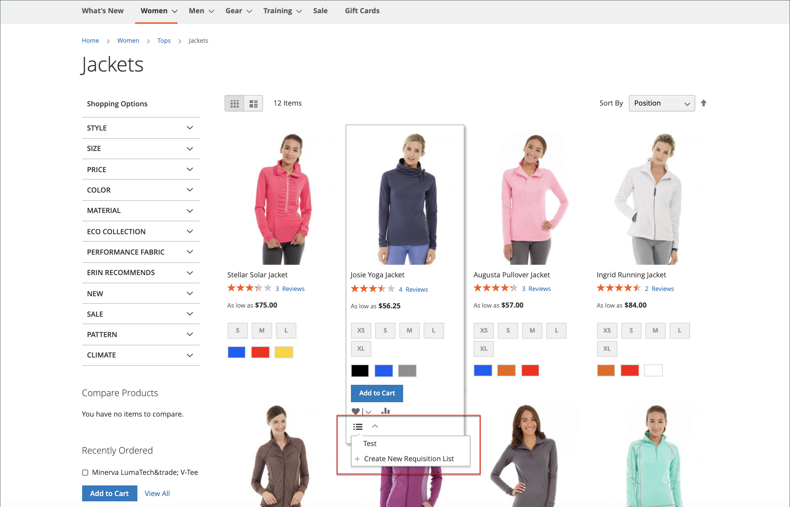

# Listes de demandes

L’utilisation d’une liste de demandes d’achat permet de gagner du temps lors de l’achat de produits fréquemment commandés, car les articles sont ajoutés directement au panier à partir de la liste. Les clients peuvent tenir à jour plusieurs listes qui se concentrent sur des produits provenant de différents fournisseurs, acheteurs, équipes, campagnes ou tout autre élément qui simplifie leur workflow. Il est disponible pour les utilisateurs connectés et les invités.

>[!NOTE]
>
>Pour activer les listes de demande pour votre magasin, reportez-vous à la section [Activation des fonctionnalités B2B](enable-basic-features.md). Il peut permettre de gérer jusqu’à 999 listes de demandes d’achat pour chaque compte client, en fonction de la variable [configuration](configure-requisition-lists.md).

La fonctionnalité Liste de demandes est similaire aux listes de souhaits, avec les différences suivantes :

- Une liste de demandes d’achat n’est pas effacée après l’envoi d’articles au panier. Il peut être utilisé plusieurs fois.
- L’interface utilisateur des listes de demandes d’approvisionnement utilise une vue compacte pour afficher de nombreux éléments.

{width="600" zoomable="yes"}

## Création d’une liste de demandes d’approvisionnement à partir du tableau de bord du compte

Un client connecté associé à un compte de société peut créer une liste de demandes à partir du tableau de bord de son compte.

1. Dans la barre latérale de leur compte, choisissez **[!UICONTROL My Requisition Lists]**.

1. Sur le _[!UICONTROL Requisition Lists]_page, clics **[!UICONTROL Create New Requisition List]**.

1. entre dans la variable **[!UICONTROL Requisition List Name]** et **[!UICONTROL Description]**.

   {width="300"}

1. Une fois l’opération terminée, cliquez sur **[!UICONTROL Save]**.

## Création d’une liste de demandes d’achat à partir d’une page de produits

Un client connecté associé à un compte d’entreprise peut créer une liste de demandes à partir d’une page de produits. Cette méthode fournit un raccourci facile pour créer la liste et ajouter le produit.

1. Sur la page des détails du produit, le client clique sur **[!UICONTROL Add to Requisition List]**.

1. Clics **[!UICONTROL Create New Requisition List]**.

1. entre dans la variable **[!UICONTROL Requisition List Name]** et **[!UICONTROL Description]**.

1. Une fois l’opération terminée, cliquez sur **[!UICONTROL Save]**.

## Ajout de produits à une liste de demandes

Les clients peuvent ajouter des produits à une liste de demandes à partir de :

- Pages de produit
- Une page de catalogue
- Le panier
- Commandes existantes

### Depuis une page Détails d’un produit

1. Depuis le storefront, le client accède à la page des détails du produit à ajouter à la liste des demandes.

1. Clics **[!UICONTROL Add to Requisition List]** et effectue l’une des opérations suivantes :

   - Choisit une liste de commandes existante.
   - Crée une liste de demandes d’approvisionnement.

   {width="700" zoomable="yes"}

### Depuis une page de catalogue

1. Depuis le storefront, le client accède à la page du catalogue qui contient le produit à ajouter à la liste des demandes d’achat.

1. Passez la souris sur le produit.

1. Clics **[!UICONTROL Add to Requisition List]** et effectue l’une des opérations suivantes :

   - Choisit une liste de commandes existante.
   - Crée une liste de demandes d’approvisionnement.

   {width="700" zoomable="yes"}

### Dans une commande existante

1. Dans la barre latérale du tableau de bord de leur compte, le client choisit **[!UICONTROL My Orders]**.

1. En haut de la commande, cliquez sur **[!UICONTROL Add to Requisition List]** et effectue l’une des opérations suivantes :

   - Choisit une liste de commandes existante.
   - Crée une liste de demandes d’approvisionnement.

   {width="700" zoomable="yes"}

### Depuis le panier

1. Sous l’élément , le client clique sur la variable **[!UICONTROL Add to Requisition List]** et effectue l’une des opérations suivantes :

   - Choisit une liste de commandes existante.
   - Crée une liste de demandes d’approvisionnement.

   {width="700" zoomable="yes"}

## Afficher la liste des demandes mise à jour

Lorsqu’il est connecté à son compte, un client peut utiliser l’une des méthodes suivantes pour afficher l’une de ses listes de commandes.

{width="700" zoomable="yes"}

### Depuis le tableau de bord du compte

1. Dans la barre latérale du tableau de bord de leur compte, choisissez **[!UICONTROL My Requisition Lists]**.

1. Dans la liste des listes de demandes d’acquisition, les clics **[!UICONTROL View]** dans le _Actions_ colonne .

### Depuis n’importe quelle page de storefront

1. Dans la barre de liens rapides située en haut de la page, cliquez sur leur nom d’utilisateur.

1. Dans le menu, sélectionnez **[!UICONTROL My Requisition Lists]**.
