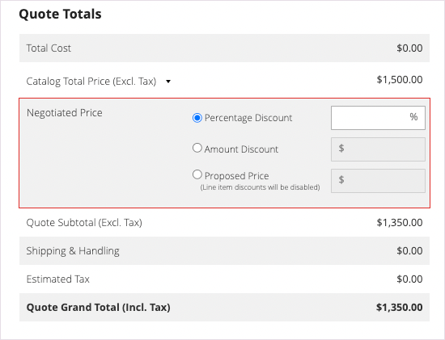

# Lancement d’un devis pour un acheteur

Si les devis sont activés dans la [configuration des fonctionnalités de vente](configure-quotes.md), un représentant commercial peut lancer le processus de négociation avec un acheteur d’entreprise en créant un devis de l’administrateur.

- Les devis préliminaires ne sont visibles que par le vendeur.
- Les projets de devis ne peuvent pas être soumis tant que le représentant commercial n&#39;a pas ajouté d&#39;articles, de remises appropriées et de notes pour créer l&#39;offre initiale pour l&#39;acheteur.
- Un vendeur peut créer un guillemet à partir des devis ou de la grille client.

Le représentant commercial envoie le devis à l&#39;acheteur pour lancer le processus de négociation. Voir [Négocier une citation](quote-price-negotiation.md).

## Expérience de création de devis par le représentant commercial

Un représentant commercial peut créer un guillemet à partir des guillemets ou de la grille client.

>[!NOTE]
>
>Pour une démonstration vidéo d’un vendeur créant un devis pour un acheteur, reportez-vous à la section [Le représentant commercial lance le devis](https://experienceleague.adobe.com/docs/commerce-learn/tutorials/b2b/b2b-quote/sales-rep-initiates-quote.html?lang=fr) dans _Vidéos et Tutorials Commerce_.

### Créer un guillemet à partir de la grille entre guillemets

1. Le représentant commercial se connecte à l’administrateur en tant qu’administrateur avec les [&#x200B; autorisations d’exploitation commerciale &#x200B;](../systems/permissions.md) pour gérer les devis.

1. Dans Admin, accédez à la grille [!UICONTROL Quotes] en sélectionnant **[!UICONTROL Sales]**, puis sélectionnez **[!UICONTROL Quotes]**.

1. Créez un devis pour un acheteur.

   - Dans la grille Guillemets, sélectionnez **[!UICONTROL Create New Quote]**.

     {width="700" zoomable="yes"}

   - Sur la page [!UICONTROL Create New Quote], sélectionnez le client (acheteur de société) pour créer le devis.

     {width="700" zoomable="yes"}

     Un nouveau guillemet s’affiche à l’état `Draft`.

     {width="700" zoomable="yes"}

   - Mettez à jour le nom du guillemet modifiez la date d’expiration si nécessaire.

   - Enregistrez le guillemet en tant que brouillon.

## Préparer le devis pour l&#39;acheteur

Après avoir créé le projet de devis, ajoutez des produits, appliquez des remises et communiquez avec l’acheteur en ajoutant des commentaires et tous les fichiers associés au devis. Ensuite, envoyez le devis à l’acheteur pour révision, ou enregistrez-le en tant que brouillon.

1. Ajoutez des éléments au guillemet en sélectionnant **[!UICONTROL Add Product By SKU]**. Saisissez le numéro et la quantité du SKU, puis sélectionnez **[!UICONTROL Add Product]**.

   {width="675" zoomable="yes"}

1. Appliquez des remises sur les articles aux produits selon les besoins.

   - Dans le menu d’actions [!UICONTROL Select], choisissez **[!UICONTROL Discount Item]**.

   - Sur le formulaire [!UICONTROL Discount Line item], sélectionnez le **[!UICONTROL Discount Type]**.

     {width="675" zoomable="yes"}

   - Dans le champ [!UICONTROL Discount] , saisissez la valeur du type de remise. Par exemple, si vous avez sélectionné un pourcentage de remise, saisissez 10 pour appliquer une remise de 10 % à l’article.

   - Vous pouvez éventuellement verrouiller la valeur de remise de l’article afin que le prix du produit ne soit pas réduit davantage par les remises appliquées au niveau du devis.

     Après avoir confirmé la modification, les attributs de ligne dans la grille de produit sont mis à jour pour afficher le montant de remise appliqué. Si la remise est verrouillée, une icône de verrouillage s’affiche.

   Un représentant commercial peut demander une remise sur une ligne spécifique dans un guillemet.

   >[!NOTE]
   >
   >Pour une démonstration vidéo montrant comment les remises sur l’article fonctionnent, reportez-vous à la section [Le représentant commercial applique une remise sur une ligne de devis](https://experienceleague.adobe.com/docs/commerce-learn/tutorials/b2b/b2b-quote/quote-line-item-discount.html?lang=fr) dans _Vidéos et Tutorials Commerce_.

1. Appliquez une remise de niveau guillemet si nécessaire :

   - Dans la section [!UICONTROL Quote Totals - Negotiated Price] , sélectionnez le type de remise, puis saisissez la valeur à appliquer.

     {width="700" zoomable="yes"}

   La grille de produit est mise à jour pour afficher la remise.

1. Ajoutez des informations supplémentaires pour l’acheteur.

   Dans l’onglet **[!UICONTROL Negotiation - Comments]**, ajoutez une note et joignez tous les fichiers annexes requis pour l’acheteur.

   {width="700" zoomable="yes"}

   Par défaut, un [fichier joint](configure-quotes.md) peut atteindre 2 Mo, dans n’importe quel format de fichier suivant : DOC, DOCX, XLS, XLSX, PDF, TXT, JPG ou JPEG, PNG.

1. Ajoutez l’adresse de livraison lors des négociations.

   Un représentant commercial peut effectuer une sélection de livraison une fois que l’acheteur a ajouté une adresse de livraison au devis.

   Les options d’expédition sont verrouillées lors du passage en caisse.

   Pour plus d’informations, voir [Mes guillemets](account-dashboard-my-quotes.md#adding-a-shipping-address).

1. Traitez la citation.

   Enregistrez le devis en tant que brouillon ou envoyez-le à l&#39;acheteur.

   - Si vous enregistrez le guillemet en tant que brouillon, l’état est mis à jour vers `Draft` et un message de confirmation s’affiche.

   - Si vous envoyez le devis à l’acheteur, l’état passe à `Submitted`. L&#39;acheteur reçoit une notification électronique pour examiner le devis. Le devis est verrouillé jusqu&#39;à ce que l&#39;acheteur le rende pour plus de négociations. Le vendeur peut visualiser le devis à partir de la grille Devis ou de la grille Client .

## Affichage et création de guillemets à partir de la grille client

1. Dans Admin, accédez à la grille [!UICONTROL Customer] en sélectionnant **[!UICONTROL Customers]**, puis sélectionnez **[!UICONTROL All Customers]**.

1. Sélectionnez l’ID de client pour un acheteur de société.

   {width="700" zoomable="yes"}

1. Sélectionnez **[!UICONTROL Edit]** pour afficher les informations sur le client.

1. Créez un devis pour le client en sélectionnant, **[!UICONTROL Create Quote]** et en suivant le processus pour mettre à jour le devis préliminaire et l’envoyer au client.

1. Affichez les guillemets existants des clients en sélectionnant **[!UICONTROL Quotes]**.

   {width="700" zoomable="yes"}

1. Ouvrez un guillemet en sélectionnant **[!UICONTROL View]**.

Pour plus d’informations sur la gestion du processus de négociation de devis, voir [Négocier un devis](quote-price-negotiation.md)
