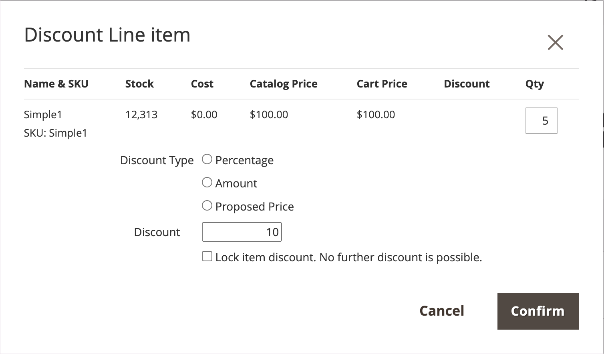
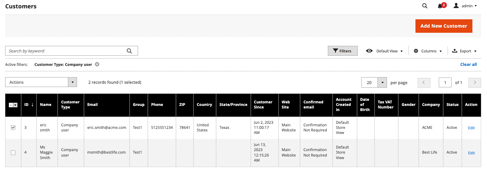
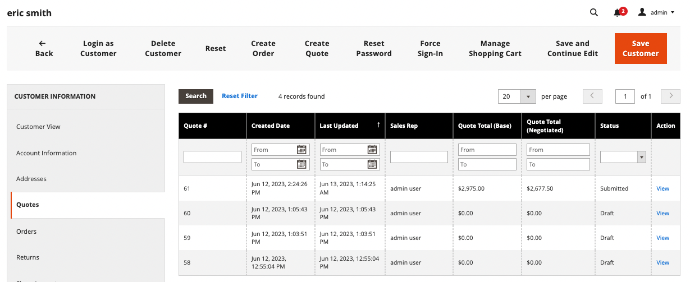

# Lancer un devis pour un acheteur

Si les devis sont activés dans la [configuration des fonctions de vente](configure-quotes.md), un commercial peut lancer le processus de négociation avec un acheteur de la société en créant un devis à partir de l&#39;administrateur.

- Les devis provisoires ne sont visibles que par le vendeur.
- Les devis provisoires ne peuvent pas être envoyés tant que le vendeur n&#39;a pas ajouté des articles, des remises pertinentes et des notes pour créer l&#39;offre initiale pour l&#39;acheteur.
- Un vendeur peut créer un devis à partir de la grille de devis ou de la grille client.

Le représentant commercial envoie le devis à l&#39;acheteur pour lancer le processus de négociation. Voir [Négocier un devis](quote-price-negotiation.md).

## Expérience de création de devis de représentant commercial

Un représentant commercial peut créer un devis à partir des devis ou de la grille client.

>[!NOTE]
>
>Pour une démonstration vidéo d’un vendeur qui crée un devis pour un acheteur, voir [Le représentant commercial initie le devis](https://experienceleague.adobe.com/docs/commerce-learn/tutorials/b2b/b2b-quote/sales-rep-initiates-quote.html?lang=fr) dans _Vidéos et tutoriels Commerce_.

### Créer un devis à partir de la grille de devis

1. Le commercial se connecte à l’administrateur en tant qu’administrateur avec les autorisations [Opérations de vente](../systems/permissions.md) pour gérer les devis.

1. Dans Admin, accédez à la grille de [!UICONTROL Quotes] en sélectionnant **[!UICONTROL Sales]**, puis sélectionnez **[!UICONTROL Quotes]**.

1. Créez un devis pour un acheteur.

   - Dans la grille Devis, sélectionnez **[!UICONTROL Create New Quote]**.

     {width="700" zoomable="yes"}

   - Sur la page [!UICONTROL Create New Quote], sélectionnez le client (acheteur de la société) pour créer le devis.

     {width="700" zoomable="yes"}

     Une nouvelle citation s&#39;affiche dans le statut `Draft`.

     {width="700" zoomable="yes"}

   - Mettez à jour le nom du devis et modifiez la date d’expiration si nécessaire.

   - Enregistrez le devis en tant que brouillon.

## Préparer le devis pour l&#39;acheteur

Après avoir créé le devis provisoire, ajoutez des articles de produit, appliquez des remises et communiquez avec l&#39;acheteur en ajoutant des commentaires et tout fichier associé au devis. Ensuite, envoyez le devis à l&#39;acheteur pour révision ou enregistrez-le en tant que brouillon.

1. Ajoutez des articles au devis en sélectionnant **[!UICONTROL Add Product By SKU]**. Saisissez le numéro de SKU et la quantité, puis sélectionnez **[!UICONTROL Add Product]**.

   {width="675" zoomable="yes"}

1. Appliquez des remises pour ligne à des produits selon vos besoins.

   - Dans le menu d’action [!UICONTROL Select], choisissez **[!UICONTROL Discount Item]**.

   - Sur le formulaire [!UICONTROL Discount Line item], sélectionnez le **[!UICONTROL Discount Type]**.

     {width="675" zoomable="yes"}

   - Dans le champ [!UICONTROL Discount] , saisissez la valeur pour le type de remise. Par exemple, si vous avez sélectionné une remise en pourcentage, saisissez 10 pour appliquer une remise de 10 % à la ligne.

   - Le cas échéant, verrouillez la valeur de remise de l&#39;article de ligne afin que le prix du produit ne soit plus réduit par les remises appliquées au niveau du devis.

     Après avoir confirmé la modification, les attributs d&#39;élément de ligne dans la grille de produits sont mis à jour pour afficher le montant de la remise appliquée. Si la remise est verrouillée, une icône de verrouillage s’affiche.

   Un représentant commercial peut demander une remise pour un article de ligne spécifique dans un devis.

   >[!NOTE]
   >
   >Pour une démonstration vidéo montrant comment fonctionnent les remises sur l’élément de ligne, reportez-vous à la section [Le représentant commercial applique une remise à un élément de ligne de devis](https://experienceleague.adobe.com/docs/commerce-learn/tutorials/b2b/b2b-quote/quote-line-item-discount.html?lang=fr) dans _Vidéos et tutoriels Commerce_.

1. Appliquez une remise au niveau du devis selon les besoins :

   - Dans la section [!UICONTROL Quote Totals - Negotiated Price] , sélectionnez le type de remise, puis saisissez la valeur à appliquer.

     {width="700" zoomable="yes"}

   La grille de produits se met à jour pour afficher la remise.

1. Ajoutez des informations supplémentaires pour l&#39;acheteur.

   Dans l&#39;onglet **[!UICONTROL Negotiation - Comments]**, ajoutez une note et joignez tous les documents justificatifs requis pour l&#39;acheteur.

   {width="700" zoomable="yes"}

   Par défaut, un [fichier joint](configure-quotes.md) peut atteindre 2 Mo, dans l’un des formats de fichiers suivants : DOC, DOCX, XLS, XLSX, PDF, TXT, JPG ou JPEG, PNG.

1. Ajouter l&#39;adresse de livraison pendant les négociations.

   Un représentant commercial peut effectuer une sélection d&#39;expédition et de livraison une fois que l&#39;acheteur a ajouté une adresse d&#39;expédition au devis.

   Les options d’expédition sont verrouillées lors du passage en caisse.

   Pour plus d&#39;informations, voir [Mes devis](account-dashboard-my-quotes.md#adding-a-shipping-address).

1. Traitez le devis.

   Enregistrez le devis en tant que brouillon ou envoyez-le à l&#39;acheteur.

   - Si vous enregistrez le devis en tant que brouillon, le statut est mis à jour sur `Draft` et un message de confirmation s&#39;affiche.

   - Si vous envoyez le devis à l&#39;acheteur, le statut passe à `Submitted`. L&#39;acheteur reçoit une notification par e-mail pour examiner le devis. Le devis est verrouillé jusqu&#39;à ce que l&#39;acheteur le retourne pour négociation ultérieure. Le vendeur peut afficher le devis à partir de la grille de devis ou de la grille client.

## Afficher et créer des devis à partir de la grille client

1. Dans Admin, accédez à la grille de [!UICONTROL Customer] en sélectionnant **[!UICONTROL Customers]**, puis sélectionnez **[!UICONTROL All Customers]**.

1. Sélectionnez l’ID client pour un acheteur d’entreprise.

   {width="700" zoomable="yes"}

1. Sélectionnez **[!UICONTROL Edit]** pour afficher les informations sur le client.

1. Créez un devis pour le client en sélectionnant, en **[!UICONTROL Create Quote]** et en suivant le processus pour mettre à jour le devis provisoire et l&#39;envoyer au client.

1. Affichez les devis existants des clients en sélectionnant **[!UICONTROL Quotes]**.

   {width="700" zoomable="yes"}

1. Ouvrez un devis en sélectionnant **[!UICONTROL View]**.

Pour plus d&#39;informations sur la gestion du processus de négociation de devis, voir [&#x200B; Négocier un devis &#x200B;](quote-price-negotiation.md)
