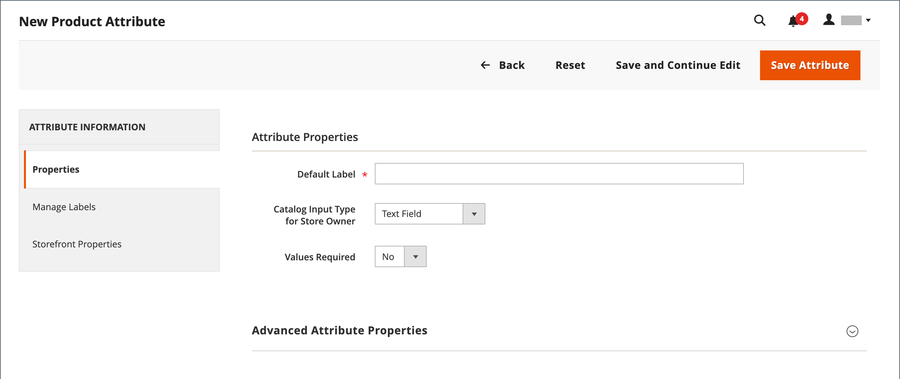
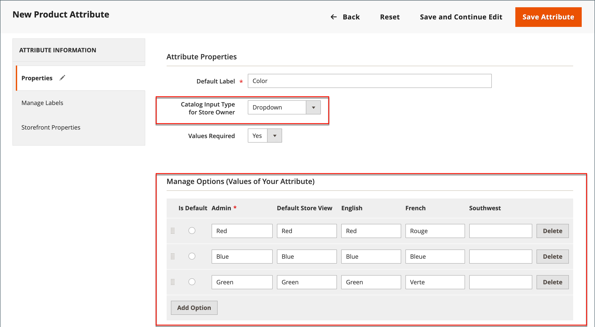

# Créer et supprimer des attributs de produit

Vous pouvez créer des attributs lorsque vous travaillez sur un produit ou à partir de la page _[!UICONTROL Product Attributes]_. Les étapes suivantes indiquent comment créer des attributs à partir du menu&#x200B;_[!UICONTROL Stores]_.

## Étape 1 : décrire les propriétés d’attribut de base

1. Dans la barre latérale _Admin_, accédez à **[!UICONTROL Stores]** > _[!UICONTROL Attributes]_>**[!UICONTROL Product]**.

1. Cliquez sur **[!UICONTROL Add New Attribute]**.

   {width="600" zoomable="yes"}

1. Par **[!UICONTROL Default Label]**, saisissez un libellé qui identifie l’attribut.

1. Pour déterminer le type de contrôle d&#39;entrée utilisé pour la saisie de données, définissez **[!UICONTROL Catalog Input Type for Store Owner]** sur l&#39;une des options suivantes :

   | Propriété | Description |
   |--- |--- |
   | `Text Field` | Champ de saisie d’une seule ligne pour le texte. |
   | `Text Area` | Champ de saisie de plusieurs lignes permettant de saisir des paragraphes de texte, tels qu’une description de produit. Vous pouvez utiliser l’éditeur WYSIWYG pour formater le texte avec des balises HTML ou saisir directement les balises dans le texte. |
   | `Text Editor` | Un éditeur de texte entièrement opérationnel à l’emplacement des attributs. |
   | Date | Affiche une valeur de date au [format préféré](attributes-input-types.md#date-and-time-options) et [fuseau horaire](../getting-started/store-details.md#locale-options). Les valeurs de date peuvent être sélectionnées dans une liste ou un calendrier (  ).   **_Remarque :_**&#x200B;selon la configuration de votre système, les utilisateurs_administrateurs _peuvent saisir des dates directement dans un champ ou sélectionner une date dans le calendrier ou la liste. Pour plus d’informations sur la spécification des valeurs de date et d’heure, voir [Options de date et d’heure](attributes-input-types.md#date-and-time-options). |
   | `Yes/No` | Affiche une liste déroulante avec les options prédéfinies de `Yes` et `No`. |
   | `Dropdown` | Affiche une liste déroulante de valeurs qui accepte une seule sélection. Le type d’entrée de liste déroulante est un composant clé des [produits configurables](product-create-configurable.md). |
   | `Multiple Select` | Affiche une liste déroulante de valeurs qui accepte plusieurs sélections. |
   | `Price` | Ce type d’entrée est utilisé pour créer des champs de prix qui s’ajoutent aux attributs prédéfinis : Prix, Prix spécial, Prix de niveau et Coût. La devise utilisée est déterminée par votre configuration système. |
   | `Media Image` | Associe une image supplémentaire à un produit, comme le logo d’un produit, des instructions d’entretien ou les ingrédients d’une étiquette alimentaire. Lorsque vous ajoutez un attribut d’image multimédia au jeu d’attributs d’un produit, il devient un type d’image supplémentaire, avec Base, Petit et Miniature. L’attribut image du média peut être exclu du [navigateur de médias storefront](catalog-images-video.md#storefront-media-browser). |
   | `Fixed Product Tax` | Permet de définir des [taux FPT](../stores-purchase/fixed-product-tax.md) en fonction des exigences de vos paramètres régionaux. |
   | `Visual Swatch` | Affiche un échantillon représentant la couleur, la texture ou le motif d’un produit configurable. Un [échantillon visuel](swatches.md) peut être rempli avec une valeur de couleur hexadécimale ou afficher une image téléchargée qui représente la couleur, la matière, la texture ou le motif de l’option. |
   | `Text Swatch` | Représentation textuelle d’une option de produit configurable fréquemment utilisée pour la taille. [Nuancier de texte](swatches.md#text-based-swatches) peut également inclure des valeurs de couleur hexadécimales. |
   | `Page Builder` | Un espace de travail [Page Builder](../page-builder/introduction.md) entièrement fonctionnel à l’emplacement des attributs qui facilite l’ajout de contenu attrayant à la page de produit. |

   {style="table-layout:auto"}

1. Si vous souhaitez exiger une sélection d’options avant que le client puisse acheter le produit, définissez **[!UICONTROL Values Required]** sur `Yes`.

1. Pour les types d’entrée [!UICONTROL Dropdown] et [!UICONTROL Multiple Select], procédez comme suit :

   - Sous _[!UICONTROL Manage Options]_, cliquez sur **[!UICONTROL Add Option]**.

   - Saisissez la première valeur qui doit apparaître dans la liste.

     Vous pouvez saisir une valeur pour l’administrateur et une traduction de la valeur pour chaque vue de magasin. Si vous n’avez qu’une seule vue de magasin, vous ne pouvez saisir que la valeur Admin. Elle est également utilisée pour le storefront.

   - Cliquez sur **[!UICONTROL Add Option]** et répétez l’étape précédente pour chaque option que vous souhaitez inclure dans la liste.

   - Sélectionnez **[!UICONTROL Is Default]** pour utiliser l’option comme valeur par défaut.

   {width="600" zoomable="yes"}

## Étape 2 : décrire les propriétés avancées (si nécessaire)

1. Saisissez un **[!UICONTROL Attribute Code]** unique en minuscules et sans espaces.

   >[!NOTE]
   >
   >Il n’est pas recommandé d’utiliser la valeur `type` dans le champ [!UICONTROL Attribute Code] . Cela peut entraîner des erreurs, car la valeur `type` est réservée à une utilisation système.

   {width="600" zoomable="yes"}

   Les options disponibles dépendent du paramètre _[!UICONTROL Catalog Input Type for Store Owner]_.

1. Définissez **[!UICONTROL Scope]** pour indiquer où, dans votre hiérarchie [ magasin](../getting-started/websites-stores-views.md) l’attribut peut être utilisé.

1. Pour empêcher toute entrée de valeurs en double, définissez **[!UICONTROL Unique Value]** sur `Yes`.

1. Pour les types d’entrée qui sont des valeurs saisies, exécutez un test de validité de toutes les données saisies dans un champ de texte en définissant **[!UICONTROL Input Validation for Store Owner]** sur le type de données que le champ doit contenir.

   Ce champ n’est pas disponible pour les types d’entrée avec des valeurs sélectionnées. Le test peut valider l’un des éléments suivants :

   - `Decimal Number`
   - `Integer Number`
   - `Email`
   - `URL`
   - `Letters`
   - `Letters (a-z, A-Z) or Numbers (0-9)`

   {width="400"}

1. Pour ajouter cet attribut à la [liste de produits](products-list.md), définissez les options suivantes sur `Yes`.

   - **Ajouter aux options de colonne** - Inclut l’attribut en tant que colonne dans la liste _[!UICONTROL Products]_.
   - **Utiliser dans les options de filtre** : ajoute un contrôle de filtre à l’en-tête de colonne dans la liste _[!UICONTROL Products]_.

## Étape 3 : saisir le libellé du champ

1. Dans le volet de navigation de gauche, choisissez **[!UICONTROL Manage Labels]**.

1. Saisissez un **[!UICONTROL Title]** à utiliser comme libellé pour le champ.

   Si votre boutique est disponible dans différentes langues, vous pouvez saisir un titre traduit pour chaque affichage.

   {width="600" zoomable="yes"}

## Étape 4 : décrire les propriétés du storefront

1. Dans le volet de navigation de gauche, choisissez **[!UICONTROL Storefront Properties]**.

   {width="600" zoomable="yes"}

   Les options disponibles dépendent du paramètre _[!UICONTROL Catalog Input Type for Store Owner]_.

1. Si l’attribut doit être disponible pour la recherche, définissez **[!UICONTROL Use in Search]** sur `Yes`.

   - Définissez la valeur **[!UICONTROL Search Weight]** pour contrôler où l’élément apparaît dans les résultats de recherche : 1 (poids le plus faible) à 10 (poids le plus élevé).

   - Définissez la **[!UICONTROL Visible in Advanced Search]** selon vos besoins. En savoir plus sur la [Recherche avancée](search.md#advanced-search).

1. Pour inclure l’attribut dans la comparaison de produits, définissez **[!UICONTROL Comparable on Storefront]** sur `Yes`.

1. Pour les champs de liste déroulante, de sélection multiple et de prix, procédez comme suit :

   - Pour utiliser l’attribut comme filtre dans la navigation superposée, définissez **[!UICONTROL Use in Layered Navigation]** sur `Yes`.

   - Pour utiliser l’attribut dans une navigation superposée sur les pages de résultats de recherche, définissez **[!UICONTROL Use in Search Results Layered Navigation]** sur `Yes`.

   - Par **[!UICONTROL Position]**, saisissez un nombre pour indiquer la position relative de l’attribut dans le bloc de navigation superposé.

1. Pour utiliser l’attribut dans les règles de prix, définissez **[!UICONTROL Use for Promo Rule Conditions]** sur `Yes`.

1. Pour permettre la mise en forme du texte avec HTML, définissez **[!UICONTROL Allow HTML Tags on Frontend]** sur `Yes`.

   Ce paramètre rend l’éditeur WYSIWYG disponible pour le champ.

1. Pour inclure l’attribut dans la page de produit, définissez **[!UICONTROL Visible on Catalog Pages on Storefront]** sur `Yes`.

1. Renseignez les paramètres suivants s’ils sont pris en charge par votre thème :

   - Pour inclure l’attribut dans les listes de produits, définissez **[!UICONTROL Used in Product Listing]** sur `Yes`.

   - Pour utiliser l’attribut comme paramètre de tri pour les listes de produits, définissez **[!UICONTROL Used for Sorting in Product Listing]** sur `Yes`.

1. Cliquez ensuite sur **[!UICONTROL Save Attribute]**.

## Étape 5 : affecter l’attribut créé au jeu d’attributs

Pour qu’un attribut soit visible sur la page de création du produit, ajoutez-le à un jeu d’attributs spécifique.

1. Après avoir terminé les étapes précédentes, accédez à **[!UICONTROL Stores]** > _[!UICONTROL Attributes]_>**[!UICONTROL Attribute Set]**.

1. Sélectionnez le jeu d’attributs dont vous avez besoin dans la liste, puis ouvrez-le en mode d’édition.

1. Faites glisser l’attribut créé de la liste de **[!UICONTROL Unassigned Attributes]** vers le dossier approprié dans la colonne **Groupes**.

1. Cliquez ensuite sur **[!UICONTROL Save]**.

## Attributs pour les produits configurables

Tout attribut utilisé comme liste déroulante d’options pour un [produit configurable](product-create-configurable.md) doit posséder les propriétés suivantes :

| Propriété | Valeur |
|----------|------ |
| Type d’entrée de catalogue pour le propriétaire de la boutique | Liste déroulante |
| Champ d’application | Global |

{style="table-layout:auto"}

## Suppression d’un attribut

Lorsqu’un attribut est supprimé, il est supprimé de tous les produits et jeux d’attributs associés. Les attributs système font partie des fonctionnalités principales de votre magasin et ne peuvent pas être supprimés.

Avant de supprimer un attribut, assurez-vous qu’il n’est actuellement utilisé par aucun produit de votre catalogue. Pour déterminer facilement si un attribut est en cours d’utilisation, utilisez l’outil [Export](../systems/data-export.md) afin de vérifier la liste des attributs d’entité du produit. Si l’attribut n’est pas inclus dans la liste, il n’est utilisé par aucun produit du catalogue.

**_Pour supprimer un attribut :_**

1. Dans la barre latérale _Admin_, accédez à **[!UICONTROL Stores]** > _[!UICONTROL Attributes]_>**[!UICONTROL Product]**.

1. Recherchez l’attribut dans la liste, puis ouvrez-le en mode d’édition.

1. Cliquez sur **[!UICONTROL Delete Attribute]**.

   {width="600" zoomable="yes"}

1. Lorsque vous êtes invité à confirmer, cliquez sur **[!UICONTROL OK]**.
