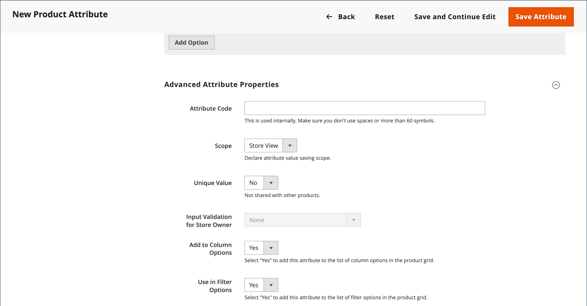
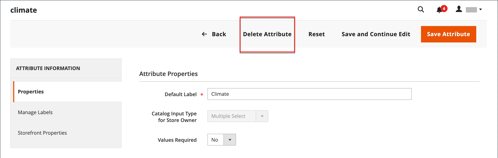

# Créer et supprimer des attributs de produit

Vous pouvez créer des attributs lorsque vous travaillez sur un produit ou à partir de la page _[!UICONTROL Product Attributes]_. Les étapes suivantes indiquent comment créer des attributs à partir du menu_[!UICONTROL Stores]_.

## Étape 1 : décrire les propriétés d’attribut de base

1. Dans la barre latérale _Admin_, accédez à **[!UICONTROL Stores]** > _[!UICONTROL Attributes]_>**[!UICONTROL Product]**.

1. Cliquez sur **[!UICONTROL Add New Attribute]**.

   {width="600" zoomable="yes"}

1. Par **[!UICONTROL Default Label]**, saisissez un libellé qui identifie l’attribut.

1. Définissez **[!UICONTROL Catalog Input Type for Store Owner]** sur le type de [contrôle de saisie](attributes-input-types.md) à utiliser pour la saisie de données.

   Si l’attribut est utilisé pour un [produit configurable](product-create-configurable.md), choisissez `Dropdown`. Définissez ensuite **[!UICONTROL Required]** sur `Yes`.

1. Si vous souhaitez exiger une sélection d’options avant que le client puisse acheter le produit, définissez **[!UICONTROL Values Required]** sur `Yes`.

1. Pour les types d’entrée [!UICONTROL Dropdown] et [!UICONTROL Multiple Select], procédez comme suit :

   - Sous _[!UICONTROL Manage Options]_, cliquez sur **[!UICONTROL Add Option]**.

   - Saisissez la première valeur qui doit apparaître dans la liste.

     Vous pouvez saisir une valeur pour l’administrateur et une traduction de la valeur pour chaque vue de magasin. Si vous n’avez qu’une seule vue de magasin, vous ne pouvez saisir que la valeur Admin. Elle est également utilisée pour le storefront.

   - Cliquez sur **[!UICONTROL Add Option]** et répétez l’étape précédente pour chaque option que vous souhaitez inclure dans la liste.

   - Sélectionnez **[!UICONTROL Is Default]** pour utiliser l’option comme valeur par défaut.

   {width="600" zoomable="yes"}

## Étape 2 : décrire les propriétés avancées (si nécessaire)

1. Saisissez un **[!UICONTROL Attribute Code]** unique en minuscules et sans espaces.

   >[!NOTE]
   >
   >Il n’est pas recommandé d’utiliser la valeur `type` dans le champ [!UICONTROL Attribute Code] . Cela peut entraîner des erreurs, car la valeur `type` est réservée à une utilisation système.

   {width="600" zoomable="yes"}

   Les options disponibles dépendent du paramètre _[!UICONTROL Catalog Input Type for Store Owner]_.

1. Pour indiquer où l’attribut peut être utilisé dans votre hiérarchie de [magasin](../getting-started/websites-stores-views.md), définissez **[!UICONTROL Scope]**.

1. Pour empêcher toute entrée de valeurs en double, définissez **[!UICONTROL Unique Value]** sur `Yes`.

1. Pour les types d’entrée qui sont des valeurs saisies, exécutez un test de validité de toutes les données saisies dans un champ de texte en définissant **[!UICONTROL Input Validation for Store Owner]** sur le type de données que le champ doit contenir.

   Ce champ n’est pas disponible pour les types d’entrée avec des valeurs sélectionnées. Le test peut valider l’un des éléments suivants :

   - `Decimal Number`
   - `Integer Number`
   - `Email`
   - `URL`
   - `Letters`
   - `Letters (a-z, A-Z) or Numbers (0-9)`

   {width="400"}

1. Pour ajouter cet attribut à la [liste de produits](products-list.md), définissez les options suivantes sur `Yes`.

   - **Ajouter aux options de colonne** - Inclut l’attribut en tant que colonne dans la liste _[!UICONTROL Products]_.
   - **Utiliser dans les options de filtre** : ajoute un contrôle de filtre à l’en-tête de colonne dans la liste _[!UICONTROL Products]_.

## Étape 3 : saisir le libellé du champ

1. Dans le volet de navigation de gauche, choisissez **[!UICONTROL Manage Labels]**.

1. Saisissez un **[!UICONTROL Title]** à utiliser comme libellé pour le champ.

   Si votre boutique est disponible dans différentes langues, vous pouvez saisir un titre traduit pour chaque affichage.

   {width="600" zoomable="yes"}

   >[!NOTE]
   >
   > Si vous prévoyez d’utiliser cet attribut en tant que facette dans la recherche en direct, vous devez spécifier un libellé spécifique au magasin. Sans cela, le nom de l’attribut risque de ne pas s’afficher correctement sur la page de configuration des facettes. Pour mettre à jour la configuration, modifiez manuellement le libellé à l’aide de l’option [modifier dans la liste de facettes de Live Search](https://experienceleague.adobe.com/en/docs/commerce/live-search/live-search-admin/facets/facets-add#step-2-edit-facet-properties-optional) dans le _Guide de Live Search_.

## Étape 4 : décrire les propriétés du storefront

1. Dans le volet de navigation de gauche, choisissez **[!UICONTROL Storefront Properties]**.

   {width="600" zoomable="yes"}

   Les options disponibles dépendent du paramètre _[!UICONTROL Catalog Input Type for Store Owner]_.

1. Si l’attribut doit être disponible pour la recherche, définissez **[!UICONTROL Use in Search]** sur `Yes`.

   - Pour contrôler où l’élément apparaît dans les résultats de recherche, définissez la valeur **[!UICONTROL Search Weight]** : 1 (poids le plus faible) sur 10 (poids le plus élevé).

   - Définissez la **[!UICONTROL Visible in Advanced Search]** selon vos besoins. En savoir plus sur la [Recherche avancée](search.md#advanced-search).

1. Pour inclure l’attribut dans la comparaison de produits, définissez **[!UICONTROL Comparable on Storefront]** sur `Yes`.

1. Pour les champs de liste déroulante, de sélection multiple et de prix, procédez comme suit :

   - Pour utiliser l’attribut comme filtre dans la navigation superposée, définissez **[!UICONTROL Use in Layered Navigation]** sur `Yes`.

   - Pour utiliser l’attribut dans une navigation superposée sur les pages de résultats de recherche, définissez **[!UICONTROL Use in Search Results Layered Navigation]** sur `Yes`.

   - Par **[!UICONTROL Position]**, saisissez un nombre pour indiquer la position relative de l’attribut dans le bloc de navigation superposé.

1. Pour utiliser l’attribut dans les règles de prix, définissez **[!UICONTROL Use for Promo Rule Conditions]** sur `Yes`.

1. Pour permettre la mise en forme du texte avec HTML, définissez **[!UICONTROL Allow HTML Tags on Frontend]** sur `Yes`.

   Ce paramètre rend l’éditeur WYSIWYG disponible pour le champ.

1. Pour inclure l’attribut dans la page de produit, définissez **[!UICONTROL Visible on Catalog Pages on Storefront]** sur `Yes`.

1. Renseignez les paramètres suivants s’ils sont pris en charge par votre thème :

   - Pour inclure l’attribut dans les listes de produits, définissez **[!UICONTROL Used in Product Listing]** sur `Yes`.

   - Pour utiliser l’attribut comme paramètre de tri pour les listes de produits, définissez **[!UICONTROL Used for Sorting in Product Listing]** sur `Yes`.

1. Cliquez ensuite sur **[!UICONTROL Save Attribute]**.

## Étape 5 : affecter l’attribut créé au jeu d’attributs

Pour qu’un attribut soit visible sur la page de création du produit, ajoutez-le à un jeu d’attributs spécifique.

1. Après avoir terminé les étapes précédentes, accédez à **[!UICONTROL Stores]** > _[!UICONTROL Attributes]_>**[!UICONTROL Attribute Set]**.

1. Sélectionnez le jeu d’attributs dont vous avez besoin dans la liste, puis ouvrez-le en mode d’édition.

1. Faites glisser l’attribut créé de la liste de **[!UICONTROL Unassigned Attributes]** vers le dossier approprié dans la colonne **Groupes**.

1. Cliquez ensuite sur **[!UICONTROL Save]**.

## Attributs pour les produits configurables

Tout attribut utilisé comme liste déroulante d’options pour un [produit configurable](product-create-configurable.md) doit posséder les propriétés suivantes :

| Propriété | Valeur |
|----------|------ |
| Type d’entrée de catalogue pour le propriétaire de la boutique | Liste déroulante |
| Portée | Global |

{style="table-layout:auto"}

## Suppression d’un attribut

Lorsqu’un attribut est supprimé, il est supprimé de tous les produits et jeux d’attributs associés. Les attributs système font partie des fonctionnalités principales de votre magasin et ne peuvent pas être supprimés.

Avant de supprimer un attribut, assurez-vous qu’aucun produit de votre catalogue ne l’utilise actuellement. Pour déterminer facilement si un attribut est en cours d’utilisation, utilisez l’outil [Export](../systems/data-export.md) afin de vérifier la liste des attributs d’entité du produit. Si la liste n’inclut pas l’attribut , aucun produit du catalogue ne l’utilise.

**_Pour supprimer un attribut:_**

1. Dans la barre latérale _Admin_, accédez à **[!UICONTROL Stores]** > _[!UICONTROL Attributes]_>**[!UICONTROL Product]**.

1. Recherchez l’attribut dans la liste, puis ouvrez-le en mode d’édition.

1. Cliquez sur **[!UICONTROL Delete Attribute]**.

   {width="600" zoomable="yes"}

1. Lorsque vous êtes invité à confirmer, cliquez sur **[!UICONTROL OK]**.

