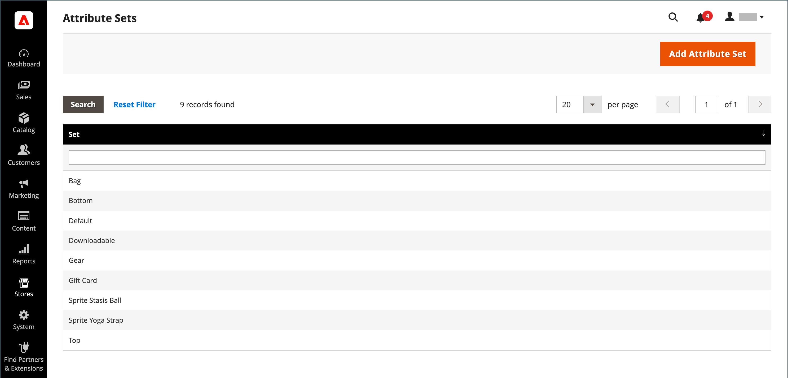
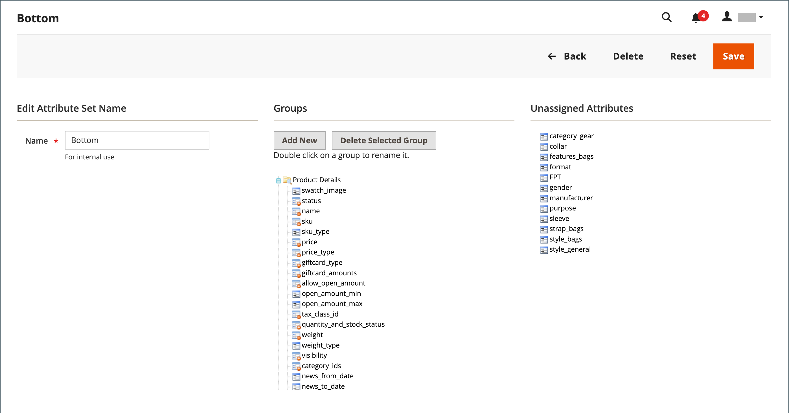

# Jeux d’attributs

L’une des premières étapes de la création d’un produit consiste à choisir le jeu d’attributs utilisé comme modèle pour l’enregistrement du produit. Le jeu d’attributs détermine les champs disponibles lors de la saisie des données et les valeurs qui s’affichent pour le client.

Les attributs sont organisés en groupes qui déterminent leur emplacement dans l’enregistrement du produit. Votre boutique s’accompagne d’un jeu d’attributs initial (appelé _par défaut_) qui comprend un ensemble d’attributs couramment utilisés. Si vous souhaitez n’ajouter que quelques attributs, vous pouvez les ajouter à ce jeu d’attributs par défaut. Si vous vendez des produits qui nécessitent des types d’informations spécifiques, il peut être préférable de créer un jeu d’attributs dédié qui inclut les attributs spécifiques nécessaires au produit.

{width="700" zoomable="yes"}

## Création d’un jeu d’attributs

1. Dans la barre latérale _Admin_, accédez à **[!UICONTROL Stores]** > _[!UICONTROL Attributes]_>**[!UICONTROL Attribute Set]**.

1. Cliquez sur **[!UICONTROL Add New Set]**.

   {width="600" zoomable="yes"}

1. Saisissez un **[!UICONTROL Name]** pour le jeu d’attributs.

1. Définissez **[!UICONTROL Based On]** sur un jeu d’attributs existant à utiliser comme modèle.

1. Cliquez sur **[!UICONTROL Save]**.

   La page suivante affiche les éléments suivants :

   - La colonne de gauche affiche le nom du jeu d’attributs. Le nom sert de référence interne et peut être modifié si nécessaire.
   - Le centre de la page répertorie la sélection en cours de groupes d’attributs.
   - La colonne de droite répertorie la sélection des attributs qui ne sont actuellement pas affectés au jeu d’attributs.

1. Pour ajouter un attribut à l’ensemble, faites glisser l’attribut de la liste **[!UICONTROL Unassigned Attributes]** vers le dossier approprié dans la colonne **[!UICONTROL Groups]**. Pour supprimer un attribut de la visionneuse, faites-le glisser vers la liste **[!UICONTROL Unassigned Attributes]**.

   >[!NOTE]
   >
   >Les attributs système sont marqués d’un point et ne peuvent pas être supprimés de la liste _[!UICONTROL Groups]_. Ils peuvent toutefois être déplacés vers un autre groupe dans le jeu d’attributs.

1. Cliquez ensuite sur **[!UICONTROL Save]**.

{width="600" zoomable="yes"}

## Création d’un groupe d’attributs

1. Dans la colonne _[!UICONTROL Groups]_du jeu d’attributs, cliquez sur **[!UICONTROL Add New]**.

1. Saisissez un **[!UICONTROL Name]** pour le nouveau groupe, puis cliquez sur **[!UICONTROL OK]**.

1. Effectuez l’une des opérations suivantes :

   - Faites glisser **[!UICONTROL Unassigned Attributes]** vers le nouveau groupe.
   - Faites glisser des attributs de n’importe quel autre groupe vers le nouveau groupe.
   - Faites glisser les attributs inutiles vers **[!UICONTROL Unassigned Attributes]**.

   Le nouveau groupe devient une section d’attributs dans tout produit basé sur le jeu d’attributs.

## Suppression d’un jeu d’attributs

1. Dans la barre latérale _Admin_, accédez à **[!UICONTROL Stores]** > _[!UICONTROL Attributes]_>**[!UICONTROL Attribute Set]**.

1. Sélectionnez le jeu d’attributs dans la liste, puis ouvrez-le en mode d’édition.

1. Cliquez sur **[!UICONTROL Delete]**.

1. Lorsque vous êtes invité à confirmer, cliquez sur **[!UICONTROL OK]**.
