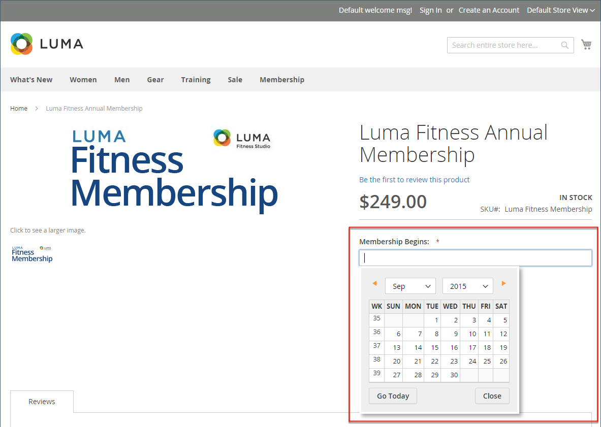

# Types d’entrée d’attribut

Lorsqu’ils sont affichés à partir de l’Administration, les attributs sont les champs que vous renseignez lors de la création d’un produit. Le type d’entrée affecté à un attribut détermine le type de données qui peut être saisi et le format du champ ou du contrôle de saisie. Du point de vue du client, les attributs fournissent des informations sur le produit et sont les options et les champs de saisie de données qui doivent être renseignés pour acheter un produit.

## Types d’entrée

| Propriété | Description |
|--- |--- |
| [!UICONTROL Text Field] | Champ de saisie d’une seule ligne pour le texte. |
| [!UICONTROL Text Area] | Champ de saisie de plusieurs lignes permettant de saisir des paragraphes de texte, tels qu’une description de produit. Vous pouvez utiliser l’éditeur WYSIWYG pour formater le texte avec des balises HTML ou saisir directement les balises dans le texte. |
| [!UICONTROL Text Editor] | Un éditeur de texte entièrement opérationnel à l’emplacement des attributs. |
| [!UICONTROL Date] | Affiche une valeur de date au [format préféré](#date-and-time-options) et [fuseau horaire](../getting-started/store-details.md#locale-options). Les valeurs de date peuvent être sélectionnées dans une liste ou un calendrier (  ).   **_Remarque:_**selon la configuration de votre système, les utilisateurs_ administrateurs_ peuvent saisir des dates directement dans un champ ou sélectionner une date dans le calendrier ou la liste. Pour plus d’informations sur la spécification des valeurs de date et d’heure, voir [Options de date et d’heure](#date-and-time-options). |
| [!UICONTROL Date and Time] | Affiche une valeur de date et d’heure au [format préféré](#date-and-time-options) et [fuseau horaire](../getting-started/store-details.md#locale-options). La date et l’heure peuvent être saisies manuellement ou sélectionnées dans un calendrier. Exemple de format : MM/JJ/AAAA HH:MM |
| [!UICONTROL Yes/No] | Affiche une liste déroulante avec les options prédéfinies de `Yes` et `No`. |
| Liste déroulante | Affiche une liste déroulante de valeurs qui accepte une seule sélection. Le type d’entrée de liste déroulante est un composant clé des [produits configurables](../catalog/product-create-configurable.md). |
| [!UICONTROL Multiple Select] | Affiche une liste déroulante de valeurs qui accepte plusieurs sélections. |
| [!UICONTROL Number] [!BADGE SaaS uniquement]{type=Positive url="https://experienceleague.adobe.com/en/docs/commerce/user-guides/product-solutions" tooltip="S’applique uniquement aux projets Adobe Commerce as a Cloud Service et Adobe Commerce Optimizer (infrastructure SaaS gérée par Adobe)."} | Champ d’entrée numérique qui stocke les valeurs décimales. Contrairement au type d’entrée **Price**, il n’applique pas de mise en forme de devise et accepte les valeurs négatives. Utilisez ce type d’entrée pour les mesures, les dimensions ou les spécifications techniques telles que les plages de températures. |
| [!UICONTROL Price] | Ce type d’entrée est utilisé pour créer des champs de prix qui s’ajoutent aux attributs prédéfinis : `Price`, `Special Price`, `Tier Price` et `Cost`. La devise utilisée est déterminée par votre configuration système. |
| [!UICONTROL Media Image] | Associe une image supplémentaire à un produit, comme le logo d’un produit, des instructions d’entretien ou les ingrédients d’une étiquette alimentaire. Lorsque vous ajoutez un attribut d’image multimédia au jeu d’attributs d’un produit, il devient un type d’image supplémentaire, avec Base, Petit et Miniature. L’attribut image du média peut être exclu du [navigateur de médias storefront](catalog-images-video.md#storefront-media-browser). |
| [!UICONTROL File] [!BADGE SaaS uniquement]{type=Positive url="https://experienceleague.adobe.com/en/docs/commerce/user-guides/product-solutions" tooltip="S’applique uniquement aux projets Adobe Commerce as a Cloud Service et Adobe Commerce Optimizer (infrastructure SaaS gérée par Adobe)."} | Permet de charger un fichier et de l’associer à un attribut de produit. Les types de fichiers pris en charge et la taille de fichier maximale sont configurés dans [Attributs de fichier de produit](../configuration-reference/catalog/product-file-attributes.md). Utilisez ce type d&#39;entrée pour les documents tels que les manuels de produit, les fiches techniques ou les certificats. |
| [!UICONTROL Fixed Product Tax] | Permet de définir des [taux FPT](../stores-purchase/fixed-product-tax.md) en fonction des exigences de vos paramètres régionaux. |
| [!UICONTROL Visual Swatch] | Affiche un échantillon représentant la couleur, la texture ou le motif d’un produit configurable. Un [échantillon visuel](swatches.md) peut être rempli avec une valeur de couleur hexadécimale ou afficher une image téléchargée qui représente la couleur, la matière, la texture ou le motif de l’option. |
| [!UICONTROL Text Swatch] | Représentation textuelle d’une option de produit configurable fréquemment utilisée pour la taille. [Nuancier de texte](swatches.md) peut également inclure des valeurs de couleur hexadécimales. |
| [!UICONTROL Page Builder] | Un espace de travail [[!DNL Page Builder]](../page-builder/workspace.md) à l’emplacement de l’attribut qui facilite l’ajout de contenu attrayant à la page du produit. |

{style="table-layout:auto"}

## Options de date et d’heure

Vous pouvez personnaliser le format des champs de date et d’heure, puis sélectionner le contrôle de saisie utilisé pour la saisie de données. Les valeurs de date peuvent être sélectionnées dans une liste déroulante ou un calendrier pop-up.

{width="700" zoomable="yes"}

**_To formate date/time fields:_**

1. Dans la barre latérale _Admin_, accédez à **[!UICONTROL Stores]** > _[!UICONTROL Settings]_>**[!UICONTROL Configuration]**.

1. Dans le panneau de gauche, développez **[!UICONTROL Catalog]** et cliquez sur le sous-élément **[!UICONTROL Catalog]** .

1. Développez la section **[!UICONTROL Date & Time Custom Options]** .

   {width="600" zoomable="yes"}

   Pour obtenir la liste détaillée de ces options, voir [_Options personnalisées de date et d’heure_](../configuration-reference/catalog/catalog.md) dans le _Guide de référence de configuration_.

1. Pour utiliser un calendrier contextuel comme contrôle d’entrée pour les champs de date, définissez **[!UICONTROL Use JavaScript Calendar]** sur `Yes`.

1. Pour établir la **[!UICONTROL Date Fields Order]**, définissez l’ordre de chaque partie du champ de date selon les besoins :

   - Mois
   - Jour
   - Année

1. Pour définir le format d’heure souhaité, définissez **Format de l’heure** sur l’une des options suivantes :

   - `12h AM/PM`
   - `24h`

1. Pour définir la **[!UICONTROL Year Range]** des valeurs des listes déroulantes, saisissez l’année (AAAA) afin de définir les dates de **[!UICONTROL from]** et de **[!UICONTROL to]**.

   Si ce champ est vide, il correspond par défaut à l’année en cours.

1. Cliquez ensuite sur **[!UICONTROL Save Config]**.
