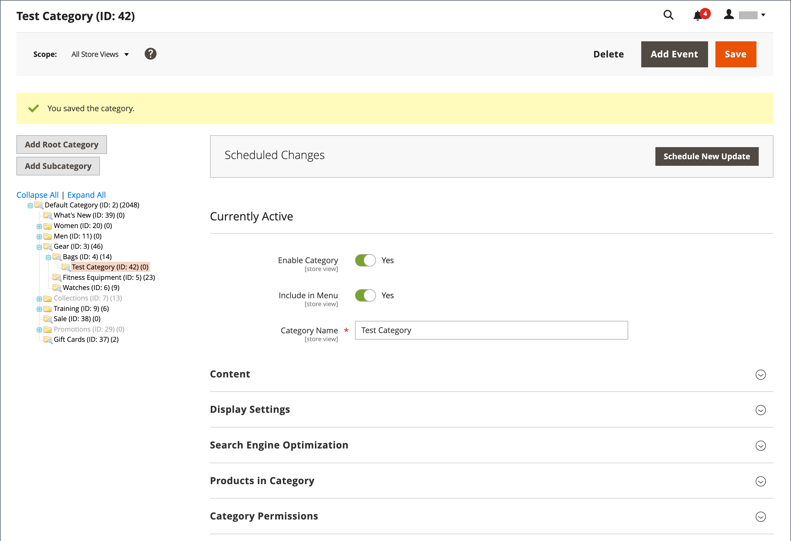

# Catalogues plats

>[!IMPORTANT]
>
>L’utilisation d’un catalogue plat n’est plus recommandée. L’utilisation continue de cette fonctionnalité peut entraîner une dégradation des performances et d’autres problèmes d’indexation. Une description détaillée et la solution proposée dans le [Centre d’aide](https://experienceleague.adobe.com/docs/commerce-knowledge-base/kb/troubleshooting/miscellaneous/slow-performance-slow-and-long-running-crons.html?lang=fr).  Les versions concernées sont les suivantes :  - Adobe Commerce sur les infrastructures cloud, 2.3.x et ultérieures - Adobe Commerce (On-Premise), 2.3.x et ultérieures - Magento Open Source, 2.3.x et ultérieures   Dans n’importe quelle version, certaines extensions ne fonctionnent qu’avec des tables plates, ce qui entraîne un risque si vous désactivez ces dernières. Si vous savez que certaines extensions utilisent des indexeurs de catalogue plat, vous devez être conscient de ce risque lorsque vous définissez ces valeurs sur `No`.

Commerce stocke généralement les données de catalogue dans plusieurs tables, en fonction du modèle Entity-Attribute-Value (EAV) . Les attributs de produit étant stockés dans de nombreuses tables, les requêtes SQL sont parfois longues et complexes.

En revanche, un catalogue plat crée des tableaux à la volée, où chaque ligne contient toutes les données nécessaires sur un produit ou une catégorie. Un catalogue aplati est mis à jour automatiquement, soit toutes les minutes, soit selon votre tâche cron. L’indexation de catalogue plat peut également accélérer le traitement des règles de prix de catalogue et de panier. Un catalogue contenant jusqu’à 500 000 SKU peut être indexé rapidement en tant que catalogue aplati.

>[!NOTE]
>
>Avant d’activer un catalogue plat pour un magasin en ligne, veillez à tester la configuration dans un environnement de développement.

## Étape 1 : activer le catalogue aplati

1. Dans la barre latérale _Admin_, accédez à **[!UICONTROL Stores]** > _[!UICONTROL Settings]_>**[!UICONTROL Configuration]**.

1. Dans le panneau de gauche, développez **[!UICONTROL Catalog]** et choisissez **[!UICONTROL Catalog]** en dessous.

1. Développez la section _Storefront_ et procédez comme suit :

   - Définissez **[!UICONTROL Use Flat Catalog Category]** sur `Yes`. (Si nécessaire, décochez la case **[!UICONTROL Use system value]** .)

   - Définissez **[!UICONTROL Use Flat Catalog Product]** sur `Yes`.

   {width="700" zoomable="yes"}

1. Cliquez ensuite sur **[!UICONTROL Save Config]**.

1. Lorsque vous êtes invité à mettre à jour le cache, cliquez sur **[!UICONTROL Cache Management]** dans le message système et suivez les instructions pour actualiser le cache.

## Étape 2 : vérifier les résultats

Vous pouvez utiliser deux méthodes pour vérifier les résultats.

### Méthode 1 : vérifier les résultats pour un seul produit

1. Dans la barre latérale _Admin_, accédez à **[!UICONTROL Catalog]** > **[!UICONTROL Products]**.

1. Ouvrez un produit en mode d’édition.

1. Par **[!UICONTROL Name]**, ajoutez le `_TEST` de texte à la fin du nom du produit.

1. Cliquez sur **[!UICONTROL Save]**.

1. Dans un nouvel onglet du navigateur, accédez à la page d’accueil de votre boutique et procédez comme suit :

   - Recherchez le produit que vous avez modifié.

   - Utilisez la navigation pour accéder au produit sous sa catégorie attribuée.

     Si nécessaire, actualisez la page pour afficher les résultats. La modification s’affiche dans la minute ou selon votre planning [Cron](../systems/cron.md).

   {width="700" zoomable="yes"}

### Méthode 2 : vérification des résultats pour une catégorie

1. Dans la barre latérale _Admin_, accédez à **[!UICONTROL Catalog]** > **[!UICONTROL Categories]**.

1. Dans le coin supérieur gauche, vérifiez que **[!UICONTROL Store View]** est défini sur `All Store Views`.

   Si vous y êtes invité, cliquez sur **[!UICONTROL OK]** pour confirmer.

1. Dans l’arborescence des catégories, sélectionnez une catégorie existante, cliquez sur **[!UICONTROL Add Subcategory]**, puis procédez comme suit :

   - Par **[!UICONTROL Category Name]**, saisissez `Test Category`.

   - Cliquez ensuite sur **[!UICONTROL Save]**.

     {width="600" zoomable="yes"}

   - Développez  la section **[!UICONTROL Products in Category]** et cliquez sur **[!UICONTROL Reset Filter]** pour afficher tous les produits.

   - Cochez la case de plusieurs produits à ajouter à la nouvelle catégorie.

   - cliquez sur **[!UICONTROL Save]**.

   {width="600" zoomable="yes"}

1. Dans un nouvel onglet du navigateur, accédez à la page d’accueil de votre boutique et utilisez la navigation de la boutique pour accéder à la catégorie que vous avez créée.

   Si nécessaire, actualisez la page pour afficher les résultats. La modification s’affiche dans la minute ou selon votre planning cron.

## Étape 3 : supprimer les données de test

Procédez comme suit pour supprimer les données de test et restaurer le nom de produit et la configuration de catalogue d’origine.

### Supprimer la catégorie de test

1. Dans la barre latérale _Admin_, accédez à **[!UICONTROL Catalog]** > **[!UICONTROL Categories]**.

1. Dans l’arborescence de catégories, sélectionnez la sous-catégorie de test que vous avez créée.

1. Dans le coin supérieur droit, cliquez sur **[!UICONTROL Delete]**.

1. Lorsque vous êtes invité à confirmer, cliquez sur **[!UICONTROL OK]**.

   Cette suppression de catégorie ne supprime pas les produits affectés à la catégorie.

### Restaurer le nom d’origine du produit

1. Dans la barre latérale _Admin_, accédez à **[!UICONTROL Catalog]** > **[!UICONTROL Categories]**.

1. Ouvrez le produit test en mode d’édition.

1. Supprimez le texte `_TEST` que vous avez ajouté à la **[!UICONTROL Product Name]**.

1. Dans le coin supérieur droit, cliquez sur **[!UICONTROL Save]**.

### Restaurer la configuration de catalogue d’origine

1. Dans la barre latérale _Admin_, accédez à **[!UICONTROL Stores]** > _[!UICONTROL Settings]_>**[!UICONTROL Configuration]**.

1. Dans le panneau de gauche, développez **[!UICONTROL Catalog]** et choisissez **[!UICONTROL Catalog]** en dessous.

1. Développez la section _Storefront_ et procédez comme suit :

   - Définissez **[!UICONTROL Use Flat Catalog Category]** sur `No`.

   - Définissez **[!UICONTROL Use Flat Catalog Product]** sur `No`.

1. Cliquez ensuite sur **[!UICONTROL Save Config]**.

1. Lorsque vous y êtes invité, actualisez le cache.
