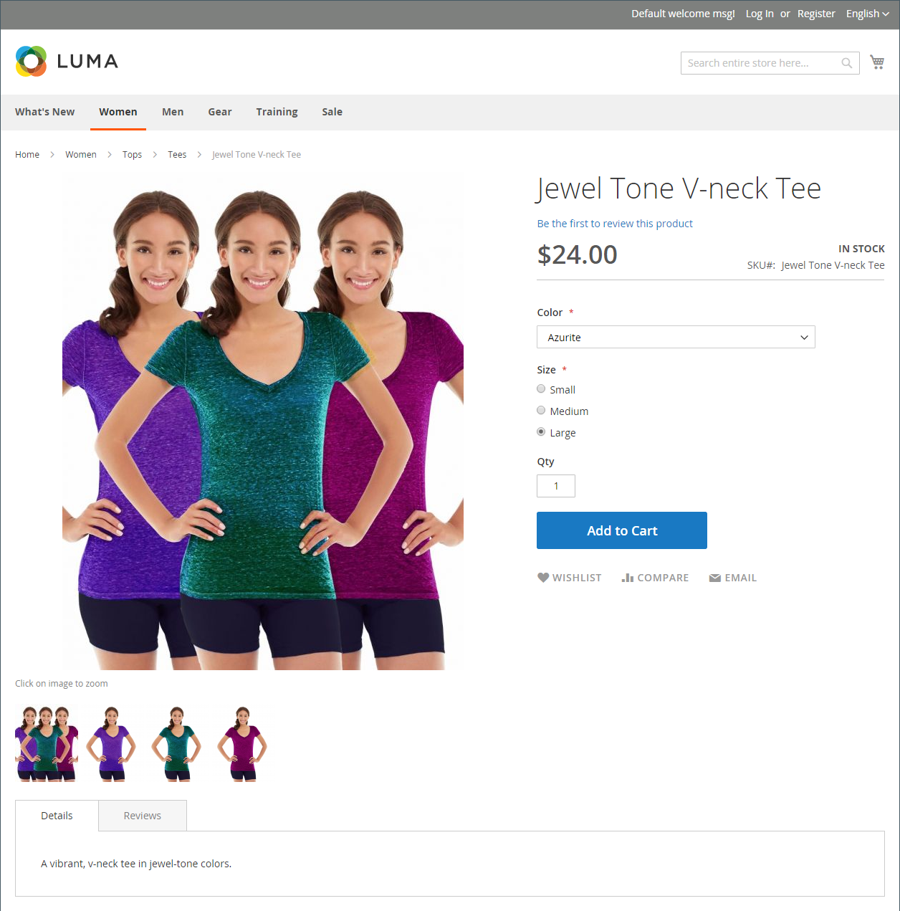

# Images et vidéo du catalogue

L&#39;utilisation d&#39;images de haute qualité de proportion constante donne à votre catalogue un aspect professionnel avec un attrait commercial. Si vous disposez d’un catalogue volumineux avec plusieurs images par produit, vous pouvez facilement gérer des centaines, voire des milliers d’images de produit. Avant de commencer, définissez une convention de nommage pour vos fichiers image et organisez-les afin de pouvoir trouver les originaux si vous en avez besoin.

{width="600" zoomable="yes"}

Une seule image de produit est rendue dans différentes tailles dans l’ensemble du catalogue. La taille d’affichage du conteneur d’images sur la page est définie dans la feuille de style de votre thème. Cependant, l’emplacement de l’image dans votre boutique est déterminé par le rôle attribué à l’image. L’image principale du produit, ou image _de base_, doit être suffisamment grande pour produire le zoom nécessaire. Outre l’image principale, une version plus petite de la même image peut apparaître dans les listes de produits ou sous forme de miniature dans le panier. Vous pouvez charger une image de la plus grande taille nécessaire ou utiliser une image [Adobe Stock](../content-design/adobe-stock.md) et laisser Commerce effectuer le rendu des tailles nécessaires pour chaque utilisation. Vous pouvez utiliser la même image pour tous les rôles, ou une image différente peut être affectée à chaque rôle. Par défaut, la première image chargée est affectée aux trois rôles.

## Navigateur de médias Storefront

L’explorateur de médias de la page de produit affiche plusieurs images, vidéos ou échantillons liés au produit. Chaque miniature peut afficher une vue ou une variation différente du produit. L’acheteur peut cliquer sur une miniature pour parcourir les ressources multimédias. Bien que la position du navigateur de médias varie en fonction du thème, la position par défaut se trouve juste en dessous de l’image principale sur la page du produit. Pour les commandes d’accessibilité, voir [Accessibilité de la navigation](../getting-started/navigation-accessibility.md).

{width="700" zoomable="yes"}

### Zoom sur l’image

Si l’[image de base](product-image.md) est suffisamment grande pour créer l’effet de zoom, vous pouvez afficher une partie agrandie de l’image lorsque vous pointez dessus avec la souris. Lorsque le zoom est activé, les clients peuvent cliquer sur l’image principale et déplacer le curseur pour agrandir différentes parties de l’image. La sélection agrandie s’affiche à droite de l’image.

{width="700" zoomable="yes"}

### Boîtes de lumière et curseurs

Il existe de nombreuses zones lumineuses et curseurs tiers que vous pouvez utiliser pour améliorer la présentation de vos images de produit. Recherchez des extensions dans [Commerce Marketplace](../getting-started/commerce-marketplace.md).

## Résolution des problèmes liés aux ressources

Pour obtenir de l’aide sur la résolution des problèmes d’images et de vidéos, consultez les articles suivants de la base de connaissances de la prise en charge de Commerce :

- [Les images de produit ne s’affichent pas malgré les rôles d’image de modification de produit](https://experienceleague.adobe.com/docs/commerce-knowledge-base/kb/troubleshooting/storefront/product-images-do-not-display-despite-product-edit-image-roles.html)
- [Les images du magasin ne s’affichent pas après le déploiement](https://experienceleague.adobe.com/docs/commerce-knowledge-base/kb/troubleshooting/storefront/store-images-not-displayed-after-deployment.html)
